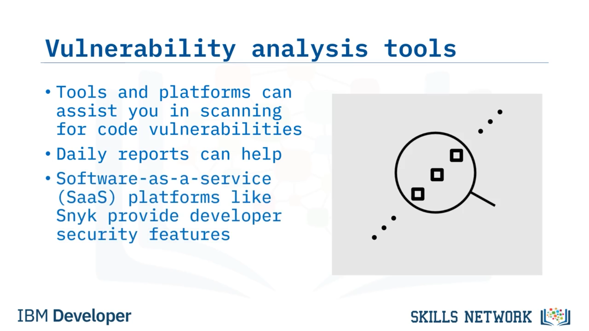

# 🛡️ Zafiyet Analizi

## 👋 Zafiyet Analizine Hoş Geldiniz

Zafiyet Analizi’ne hoş geldiniz!

Bu videoyu izledikten sonra, zafiyet analizini tanımlayabilecek ve zafiyet analizini kullanmaya yönelik en iyi uygulamaları açıklayabileceksiniz.

---

## ❓ Zafiyet Analizi Nedir?

Öncelikle, zafiyet analizi nedir?

Zafiyet analizi, uygulamanızı tehlikeye atabilecek olası uygulama hatalarını belirleme yöntemidir.

Kodunuzdaki zafiyetler her gün ortaya çıkar.

Diyelim ki bir gün kodunuzu taradınız ve hiçbir zafiyet bulamadınız. Ancak gerçekte, farkında olmadığınız bir zafiyet vardı.

Ya da kullandığınız bir kütüphanede, yeni keşfedilmiş bir zafiyet olabilir.

İşte bu şekilde, dün güvenli olan bir kod bugün savunmasız hâle gelebilir.

Birileri, orada burada birkaç şey deneyerek bir açık (loophole) bulursa, sisteminize girebilir.

Güvenlik kontrollerinizi ve taramalarınızı yapıp koda hiçbir şey eklemediğinizde bile, yalnızca birilerinin kullanılabilir küçük bir hata, arıza veya durum keşfetmesi nedeniyle kodunuz savunmasız hâle gelebilir.

---

## 📡 Zafiyet Tarama Platformları ve Raporlar

Kodunuzdaki zafiyetleri taramanıza yardımcı olabilecek bazı programlar ve platformlar vardır.

Ayrıca, zafiyet raporları her gün yayınlanır.

Eğer yeni bir rapor, kullandığınız kütüphane veya eklentinin zafiyet içeren bir sürüm olduğunu söylüyorsa, uygulamanızın saldırıya uğramasını önlemek için onu daha yeni bir sürüme güncellemek isteyebilirsiniz.

Bu tür bir platforma örnek olarak, kodu, bağımlılıkları, konteynerleri ve  *infrastructure as code* ’u güvence altına almak için kullanılan bir geliştirici güvenlik platformu olan **Snyk** verilebilir.

Ayrıca şu üç zafiyet aracıdan birini kullanabilirsiniz:  **Burp Suite** , **Nessus** ve  **Zed Attack Proxy** .

---

## 🌐 Burp Suite

 **Burp Suite** , web uygulamalarını taramak için popüler olan bir zafiyet tarayıcısıdır.

Bir web sitesinin otomatik taramalarını ayarlayabilir veya bir web sitesi ya da web uygulamasının genel yapısını tarayarak manuel tarama gerçekleştirebilirsiniz.

Birden fazla denetim (audit) aşaması çalıştırarak, Burp Suite kullanıcı girdisini içeren fonksiyonları bulabilir ve bunlardan yararlanabilir.

Burp Suite, zafiyetleri üç aşamada denetler:  **pasif** , **aktif** ve  **JavaScript analizi** .

---

## 💻 Nessus

Bir diğer önemli zafiyet aracı  **Nessus** ’tur.

Nessus, Mac, Linux ve Windows üzerinde çalışan, iyi bilinen bir zafiyet tarayıcısıdır.

Onu yerel bir web uygulaması olarak kurabilir ve çalıştırabilirsiniz.

Nessus, belirli bir zafiyeti veya yaygın bir virüsü tespit etmek için özel testler ve eklentiler yazmanıza imkân veren bir betik (scripting) dili sağlar.

---

## 🕷️ Zed Attack Proxy (ZAP)

Başka bir zafiyet tarayıcısı ise, **OWASP** aracısı olan  **Zed Attack Proxy (veya Zap)** ’tır.

Zap, web uygulamalarını taramak için  *spider* ’lar kullanan açık kaynaklı bir yazılımdır.

Zap, web uygulamalarındaki HTML dosyalarını bağlantılar aracılığıyla ve AJAX uygulamalarını ise oluşturulan bağlantılar aracılığıyla aktif veya pasif olarak tarar.

---

## ✅ Zafiyet Analizinde En İyi Uygulamalar

Kodunuzda zafiyetleri önlemek için uygulayabileceğiniz üç en iyi uygulama şunlardır:

Geliştirme ekibinizi güvenlik konusunda eğitmek.

Bu yapılacak en önemli tek adımdır ve özellikle geliştiriciler için tasarlanmış bu tür kursları almak, yazılımınızı daha güvenli hâle getirme konusunda çok yol kat etmenizi sağlar.

Politika analizi yapmak ve politikalarınızı güncellemek; böylece politikalarınızın her zaman uygun ve güncel olmasını sağlamak.

Ve zafiyet analizi sürecinizi otomatikleştirmek; böylece geliştiricileriniz taramayı unutsa bile, otomasyon onlar adına tarama yapar ve yeni zafiyetleri sizi hızlı bir şekilde uyararak bildirir.

---

## 📌 Bu Videoda Öğrendikleriniz

Bu videoda şunları öğrendiniz:

Zafiyet analizi, uygulamanızı tehlikeye atabilecek olası hataları belirleme yöntemidir.

Koddaki zafiyetler her gün ortaya çıkar.

Programlar ve platformlar, kodunuzdaki zafiyetleri taramanıza yardımcı olabilir.

Kullanılabilecek üç zafiyet aracı  **Burp Suite** , **Nessus** ve  **Zap** ’tır.

Ve zafiyet analizinde izlenmesi gereken en iyi uygulamalar; eğitim, politika güncelleme ve süreç otomasyonudur.

