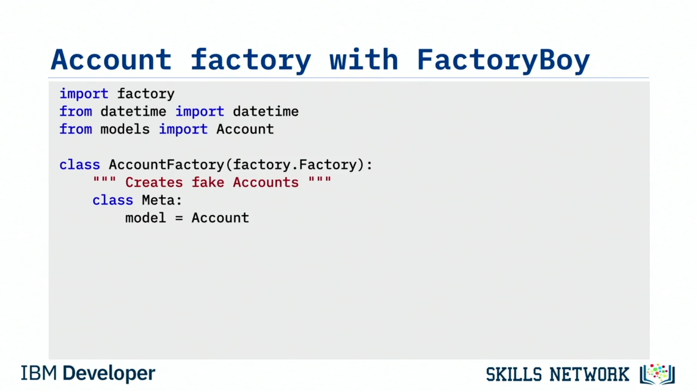
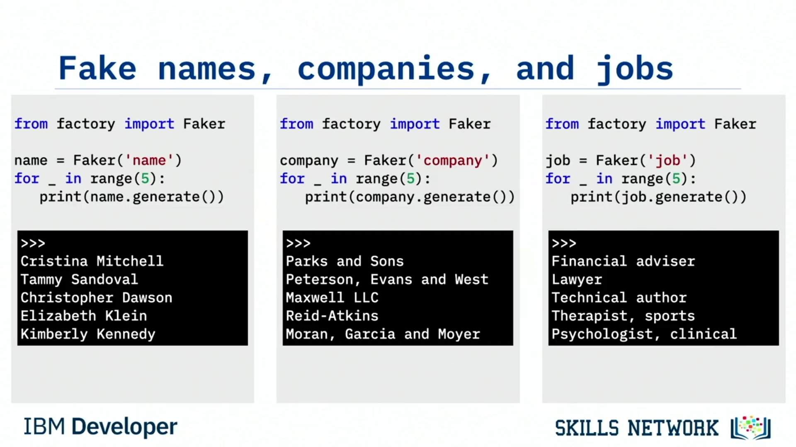

# 🏭 Factories ve Fakes

Bu videoyu izledikten sonra şunları yapabileceksiniz: Test için *factory* ve  *fake* ’lerin önemini tartışmak,  *factory* ’leri kullanarak  *fake* ’ler üretmeyi özetlemek ve bir *factory* tarafından üretilen  *fake* ’lere karşı nasıl test yapılacağını açıklamak.

Test etmek için sıklıkla sahte ( *fake* ) verilere ihtiyaç duyarsınız. Elbette testlerinizde bazı örnek verileri kullanabilirsiniz. Peki ya yüzlerce kayıt, hatta binlerce kayıt test verisine ihtiyacınız olursa? O zaman oluşturmak ve bakımını yapmak zahmetli hale gelebilir.

Bazen programınızdaki bir sınıfın sahte bir sürümüne ihtiyaç duyarsınız; ama gerçek sınıf gibi davranan, gerçekçi veriler olsun istersiniz.  *Factory* ’ler ve  *fake* ’ler bunu mümkün kılar.

Diyelim ki müşteri hesaplarını yöneten bir veri modelini test etmemiz gerekiyor.

---

## 🧱 Veri Modelini Oluşturma

Bu veri modelini oluşturarak başlayacağız. Popüler bir nesne-ilişkisel eşleyici ( *object relational mapper* ) olan *SQLAlchemy* kullanacağız ve bu yüzden *SQLAlchemy* sınıfından bir `db` örneği oluşturuyoruz.

Şimdi modelimizi inşa ediyoruz. SQLAlchemy’nin temel modelinden miras alan `Accounts` adında bir sınıf oluşturuyoruz. Şimdi sütunlarımızı ekleyebiliriz; bunlar sınıf değişkenleri olarak temsil edilecek.

Bir `id` ekliyoruz. Bilgi taşımayan bir anahtar olarak hizmet edecek, bu yüzden `id`’yi birincil anahtar ( *primary key* ) olarak etiketliyoruz.

`name` alanını string olarak ve `email` alanını string olarak ekliyoruz. Ayrıca `phone number` alanını da string olarak ekliyoruz. Bu telefon numarasını isteğe bağlı yapıyoruz, bu yüzden `nullable` değerini `True` yapıyoruz.

Bu hesabın devre dışı olup olmadığını belirlemek için bir Boolean alan ekleyelim ve varsayılanı `False` yapalım. Son olarak, `date joined` sütununu bir `DateTime` olarak ekleyeceğiz ve onu da isteğe bağlı yapacağız.

Sahte hesaplar üreten  *factory* ’mizi oluşturduğumuzda, bunlar görmeyi bekleyeceğimiz alanlar olacak.

---

## 🧪 FactoryBoy ile Fake Hesaplar Üretme

Şimdi sahte hesaplarımızı oluşturmak için *FactoryBoy* adlı bir Python paketini kullanacağız.

Ruby on Rails’e aşina olanlar, aynı işi yapmak için *FactoryGirl* adlı paketi kullanmış olabilir.  *FactoryBoy* , Ruby’nin *FactoryGirl* paketinin Python sürümüdür.

 *FactoryBoy* ’u import ederek başlıyoruz; bu paket basitçe `factory` olarak adlandırılır. Zaman damgaları oluşturmak için `datetime`’ı da import ediyoruz. Sonra az önce oluşturduğumuz modelimizi import ediyoruz.

Bu modeli import etmek önemlidir çünkü burada gerçek sınıfla aynı işlevselliği sağlamak için kullanacağız.

Ardından `AccountFactory` adlı bir sınıf oluşturacağız ve bunun  *FactoryBoy* ’daki `Factory` sınıfından miras almasını sağlayacağız.

Sonra `Meta` adlı bir iç sınıf oluşturuyoruz ve bir sınıf özniteliği ekliyoruz: `model = Account`. Bu öznitelik, factory’nin hangi model sınıfı için fake ürettiğini bilme şeklidir. İşte bu yüzden `Account` sınıfını `models` içinden import ettik.

Son olarak, orijinal sınıfla aynı öznitelikleri ekliyoruz ama bunların fake sürümlerini kullanıyoruz.

---

## 🧾 Factory Alanlarını Tanımlama

`id` ile başlayacağız. Bu bilgi taşımayan bir anahtar olduğu ve çoğu veritabanı birincil anahtar olarak sadece bir sıra ( *sequence* ) kullandığı için, bu alan her çağrıldığında artan bir sıra numarası sağlamak üzere `factory.Sequence` sınıfını kullanacağız.

Sonra bir `name` ekliyoruz ve  *FactoryBoy* ’un `Faker` sınıfını içerdiği gerçeğinden yararlanıyoruz.

`Faker` ile, Faker’ın bildiği sağlayıcılar ( *providers* ) kümesi için sahte veri üretebiliriz. İsimler için bir sağlayıcısı vardır, bu yüzden onu kullanacağız. Sadece bir `Faker` nesnesi örnekleyip, kurucuya ( *constructor* ) parametre olarak “name” sağlayıcısını geçirirsiniz.

Sonra `email` alanını ekliyoruz ve Faker’ın sahte e-postalar için de bir sağlayıcısı var, bu yüzden onu kullanacağız.

Bir sonraki alan `phone number`. Neyse ki Faker telefon numarası sağlayıcısını da destekliyor, bu yüzden onu kullanıyoruz.

Bir sonraki alan `disabled`. Faker’ın Boolean’lar için bir sağlayıcısı yoktur, ama  *FactoryBoy* ’un bize verdiğimiz seçenekler arasında rastgele seçim yapan `FuzzyChoice` adlı bir yöntemi vardır. `FuzzyChoice` özelliğine bir değer listesi geçebiliriz ve `FuzzyChoice` bu listedeki değerlerden birini rastgele seçer.

Bu, sağlayıcısı olmayan verilere ihtiyaç duyduğunuzda harikadır. Bizim durumumuz için, bir Boolean’ın sahip olabileceği iki değeri vereceğiz: `True` ve `False`.

Son olarak `date joined` alanını ekliyoruz. Burada `datetime` sınıfını `LazyFunction` yöntemine parametre olarak veriyoruz; bu yöntem zaman damgasını yalnızca `AccountFactory` oluşturulduğunda üretir.

Bu şekilde, beş hesap oluşturursak, `date joined` için beş farklı zaman damgaları olur.

---

## ✅ Unit Test’te AccountFactory Kullanma

Artık unit testlerimizde `AccountFactory`’yi kullanmaya hazırız. `factories` modülünden `AccountFactory`’yi import ederek başlıyoruz.

Sonra `test_update_account` adlı bir test vakası oluşturuyoruz. Burada `AccountFactory`’yi örnekleyip `account` adlı bir değişkene atıyoruz.

Sonra `account` üzerinde `create()` metodunu çağırıyoruz. Şunu soruyor olabilirsiniz: “Sahte bir sınıfta nasıl metot çağırabiliyoruz?” Çünkü `AccountFactory`’nin herhangi bir metodu yok.

`Meta` adlı iç sınıfı kullanıp `model` değişkenini “gerçek” `Account` sınıfımıza atadığımızı hatırlayın. Bu, `AccountFactory`’nin gerçek bir hesap gibi davranmasını sağlar.

Artık `Account` sınıfında çağırabildiğiniz her metodu `AccountFactory` sınıfında da çağırabilirsiniz. Bu gerçekten bir “body double” ya da “stand-in” olarak bir hesabın yerine geçer.

Sonra az önce oluşturduğumuz hesabı geri alıyoruz. `email` için, test verilerinde görünmeyeceğini bildiğimiz yeni bir değer atıyoruz ve bu yeni e-postayı kaydetmek için `update()` metodunu çağırıyoruz.

Son olarak hesabı veritabanından bir kez daha geri alıyoruz ve kaydedilen e-postanın, ona atadığımız e-postayla eşleştiğini doğruluyoruz.

Sahte hesap verisi üretmek bu kadar basit. `Account` kullanabildiğiniz her yerde artık `AccountFactory` kullanabilir ve anında örnek verilere sahip olabilirsiniz.

`Account` üzerinde çağırabildiğiniz her metodu `AccountFactory` üzerinde de çağırabilirsiniz çünkü fake olmasına rağmen gerçek bir `Account` ile tamamen aynı şekilde davranır.

---

## 🧰 Faker Sağlayıcıları

İşte `Fake` sınıfının desteklediği standart sağlayıcılar. Adres sağlayıcıları, otomotiv sağlayıcıları, banka sağlayıcıları ve uygulamalarınız için örnek veri oluşturmanıza yardımcı olacak pek çok başka sağlayıcı olduğunu görebilirsiniz.

Hatta bu listeyi genişleten topluluk sağlayıcıları ( *community providers* ) bile vardır.

Bu sağlayıcılardan bazılarına bakalım.

---

## 👤 “name” Sağlayıcısı Örneği

`factory` paketinden `Faker`’ı import ederek başlayacağız. Sonra isim üretecek bir `Faker` örneği oluşturuyoruz. Bunu yapmak için sağlayıcı adını, bu durumda “name”, `Faker()` sınıfına geçirip `name` adlı bir değişkende saklıyoruz.

Sonra beş kez dönen bir döngü oluşturuyor ve döngünün her turunda bir isim üretmek için `name.generate()` çağırıyoruz.

Bu kodu çalıştırdığımızda beş rastgele isim görürüz: Cristina Mitchell, Tammy Sandoval, Cristopher Dawson, Elizabeth Dawson, ve Kimberly Kennedy.

---

## 🏢 “company” Sağlayıcısı Örneği

Bu süreci tekrar yapalım ama farklı bir sağlayıcıyla. Bu kez “company” sağlayıcısını kullanacağız; sağlayıcı adı olarak “company” geçirerek bir `Faker` örneği oluşturuyoruz.

Yine bir döngü oluşturup beş sahte şirket üretiyoruz. Kodu çalıştırdığımızda “Parks and Sons,” “Peterson, Evans and West,” “Maxwell LLC,” ve benzeri sonuçlar elde ediyoruz.

---

## 💼 “job” Sağlayıcısı Örneği

Bir kez daha deneyelim; bu sefer “job” sağlayıcısını kullanıyoruz. Kodu çalıştırdığımızda “Financial adviser,” “Technical author,” “Lawyer,” ve benzeri beş iş adı elde ediyoruz.

Fake’leri kullanarak Parks and Sons şirketinde finansal danışman olarak çalışan Cristina Mitchell’i; veya Peterson, Evans and West şirketinde avukat olarak çalışan Tammy Sandoval’ı; ya da sağlayıcıların herhangi bir kombinasyonunu oluşturabiliriz.

Ve ben fake yapmıyorum!

---

## 🎲 FuzzyChoice ve Diğer Fuzzy Öznitelikler

Örneğimizde `FuzzyChoice` adlı bir fonksiyon kullandığımızı fark etmiş olabilirsiniz.

Sadece bilginiz olsun diye söylüyorum: metin, tamsayılar, ondalık sayılar, float’lar, tarihler ve çeşitli zaman damgaları gibi pek çok veri türü için fuzzy öznitelikler ( *fuzzy attributes* ) vardır.

*FactoryBoy* gibi bir kütüphaneyle, test etmeniz gereken neredeyse her şey için gerçekçi örnek veriler oluşturabilirsiniz.

---

## 📌 Özet

Bu videoda şunları öğrendiniz:

* *Factory* ’ler ve  *fake* ’ler, çok miktarda test verisi oluşturmak ve sürdürmek için faydalıdır.
* *Factory* ’ler, gerçekçi test verileriyle  *fake* ’ler üretir.
* *Fake* ’ler test sırasında gerçek nesneler gibi davrandığı için geliştiriciler  *fake* ’leri gerçek veriyi test eder gibi test eder.
