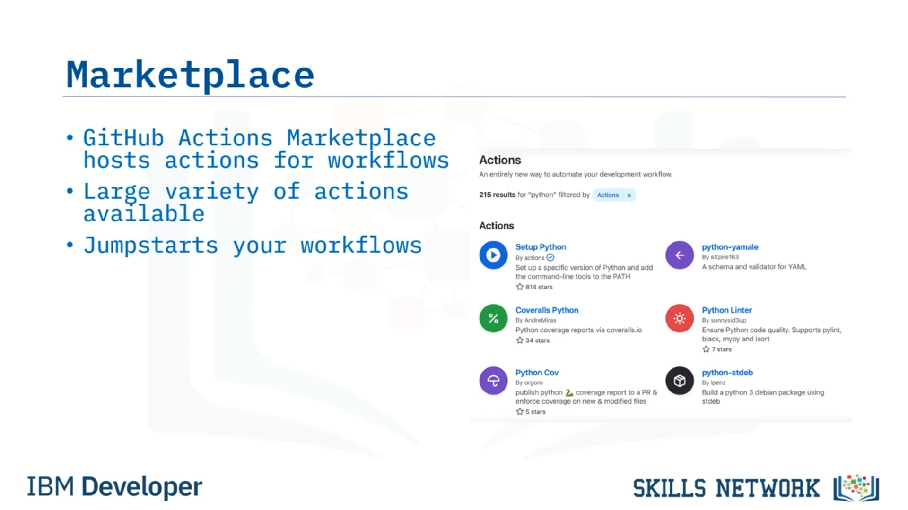
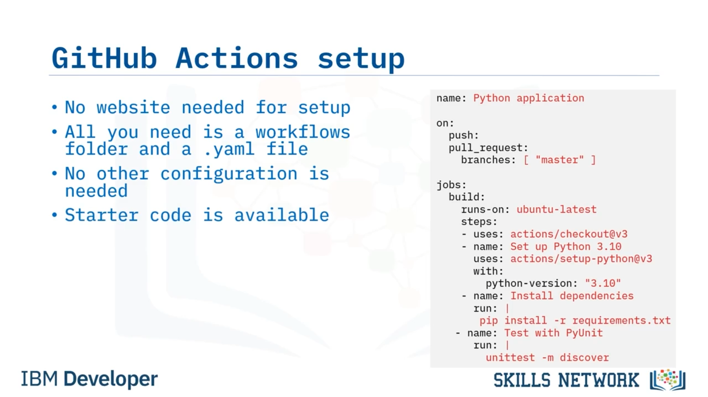
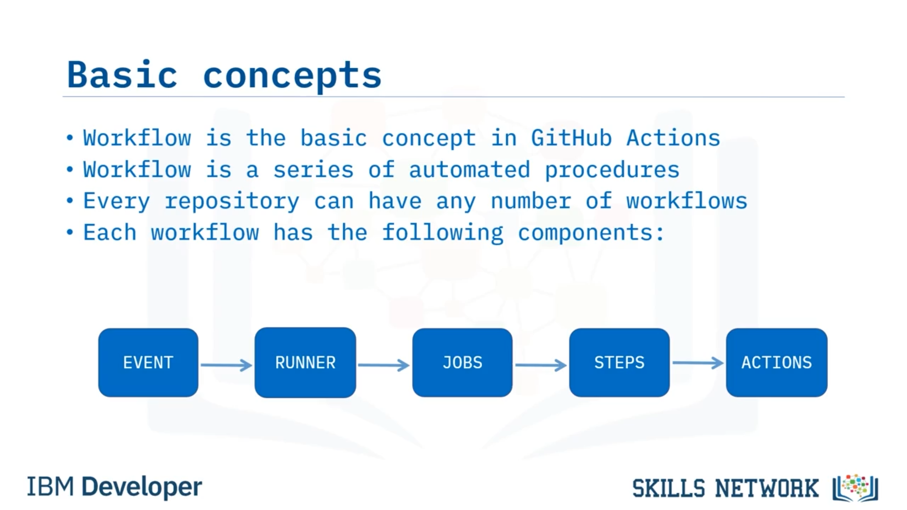

# 🚀 GitHub Actions’a Giriş

GitHub Actions’a Giriş’e hoş geldiniz. Bu videoyu izledikten sonra şunları yapabileceksiniz: GitHub Actions aracının temellerini açıklamak. GitHub Actions, CI/CD araçları alanına yeni katılan bir araçtır. GitHub’daki her depoda kullanılabilen bir CI/CD aracıdır. Bu da onu çok çekici kılar çünkü GitHub’a bir hizmet olarak entegredir. Ekstra eklemeniz gereken hiçbir şey yoktur; kaydolmanız gereken hiçbir şey yoktur. Bu, herkesin erişebildiği bir CI/CD aracı olmasını sağlar.

GitHub Actions, tıpkı konuştuğumuz diğer tüm CI/CD araçları gibi CI hattınızı (pipeline) kod olarak ele almanıza olanak tanır. Diğer araçlardan farklı olarak, iş akışı (workflow) tanımlarını `.github/workflows` adlı bir klasörde saklamak için yalnızca bir `.yaml` dosyasına ihtiyacınız vardır. Bu YAML dosyalarına hangi adı verdiğiniz önemli değildir çünkü her dosya, ne zaman tetikleneceklerini açıklar. GitHub Actions, `workflows` klasöründeki tüm dosyaları işler ancak yalnızca iş akışında belirtilen olay gerçekleştiğinde onları çalıştırır. Jenkins’in zengin eklenti koleksiyonuna benzer şekilde GitHub Action, iş akışlarınızda kullanabileceğiniz action’ların barındırıldığı bir marketplace’e sahiptir. Neredeyse her dil ve gerçekleştirmeniz gereken hemen her adım için çok çeşitli action’lar arasından seçim yapabilirsiniz. Bu, iş akışlarınızı gerçekten hızla başlatır.

Bir eylemi gerçekleştirmek için bir script yazmadan önce, her zaman marketplace’i kontrol ederim; birisinin bunun için zaten bir action oluşturup oluşturmadığına bakarım ve çoğu zaman birisi oluşturmuş olur. GitHub Actions’ın güzel özelliklerinden biri şudur: Jenkins, Circle CI ve Travis CI gibi birçok rakibinin aksine, herhangi bir şeyi manuel olarak kurmak için bir web sitesine ihtiyaç yoktur. 

Tek yapmanız gereken bir `workflows` klasörü oluşturmak ve iş akışınızı temsil eden YAML dosyalarını eklemektir. Başka hiçbir yapılandırma gerekmez. Bu, başlamayı yalnızca basit hale getirmekle kalmaz; ayrıca CI/CD iş akışlarınızın yeniden üretilebilir olmasını sağlar çünkü manuel adımlar yoktur. Son olarak, hızlıca çalışır hale gelmeniz için başlangıç kodu (starter code) mevcuttur. GitHub deponuzdaki **Actions** sekmesinden, işlevsel iş akışı şablonları arasından seçim yapabilir ve onları kendi durumunuza göre düzenleyebilirsiniz.

## 🧩 GitHub Actions’ın Temel Kavramı: Workflow

GitHub Actions’taki temel kavram bir  *workflow* ’dur. Workflow, GitHub Actions’ın çalıştırdığı  *job* ’lar ve  *step* ’ler olarak temsil edilen otomatik prosedürler dizisidir. Her depo herhangi sayıda workflow’a sahip olabilir. Continuous Integration için bir workflow, Continuous Delivery için başka bir workflow ve artifact yayımlayan bir workflow’a daha sahip olabilirsiniz. İhtiyacınız olan sayıda workflow’u `workflows` klasörüne koyarsınız.

Her workflow şu bileşenlere sahiptir: Workflow’un ne zaman çalışacağını söyleyen bir  *event* ’i vardır. Event’ler örneğin bir depoya push yaptığınızda, bir pull request oluşturduğunuzda veya bir release oluşturduğunuzda gibi şeyler olabilir.

## 🏃 Runner’lar, Job’lar, Step’ler ve Action’lar

Workflow’lar job’ları yürütmek için  *runner* ’ları kullanır. Farklı sanal ortamlar için yerleşik runner’lar vardır ya da kendi ortamınızda *self-hosted runner* kullanabilirsiniz.

Bir workflow bir veya daha fazla *job* içerir. Bileşeninizi derleyen bir job’unuz, bunu bir artifact deposuna yayımlayan başka bir job’unuz ve hatta bir ortama dağıtan bir job’unuz olabilir.

Her job bir veya daha fazla *step* içerebilir. Bir step kodu checkout edebilir, bir başka step kodu derleyebilir, bir başka step kod üzerinde bir linter çalıştırabilir ve büyük olasılıkla kodun düzgün çalıştığından emin olmak için bir test senaryoları paketini çalıştıran bir step’iniz olur. Ve her step bir veya daha fazla *action* ya da *shell command* içerebilir.

 *Action* ’lar bir workflow’un en alt seviyesidir. Kodu checkout etmek, bağımlılıkları kurmak, derlemek veya testleri çalıştırmak gibi tek bir görevi yerine getirirler. Job’lar, step’ler ve action’lardan oluşan bu hiyerarşi, workflow’unuzun gerçekleştirdiği eylemleri mantıksal olarak gruplamanıza olanak tanır.

## ✅ Bu Videoda Öğrendikleriniz

Bu videoda şunları öğrendiniz: GitHub Actions, GitHub’daki her depoda kullanılabilen bir CI/CD aracıdır. GitHub Actions, workflow’larınızda kullanabileceğiniz action’ların barındırıldığı bir marketplace’e sahiptir. GitHub Actions, hızlıca çalışır hale gelmenizi sağlayacak başlangıç koduna sahiptir. Ve bir workflow, GitHub Actions’ın çalıştırdığı job’lar, step’ler ve action’lar ile temsil edilen otomatik prosedürler dizisidir.

