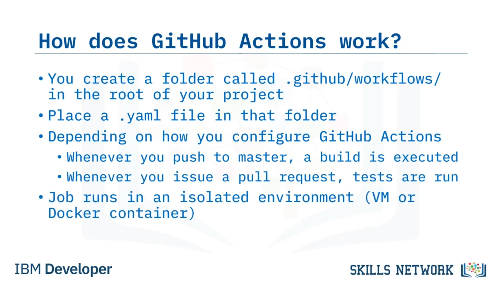
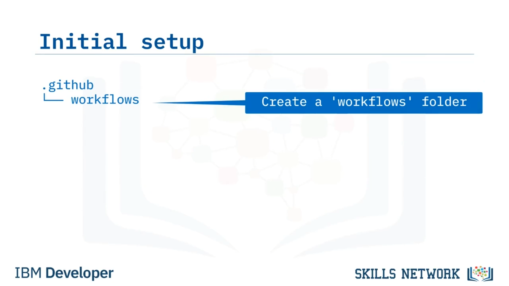
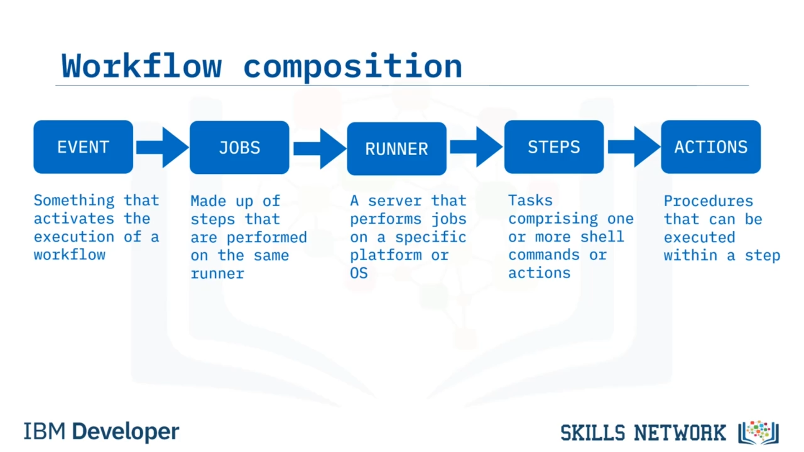
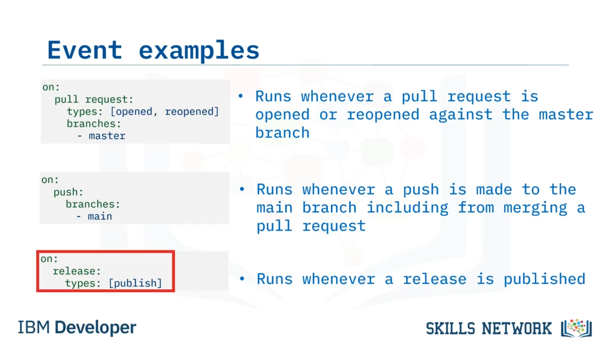
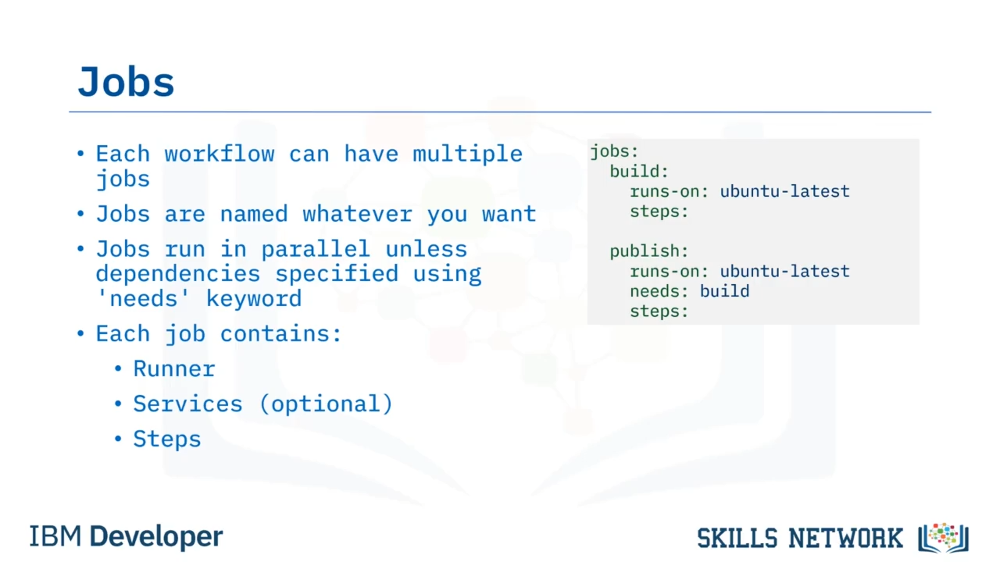
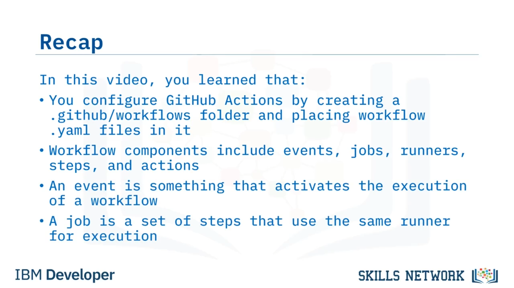

# 🧩 GitHub Actions’a Derinlemesine Bakış: Bölüm 1

‘GitHub Actions’a Derinlemesine Bakış – Birinci Bölüm’e hoş geldiniz.’ Bu videoyu izledikten sonra, GitHub Actions’ın nasıl çalıştığını açıklayabilecek, GitHub Actions kullanmak için bir depoyu nasıl ayarlayacağınızı anlatabilecek ve GitHub Actions’ın *event* ve *job* bileşenlerini açıklayabileceksiniz.

## ⚙️ GitHub Actions Nasıl Çalışır?

GitHub Actions’ın nasıl çalıştığına bakalım. Projenizin kök dizininde **`.github/workflows`** adlı bir klasör oluşturursunuz.  *Issue template* ’larınızı tutmak için zaten bir **`.github`** klasörünüz olabilir. Eğer öyleyse, onun altında sadece bir **`workflows`** klasörü oluşturun.

Sonra, bu klasörün içine iş akışınız ( *workflow* ) için ifadeleri içeren en az bir **`.yaml`** dosyası koyarsınız.

Bir veya daha fazla iş akışını **`.yaml`** dosyaları olarak belirtebilirsiniz. Ardından, nasıl yapılandırdığınıza bağlı olarak, iş akışınız belirtilen *event* gerçekleştiğinde çalışır. Örneğin, *master* branch’ine push yaptığınızda bir build çalışabilir veya bir pull request açtığınızda bir test çalışabilir.

 *Job* , izole bir ortamda çalışır; bu ortam bir sanal makine veya bir Docker container olabilir.

## 🗂️ GitHub Actions Kullanmak İçin Depo Kurulumu

GitHub Actions kullanmak için önce bir **`.github`** klasörü oluşturursunuz (zaten yoksa). Sonra, bu klasörün altında tüm GitHub iş akışlarınızı tutmak için bir **`workflows`** klasörü oluşturursunuz. Ve son olarak, çeşitli iş akışlarınızı temsil eden **`.yaml`** dosyalarını **`workflows`** klasörünün içine yerleştirirsiniz.

Ve ihtiyacınız olan tüm yapılandırma budur.

## 🧱 Workflow Bileşenleri

Her iş akışı şu bileşenleri içerir:

* Bir  *event* , bir iş akışının yürütülmesini etkinleştiren şeydir. Seçebileceğiniz birçok event vardır; en yaygın olanları bir depoya kod check-in etmek, bir branch’e kod push etmek veya bir pull request oluşturmaktır.
* Sonra *jobs* vardır. Job’lar, aynı *runner* üzerinde gerçekleştirilen adımlardan ( *steps* ) oluşur.
* Bir iş akışında birden fazla job varsa, bu job’lar varsayılan olarak paralel çalıştırılır. Ancak bir job’un başka bir job’a bağımlı olduğunu belirtmek için yapılandırabilirsiniz; bu durumda job’lar bağımlılıklarına göre seri olarak yürütülür.

## 🖥️ Runner, Steps ve Actions

Her job’un bir  *runner* ’ı vardır; runner, belirli bir platform veya işletim sistemi üzerinde job’ları gerçekleştiren bir sunucudur. GitHub runner’ları barındırabilir veya kendi runner’larınızı bağımsız bir sunucuda barındırabilirsiniz.

Ayrıca adımları bir Docker container içinde yürütmenin bir yolu da vardır, fakat Docker container bir runner üzerinde çalışır.

Job’lar *steps* içerir. Steps, bir veya daha fazla shell komutu veya  *action* ’dan oluşan görevlerdir. Bir job’un tüm step’leri aynı runner üzerinde çalıştırıldığı için, birbirleriyle veri paylaşabilirler. Bu da şu anlama gelir: kodunuzu checkout eden bir step, kodunuzu derleyen başka bir step ve bir Docker container build eden başka bir step olabilir ve hepsi ilk step’te checkout edilen aynı kodu paylaşır.

Ve son olarak, *actions* vardır; bunlar bir step içinde yürütülebilen prosedürlerdir.

## 🛒 GitHub Actions Marketplace ve Hazır Actions

GitHub, GitHub topluluğu aracılığıyla ve GitHub Actions Marketplace’te çok sayıda action sunar. Bekleyeceğiniz gibi, kodunuzu checkout etmek ve artifact yüklemek gibi yaygın görevler halihazırda mevcuttur ve iş akışlarınızda kullanılmayı bekler.

Bir action oluşturmak veya shell komutları kullanmak yerine, marketplace’te mevcut bir action olup olmadığını her zaman kontrol edin.

## 🎯 Event Bileşenine Daha Yakından Bakış

Şimdi bu iş akışı bileşenlerinden ilk ikisine daha ayrıntılı bakalım. Event’lerle başlayacağız. Unutmayın, bir  *event* , bir iş akışının yürütülmesini etkinleştiren bir şeydir. Şu anda bir workflow’u tetikleyebilen 35 farklı event vardır.

Ve bu listeden görebileceğiniz gibi, bir issue, bir label veya bir milestone üzerinde değişiklik yaptığınızda ya da bir repo’yu fork ettiğinizde bile bir event tetiklenebilir.

Muhtemelen iş akışlarınızda kullanacağınız en popüler event’ler: pull request yapmak, bir branch’e kod push etmek veya yeni bir release oluşturmaktır.

### 📌 Örnek: Pull Request Event

İşte *master* branch’ine karşı bir pull request açıldığında veya yeniden açıldığında çalışan bir event örneği. Bu, CI pipeline’ınızı tetiklemek için harikadır.

Tüm event’ler **`on:`** anahtar sözcüğü ile başlar ve ardından event’in anahtar sözcüğü gelir. Bu durumda  *pull request* .

Bazı event’lerin  *types* ’ı vardır. Bu örnekte event, bir pull request’in açılması veya yeniden açılması gibi type’ları dinler.

Pull request event’ine başka bir girdi de izlenecek branch listesidir. Bu örnek, hedef olarak *master* branch’ini belirtir.

### 📌 Örnek: Push Event

Bu sonraki örnek, main branch’ine bir push yapıldığında (bir pull request merge edilmesi dahil) çalışır. Bu, bir CD pipeline’ını tetiklemek için iyi olabilir.

Yine, **`on:`** anahtar sözcüğü ile başlar ve ardından event’in anahtar sözcüğü gelir; bu durumda  *push* .

Sonra branch listesi gelir; bu örnekte yalnızca main branch’i içerir, ancak daha fazlasını da içerebilirdi.

### 📌 Örnek: Release Event

Son örnek, bir release yayınlandığında çalışır; ancak release oluşturulduğunda gibi başka type’ları da belirtebilirdi. Bu tür bir event, bir paketleme ( *packaging* ) iş akışını tetiklemek için harikadır.

Örneğin, Python kodunuzu paketleyip PyPI’a yayınlamak isteyebilirsiniz. Ya da Java kodunuzu alıp Maven’a yayınlamak isteyebilirsiniz. Ya da bir Docker container build edip Docker Hub’a yayınlamak isteyebilirsiniz.

Bir release oluştururken hangi etkinliği otomatikleştirmek istiyorsanız, bu event işi halletmenize yardımcı olur.

## 🧰 Job Bileşenine Daha Yakından Bakış

Sonra *jobs* gelir.

Bir job, yürütme için aynı runner’ı kullanan bir dizi step’tir. Her workflow birden fazla job içerebilir; yani workflow başına yalnızca bir job’a bağlı değilsiniz. Bu, job ve workflow’ları oluştururken size çok fazla esneklik sağlar.

Job’lar, doğru **`.yaml`** söz dizimine sahip oldukları sürece istediğiniz şekilde adlandırılabilir. Bu örnekte, *build* adlı bir job ve *publish* adlı bir job vardır.

Varsayılan olarak job’lar paralel çalışır; aralarında **`needs`** anahtar sözcüğü ile bağımlılıklar belirtmediğiniz sürece.

Bu örnekte, *publish* job’u **`needs`** anahtar sözcüğünü kullanarak *build* job’una bağımlı olduğunu belirtir.

Bu, GitHub Actions’a önce *build* job’unu çalıştırmasını söyler. *publish* job’u, bağımlı olduğu *build* job’u başarıyla tamamlanana kadar çalışmaz.

Her job bir runner, isteğe bağlı gerekli servisler ve yürütülecek bir dizi step içerir. Bu bileşenlere kursun ilerleyen bölümlerinde bakacağız.

## ✅ Bu Videoda Öğrendikleriniz

Bu videoda şunları öğrendiniz:

* GitHub Actions’ı, **`.github/workflows`** klasörü oluşturup içine workflow **`.yaml`** dosyaları yerleştirerek yapılandırırsınız.
* Workflow bileşenleri:  *events* ,  *jobs* ,  *runners* , *steps* ve  *actions* .
* Bir  *event* , bir workflow’un yürütülmesini etkinleştiren şeydir.
* Bir  *job* , yürütme için aynı runner’ı kullanan bir step setidir.

