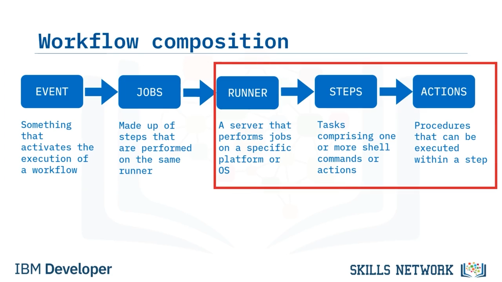
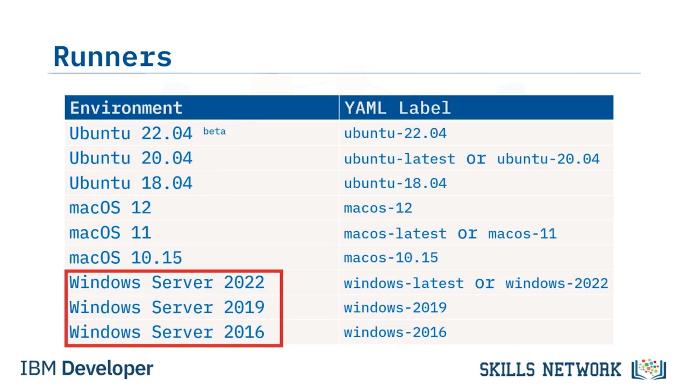
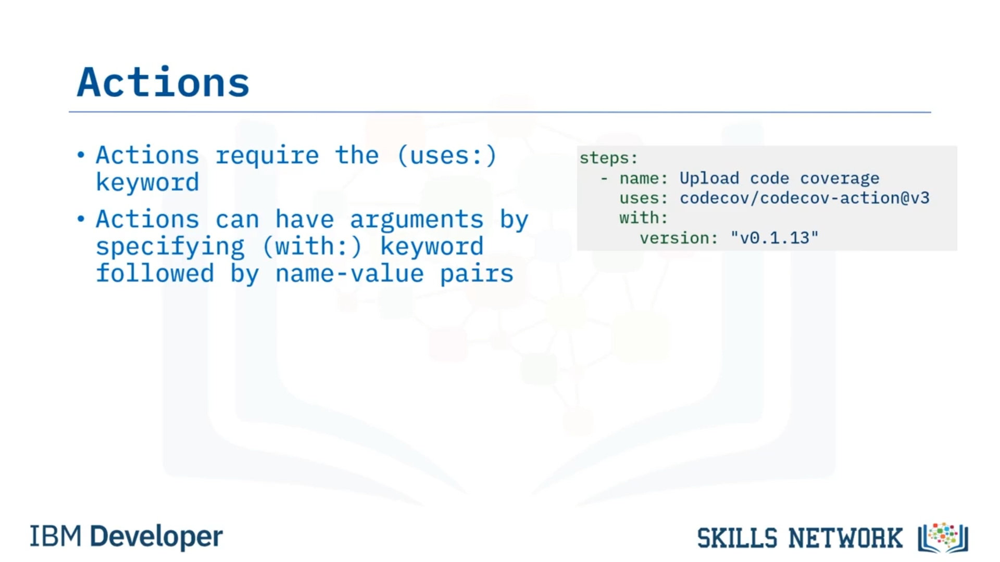
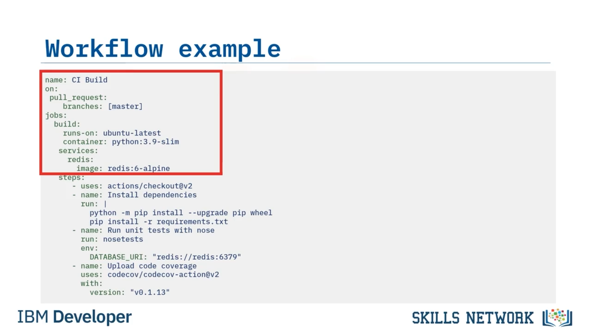
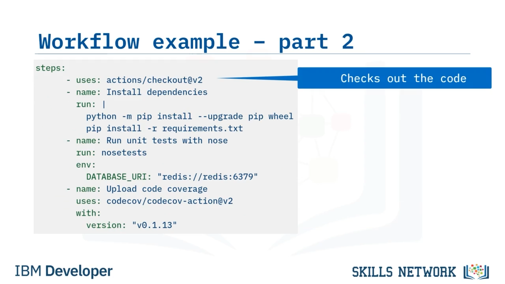
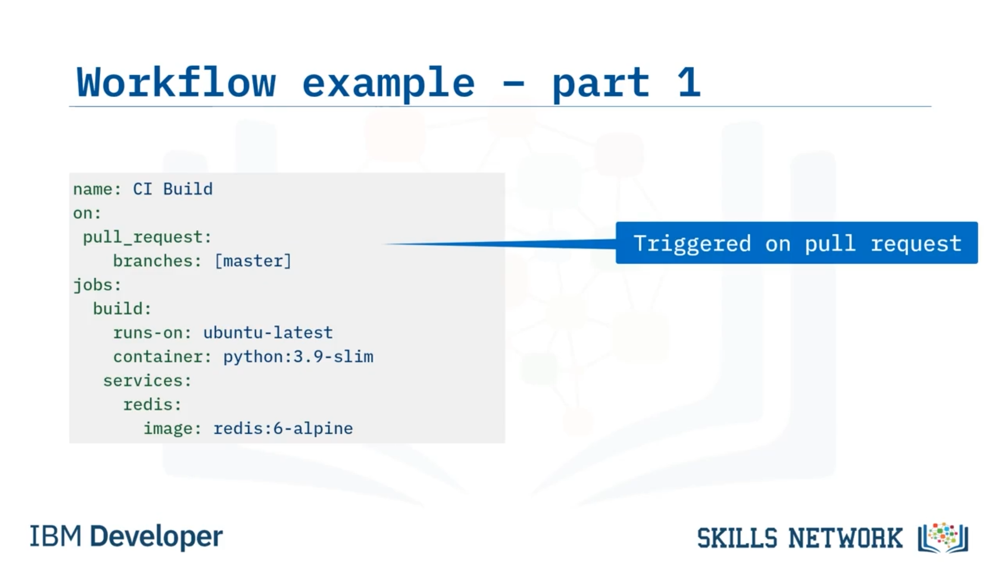
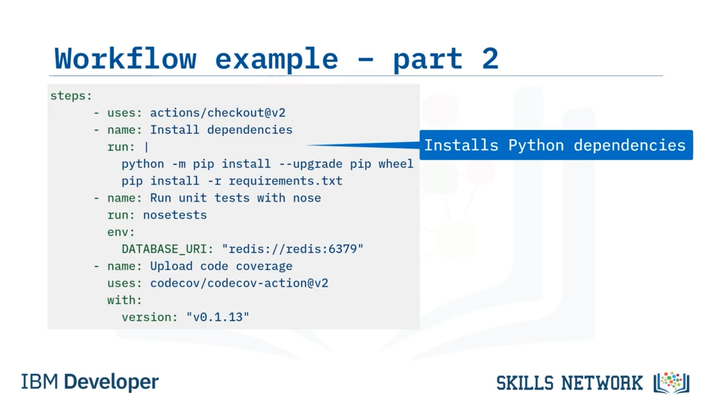
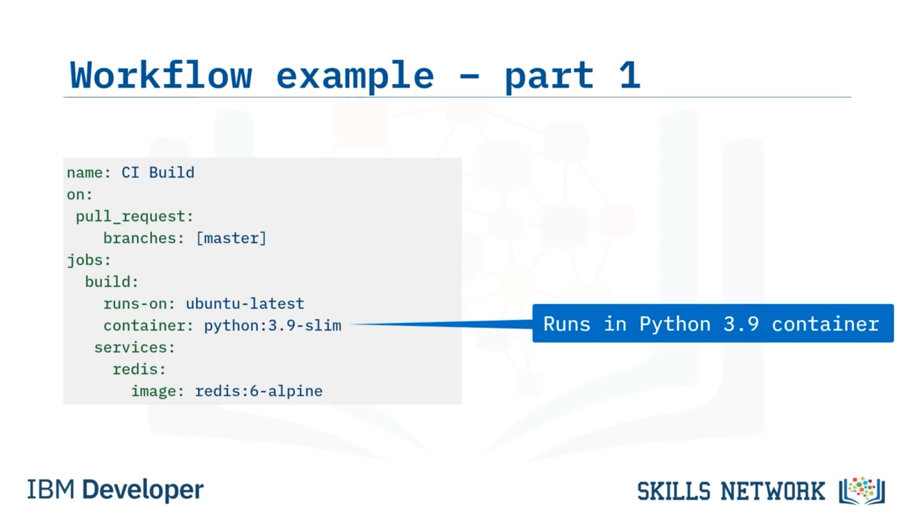
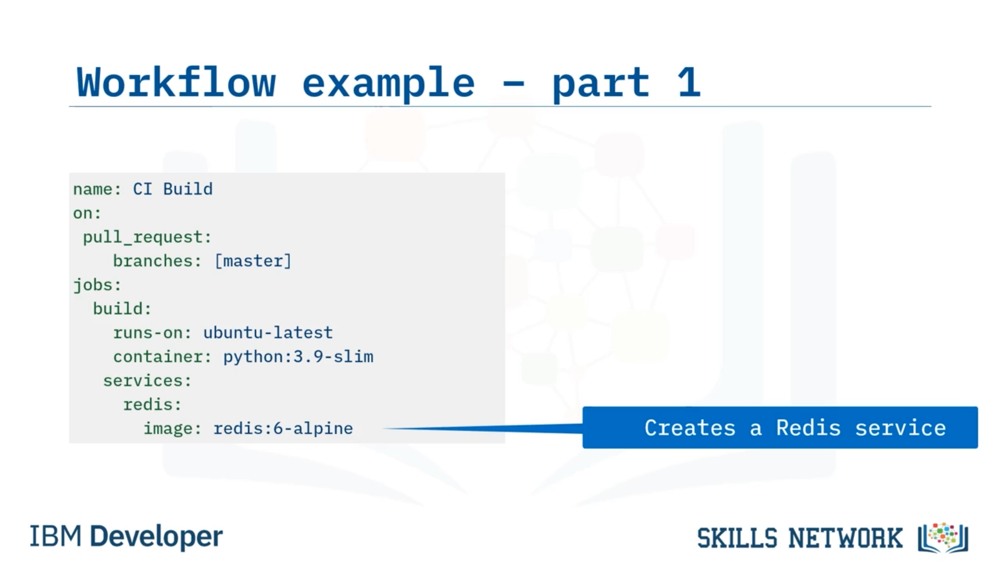

# 🧩 GitHub Actions’a Derinlemesine Bakış: Bölüm 2

‘GitHub Actions’a Derinlemesine Bakış – Bölüm 2’ye hoş geldiniz’. Bu videoyu izledikten sonra şunları yapabileceksiniz: Bir GitHub Actions iş akışındaki ( *workflow* ) bir işin ( *job* ) bileşenlerini açıklamak, bir iş akışının bileşenlerini tanımlamak ve GitHub Actions Marketplace’i nasıl kullanacağınızı açıklamak.

Olayları ( *events* ) ve işleri ( *jobs* ) zaten tartıştık, ancak şimdi bir GitHub Actions iş akışının kalan öğelerine daha yakından bakalım. Özellikle, bir işi oluşturan şeyin ne olduğunu; yani  *runner* ’lar,  *step* ’ler ve  *action* ’ları konuşalım.

---

## 🏃 Runner’lar

Bir  *runner* , belirli bir platformda veya işletim sisteminde bir işi gerçekleştiren bir sunucudur. Bu listede, GitHub Actions’ın desteklediği tüm işletim sistemlerini görebilirsiniz. Ubuntu’nun birkaç sürümü, macOS ve Windows Server’ın çeşitli sürümleri vardır.

Bir iş için bir *runner* belirlediğinizde, tüm  *step* ’ler o *runner* üzerinde çalıştırılır. İşte bazı *runner* tanımı örnekleri. Bir *runner* belirtmek için `runs-on:` anahtar sözcüğünü kullanırsınız.

Bu ilk işin adı `build` ve Ubuntu’nun en son sürümü ne ise onun üzerinde çalışır. Bu sonraki iş çok benzer, ancak Ubuntu 22.04’ü belirtir; yani bu iş, en son sürüm ne olursa olsun her zaman Ubuntu’nun 22.04 sürümünde çalışır.

Bu son iş ise bir Python 3.9-slim Docker konteyneri içinde çalışır; bu da aslında Debian 11’in içindedir. Konteyner, en son Ubuntu ortamının üzerinde çalışır.

Yani bunun için, en son Ubuntu sürümünü çalıştıran bir sanal makine elde edersiniz ve bu sanal makine, tüm adımlarınızı çalıştırmak üzere Python 3.9-slim imajından bir Docker konteyneri başlatır. Bunu çok kullanıyorum çünkü konteynerlarda geliştiriyorum ve bu, sürprizleri en aza indirmek için derlemi ( *build* ) aynı konteynerlarda çalıştırmama olanak tanıyor.

---

## 🧰 Servisler

İşler, iş akışı için gerekli olan hizmetleri ( *services* ) isteğe bağlı olarak tanımlayabilir. Servisler Docker konteynerları olarak tanımlanır. Servisi oluşturmak için, kendi imajlarınız dahil olmak üzere, istediğiniz herhangi bir herkese açık Docker imajını kullanabilirsiniz. Veritabanları, mesaj kuyrukları veya iş akışınızın ihtiyaç duyduğu servisleri oluşturabilirsiniz.

Bu örnek, bazı birim testlerini ( *unit tests* ) çalıştırmadan önce gerekli olan bir Postgres veritabanı oluşturur.

Servis için hangi adı kullanırsanız, ona erişmek için kullandığınız DNS adı da o olur. Yani bu örnekte, Postgres veritabanınızı `postgres` adlı bir host üzerinde arardınız. Bu şekilde servisler kullanmak, geliştirmede kullandığınız aynı Docker konteynerlarını iş akışlarınızda da kullanmanıza olanak tanır.

---

## 🧱 Step’ler

 *Step* ’ler GitHub Actions’ın kalbidir. Tüm iş burada gerçekleşir. Bir  *step* , bir veya daha fazla kabuk ( *shell* ) komutu ya da  *action* ’dan oluşan bir görevdir.

 *Step* ’ler, raporda görüntülenen, `name:` anahtar sözcüğü ile belirtilen isteğe bağlı bir ada sahip olabilir. Raporu incelediğinizde her adımda tam olarak ne olduğunu bilmeniz için adımlarınızı açıklayıcı bir şekilde adlandırmak en iyisidir.

Eğer adımınızı kendiniz adlandırmazsanız, adın varsayılanı çalıştırdığınız komutun adı olur.

 *Step* ’lerin, `id:` anahtar sözcüğü ile belirtilen isteğe bağlı bir kimliği ( *ID* ) olabilir; bu da onları diğer adımlarda referans vermek için çok faydalı hale getirir. Bu, bir adımın çıktısını başka bir adımın giriş parametreleri olarak kullanmak istediğinizde işe yarar.

 *Step* ’lerde ya `uses:` anahtar sözcüğü ile belirtilen bir *action* bulunur ya da `run:` anahtar sözcüğü ile belirtilen kabuk komutları bulunur. Bir dikey çizgi ile başlayıp ardından her komutu yeni bir satıra koyarak birden fazla kabuk komutu belirtebilirsiniz.

 *Step* ’ler ayrıca tanımlı ortam değişkenlerine ( *environment variables* ) sahip olabilir. Gerçek bir *12-factor* yaklaşımıyla, servislerinizi ortam değişkenleri aracılığıyla yapılandırmalısınız ve `env:` anahtar sözcüğü bunu yapmanıza olanak tanır. Bir işte ihtiyaç duyduğunuz kadar  *step* ’e sahip olabilirsiniz.

---

## 🧩 Action’lar

 *Action* ’lar, bir *step* içerisinde çalıştırılabilen prosedürlerdir. *Action* tanımlamak için `uses:` anahtar sözcüğünü, ardından  *action* ’ın adını yazmanız gerekir.

GitHub Actions Marketplace topluluğunda geniş bir *action* kütüphanesi vardır.  *Action* ’lar, `with:` anahtar sözcüğü ve ardından ad-değer çiftleri belirterek yapılandırılabilen argümanlara sahip olabilir. Bazı  *action* ’lar `args:` anahtar sözcüğünü kullanır.

Bu örnekte, codecov  *action* ’ı isteğe bağlı parametrelerinden biri olarak bir sürümü kabul eder. Bir  *action* ’ı hangi seçeneklerle yapılandırabileceğinizi keşfetmek için *action* dokümantasyonunu okumanız kritik öneme sahiptir. Bu, dokümantasyon okumanın gerçekten yardımcı olduğu durumlardan biridir.

---

## 🛒 GitHub Actions Marketplace

GitHub Actions Marketplace’ten birkaç kez bahsettim ve burası *action* bulmak için harika bir yerdir. Bu örnekte, Python için yapılan bir arama; bir Python ortamı kurmak, bir Python linter çalıştırmak, coveralls kullanmak (bu da başka bir kod kapsama ( *code coverage* ) aracıdır) ve daha fazlasını yapmak için  *action* ’lar getirir.

Yapmak isteyebileceğiniz herhangi bir işlem için her zaman GitHub Actions Marketplace’i kontrol edin.

---

## 🧪 Her Şeyi Bir Araya Getirelim: Örnek

Her  *workflow* ’un bir adı vardır. Bunun adı, Sürekli Entegrasyon ( *Continuous Integration* ) iş akışının bir parçası olduğu için `CI Build`’dir. `master` dalına yapılan bir pull request ile tetiklenir.

`build` adlı bir işi vardır; bu iş, en son Ubuntu  *runner* ’ının üzerinde bir Python 3.9 konteynerinde çalışır. Ve Redis 6-Alpine Docker imajından `redis` adlı bir veritabanı servisi oluşturur.

Ardından  *step* ’lerde:

* GitHub  *action* ’ı kullanarak kodu checkout eder.
* `pip` ve `wheel`’i yükseltmek için bir kabuk komutu kullanır ve sonra `requirements.txt` dosyasındaki tüm paketleri kurmak için `pip` kullanır.

* Ardından, `nosetests` adlı popüler bir Python test çalıştırıcısını kullanarak birim testlerini çalıştırır.
* Aynı adımda, daha önce oluşturduğu `redis` veritabanı servisine işaret eden `DATABASE_URI` adlı bir ortam değişkeni tanımlar.
* Son olarak, sürüm numarasını argüman olarak belirterek, codecov uploader’ın 0.1.13 sürümünü kullanıp kod kapsama verisini Codecov web sitesine yükler.

Umarım bu, olayları ( *events* ), işleri ( *jobs* ),  *runner* ’ları, servisleri ( *services* ), adımları ( *steps* ) ve  *action* ’ları bir araya getirerek `master` dalına yapılan her pull request’te tetiklenecek bir Sürekli Entegrasyon iş akışı oluşturmayı nasıl yapacağınızı gösterir.

---

## 📌 Bu Videoda Öğrendikleriniz

Bu videoda şunları öğrendiniz: GitHub Actions iş akışının iş ( *job* ) bileşeni;  *runner* ’ları, servisleri, adımları ( *steps* ) ve  *action* ’ları içerir; bir  *runner* , belirli bir işletim sistemi veya platform üzerinde bir işi gerçekleştiren bir sunucudur; servisler Docker konteynerları olarak tanımlanır; adımlar ( *steps* ), bir veya daha fazla kabuk komutu ya da *action* içeren görevlerdir;  *action* ’lar, bir adım ( *step* ) içinde çalıştırılabilen prosedürlerdir; ve GitHub Actions Marketplace, iş akışlarınızda kullanabileceğiniz birçok hazır *action* içerir.

