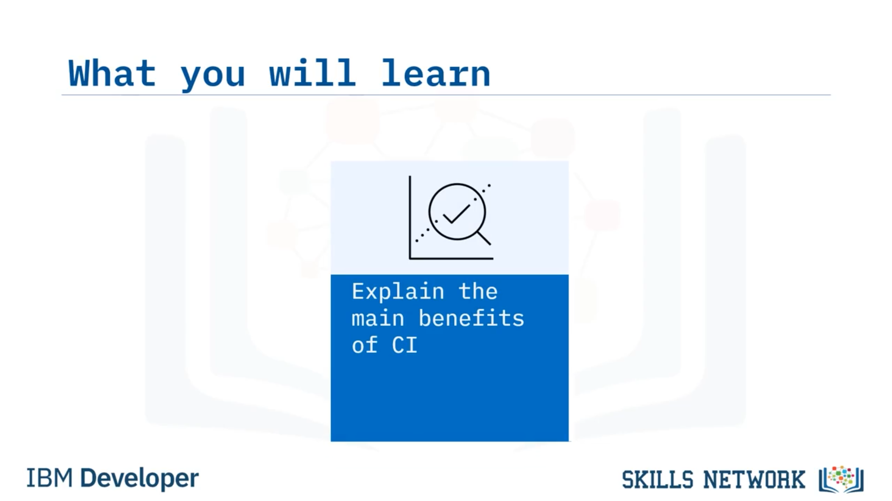
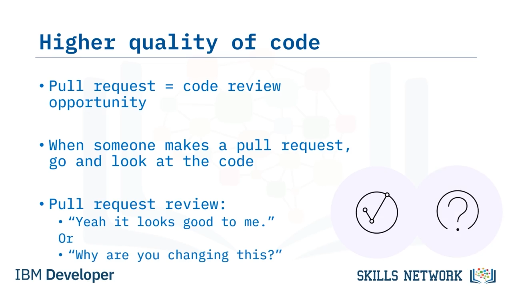

# ✅ CI’nin Faydaları

‘CI’nin Faydaları’na hoş geldiniz. Bu videoyu izledikten sonra şunları yapabileceksiniz: *Sürekli Entegrasyonun (Continuous Integration) temel faydalarını açıklamak.*

CI/CD’nin ilk faydası, kod değişikliklerine daha hızlı tepki süreleri elde etmenizdir. Çünkü kodunuzda her değişiklik yaptığınızda ve bunu uzak bir dala ( *remote branch* ) gönderdiğinizde, kod test edilir; bu yüzden testleri çalıştırmayı unutsanız bile CI aracı bunu test eder.

Ardından değişiklik derlenir (*build* edilir); yani derlemenin çalışıp çalışmadığını kontrol etmeyi unuttuysanız bile CI aracı bunu kontrol eder. Sonra tüm testlerin geçtiğini ve derlemenin bozuk olmadığını bilerek çözümü müşterilerinizin eline daha hızlı ulaştırabilirsiniz.

CI’nin bir diğer faydası, kod entegrasyonu riskinin azalmasıdır.

Çünkü daha küçük ve daha küçük parçaları entegre edersiniz. Daha küçük değişiklikler, bir şeylerin ters gitmesi riskinin daha az olduğu anlamına gelir. Yani, kod tabanınızdaki milyonlarca satır kodun içine 100.000 satır kod entegre etmek zorunda kalmazsınız. O günler bitti.

Yalnızca örneğin 10, 20, 30, 50 satır kodu entegre etmeniz gerekir; bu da ele almanız gereken çok fazla kod olmadığı anlamına gelir. Unutmayın, daha az değişiklik daha az risk demektir.

Bir diğer fayda, CI/CD ile daha yüksek kod kalitesine sahip olmanızdır; çünkü her şey sürekli gözden geçirilir ve sürekli test edilir.

Her *pull request* bir kod incelemesi ( *code review* ) için bir fırsattır. Kod incelemelerini ayrı bir görev olarak planlamayı unutun. En iyi uygulamalardan biri olarak, biri *pull request* açtığında gidip koda bakmalısınız.

Testin geçmesini beklerken değişen şeylere başka bir gözün bakması her zaman iyi bir şey olacaktır. *Pull request* incelemesi sırasında ya “evet bana iyi görünüyor” diyebilirsiniz ya da başlığa bakıp kodun bunu yapması gerektiğini görürsünüz; sonra kodun bir parçasına bakıp bu kodun bununla hiçbir ilgisi olmadığını fark eder ve “bunu neden değiştiriyorsun?” diye sorarsınız.

Ayrıca testlere bakıp tüm testlerin geçip geçmediğini kontrol etmelisiniz. Kod kapsamına ( *code coverage* ) bakın.

Diyelim ki kod kapsamı düştü. Ekibinizin %95 kod kapsamı standardı var ama kod kapsamı yalnızca %91. O zaman ne oldu? Belki biri kod yazdı ama kodun tüm satırlarını çalıştıracak bir test senaryosu yazmadı.

Bu yüzden *pull request* incelemeniz sırasında basitçe bunu kabul etmediğinizi söyleyebilir ve kodda daha fazla değişiklik isteyebilirsiniz. “Kod kapsamı düştü, bu yüzden bunu henüz onaylamayacağım” diyebilir ve kod için daha fazla test senaryosu yazmalarını isteyebilirsiniz.

Sonra gidip daha fazla test senaryosu yazarlar ve *pull request* kod değişikliklerini görür ve testleri yeniden çalıştırır.

Eğer bu test sonuçları artık size iyi görünüyorsa, “Tamam, kod kapsamı artık %95’in üzerinde, şimdi  *pull request* ’i onaylıyorum” diyebilirsiniz.

Birbirinizin işini bu şekilde izlemek, geliştirme ekiplerinizden beklemeniz gereken şeydir; onların yapmasını istediğiniz şey budur. Birbirlerini izlemelerini, birbirlerine yardım etmelerini, birbirlerinin koduna bakmalarını ve çok sayıda kod incelemesi yapmalarını istersiniz.

Çünkü 20 satır kod üzerinde kod incelemesi yapmak, 20.000 satır kod üzerinde kod incelemesi yapmaktan çok daha kolaydır.

 *Pull request* ’leri bu yüzden yaparsınız; koda ikinci bir göz seti kazandırırsınız ve birinin haberi olmadan felaket bir şey olmasını engellersiniz.

Ayrıca sürüm kontrolündeki ( *version control* ) kodun çalıştığını bilirsiniz. Çünkü sürekli teslimat ( *continuous delivery* ) nasıl yapılacak?

Bunu bir an düşünün. Git’ten veya kodunuzu tuttuğunuz başka bir kaynak kod yönetim sisteminden ( *source control management system* ) dağıtım yapacaksınız. Git’teki kodun çalıştığını nasıl bilirsiniz?

Cevap şu olmalıdır: Sürekli entegrasyon testlerinizi çalıştırdınız ve hepsi geçti.

Her değişikliği test etmezseniz, üretime ( *production* ) bozuk kod dağıtıyor olabilirsiniz. Bu yüzden Git’teki o *master* ya da *main* dalındaki her şeyin çalıştığını bilmek çok önemlidir.

Bu videoda şunları öğrendiniz: CI/CD size değişikliklere daha hızlı tepki süreleri, azaltılmış kod entegrasyonu riski, her şeyin sürekli gözden geçirilip test edilmesi nedeniyle daha yüksek kod kalitesi ve sürüm kontrolündeki kodun çalıştığına dair doğrulama sağlar.

Ayrıca geliştirme ekiplerinizin birbirlerinin işlerini düzenli olarak izlemesi gerektiğini de öğrendiniz.

