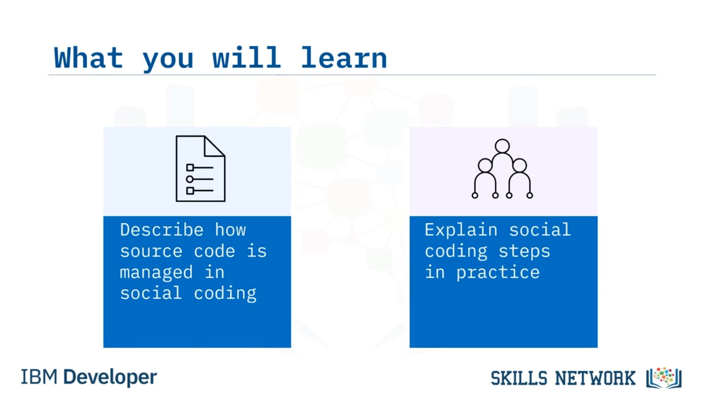
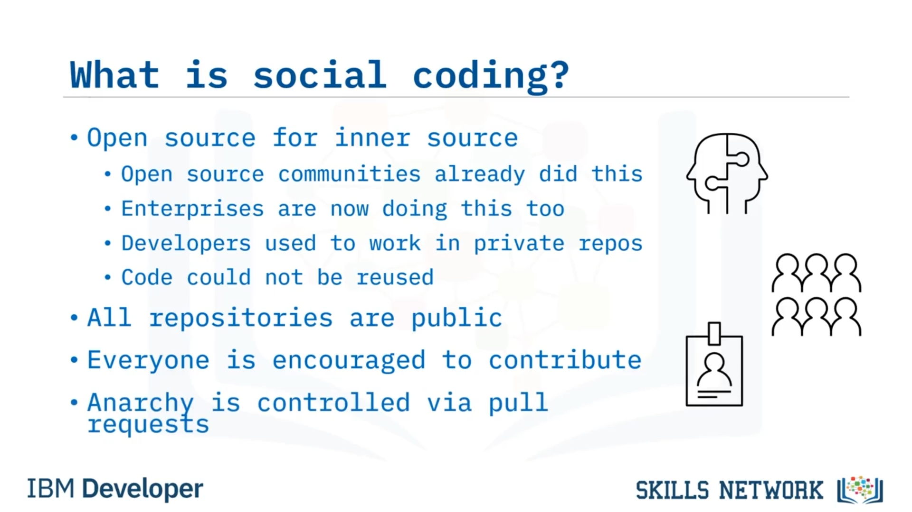
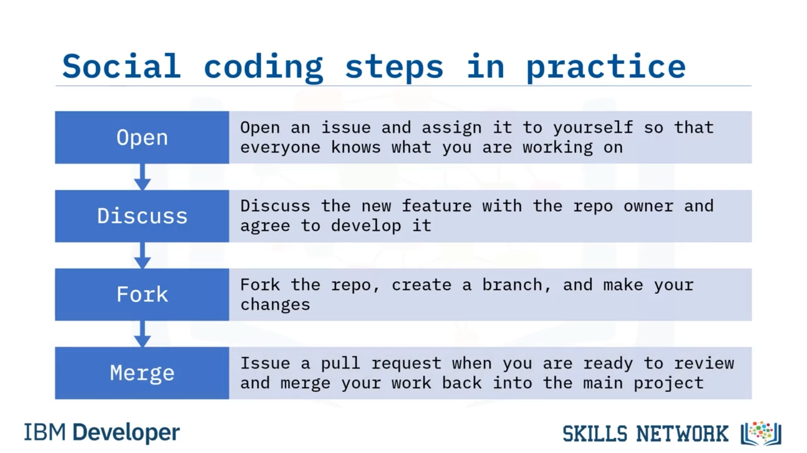
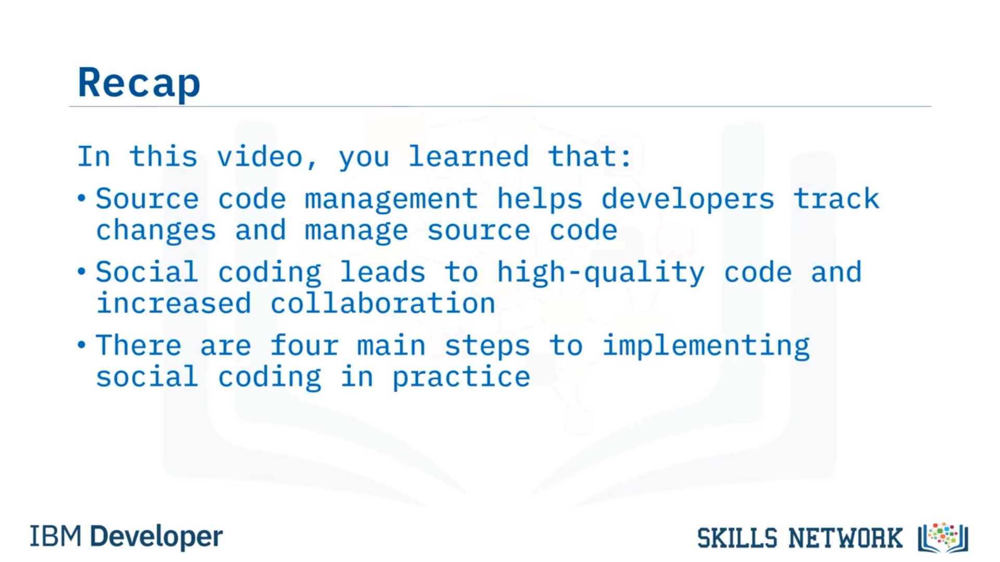

# 🤝 Sosyal Kodlama

“Sosyal Kodlama” bölümüne hoş geldiniz. Bu videoyu izledikten sonra şunları yapabileceksiniz: Sosyal kodlamada kaynak kodun nasıl yönetildiğini açıklamak ve pratikte sosyal kodlama adımlarını anlatmak.

Kaynak kod yönetimi (*Source Code Management* ya da  **SCM** ), kaynak kod geliştirilirken sürümlerinin takip edilmesi uygulamasıdır. Bu, hatalar oluştuğunda önceki bir sürüme geri dönmeyi kolaylaştırır. Ayrıca birden fazla kişinin kodun farklı bölümlerinde çalışmasına ve bu değişiklikleri tek bir **doğruluk kaynağına** ( *single source of truth* ) birleştirmesine olanak tanır.

Programcılar kaynak kodu yönetmek için **SCM araçları** kullanır. Bu araçlar **sürüm kontrol sistemleri** (*Version Control Systems* ya da  **VCS** ) olarak da adlandırılır.

Bu iki terimi yazılım sistemlerine atıfta bulunurken birbirinin yerine kullanabilirsiniz.

---

## 🗂️ SCM Türleri: Merkezi ve Dağıtık

SCM’ler merkezi ( *centralized* ) veya dağıtık ( *distributed* ) olabilir.

Merkezi bir SCM, kod deposunu ( *repository* ) ve sürüm geçmişini merkezi olarak saklar; geliştiriciler kodun parçalarını check out eder, üzerinde çalışır ve değişiklikleri tekrar merkezi depoya commit eder. Build işlemleri merkezi depoda yapılmalıdır çünkü tüm kodun bulunduğu tek yer orasıdır.

Dağıtık bir SCM’de ise her geliştiricinin tüm kod deposunun ve sürüm geçmişinin yerel bir kopyası ( *local clone* ) vardır. Bu, her geliştiricinin kodun tamamı yerelde bulunduğu için yerel build alabilmesi anlamına gelir.

---

## 🌐 Sosyal Kodlama Nedir?

Peki sosyal kodlama nedir?

“İç kaynak için açık kaynak” ( *open source for inner source* ) olarak da adlandırılabilir. Sosyal kodlama, açık kaynak topluluklarının yıllardır yaptığı bir şeydir. Yeni olan, bu kavramları kuruma ( *enterprise* ) taşımak ve iç projelerde topluluk olarak kodlamaktır.

Geçmişte geliştiriciler, sınırlı “bilmesi gereken” ( *need to know* ) erişimi ve sınırlı iletişimi olan özel depolarda (*private repositories* /  *repos* ) çalışırdı. Bu, kodun yeniden kullanılma ihtimalinin olmaması anlamına gelirdi ve sonuç olarak kurumlar sürekli aynı şeyi yeniden icat ederdi; çünkü kimse tekerleğin zaten yapılmış olduğunu bilmiyordu.

Sosyal kodlamada depolar herkese açıktır ve herkesin kodu fork etmesi ve katkıda bulunması teşvik edilir. Bu, çok farklı bir düşünme biçimidir.

Geliştirme ekipleri “bu benim kodum ve kimse dokunamaz” diye düşünmeyi sever, ancak şirketin iyiliği için bunun üstesinden gelmeleri gerekir.

Anarşinin ortaya çıkacağını düşünebilirsiniz, ancak aslında oldukça iyi çalışır; çünkü depo sahibi tarafından kontrol edilir. Depoya sahip olan kişi hâlâ katkılar üzerinde tamamen kontrol sahibidir.

---

## 🧭 Sosyal Kodlama Pratikte Nasıl İşler?

Sosyal kodlama pratikte şu şekilde çalışır:

Önce bir **GitHub issue** açar ve onu kendinize atarsınız; böylece herkes üzerinde çalıştığınızı bilir.

Yeni özelliği repo sahibiyle tartışırsınız ve onlar için geliştirmeyi kabul edersiniz. Bu, onların yaptığı her şeyden yararlanmanıza ve ihtiyaç duyduğunuz özelliği eklemenize olanak tanır.

Ardından repoyu **fork** edersiniz, bir **branch** oluşturursunuz ve değişikliklerinizi yaparsınız.

Her şey bittiğinde ve katkıda bulunacak bir şeyiniz olduğunda, incelemeye hazır olduğunuzu belirten bir **pull request** açarsınız ve repo sahibi kodunuzu ana projeye ( *main project* ) merge edip etmeyeceğine karar verebilir.

Repo sahipleri tam kontrole sahiptir. Kodu merge ettikleri için değişiklik isteyebilirler. Yeterli test kapsamınız ( *test coverage* ) yoksa daha fazla test yazmanızı isteyebilirler. Sizi eşit bir ekip üyesi olarak görürler ve bu bir kazan-kazan durumudur.

Siz başka bir ekibin kodunu ve işlevselliğini kullanmış olursunuz, diğer ekip ise ücretsiz olarak yeni bir özellik kazanır.

Şirket, kod yeniden yazılmak yerine yeniden kullanıldığı için para tasarrufu sağlar ve herkes mutlu olur.

Bu, açık kaynağın çalışma şeklidir ve şirketlerin iç kaynaklarını ( *inner source* ) da bu şekilde ele alması gerekir.

---

## ✅ Özet

Bu videoda şunları öğrendiniz: kaynak kod yönetiminin geliştiricilerin değişiklikleri takip etmesine ve kaynak kodu yönetmesine yardımcı olduğu, sosyal kodlamanın yüksek kaliteli koda ve artan iş birliğine yol açan bir uygulama olduğu, pratikte sosyal kodlamayı uygulamanın dört ana adımı olduğu ve her adımın bir sonrakine aktığı.

