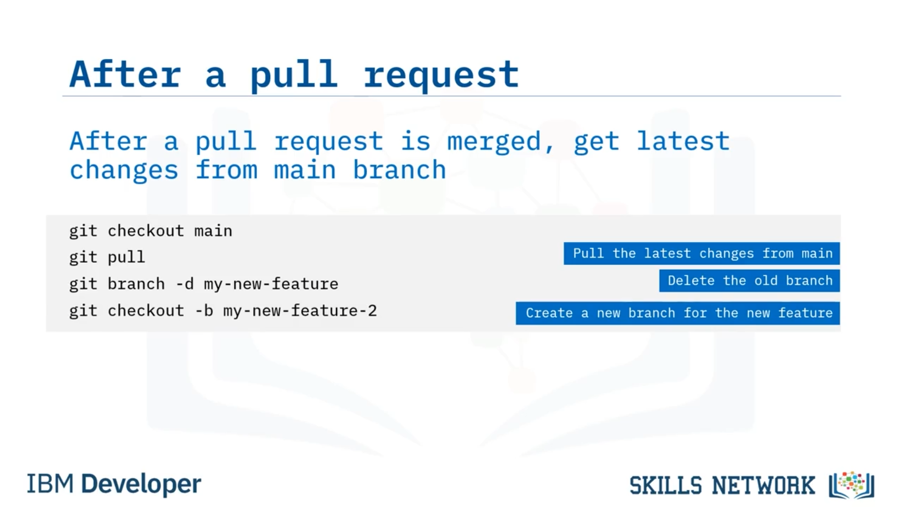

# 🌿 Git Feature Branch Workflow: Pull Request Oluşturma

Git Feature Branch Workflow: Pull Request Oluşturma bölümüne hoş geldiniz. Bu videoyu izledikten sonra, Git Feature Branch iş akışının pratikte nasıl göründüğünü açıklayabilecek ve *pull request* iş akışını tanımlayabileceksiniz.


Önceki videoda Git Feature Branch iş akışını hatırlıyorsanız, şimdi sürecin son iki adımındasınız: önce bir *pull request* oluşturmanız, sonra da kodunuzu birleştirmeniz ( *merge* ) gerekir.


---

## 🔁 Pull Request Sürecini Gözden Geçirme

Önce ana ( *main* ) branch’i checkout yapar ve koddaki yeni değişiklikleri yerel çalışma alanınıza çekersiniz. Ardından değişiklikler yaptığınız feature branch’e geçebilir ve ana branch’teki yeni kodları feature branch’inize birleştirebilirsiniz ( *merge* ). Bu, ana branch’teki en güncel değişikliklerin branch’inize dahil edilmesini sağlar.


---

## 🧩 Çakışmaları Çözme ve Remote’a Gönderme

Merge çatışmaları ( *merge conflicts* ) çözüldükten ve süreç tamamlandıktan sonra, yerel branch’inizi remote repo’ya push edebilirsiniz. Bu basit komutla remote repo’da, yerel branch’inizi takip edecek yeni bir branch oluşturup ayarlayabilirsiniz.

Son olarak, bir *pull request* oluşturabilir ve bunun incelenip remote repository’ye birleştirilmesini sağlayabilirsiniz.


---

## ✅ Pull Request Oluşturmadan Önce Yapılacaklar

Pull request yapmadan önce aşağıdaki görevleri tamamladığınızdan emin olun:

### 1) Ana branch’e geçip en güncel kodu çekin

Öncelikle `git pull` çalıştırmadan önce ana branch’e geçtiğinizden emin olun; böylece yerel çalışma alanınızda ana branch’in en güncel kodu bulunur.

```bash
git pull
```

Ana branch’in en güncel kodu içerdiğini unutmayın; çünkü değişiklikler yapıldıktan sonra geliştiriciler her zaman tekrar buraya merge eder.

### 2) Güncellenmiş ana branch’i çalışma branch’inize merge edin

Sonrasında güncellenmiş ana branch’i kendi working branch’inize merge edin; böylece sizin branch’iniz de en güncel kodu içerir.

Bu işlem, manuel olarak çözmeniz gereken merge çatışmalarına neden olabilir.

### 3) Güncellenmiş branch’inizi remote repo’ya push edin

Son olarak, güncellenmiş branch’inizi remote repo’ya push edebilirsiniz. Bu noktada branch’iniz artık ana branch’e geri merge edilmek üzere hazırdır.


---

## 🔄 Pull Request Merge Edildikten Sonra

Pull request’iniz merge edildikten sonra, ana branch’e geçmeli ve en güncel kodu çekmelisiniz; bu artık sizin son değişikliklerinizi de içerir.

Yeni bir başlangıç için, üzerinde çalıştığınız eski feature branch’i silin; çünkü o branch’teki değişiklikler zaten ana branch’e merge edilmiştir.

Ardından yeni bir feature branch oluşturarak ve checkout yaparak geliştirmeye başlayabilirsiniz.



---

## 📌 Bu Videoda Öğrendikleriniz

Bu videoda şunları öğrendiniz: Pull request’lerin Git Feature Branch iş akışının son iki adımında yapıldığı, geliştirme için her zaman yeni bir feature branch oluşturmanız gerektiği, pull request oluşturmadan önce ana branch’ten güncel kodu her zaman çekmeniz gerektiği ve branch merge edildikten sonra feature branch’i silmeniz gerektiği.


