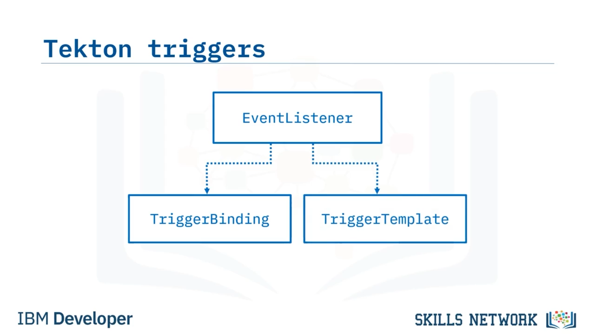
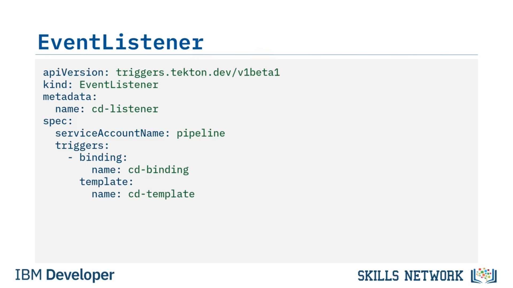
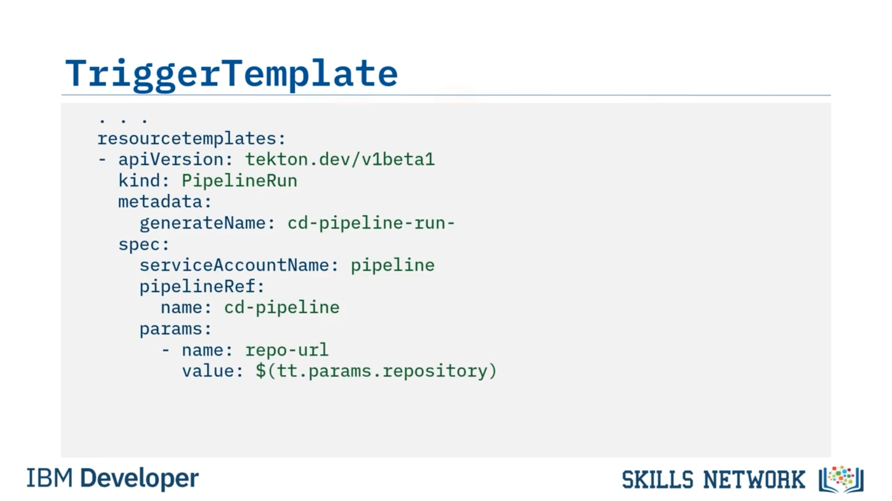

# 🎯 Tekton Tetikleyicileri Oluşturma

‘Tekton Tetikleyicileri Oluşturma’ya hoş geldiniz. Bu videoyu izledikten sonra Tekton olaylarını nasıl oluşturacağınızı, Tekton tetikleyicilerini nasıl oluşturacağınızı ve olaylar ile tetikleyicileri kullanarak bir Tekton pipeline’ını nasıl başlatacağınızı açıklayabileceksiniz. 

Olaylar, tetikleyiciler, pipeline’lar, görevler ve adımların kavramsal yapı taşlarına geri dönerseniz, olaylara ve tetikleyicilere daha yakından bakalım.

Tekton tetikleyicileri, pipeline’ınızın dış olaylara yanıt vermesini sağlar. Bunu, iki diğer CRD’yi işaret eden EventListener olarak bilinen bir *Custom Resource Definition* (veya  *CRD* ) ile yaparlar. *TriggerBinding* CRD’si, olaydan veri alır ve bunu pipeline’ınızdaki özelliklere bağlar. *TriggerTemplate* CRD’si ise bağlamadan gelen veriyi alır ve bu veriyi geçirerek bir *PipelineRun* örnekler.

---

## 🔁 Tetikleyicilerin Akışı

Bu tetikleyicilerin nasıl aktığına bakalım. Bir *EventListener* oluşturduğunuzda, Kubernetes içinde olayları dinleyen bir pod oluşturur. Dış bir olay gerçekleştiğinde, bu olay EventListener pod’una gönderilir; bu da TriggerBinding’in örneklenmesine neden olur ve TriggerBinding olaydan bilgiyi çekip pipeline’ın ihtiyaç duyduğu parametrelere bağlar.

TriggerBinding’den gelen parametreler daha sonra TriggerTemplate’e iletilir. TriggerTemplate, adından da anlaşılacağı üzere pipeline’ınızı çalıştıran bir PipelineRun olarak tanımlanır. Bu yeni PipelineRun kaynağı başlar ve pipeline’ınız çalışmaya başlar.

Şimdi bir CD pipeline’ı için basit bir event listener oluşturalım.

---

## 🧩 EventListener Tanımı

Önce API sürümünü belirtirsiniz: `triggers.tekton.dev/v1beta1`. Ardından kaynak türünü belirtirsiniz:  *EventListener* . Metadata kullanarak buna `"cd-listener"` adını verirsiniz.

Şimdi spesifikasyonları ekleyebilirsiniz. Pipeline’ın hangi ServiceAccount altında çalışacağını belirlemek için `serviceAccountName` tanımlarsınız. OpenShift’te, pipeline çalıştırmak için gereken erişim kontrolüyle önceden yapılandırılmış `"pipeline"` adlı bir ServiceAccount bulunur; bu yüzden onu kullanırsınız.

Artık bu EventListener için tetikleyicileri tanımlayabilirsiniz. `"cd-binding"` adında bir binding ve `"cd-template"` adında bir template belirtirsiniz. Bu EventListener bir olay aldığında, veri önce `"cd-binding"` adlı binding’e aktarılır; ardından binding bu veriyi `"cd-template"` adlı trigger template’in ihtiyaç duyduğu parametrelere dönüştürür ve template’i çağırır.

---

## 🔗 TriggerBinding Tanımı

Event listener’ı oluşturduğunuza göre, onun referans verdiği binding’i oluşturabilirsiniz. Öncekilerle aynı API sürümüyle başlarsınız ve kaynak türünü *TriggerBinding* olarak belirtirsiniz. Metadata kullanarak adını `"cd–binding"` yaparsınız; böylece EventListener içindeki adla eşleşir.

Sonra spesifikasyonları tanımlarsınız; parametrelerle başlayarak. İlk parametrenin adı `"repository"`’dir ve değeri `body.repository.url` olur.

Bu, gelen olayın body kısmına oldukça özeldir. GitHub için bunu anlamak adına, parametreleri nereden çekeceğinizi görmek üzere GitHub olayının body’sinden gelen JSON dosyasına bakarsınız. İkinci parametrenin adı `"branch"`’dır ve değeri `body.ref`’ten gelir. Böylece gelen olaydan veriyi pipeline’ın ihtiyaç duyduğu parametrelere bağlamış olursunuz.

---

## 🧱 TriggerTemplate Tanımı

Şimdi event listener’da referans verilen trigger template’i belirtmeniz gerekir. Diğer kaynak tanımlarında olduğu gibi API sürümüyle başlarsınız. Bu kez kaynak türünü *TriggerTemplate* olarak belirlersiniz. Metadata’da adını `"cd-template"` yaparsınız; böylece EventListener’daki adla eşleşir.

Sonra spesifikasyonları tanımlarsınız; parametrelerden başlayarak. İlk parametrenin adı `"repository"`’dir; bir açıklama ve boş bir varsayılan değer verirsiniz. Açıklama sadece dokümantasyon içindir; varsayılan değer ise TriggerBinding tarafından repository adlı bir parametre geçirilmezse kullanılır.

Bir sonraki `"branch"` parametresi de bir açıklamaya sahiptir; fakat bu kez varsayılan değer `"master"`’dır. Yine, TriggerBinding’den branch parametresi gelmezse, pipeline için branch parametresi olarak `"master"` kullanılır.

Şimdi kullanılacak resource template’lerini tanımlamaya hazırsınız.

---

## 🏃 TriggerTemplate İçinde PipelineRun

Bu, aynı TriggerTemplate tanımının bir parçasıdır. TriggerTemplate’in `resourcetemplates` bölümü bir *PipelineRun* kaynağı içerir. Tüm kaynaklarda gördüğünüz gibi, bir API sürümüyle başlar. Bu, normal Tekton API’sidir.

Kaynak türü  *PipelineRun* ’dır ve pipeline’ı çalıştırmak için gereken bilgileri belirtir. Metadata bölümünde bir ad verebilirsiniz ya da bu örnekte olduğu gibi `"generateName"` kullanıp kısmi bir ad belirtebilirsiniz. Bu, benzersiz bir ID üretir ve verdiğiniz kısmi adın sonuna ekler.

Bu, tüm pipeline run’lara benzersiz bir ad vermenin etkili bir yoludur.

Ardından spesifikasyonları listelersiniz. Yine pipeline’ı çalıştıran ServiceAccount’un `serviceAccountName`’ini belirtmeniz gerekir; bu yüzden aynı `"pipeline"` hesabını kullanırsınız.

Şimdi `pipelineRef` belirtirsiniz; bu, çalıştırmak istediğiniz pipeline’a bir referanstır. `"cd-pipeline"` adını verirsiniz; bunun, başka bir yerde cd-pipeline adlı bir pipeline tanımladığınızı varsayar.

Sonra pipeline’ın gerektirdiği parametreleri belirtirsiniz. Tahmin ettiğiniz gibi repository için bir parametreye ihtiyaç vardır; ancak burada farklı bir isim kullanıyorsunuz.

Bunun nedeni, çağırdığınız pipeline’ın belirttiği ismi kullanmanız gerekmesidir. Pipeline bunu `"repo-url"` olarak tanımlamıştır, bu yüzden onu geçirmeniz gerekir. Değeri bu TriggerTemplate’in `params` bölümünden alırsınız; yani `$(tt.params.repository)` olarak referans verirsiniz. Bu, parametre adlarının, birbirlerine eşleyebildiğiniz sürece aynı olmak zorunda olmadığını gösterir.

Pipeline’ın ayrıca `"branch"` adlı bir parametreye ihtiyacı vardır; o da TriggerTemplate’in params bölümünden gelir, bu yüzden `$(tt.params.branch)` olarak referans verirsiniz.

Artık bir pipeline’ı tetiklemek için ihtiyacınız olan her şeye sahipsiniz. Parametre adı her zaman eşleşmese bile, onları yine de birbirlerine eşleyebildiğinizi gördünüz.

---

## 🧬 Parametre Akışının Özeti

Parametrelerin nasıl aktığına bakalım. Pipeline için gereken bazı verileri içeren bir olayla başlarsınız. TriggerBinding, bu veriyi olaydan alır ve parametrelere bağlar. Bu parametreler daha sonra TriggerTemplate içinde pipeline run’a eşlenir; böylece pipeline’a ve tüm görevlerine, pipeline’ın beklediği parametre adları olarak sağlanır.

Şunu merak edebilirsiniz: Bu dosyaları kendiniz yazdıysanız, neden tüm parametre adlarını aynı yapmazdınız? Normalde yapardınız; ama artık farklı parametre adlarına sahip mevcut pipeline’ları eşleyip yine de çalıştırabileceğinizi gördünüz.

---

## 🧪 Tetikleyiciyi Test Etme

Gerçeğin anı geldi. Tetikleyicinizin çalışıp çalışmadığını görmeye hazırsınız.

Bunu yerelde `curl` komutunu kullanarak test edebilirsiniz. Önce event listener’ı yerelde dışarı açmanız gerekir. Normalde EventListener’ı bir endpoint olarak açığa çıkarmak için bir Ingress kurarsınız; ancak hızlı bir kontrol için Kubernetes `port-forward` komutunu kullanabilirsiniz.

Bu, EventListener’ın dinlediği port olan 8080’i, istediğiniz herhangi bir porta yönlendirir. Bu örnekte 8090’ı seçtiniz.

Ardından `curl` komutunu kullanır ve `localhost:8090` adresine POST atarsınız. Gönderdiğiniz payload’un `application/json` olduğunu belirtmek için header’da Content-Type ayarlarsınız. Ve son olarak dash `"D"` parametresini kullanarak veriyi JSON formatında gönderirsiniz.

TriggerBinding’e repository parametresini `body.repository.url`’den almasını söylediğinizi hatırlarsanız, JSON mesajınızın body’sinde `"repository"` niteliği ve onun altında `"url"` niteliği bulunur.

ENTER’a bastığınızda, EventListener’dan isteğinizi kabul ettiğini belirten bir mesaj alırsınız. En son log’ları görmek için `tekton pipelinerun logs` komutunu kullanırsanız, pipeline’ın hâlâ çalıştığını görürsünüz ve sonunda pipeline içinde çalışan `"checkout"` görevinden gelen mesajı görürsünüz.

Mesajdaki repository adının, klonlamasını söylediğiniz repository adıyla eşleştiğine dikkat edin. Böylece çalıştığını anlarsınız.

---

## ✅ Bu Videoda Öğrendikleriniz

Bu videoda şunları öğrendiniz: Tekton  *EventListener* ’lar dış olayları dinlemek için kullanılabilir, Tekton  *TriggerBinding* ’ler bu olaylara yanıt verip parametreleri bağlayabilir, Tekton  *TriggerTemplate* ’ler parametreleri pipeline’a geçirerek  *PipelineRun* ’lar oluşturabilir ve EventListener’ınızı `curl` komutunu kullanarak test edebilirsiniz.

