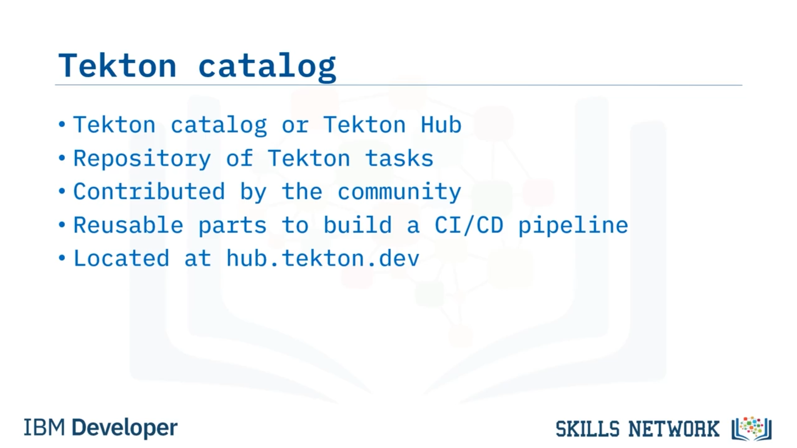
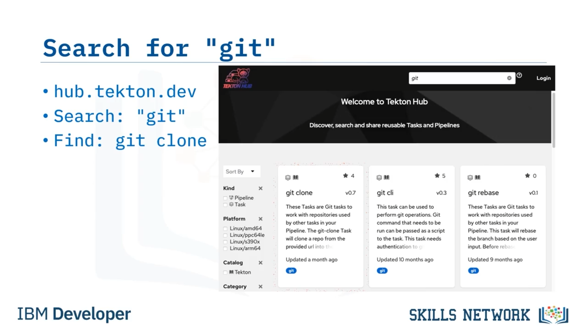
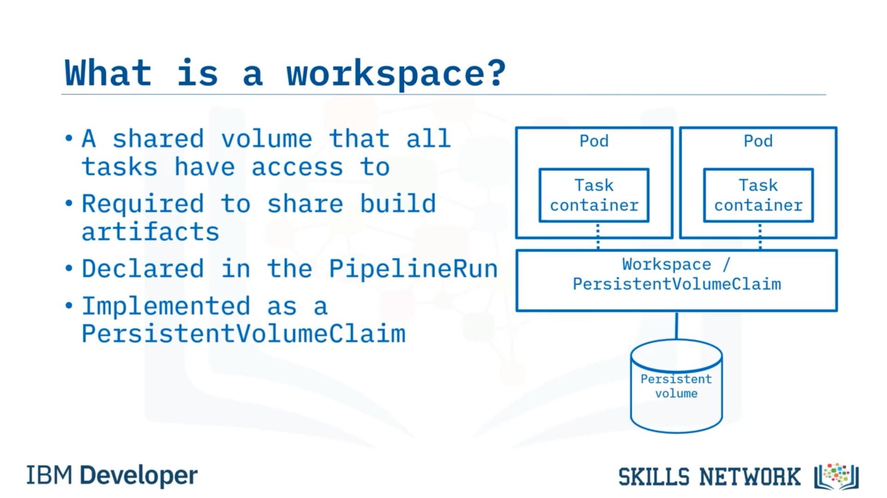
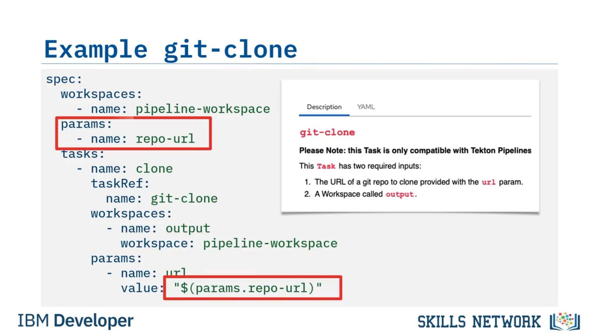
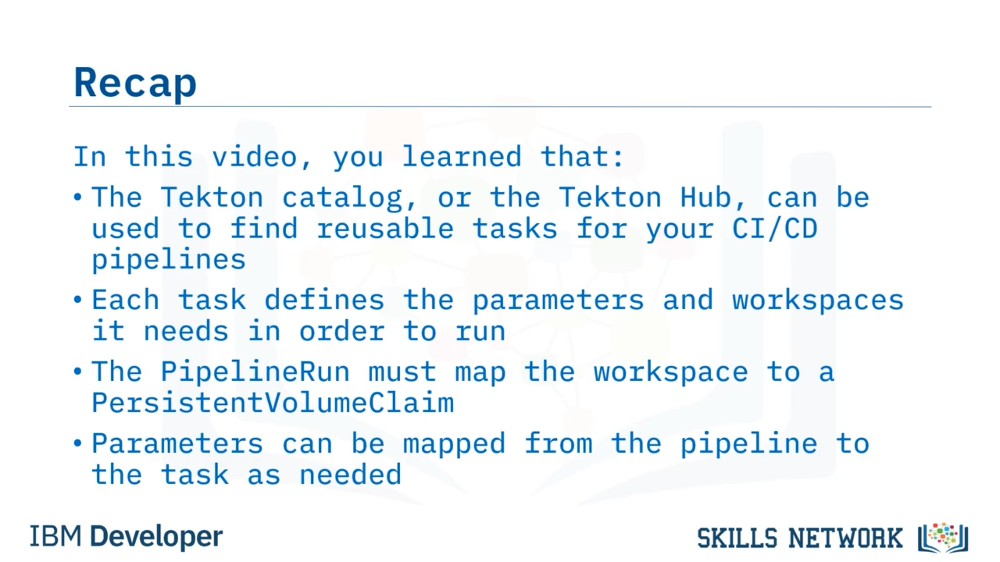

# 📚 Tekton Kataloğunu Kullanma

‘Tekton Kataloğunu Kullanma’ bölümüne hoş geldiniz. Bu videoyu izledikten sonra, Tekton kataloğunu nasıl kullanacağınızı açıklayabilecek, görevler için bir *workspace* nasıl oluşturacağınızı anlatabilecek ve Tekton kataloğundaki görevleri bir Tekton pipeline’ında nasıl kullanacağınızı tarif edebileceksiniz.


## 🗂️ Tekton Kataloğu Nedir?

Peki, Tekton kataloğu nedir? Tekton kataloğu, diğer adıyla Tekton Hub, topluluk tarafından katkıda bulunulmuş Tekton görevlerinin bulunduğu bir depodur; bir CI/CD pipeline’ı oluşturmak için kullanabileceğiniz yeniden kullanılabilir parçalardan oluşan bir koleksiyonu temsil eder. `hub.tekton.dev` adresinde bulunur. Kendi görevlerinizi yazmadan önce, her zaman Tekton kataloğunu kontrol ederek başkasının sizin kullanabileceğiniz bir görev yazıp yazmadığına bakmalısınız. Bu, görevleri oluşturma ve hata ayıklama için harcanacak saatleri, ayrıca görev bakımında harcanacak daha da fazla saati tasarruf ettirir.

Unutmayın: Yazmadığınız bir kod satırı, bakımını yapmak zorunda olmadığınız bir kod satırıdır.



## 🧰 Tekton Hub’daki Kategori ve Görevler

Tekton Hub’da mevcut görev kategorileri; otomasyon, build araçları, kod kalitesi, sürekli entegrasyon, Git gibi geliştirici araçları, imaj oluşturma, Kubernetes ve OpenShift görevleri, ağ, izleme, güvenlik, yayınlama ve daha niceleridir.

Daha önce de belirtildiği gibi, herhangi bir görev yazmaya başlamadan önce her zaman Tekton Hub’ı kontrol etmelisiniz; çünkü büyük ihtimalle sizin kullanabileceğiniz bir görev zaten yazılmıştır.


## 🔧 Görev Detayları ve Kurulum Yöntemleri

Bir görevi seçip ayrıntılarını görüntülediğinizde, görevi nasıl kuracağınıza dair talimatları görürsünüz. Bunlar genellikle YAML biçiminde yazılmış bir Kubernetes manifest’i şeklindedir ve `kubectl` komutu ile uygulanabilir.

Ancak ayrıca, görevleri hub’dan Tekton CLI aracıyla kolayca kurabileceğinizi de belirtmek önemlidir; şu şekilde:

```bash
tkn hub install task <task-name>
```

Detaylar ayrıca görevin ihtiyaç duyduğu parametreleri de belgeler; adının ne olduğu, türünün ne olduğu ve çeşitli değerlerin ne olabileceğine dair ipuçları gibi.

Detaylar ayrıca görevin, diğer görevlerle veri paylaşmak için herhangi bir *workspace* gerektirip gerektirmediğini de söyler. *Workspaces* konusunu birazdan ele alacağız.

Eğer görev herhangi bir *result* üretiyorsa, bunlar da detaylarda belgelenir; ayrıca görevin özel çalıştırma izinlerine sahip bir service account gerektirip gerektirmediği de belirtilir.

Son olarak, detaylar görevin çalışabileceği platformlar hakkında bilgi içerir ve bazıları yararlı kullanım örnekleri bile sunar.


## 🧩 Örnek: Tekton Hub’dan `git-clone` Görevini Bulma

Muhtemelen pipeline’ınızda yapmanız gereken ilk şey, kaynak kodunuzu klonlamak için Git kullanmaktır; böylece build edilebilir ve üzerinde diğer kontroller çalıştırılabilir.

`hub.tekton.dev` adresine gidersiniz ve arama kutusuna “git” yazarsınız. Bu, biri “git clone” adlı bir görev olan birkaç sonuç döndürür.



Bu, tam olarak ihtiyacınız olan görev gibi görünür. Bu yüzden ayrıntıları görmek için seçersiniz.

Detay sayfası, görevi pipeline’ınızda kullanmak için gereken tüm bilgileri verir. `git-clone` gibi bazı görevler birçok isteğe bağlı parametreye sahiptir ama gözünüz korkmasın.


Genel bakışa baktığınızda, `git-clone` görevinin yalnızca iki girdi gerektirdiğini görürsünüz: Klonlamak istediğiniz deponun URL’i ve kaynak kodu içine klonlamak için “output” adlı bir  *workspace* .

Bu bilgileri bir görevde nasıl uygulayabileceğinize bakalım.


## 🗃️ Workspace Nedir ve Neden Gereklidir?

İki girdiden biri bir *workspace*tir. Peki *workspace* nedir?

Tekton’da her görev kendi pod’unda çalışır ve her pod diğer tüm pod’lardan izoledir. Bu, görevler arasında veri aktarmayı zorlaştırır.

Bu problemi, her görevin erişebildiği paylaşımlı bir volume olan bir *workspace* sağlayarak çözersiniz. Bu, bu volume üzerinden veri paylaşmalarını sağlar.

Düşününce, bu build artifact’lerini paylaşmak için gereklidir.

Kodunuzu önce Git’ten klonlamadan lint yapamazsınız; dolayısıyla kodu paylaşmanın bir yolu olmalıdır ve bunun cevabı  *workspace* ’tir.

 *Workspace* ’ler `PipelineRun` içinde tanımlanır ve bir Kubernetes `PersistentVolumeClaim` olarak uygulandıkları için, pipeline’ın beklediği workspace adını, artifact’leri saklamak için pipeline’ın kullanabileceği bir `PersistentVolumeClaim` ile eşlemek `PipelineRun`’a bağlıdır.

Bunun nasıl yapıldığına bakalım.



## 💾 PersistentVolumeClaim Oluşturma

Öncelikle bir `PersistentVolumeClaim` oluşturmanız gerekir. Ona “pipelinerun-pvc” adını verirsiniz. Ardından varsayılan storage class’ı kullanarak yapılandırırsınız, 1 gigabyte depolama alanı talep eder ve bir dosya sistemi olarak read-write şekilde mount edersiniz.

## 🚀 PipelineRun Oluşturma ve Workspace Eşleme

Artık bir `PipelineRun` oluşturmaya hazırsınız.

Her çalıştırmanın benzersiz şekilde tanımlanabilmesi için benzersiz bir ad üretilecek şekilde yapılandırırsınız.

Spec içerisinde çalıştırmak istediğiniz pipeline’a bir referans eklersiniz. Bu örnekte “cd-pipeline” adlı bir pipeline’dır.

Sonra, bir *workspace* tanımlarsınız: ona bir isim verirsiniz ve onu kullanmak istediğiniz `PersistentVolumeClaim` (PVC) ile eşlersiniz.

Bu noktadan sonra pipeline, onu “pipeline-workspace” adıyla referans alabilir ve Kubernetes, “pipelinerun-pvc” adlı PVC’yi her bir pod’a mount edeceğini bilir.

Son olarak, pipeline’ın ihtiyaç duyduğu parametreleri iletirsiniz. Bu örnekte “repo-url” adlı bir parametredir.


## 🧱 Tekton Kataloğundan `git-clone` ile Pipeline Görevi Yazma

Şimdi, Tekton kataloğundan `git-clone` görevini kullanarak pipeline görevini nasıl yazacağınıza bakalım.

Pipeline spec ile başlarsınız ve “pipeline-workspace” adlı bir workspace’in gerekli olduğunu tanımlarsınız; böylece ihtiyaç duyan görevlerin herhangi biri onu kullanabilir.

Sonra, “repo-url” adlı bir parametrenin pipeline’a geçirilmesi gerektiğini tanımlarsınız; böylece ihtiyaç duyan herhangi bir görev onu kullanabilir.

Ardından görevlerinizi tanımlamaya başlarsınız.

Kaynak kodunuzu klonlayacak görev olduğu için “clone” adlı bir görev oluşturursunuz.

`taskRef` değerini, Tekton kataloğundan kurduğunuz “git-clone” görevine işaret edecek şekilde ayarlarsınız.

Hatırlarsanız, `git-clone` görevi “output” adlı bir workspace gerektirir; bu nedenle, bu görev için “pipeline-workspace” adlı workspace’i “output” adlı workspace’e eşleyecek bir mapping tanımlarsınız.

Diğer görevler farklı workspace adları kullanabilir ve hepsi bu pipeline’ın kullandığı tek bir workspace’e geri eşlenebilir.

Ayrıca, `git-clone` görevi, klonlamak istediğiniz git deposunun URL’ine ayarlanması gereken “url” adlı bir parametre gerektirir; bu yüzden pipeline’daki “repo-url” parametresini, görevin gerektirdiği “url” parametresine eşlersiniz.

Görev tamamlanmıştır ve çalıştırılmaya hazırdır.


## 🧾 Her Şeyin Nereden Geldiğini Gözden Geçirme

Tekton Hub’daki `git-clone` görevinin detaylarından, “output” adlı bir workspace’e ihtiyaç olduğunu gördünüz; bu yüzden bunu görev için tanımladınız.

Detaylar ayrıca “url” adlı bir parametrenin geçirilmesi gerektiğini söylüyordu; bu yüzden bunu da görev için tanımladınız.

Görevdeki workspace, pipeline spec’inden gelen `pipeline-workspace`’e eşlendi ve görevdeki `url` parametresi, pipeline spec’inden gelen `repo-url` parametresine eşlendi.



## ✅ Özet

Bu videoda şunları öğrendiniz: Tekton kataloğu veya Tekton Hub, CI/CD pipeline’larınız için yeniden kullanılabilir görevler bulmak amacıyla kullanılabilir; her görev çalışmak için ihtiyaç duyduğu parametreleri ve workspace’leri tanımlar; `PipelineRun`, workspace’i bir `PersistentVolumeClaim` ile eşlemelidir; ve parametreler gerektiğinde pipeline’dan göreve eşlenebilir.


