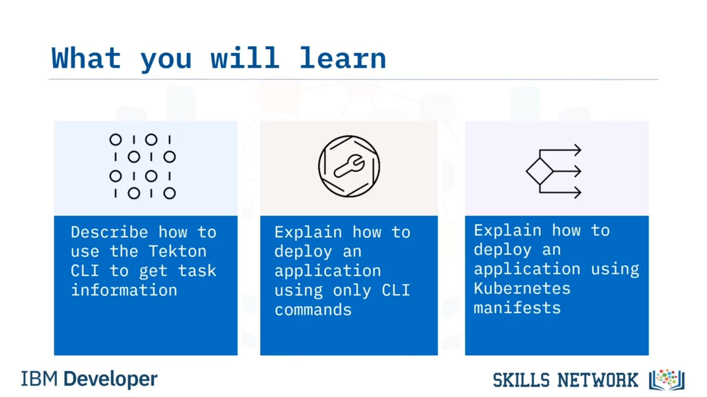
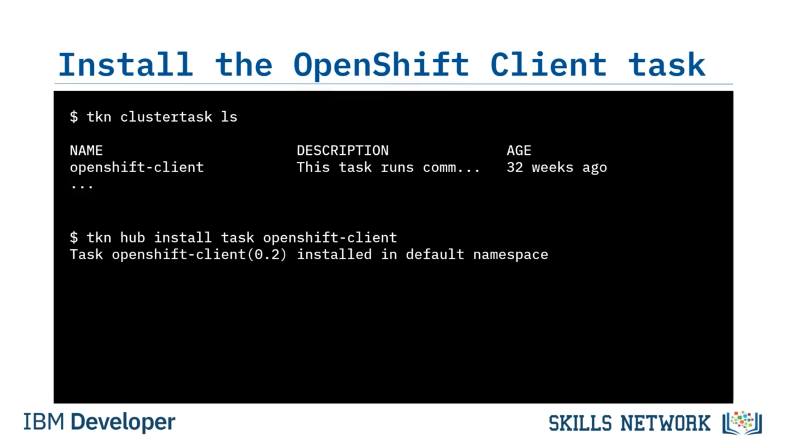
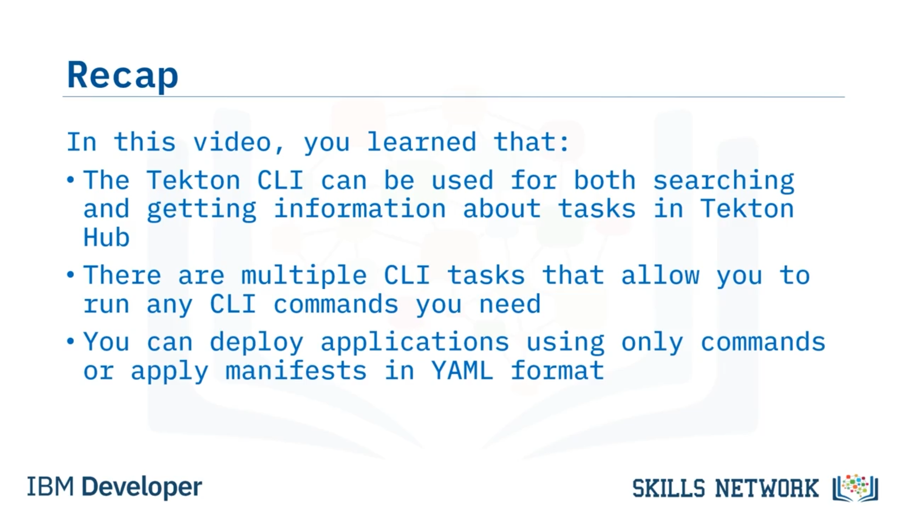

# 🚀 Kubernetes’e Dağıtım

‘Kubernetes’e Dağıtım’ bölümüne hoş geldiniz. Bu videoyu izledikten sonra, Tekton CLI’yi kullanarak görev bilgilerini nasıl alacağınızı açıklayabilecek, yalnızca CLI komutlarını kullanarak bir uygulamayı nasıl dağıtacağınızı açıklayabilecek ve Kubernetes manifestlerini kullanarak bir uygulamayı nasıl dağıtacağınızı açıklayabileceksiniz.



Artık CD pipeline’ınızın son aşamasındasınız. GitHub’dan klonlayarak kodu çekmeyi, *flake8* ve *nose* gibi araçlarla kalite kontrollerini ve birim testlerini çalıştırmayı ele aldınız ve bir container imajı oluşturup yerel bir registry’ye push ettiniz. Şimdi uygulamanızı bir ortama, özellikle Kubernetes’e dağıtma zamanı.

Uygulamanızı Kubernetes’e dağıtmak için seçebileceğiniz birçok yol vardır. *kubectl* komutunu kullanarak cluster’a dağıtabilirsiniz.

Bu, resmi Kubernetes komut satırı arayüzüdür (CLI). Ayrıca, lab’lerde yapacağınız gibi bir OpenShift cluster’a dağıtım yapıyorsanız *OC* (veya OpenShift Cluster CLI) komutunu da kullanabilirsiniz. `oc` komutlarının çoğu yerel Kubernetes ile de çalışır çünkü `oc`, `kubectl`’ün uygun bir üst kümesidir (proper superset).

Bu yöntemlerin her ikisi için de, kaynağınızı yapılandırmak üzere çok sayıda parametre içeren ham CLI komutları kullanabilirsiniz. Ancak çoğu kişi, dağıtmak istedikleri kaynakların tanımını içeren YAML dosyaları biçimindeki Kubernetes manifestleri ile dağıtım yapar.

Son olarak, artık *kubectl* komutunun bir parçası olan *kustomize* (K ile) adında bir araç vardır; bu araç, manifest dosyalarınızda minimum değişiklikle dağıtımları farklı ortamlara anlık olarak özelleştirmenize olanak tanır.


---

## 🔎 Tekton Hub’da CLI Görevlerini Arama

Uygulamanızı dağıtmak için komut satırı arayüzlerinden birini kullanmak istediğinizden, `cli` etiketiyle anotasyonlanmış görevleri aramak için `tkn hub search` komutunu, ardından `"cli"` arama kriterini kullanabilirsiniz.

`"cli"` anahtar kelimesiyle eşleşen veya `cli` etiketine sahip tüm görevler döndürülür. Bu listede `openshift-client`’ın yer aldığını görebilirsiniz, o halde onu inceleyelim.


---

## 📄 Görev Bilgisini Komut Satırından Alma

Tekton Hub’a gitmeden, bir görev hakkında komut satırından daha fazla bilgi alabilirsiniz. Bunu yapmak için `tkn hub info task` komutunu ve ardından bilgi almak istediğiniz görevin adını kullanırsınız; bu örnekte görev adı `openshift-client`’tır.

Görevi açıklayan ve hatta nasıl kurulacağını söyleyen ayrıntılı bir açıklama döndüğünü görürsünüz. Açıklamadan, bunun tam olarak ihtiyacınız olan şey olduğunu görebilirsiniz; o halde kuralım.

---

## 🧩 Görevi Kurma ve Mevcut ClusterTask’ları Kontrol Etme

Bir kez daha belirtmek isterim ki görevler, yönetici tarafından cluster seviyesinde veya yerel seviyede kurulabilir.

Cluster seviyesinde hangi görevlerin zaten kurulu olduğunu görmek için şu komutu kullanmak her zaman iyi bir fikirdir:


```bash
tkn clustertask ls
```

Bu örnekte `openshift-client` cluster seviyesinde kurulu olduğundan, namespace’inizde yerel olarak kurmaya gerek yoktur. Cluster’ınızda durum böyleyse, hazırsınız demektir.

Aksi halde, `openshift-client` görevini Tekton CLI kullanarak kurabilirsiniz. Komut şudur: `tkn hub install task` ve ardından kurmak istediğiniz görevin adı; bu durumda `openshift-client`.


Kurulumun mevcut varsayılan namespace’inize yapıldığını belirten bir sonuç mesajı görmelisiniz.

Tekton Hub’daki OpenShift Client görev dokümantasyonuna bakarsanız, çalıştırmak istediğiniz script’i temsil eden `SCRIPT` adlı yalnızca bir parametre gerektirdiğini görürsünüz.

Ayrıca, dağıtmak istediğiniz manifestler varsa isteğe bağlı bir `manifest-dir` parametresi de belirtir. Bu, uygulamanızı çeşitli şekillerde dağıtmak için mükemmel görünüyor.

---

## 🛠️ Yalnızca CLI Komutlarıyla Dağıtım Görevi Ekleme

Pipeline’a, dağıtım adını ve hangi imajın kullanılacağını belirten tek bir komut satırıyla deploy görevini ekleyelim. Build görevinden `build-image` adlı pipeline parametresini yeniden kullanabilirsiniz. Pipeline parametrelerinin güzel tarafı budur; onları birden fazla pipeline görevi arasında yeniden kullanabilirsiniz.

Daha sonra `oc` komutuyla kullanılmak üzere uygulama adı için `app-name` adında yeni bir pipeline parametresi eklemeniz gerekir.

Şimdi yeni bir görev ekleyebilirsiniz.

Ona `deploy` adını verirsiniz. Ardından kurduğunuz `openshift-client` görevini referans gösterirsiniz. Cluster task sürümünü kullanıyorsanız, Tekton’a `kind` anahtar sözcüğünü `ClusterTask` değeriyle kullanarak bunu söylemelisiniz. Namespace’inizde yerel olarak kurduysanız buna gerek yoktur.



Şimdi, `openshift-client`’ın arayacağı parametre adı bu olduğu için `SCRIPT` adlı bir parametre oluşturma zamanı. Değerine, sonraki satırların tek bir script olarak ele alınacağını belirtmek için dikey çizgi (pipe karakteri) ile başlayan bir içerik verirsiniz.

Pipeline parametrelerinden uygulama adını ve imaj adını geçirerek `oc create deploy` komutunu kullanırsınız.


`app-name` parametresini yukarıda bu yüzden eklediniz.

Son olarak, bu pipeline görevinin `build` görevinden sonra çalışmasını belirtirsiniz; böylece dağıtımdan önce imajın oluşturulduğundan emin olursunuz.

Ve hepsi bu. Tekton Hub’daki Tekton katalogundan `openshift-client` görevini kullanarak pipeline’ınıza başarıyla bir deploy görevi eklediniz.


---

## 🗂️ Kubernetes Manifestleriyle Alternatif Dağıtım

Alternatif bir deploy uygulamasına bakalım. Diyelim ki dağıtmak istediğiniz kaynakları belirten YAML dosyaları biçiminde Kubernetes manifestleriniz var. Bu biraz farklı görünecektir.

Bu görev için herhangi bir pipeline parametresine ihtiyacınız yoktur. Her şey manifestlerde belirtilecektir.

Yeni bir görev ekleyip adını `deploy` olarak vererek başlarsınız. Ardından workspace tanımı eklersiniz. Dokümantasyon, `openshift-client` görevinin `manifest-dir` adlı isteğe bağlı bir workspace kullanabildiğini söylediği için, adını `manifest-dir` yapar ve pipeline-workspace persistent volume claim’inizi kullanırsınız.

Sonra, kurduğunuz `openshift-client` görevini referans verirsiniz. Yine, cluster task kullanıyorsanız `kind` değerini `ClusterTask` olarak ayarlamanız gerekir; aksi halde bunu eklemeyebilirsiniz.

Şimdi aynı `SCRIPT` parametresini oluşturursunuz, ancak script biraz farklı olacaktır. Bu script sürümünde, `deploy/` klasöründeki tüm Kubernetes manifestlerini uygulamak istersiniz. Bu klasör, `manifest-dir` workspace’ini eklemenizin sebebidir.

Manifest dosyalarını içeren klasörü belirtmek için `--filename` bayrağıyla `oc apply` komutunu kullanırsınız. Bir script birden fazla satıra sahip olabileceğinden, birden fazla komut kullanabilirsiniz. Bu örnekte, deployment’ın rollout olmasını beklersiniz ve ardından pod’ları listelersiniz.

Son olarak, bu pipeline görevinin dağıtmakta olduğunuz imajı oluşturan `build` görevinden sonra çalışmasını belirtirsiniz.


---

## ✅ Özet

Bu videoda, Tekton CLI’nin Tekton Hub’daki görevleri hem aramak hem de görevler hakkında bilgi almak için kullanılabileceğini, ihtiyaç duyduğunuz herhangi bir CLI komutunu çalıştırmanıza izin veren birden fazla CLI görevi olduğunu ve uygulamaları yalnızca komutlarla dağıtabileceğinizi veya YAML formatındaki manifestleri uygulayarak dağıtabileceğinizi öğrendiniz.


