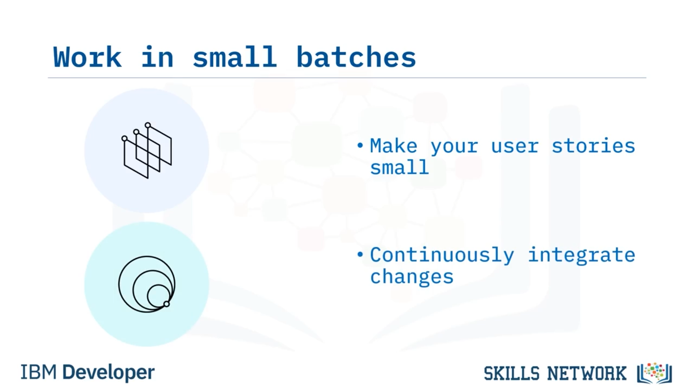

# 🚀 Continuous Delivery Temel İlkeleri

‘Continuous Delivery Temel İlkeleri’ne hoş geldiniz. Bu videoyu izledikten sonra, Continuous Delivery’nin beş temel ilkesini açıklayabileceksiniz.

Continuous Delivery’nin temel ilkelerinden ilki  **kaliteyi sürece dahil ederek inşa etmektir** . Her adımda kaliteyi yerleşik hale getirdiğinizden emin olmanız gerekir. Kalite bedava değildir; bunun için plan yapmalısınız. Bu, kodunuzu sürekli gözden geçirerek sağlanabilir. Her  *pull request* , bir kod incelemesi ve kalite kontrolü için bir fırsattır.

Bu, pipeline’ınız boyunca her şeyin en başından en sona kadar iyi göründüğünden emin olmak için kritiktir.

---

## 🧩 Küçük Partilerle Çalışmak

Bir sonraki temel ilke  **küçük partiler halinde çalışmaktır** . Bu yüzden  *user story* ’lerinizi küçük tutmalısınız; küçük değişiklikler yapmak en iyisidir çünkü daha az değişiklik daha az risk demektir.

Ayrıca bu değişiklikleri temel kodla sürekli olarak entegre etmelisiniz; böylece değişiklikler, herkesin üzerinde çalıştığı temel koddan asla çok fazla uzaklaşmaz.

---

## 🤖 Tekrarlı İşleri Bilgisayarlara Bırakmak

Üçüncü temel ilke, insanların problem çözmede harika olduklarını ama tekrar konusunda o kadar iyi olmadıklarını bilmektir. Bu yüzden, insanların tekrarlı görevleri yapması gerekmemelidir. Aslında insanlar tekrarlı işleri yapmakta kötüdürler.

Kolayca sıkılır ve dikkatleri dağılır. *Test-driven development* ile insanların kodunu sürekli çekip testleri manuel olarak çalıştırabilirsiniz; ama neden bunun yerine, bu tekrarlı görevleri yapmak için tasarlanmış bilgisayarların gücünden yararlanmayasınız?

Bilgisayarlar bu görevleri sizden veya benden daha hızlı ve daha verimli şekilde gerçekleştirebilir. Örneğin, *GitHub Actions* gibi uygulamalar bu işi yapabilir ve böylece bir daha asla kodu manuel olarak çekip test etmeniz gerekmez.

---

## 📈 Acımasız Sürekli İyileştirme

Continuous Delivery’nin bir sonraki temel ilkesi,  **durmaksızın sürekli iyileştirmeyi mümkün kılmasıdır** . Bir şeyi ne kadar sık yaparsanız, o konuda o kadar iyi olursunuz ve başarısız olma olasılığınız o kadar azalır.

Her değişikliği bilinen çalışan bir ortama teslim ederek, nerede olduğunuzu ve ne zaman bir şeylerin bozulduğunu sürekli olarak bilmelisiniz.

---

## 🤝 Herkesin Sorumlu Olması

Ve Continuous Delivery’nin son temel ilkesi,  **herkesin hikâyedeki kendi kısmından sorumlu olmasıdır** . Yani bir build bozulursa, bu “Parmakla gösterme” ve “Kimin hatası?” diye sorma meselesi değildir.

Sormanız gereken şey şudur: “Ne yanlış gitti?” ve “Bunun gelecekte olmasını nasıl engelleyebiliriz?” Dikkate almanız gereken, insanların hatalarından çok sistemin hatalarıdır. Sistem insanları nasıl yarı yolda bıraktı? Tersi değil.

---

## ✅ Video Özeti

Bu videoda, kaliteyi sürece dahil ederek inşa etmeniz gerektiğini, küçük partiler halinde çalışmanız gerektiğini, insanların problem çözmede en iyi olduklarını ama tekrarlı işler için uygun olmadıklarını, durmaksızın sürekli iyileştirmeyi hedeflemeniz gerektiğini ve herkesin hikâyedeki kendi kısmından sorumlu olduğunu öğrendiniz.

