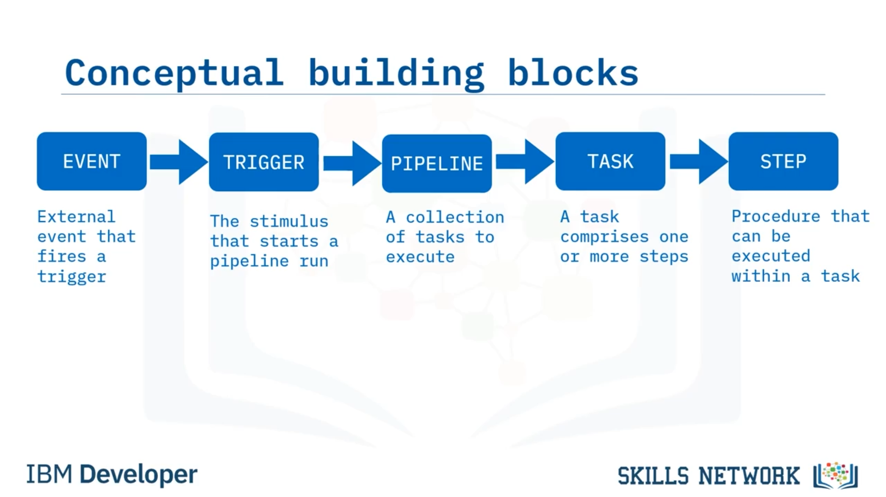
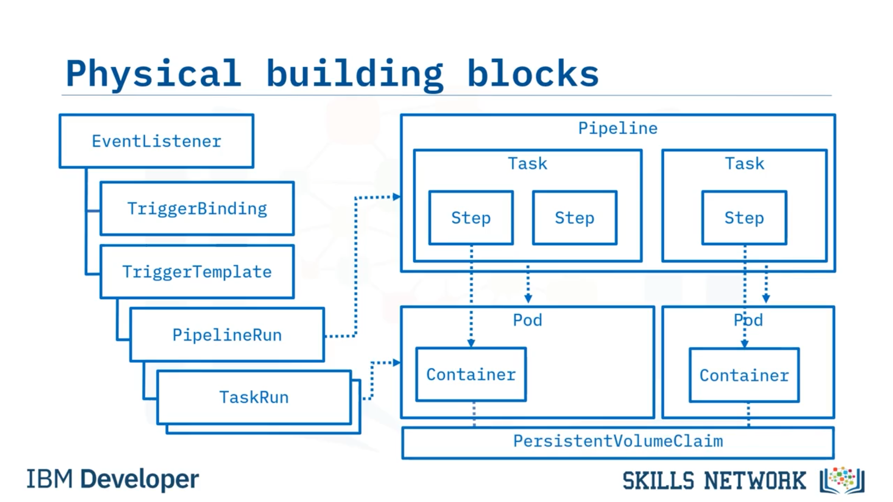
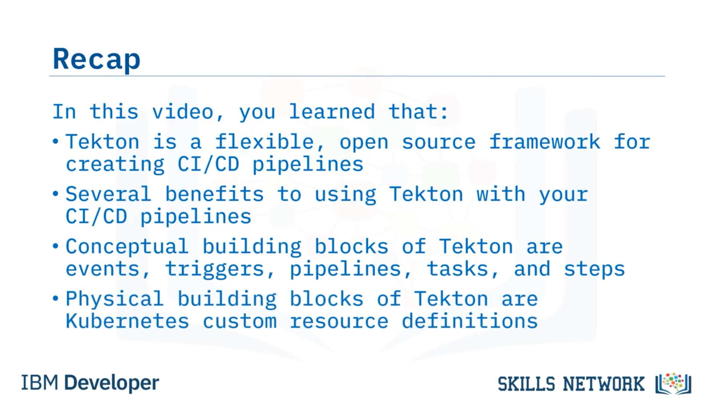

# 🚀 Tekton ve Pipeline’lara Giriş

Tekton ve Pipeline’lara Giriş’e hoş geldiniz. Bu videoyu izledikten sonra Tekton’un ne olduğunu açıklayabilecek ve Tekton’un nasıl çalıştığını tanımlayabileceksiniz.

Tekton’un ne olduğunu açıklayarak başlayalım. Tekton, CI/CD pipeline’ları oluşturmak için esnek, *açık kaynaklı* bir çerçevedir. Çok basitten çok ayrıntılıya kadar CI/CD pipeline’ları oluşturmak için kullanabileceğiniz temel bir yapı taşı seti sağlar. Tekton, geliştiricilerin uygulamaları otomatik olarak oluşturmasına, test etmesine ve dağıtmasına olanak tanır. Adımların seri veya paralel şekilde çalıştırılabilmesini sağlar; böylece yürütme sırası üzerinde tamamen kontrol sahibi olursunuz.

Hepsinden iyisi, hem bulut sağlayıcıları hem de *on-premises* sistemler genelinde çalışır. Yani Tekton’u hem yerel veri merkezinizde hem de bulutta kullanabilirsiniz. Kubernetes cluster’ı çalıştırabildiğiniz her yerde Tekton’u çalıştırabilirsiniz.

Tekton kullanmanın bazı faydaları şunlardır: Standartlaştırma sunar. Tekton bir açık kaynak projesi olduğu ve *vendor neutral* olduğu için Tekton, CI/CD araçlarınızı ve süreçlerinizi satıcılar, diller ve dağıtım ortamları arasında standartlaştırmanıza olanak tanır. Jenkins X, Skaffold ve Knative gibi birçok popüler CI/CD aracı, temel olarak Tekton’u kullanır. Tekton ayrıca mantıksal olarak düzenlenmiş olduğu için yerleşik en iyi uygulamalar da sunar.

Kutudan çıktığı haliyle ölçeklenebilir, *serverless* ve hepsinden önemlisi *cloud native* CI/CD sistemlerini hızlıca oluşturabilirsiniz. Bu, Tekton’un Kubernetes cluster’ınız üzerinde yerel olarak çalıştığı ve ayrı bir CI/CD çözümüne olan ihtiyacı ortadan kaldırdığı anlamına gelir. Tekton ayrıca CI/CD pipeline’larınızı tasarlama ve özelleştirme konusunda esnekliği en üst düzeye çıkarır. Altta yatan uygulamayı soyutlayarak ekibinizin ihtiyaçlarını karşılar; böylece uygulamaları nasıl build edeceğinizi, test edeceğinizi ve deploy edeceğinizi ekip gereksinimlerinize göre seçebilirsiniz.

---

## 🧩 Tekton’un Kavramsal Yapı Taşları

Tekton’un nasıl çalıştığını anlamak için, iş akışını örnekleyen bazı kavramsal yapı taşlarına bakalım:

* *Event* kavramı vardır. Bu, bir trigger’ın çalışmasına neden olan harici bir olaydır. Bu bir pull request veya bir Git repository’sine yapılan push olabilir.
* Bir  *trigger* , bir event tarafından tetiklenir ve bir pipeline run’ı başlatan uyarandır; bu pipeline run, bir pipeline’ı yürütür.
* Trigger’lar, yürütülecek task koleksiyonları olan pipeline’lara işaret eder. Bir pipeline’da sahip olabileceğiniz task sayısında bir sınır yoktur ve bu task’lar seri veya paralel olarak çalışabilir.
* Bir  *task* , bir veya daha fazla  *step* ’ten oluşan bir iş birimidir. Ayrıca step’leri gerçekleştirmek için gereken parametreleri ve artifact’ları depolamak için gereken workspace’leri tanımlayabilir.
* Son olarak, step’ler vardır; bunlar task’ları gerçekleştirmek için yürütülen gerçek komutlardır. Bunlar istediğiniz herhangi bir şey olabilir; ancak çoğu zaman uygulamaları build etmek, test etmek ve deploy etmek için komutlar çalıştıran shell script’leridir.

---

## ⚙️ Tekton’un Fiziksel Yapı Taşları: Kubernetes CRD’leri

Tekton’un kavramsal olarak nasıl çalıştığını gördükten sonra, daha yakından bakıldığında Tekton’un Kubernetes *custom resource definitions* ( *CRD* ’ler) seti olduğu görülür. Çalıştırma sırasına göre her birini açıklayalım:

Event’leri ele almak için, Git repository’sinde pull request veya commit gibi event’leri dinleyen ***EventListener*** adlı bir CRD vardır. Event’ler, iki diğer CRD ile ilişkilidir; bunlardan ilki  ***TriggerBinding*** ’dir. TriggerBinding, pipeline’ı çalıştırmak için gerekli olan event’ten parametreleri yakalar.

Event’lerin ilişkilendirildiği ikinci CRD ise  ***TriggerTemplate*** ’tir; TriggerBinding’den gelen parametreleri alır ve bunları ***PipelineRun*** ile ilişkilendirir. Bir event tarafından tetiklendiğinde TriggerTemplate, bir PipelineRun oluşturur ve tetiklenen event’ten veya pipeline’ın ihtiyaç duyabileceği kalıcı depolamadan gelen parametreleri aktarır. Burada, event’leri kullanmadan PipelineRun’ları manuel olarak da oluşturabileceğinizi belirtmek önemlidir; ancak CI/CD pipeline’ları genellikle event’ler tarafından sürdürülür.

 ***PipelineRun*** , bir pipeline’ı örnekleyen (instantiate eden) şeydir. Pipeline, task’ların bir koleksiyonudur. Bu task’lar varsayılan olarak aynı anda, paralel biçimde çalışabilir veya aralarında bağımlılıklar tanımlarsanız seri olarak, biri diğerinin ardından çalışabilir. Her task ise bir dizi step’ten oluşur. Step’ler task içinde belirtilen sırada çalışır.

Bir pipeline yürütüldüğünde, PipelineRun CRD task’ları yönetmekten sorumludur. Bunu, her task için bir ***TaskRun*** oluşturarak yapar; bu da task’ın çalışacağı bir Kubernetes pod’u oluşturur.

Bir task’ın tüm step’leri aynı pod içinde çalışır. Step’ler yürütülürken, pod içinde her step’in çalışması için bir container oluşturulur; her step için bir tane. Eğer task’lar paralel çalışıyorsa, bu örnekte olduğu gibi her task için container’lar aynı anda oluşturulur.

Genellikle bir ***PersistentVolumeClaim*** oluşturulur ve depolama tüm pod’lara bağlanır; böylece pipeline boyunca artifact’ları paylaşabilirler. Bu, bir task’ta kodu check out etmenize, başka bir task’ta bunun üzerinde unit test çalıştırmanıza ve bir başka task’ta bundan bir container image oluşturmanıza olanak tanır. Çoğu pipeline, bir tür kalıcı depolama gerektirir.

Step’ler her zaman seri çalıştırıldığı için container’lar birer birer oluşturulur; her biri, önceki bittiğinde başlar.

Tekton’un her şeyi Kubernetes yerelidir. Her şey, harici CI/CD sunucularına ihtiyaç duymadan Kubernetes cluster’ınızda çalışır. Bu, Tekton’u Kubernetes ile CI/CD için mükemmel teknoloji yapan şeylerden biridir.

---

## 📝 Özet

Bu videoda şunları öğrendiniz: Tekton’un CI/CD pipeline’ları oluşturmak için esnek, açık kaynaklı bir çerçeve olduğu, CI/CD pipeline’ınız içinde Tekton kullanmanın çeşitli faydaları olduğu, Tekton’un kavramsal yapı taşlarının event’ler, trigger’lar, pipeline’lar, task’lar ve step’ler olduğu ve Tekton’un fiziksel yapı taşlarının Kubernetes custom resource definitions ( *CRD* ’ler) seti olduğu.

