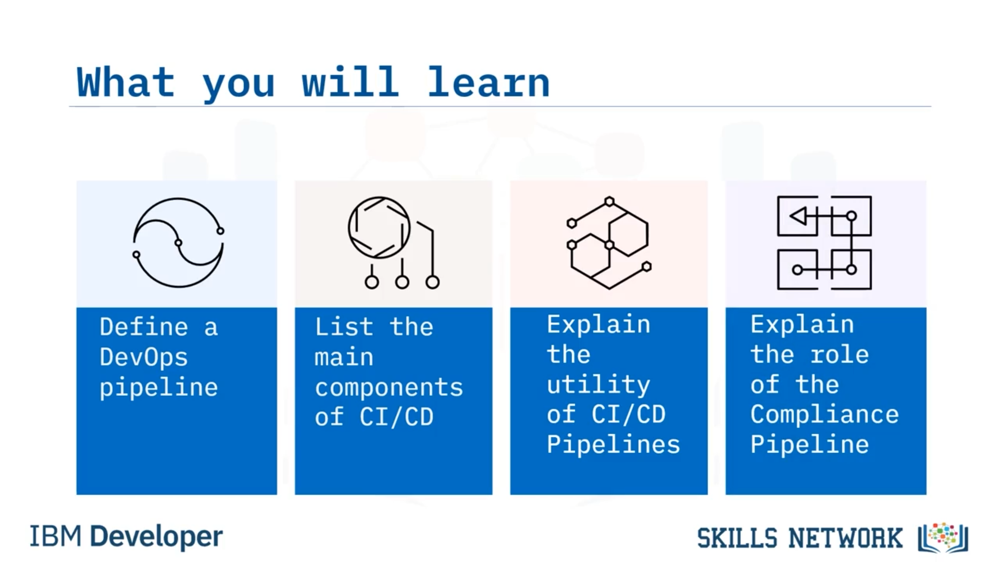
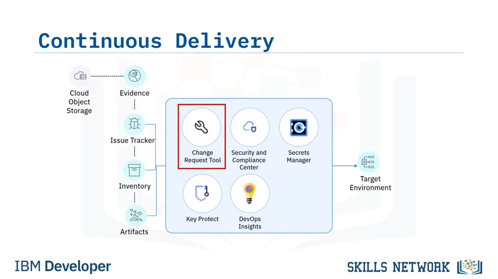
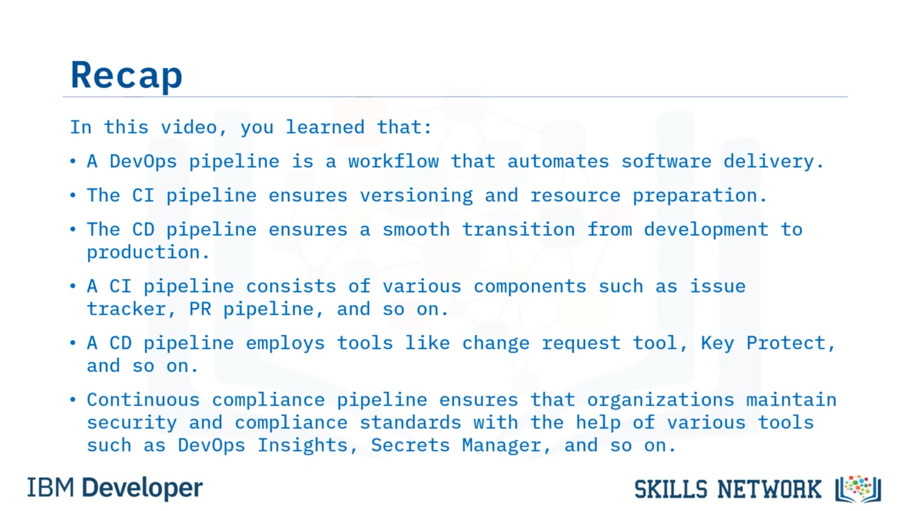

# 🧩 DevOps Pipeline Bileşenleri

“DevOps Pipeline Bileşenleri”ne hoş geldiniz. Bu videoyu izledikten sonra bir DevOps pipeline’ını tanımlayabilecek, bir CI/CD pipeline’ının ana bileşenlerini listeleyebilecek, CI/CD pipeline’larının faydasını açıklayabilecek ve  *compliance pipeline* ’ının rolünü açıklayabileceksiniz.

Bir DevOps pipeline’ı, yazılım teslimatını otomatikleştiren bir iş akışıdır. Yazılımı derleme, test etme, dağıtma ve yayınlama gibi görevlerin verimli ve tutarlı biçimde yürütülmesini sağlayan, birbiriyle bağlantılı adımlardan oluşan bir seridir. Süreci sadeleştirip standartlaştırarak yazılım teslimat yaşam döngüsünü otomatikleştirir. Bir DevOps pipeline’ı kod değişikliklerinin sürekli entegrasyonunu sağlar, depolarla entegre olur, test ve derleme süreçlerini otomatikleştirir ve çatışma çözümü ile hata tespitini kolaylaştırır.

Pipeline’lar, DevOps’ta sürekli entegrasyon ve sürekli dağıtım ya da CI/CD pratiklerini uygulamak için gereklidir. Kuruluşlar, kapsamlı bir derleme ve teslimat süreci için sürekli entegrasyon ve sürekli teslimat pipeline’larını kullanır.

---

## 🔁 CI ve CD Pipeline’larının Rolü

CI pipeline’ı paketleri doğrular ve gerekli bileşenleri derleyerek container image’ları ve Helm chart’ları gibi dağıtılabilir artefaktlar oluşturur. Sürümlemeyi ve kaynak hazırlığını sağlar.

CD pipeline’ı ise ağırlıklı olarak hazırlanan artefaktları belirli hedef ortamlara dağıtmaktan sorumludur; böylece geliştirmeden üretime sorunsuz bir geçiş sağlar.

Bir CI pipeline’ı, geliştirme ve teslimat sürecini sadeleştirmek için birlikte çalışan çeşitli bileşenlerden oluşur. Bu, bir CI pipeline’ının nasıl görünebileceğine dair yalnızca bir örnektir. Siz kendi ortamınızda daha fazla veya daha az araç kullanabilirsiniz. Şimdi farklı bileşenlerin rollerine bakalım.

---

## 🧪 CI Pipeline Bileşenleri

Uygulama deposundaki  *pull request* ’ler PR pipeline’ını tetikler. Bu pipeline, kod tabanının bütünlüğünü sağlayarak kod değişikliklerini doğrulamak için otomatik testler çalıştırır.

*Issue tracker* CI pipeline’ına entegre olur; *pull request* ile ilişkilendirilmiş ilgili sorunları veya görevleri vurgular ve sorun çözümünü kolaylaştırır.

Uygulama deposu kaynak kodu saklar; CI pipeline’ı derleme ve test işlemleri için bu kodu çeker.

 *Code Risk Analyzer* , kodu olası riskler, zafiyetler veya kod kalitesi problemleri açısından analiz eder. Statik kod analizine dayalı geri bildirim ve öneriler sağlar.

Slack entegrasyonu, geliştirme ekibine bildirimler ve raporlar göndererek verimli iletişim sağlar.

 *DevOps Insights* , CI pipeline’ından veri toplayarak darboğazları ve iyileştirme alanlarını belirlemek için raporlar üretir.

Kod kalitesi yönetim platformu olan  *SonarCube* , statik kod analizi yapar, kod kapsamını ölçer ve sürdürülebilirliği değerlendirir.

Bir  *secrets manager* , hassas bilgileri güvenle saklar ve derleme ile dağıtım sırasında yetkili erişim sağlamak üzere CI pipeline’ı ile entegre olur.

Bir *evidence* bileşeni, izlenebilirlik ve denetim için pipeline yürütümü sırasında toplanan artefaktları ve dokümantasyonu saklar.

*Inventory* bileşeni, dağıtılmış uygulamaları, bağımlılıkları ve altyapı konfigürasyonlarını takip ederek yazılım dağıtımlarında tutarlılık ve kontrol sağlar.

CI pipeline’ının ürettiği binary’ler ve container image’lar gibi artefaktlar, yazılım teslimat sürecinin sonraki aşamalarında kritik rol oynar.

Genel olarak CI pipeline’ı; kod doğrulama, test, analiz ve iş birliğini otomatikleştirmek için çeşitli bileşenlerden yararlanır.

Bu bileşenlerin entegrasyonu, geliştiricilerin kalite ve güvenlik standartlarını korurken değişiklikleri sürekli olarak kod tabanına entegre etmelerini sağlar.

---

## 🚚 CI Sonrası: CD Pipeline ve Dağıtım Süreci

Sürekli entegrasyon pipeline’ından sonra, dağıtım sürecini kolaylaştırmak üzere sürekli teslimat pipeline’ı tetiklenir.

Bir *change request tool* sistem değişikliklerini yönetir ve takip eder. Dağıtımdan önce değişikliklerin belgelenmiş ve doğrulanmış olmasını sağlamak için pipeline ile entegre olur.

 *Key Protect* , kriptografik anahtarları ve hassas bilgileri güvenli şekilde saklar ve dağıtım sırasında güvenli erişim sağlar.

 *Security and Compliance Center* , politikaları uygular; güvenlik taramaları, zafiyet değerlendirmeleri ve uyumluluk kontrolleri gerçekleştirir.

*DevOps Insights* veri toplar ve iyileştirme alanlarını belirlemek için raporlar üretir.

*Secrets Manager* hassas bilgileri güvenli şekilde saklar ve pipeline ile entegrasyon yoluyla dağıtım sırasında güvenli erişim sağlar.

Sürekli teslimat pipeline’ı uygulamayı hedef ortama dağıtır; doğru dağıtımı ve konfigürasyonu güvence altına alır.

Bu iş akışı; dağıtımı, değişiklik takibini, güvenlik uyumluluğunu ve dokümantasyonu otomatikleştirerek standartları korurken verimli ve güvenilir yazılım teslimatı sağlar.

---

## ✅ Sürekli Uyumluluk Pipeline’ı

CI/CD pipeline’larına ek olarak bazı ekipler *continuous compliance pipeline* uygular. Bu pipeline, kuruluşların uygulama ve altyapı geliştirme yaşam döngüsü boyunca güvenlik ve uyumluluk standartlarını korumasını sağlar.

Aşağıda sürekli uyumluluk pipeline’ı için örnek bir iş akışı yer alır. Pipeline, uygulama kodunu önceden tanımlanmış güvenlik ve uyumluluk kurallarına göre doğrular.

*SonarCube* gibi statik kod analizi araçları kod tabanını tarar ve olası güvenlik zafiyetlerini ve uyumluluk sorunlarını tespit eder.

Pipeline, uygulamanın sektöre özgü veya düzenleyici uyumluluk gereksinimlerini karşıladığını doğrulamak için uyumluluk kontrolleri içerir.

*IBM Cloud Continuous Compliance* gibi araçlar, uygulamayı önceden tanımlanmış uyumluluk politikalarına göre değerlendirir ve uyumluluk raporları üretir.

 *Key Protect* , kriptografik anahtarları, sertifikaları ve diğer hassas bilgileri güvenli şekilde koruma altına almak ve yönetmekten sorumludur.

 *Security and Compliance Center* , uygulamayı önceden tanımlanmış güvenlik politikaları ve uyumluluk gereksinimlerine göre değerlendirir.

Bir izleme ve analitik aracı olan  *DevOps Insights* , pipeline’ın çeşitli aşamalarından veri toplar.

Pipeline yürütümü sırasında  *Secrets Manager* , API anahtarları, parolalar veya sertifikalar gibi hassas bilgileri güvenli şekilde saklar ve yönetir.

Gerekli kimlik bilgilerini, kaynakları korumaya yönelik erişim gerektiren pipeline aşamalarına güvenli biçimde sağlar.

Slack bildirimleri, pipeline durumu, uyumluluk sorunları ve pipeline boyunca gerçekleşen diğer önemli olaylar hakkında ekip üyelerini bilgilendirir.

Ekip, uyumluluğu göstermek ve pipeline yürütümünü takip etmek için kanıt ( *evidence* ) toplar. Bu kanıt; günlükler, raporlar, test sonuçları veya uyumluluğu ve başarılı pipeline yürütümünü kanıtlayan diğer artefaktları içerir.

Sürekli uyumluluk pipeline’ındaki bu bileşenlerin birleşimi, kuruluşların güvenlik ve uyumluluk doğrulamasını otomatikleştirmesini, secrets ve anahtarları etkin biçimde yönetmesini ve uyumluluk amaçları için kanıt toplamasını sağlar. Bu kapsamlı yaklaşım, uygulamaların ve altyapının geliştirme ve dağıtım süreci boyunca güvenlik ve uyumluluk standartlarıyla hizalı kalmasını güvence altına alır.

---

## 🧾 Video Özeti

Bu videoda, bir DevOps pipeline’ının yazılım teslimatını otomatikleştiren bir iş akışı olduğunu öğrendiniz.

CI pipeline’ı sürümlemeyi ve kaynak hazırlığını sağlar.

CD pipeline’ı geliştirmeden üretime sorunsuz bir geçiş sağlar.

Bir CI pipeline’ı  *Issue Tracker* , *PR pipeline* ve benzeri çeşitli bileşenlerden oluşur.

Bir CD pipeline’ı  *change request tool* , *Key Protect* ve benzeri araçları kullanır.

Sürekli uyumluluk pipeline’ı ise  *DevOps Insights* , *Secrets Manager* ve diğer çeşitli araçların yardımıyla kuruluşların güvenlik ve uyumluluk standartlarını korumasını sağlar.

