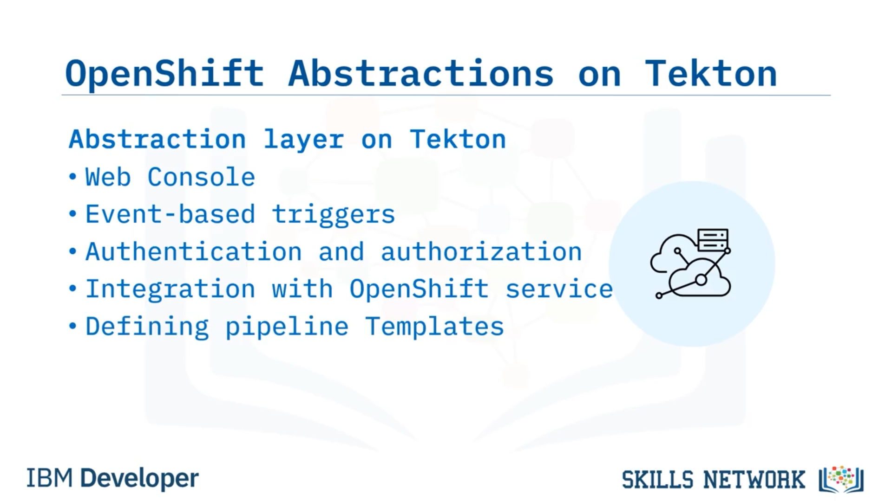
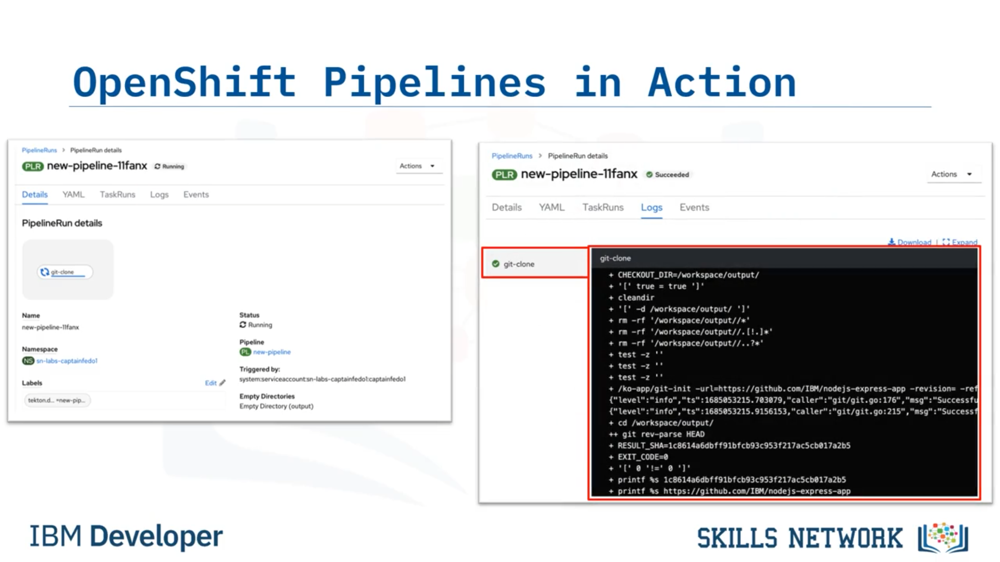

# 🚀 CI/CD ile OpenShift Pipelines

OpenShift Pipelines ile CI/CD’ye hoş geldiniz. Bu videoyu izledikten sonra  *OpenShift Pipelines* ’ı tanımlayabilecek, OpenShift Pipelines’taki *soyutlama katmanının* faydalarını belirleyebilecek ve OpenShift Pipelines’ın *Tekton* ile ilişkisini açıklayabileceksiniz.

## 🧩 OpenShift Pipelines nedir?

OpenShift Pipelines, Red Hat OpenShift tarafından sağlanan, *sürekli entegrasyon* ve *sürekli teslimat* ( *CI/CD* ) için bulut yerel ( *cloud native* ) bir çözümdür. Çeşitli platformlarda dağıtımları otomatikleştirmek için *Kubernetes nesnelerine* dayanır.

Geliştiricilerin Kubernetes ortamında uygulamaları  *derleme* , *test etme* ve *dağıtma* işlemlerini otomatikleştirmesini sağlar. Kubernetes ile sorunsuz entegrasyonu sayesinde OpenShift Pipelines, geliştiricilerin platformun  *ölçeklenebilirlik* , *esneklik* ve *taşınabilirlik* özelliklerinden yararlanmasına imkân tanır.

## 🔧 Tekton ile ilişki ve soyutlama katmanı

OpenShift Pipelines’ın temel dayanaklarından biri, bu kursta zaten aşina olduğunuz *Tekton* kullanımına dayanmasıdır. Bu  *soyutlama* , geliştiricilerin ve operatörlerin daha anlaşılır ve üzerinde çalışması daha kolay olan *üst seviye yapılar* kullanarak pipeline’ları tanımlayıp yapılandırmasına olanak sağlar.

## ✅ OpenShift Pipelines kullanmanın faydaları

OpenShift Pipelines ile geliştiriciler,  *Kubecontrol* , *Helm* ve *operators* gibi Kubernetes araçlarını CI/CD iş akışlarına sorunsuz biçimde entegre edebilir. Bu entegrasyon, Kubernetes en iyi uygulamalarının benimsenmesini kolaylaştırır ve geliştiricilerin Kubernetes ekosisteminin tüm potansiyelini pipeline’lar içinde kullanmasını sağlar.

OpenShift Pipelines kullanılarak oluşturulan pipeline’lar, daha büyük iş yüklerini karşılayacak şekilde kolayca ölçeklenebilir. Ayrıca bu pipeline’lar yeniden kullanılabilir; böylece pipeline şablonlarını birden fazla proje veya uygulama genelinde tanımlayıp tekrar kullanabilirsiniz.

OpenShift Pipelines ayrıca,  *on premise* , *cloud* veya *hibrit* gibi farklı platformlarda dağıtım süreçlerini otomatikleştirir; uygulamaları tutarlı ve güvenilir şekilde dağıtmayı kolaylaştırır.

## 🧱 Paylaşılan temel kavramlar

OpenShift Pipelines ve Tekton’ın paylaştığı temel kavramlar şunlardır:  *events* ,  *triggers* ,  *pipelines* , *tasks* ve  *steps* . Bu kavramlar, CI/CD iş akışlarını tanımlamak ve yürütmek için çekirdek yapı taşlarını oluşturur.

## 🧠 OpenShift’in ek olarak sunduğu bileşenler

OpenShift ayrıca aşağıdakileri tanıtır:

* Bir  *resource* , pipeline içindeki görevler tarafından kullanılan bir girdi veya çıktı artefaktını temsil eder.
  OpenShift pipelines içindeki  *resources* ; kaynak kod depoları, imajlar, yapılandırma dosyaları, secret’lar ve diğer artefaktları içerebilir.
* Bir  *condition* , pipeline içinde belirli bir görev veya adımın yürütülüp yürütülmeyeceğini belirleyen bir kural veya kriterler kümesidir.
  Yaygın örnekler arasında branch tabanlı koşullar, ortama özel koşullar ve hata yönetimi koşulları bulunur.
* Bir  *pipeline run* , bir pipeline’ın belirli bir örneğinin yürütülmesini temsil eden bir kaynaktır. OpenShift pipelines içinde bir pipeline’ı çalıştırmak için çalışma zamanı, yapılandırma ve parametreleri tanımlar.
* Bir  *task run* , bir pipeline içindeki belirli bir görevin belirli bir örneğinin yürütülmesini temsil eden bir kaynaktır. Belirli bir görev için adımları ve yapılandırmayı tanımlayan bir *task resource* temel alınarak oluşturulur.

## 🧱 Tekton üstünde OpenShift soyutlama katmanı

Temel kavramlar sabit kalsa da OpenShift pipelines, OpenShift platformuna özgü ek bileşenler ve özellikler sunar. Bu platform, OpenShift’te pipeline oluşturma, dağıtma ve yönetim prosedürünü basitleştiren, Tekton’ın üzerinde bir *soyutlama katmanı* sağlar.

Bu soyutlamalar, alttaki Tekton framework’ünün karmaşıklığını azaltır. Bu da kullanıcının uygulamaya odaklanmasını sağlar.

## 🖥️ Web Console ve kullanıcı deneyimi

OpenShift’teki soyutlama katmanı, Tekton pipeline’larının yönetimini ve izlenmesini kolaylaştıran kullanıcı dostu bir *Web Console* sağlar.

## ⚡ Olay tabanlı tetikleyiciler

Tekton’ı olay tabanlı tetikleyicilerle genişletir; böylece OpenShift cluster’ı içindeki çeşitli olaylara göre pipeline’ların otomatik tetiklenmesini mümkün kılar. Örnekler arasında kod commit’leri, imaj güncellemeleri veya zamanlayıcı ya da dış sistem yanıtı gibi harici tetikleyiciler bulunur.

## 🔐 Güvenlik: Kimlik doğrulama ve yetkilendirme

Tekton pipeline’larına erişimi güvence altına almak ve kontrol etmek için kimlik doğrulama ve yetkilendirme mekanizmalarından yararlanır. Bu, CI/CD iş akışına güvenlik sağlar.

## 🧰 OpenShift servisleri ile zengin entegrasyon

İmaj registry’leri, kalıcı depolama ve ağ özellikleri gibi zengin yerleşik servisler ve kabiliyetler sunar. Bu servisler Tekton pipeline’larına sorunsuz biçimde entegre edilebilir; böylece CI/CD iş akışınızda OpenShift platformunun tüm gücünden yararlanabilirsiniz.

## 🧩 Pipeline şablonları

Ortak desenleri, yapılandırmaları ve adımları tanımlamanıza olanak veren pipeline şablonlarını tanıtır. Bunlar birden fazla proje genelinde kolayca yeniden kullanılabilir.

## 🧪 Lab ortamında OpenShift Pipelines doğrulama

Lab ortamında OpenShift pipelines zaten kuruludur. Bunu doğrulamak için lab’i açıp Console’un administrator bölümüne giderek kontrol edebilirsiniz. Bu bölümde, tüm namespace’lerde kurulu Red Hat OpenShift Pipelines’ı görüntülemek için  *Installed Operators* ’a tıklarsınız.

Ardından developer rolüne geçerek sol çubukta  *pipelines* ’ın bir sekme olarak göründüğünü görebilirsiniz. Şu anda oluşturulmuş pipeline olmadığını fark edin.

## 🏗️ Pipeline oluşturma ve Pipeline builder

Ekranın sağ tarafındaki *Create* menüsünü kullanarak yeni bir pipeline oluşturabilirsiniz. İlk Pipeline’ınızı oluşturmak için *Pipeline builder* aracını kullanın.

Bu grafiksel araç OpenShift Web Console’da mevcuttur. Kullanıcıların pipeline’ları görsel olarak oluşturmasına, düzenlemesine ve yönetmesine olanak tanır. Ayrıca YAML dosyalarını doğrudan yazma veya değiştirme ihtiyacı olmadan pipeline tasarlamak için kullanılır.

## 🏷️ Pipeline adlandırma ve Tekton task ekleme

Yeni oluşturduğunuz Pipeline’a bir isim verebilir ve Tekton task’larını eklemeye başlayabilirsiniz. Bunlar, önceki derslerden aşina olduğunuz Tekton task’larıdır.

OpenShift Pipeline builder’da mevcut task kataloğu, *Tasks* alanını doldurur.

## 📚 Task catalog

Task catalog, pipeline’ın kullanabileceği önceden tanımlanmış görevlerin bir deposudur.

Task catalog, OpenShift topluluğu tarafından katkıda bulunulan görevlerin bir koleksiyonunu ve Red Hat tarafından tanımlanan özel görevleri içerir.

Bu örnekte pipeline’a *git clone* task’larını ekliyoruz.

## 🔗 Görevleri bağlama ve parametreleri yapılandırma

Task catalog’dan görevleri seçtikten sonra pipeline iş akışınız bu görevi de içerir.

Ardından gereksinimlerinize göre görevin girdilerini, çıktıları ve diğer parametrelerini yapılandırabilirsiniz.

Pipeline builder, Pipeline içindeki görevlerin görsel bir temsilini sunar; görevleri birbirine bağlamanıza ve yürütme sırasını tanımlamanıza olanak tanır.

## ▶️ Pipeline çalıştırma ve log görüntüleme

Pipeline’ı tanımladıktan sonra kaydedebilir ve  *Actions Menu* ’yü kullanarak pipeline’ı başlatabilirsiniz. Artık Console’da Pipeline’ın çalıştığını görebilirsiniz.

Görevlerin log’larını *PipelineRun* ayrıntıları sayfası üzerinden görüntüleyin. Pipeline yürütülmesi sırasında, pipeline içindeki her görev, o görevin çıktısını ve yürütme ayrıntılarını yakalayan log’lar üretir.

Bu log’lar hata ayıklama, sorun giderme ve pipeline yürütmesini izleme için değerli bilgiler sağlar.

## 📌 Özet

Bu videoda, Open Shift Pipelines’ın Kubernetes araçlarıyla sorunsuz entegrasyon sağlayarak geliştirme ve dağıtım sürecini basitleştirdiğini öğrendiniz. Tekon framework’ünün üzerine inşa olur ve geliştiricilerin pipeline tanımlamaya odaklanmasını sağlayan bir soyutlama katmanı sunar. Ayrıca OpenShift servisleriyle sorunsuz entegre olarak geliştiricilerin platformun tüm kabiliyetlerinden yararlanmasına olanak tanır.

 
