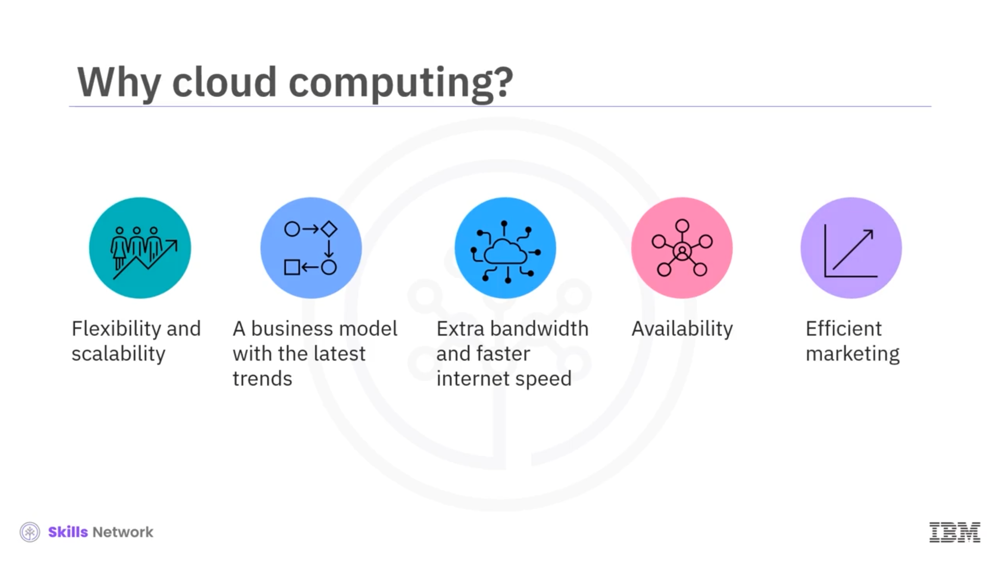
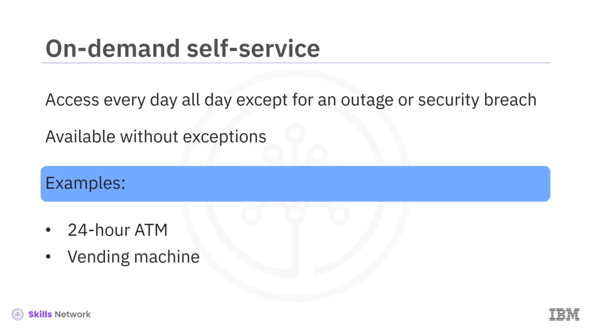
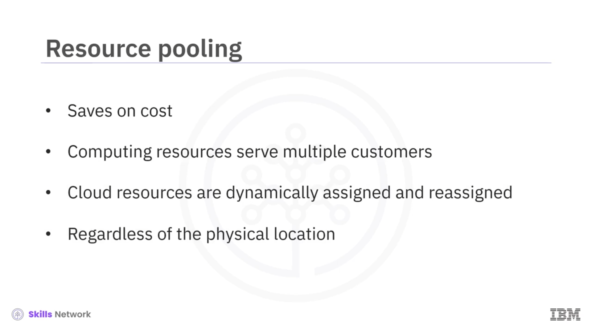

# ☁️ Cloud Computing’in Tanımı ve Temel Özellikleri

Yerel bir sunucuda geleneksel barındırma yerine neden *Cloud computing* seçersiniz?  *Cloud computing* , işletmelere yerel bir sunucuda barındırmaya kıyasla daha fazla esneklik ve ölçeklenebilirlik sunar. Bu, sanallaştırma gibi teknolojileri birkaç güncel trendle birleştiren bir iş modeli veya hizmettir ve ek bant genişliğine ihtiyaç duyarsanız, *Cloud tabanlı* bir hizmet bu ihtiyacı BT altyapınızda karmaşık ve maliyetli bir güncellemeyi beklemek yerine hızlıca karşılayabilir. Kullanıcılar, internet bağlantısı olduğu sürece *Cloud* hizmetlerini kullanarak uygulamalarını her yerden özelleştirebilir. Ayrıca  *Cloud computing* , bakım ve maliyetten bağımsız olarak uygulamaların verimli biçimde pazarlanmasını sağlar.

*Cloud computing* hakkında ortak bir anlayış geliştirmek için, ABD Ulusal Standartlar ve Teknoloji Enstitüsü’nün (NIST) *Cloud computing* tanımıyla başlayalım. NIST, *Cloud computing*i; minimum yönetim çabası veya hizmet sağlayıcı etkileşimiyle hızlıca sağlanıp serbest bırakılabilen, yapılandırılabilir bilişim kaynaklarından oluşan paylaşımlı bir havuza uygun, isteğe bağlı ağ erişimini mümkün kılan bir model olarak tanımlar.

Bilişim kaynaklarına örnek olarak ağlar, sunucular, depolama, uygulamalar ve hizmetler verilebilir. Bu *Cloud* modeli; beş temel özellik, dört dağıtım modeli ve üç hizmet modelinden oluşur.

## 🧩 Cloud’un Beş Temel Özelliği

Cloud’un beş temel özelliğini anlamakla başlayalım. Bunlar  *on-demand self service* ,  *broad network access* ,  *resource pooling* , *rapid elasticity* ve *measured service* özellikleridir.

### ⚡ On-demand Self Service

İlk özellik olan  *on-demand self-service* , ihtiyaç duyduğunuz anda *Cloud* kaynaklarına erişebileceğiniz anlamına gelir. Örneğin, 24 saat açık bir ATM veya ofiste ya da mağazada bulunan bir otomat gibi. Hizmetler, belirli bir günün ulusal tatil, hafta sonu, festival günü vb. olup olmadığına bakılmaksızın yılın tüm günlerinde her zaman kullanılabilir. Hizmetlerin kullanılamadığı tek istisna; kesinti veya güvenlik ihlali nedeniyle hizmetlerin devre dışı kalmasıdır.

### 🌐 Broad Network Access

 *Broad network access* , *Cloud computing* kaynaklarına ağ üzerinden erişilebileceği anlamına gelir. Genel *Cloud* hizmetlerine, internet bağlantısı ve tarayıcı yetenekleri olan herhangi bir cihazla genellikle her yerden erişilebilir. Günümüzde *Cloud* hizmetlerine erişimde yalnızca masaüstü veya dizüstü bilgisayarlarla sınırlı değiliz. Tabletler, iPad’ler, akıllı telefonlar, e-kitap okuyucular, akıllı giyilebilir cihazlar vb. pek çok başka cihaz vardır. Ayrıca tekrar vurgulamak gerekirse, genel *Cloud* hizmetlerine erişmek için internet erişimi zorunludur.

Ancak kurum içi ( *on-premises* ) özel bir *Cloud* ortamında, organizasyonun tüm dünyaya açık genel kitleye erişme ihtiyacı olmadığı sürece, *Cloud* hizmetlerine erişmek için yalnızca bir *Intranet* yeterli olabilir.

### 🧺 Resource Pooling

*Resource pooling* ile tüketiciler, paylaşımlı bir modeli kullanırken maliyetten tasarruf eder. Bu model, *Cloud* sağlayıcılarına ölçek ekonomileri sağlar ve bunu müşterilerine yansıtabilirler. Bu da  *Cloud* ’u maliyet açısından verimli hale getirir. Bilişim kaynakları, çok kiracılı ( *multi-tenant* ) bir model kullanarak birden fazla tüketiciye hizmet vermek üzere bir araya getirilir. *Cloud* kaynakları, müşterilerin bu kaynakların fiziksel konumuyla ilgilenmesine gerek kalmadan, talebe göre dinamik biçimde atanır ve yeniden atanır.

### 📈 Rapid Elasticity

 *Rapid elasticity* , talebinize göre kaynakları artırıp azaltabileceğiniz anlamına gelir.  *Cloud* ’un elastik özelliği sayesinde kaynaklar; dikey ölçekleme ( *vertical scaling* ) ile yukarı/aşağı ölçeklenebilir veya yatay ölçekleme ( *horizontal scaling* ) ile dışa doğru ölçeklenebilir. İdeal bir örnek, çevrimiçi alışverişte kullanıcı sayısındaki artış nedeniyle talep yükseldiğinde (örneğin bir tatil indirimi sırasında) kaynak eklemek ve indirim dönemi bittikten sonra bunun tersini yapmaktır.

### 🧾 Measured Service

 *Measured service* , kullandığınız veya ayırdığınız kadar ödeyerek ilerlediğiniz anlamına gelir.

Ancak  *measured service* , Gmail, Hotmail, Yahoo gibi genel e-posta hizmetleri; Facebook, Twitter, WhatsApp gibi sosyal medya siteleri ve AWS, Azure ve GCP gibi ücretsiz sunulan deneme amaçlı *Cloud* hizmet değerlendirmeleri gibi bazı *Cloud* hizmetleri için geçerli değildir; bunlar ilgili hizmet sağlayıcılarının sunduğu takdir politikaları nedeniyle ücretsiz sağlanır.

 *Measured service* , kullanım sonrası ve önceden tanımlanmış dönemin sonunda (örneğin aylık elektrik faturaları gibi) ücretlendirildiğiniz bir fayda ( *utility* ) modeli faturalandırma olarak da adlandırılır. Bu modülde dağıtım ve hizmet modellerini daha sonra ele alacağız.

