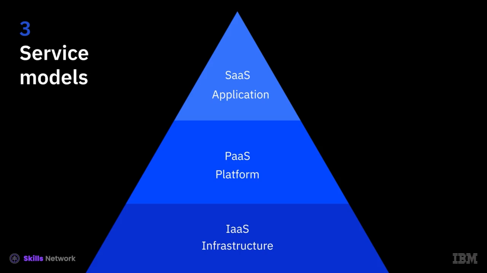

# ☁️ Cloud Hizmet Modellerine Genel Bakış

Giriş niteliğindeki bulut videomuzda, bulutta mevcut üç hizmet modelinden kısaca bahsetmiştik:  *Infrastructure as a Service* , *Platform as a Service* ve  *Software as a Service* . Sonraki videolarda bu hizmet modellerinin her birinin detaylarına geçmeden önce, bu modellerin hızlı bir genel görünümüyle başlayalım.

> Merhaba, ben Tessa Rhodes ve IBM Cloud’da bir tasarımcıyım.

## 🧱 IaaS Temeli: Infrastructure as a Service

Önce temel ile başlayalım:  *IaaS* .  *IaaS* , bir satıcı tarafından sanallaştırılmış (virtualized)  *işlem (compute)* , *ağ (networking)* ve *depolama (storage)* kaynaklarından oluşan bir settir; böylece bir kullanıcı bu kaynaklara erişebilir ve onları istediği gibi yapılandırabilir.

Tasarımda, “persona” dediğimiz kullanıcı kavramıyla konuşuruz; *IaaS* için persona bir *sistem yöneticisi (system admin)*dir. Ya da bir  *BT yöneticisi (IT admin)* .

## 🧩 SaaS: Software as a Service

Şimdi en üst tarafa,  *Software as a Service* ’e geçelim; bu kolay olanı.

 *Software as a Service* , makinenize kurmanız gerekmeyen ve manuel olarak güncellemeniz gerekmeyen yazılımdır. Bu yüzden *Software as a Service* kullanıcısı herhangi biri olabilir. Hatta şu anda bunu YouTube’da izliyorsanız, o zaman siz *Software as a Service* kullanıcısısınız.

Genellikle tek seferlik bir lisans ücretinden ziyade bir *abonelik modeli (subscription model)* üzerinden ücretlendirilir.

## 🧱➡️🧩 PaaS: Platform as a Service

Ve bu da bizi  *Platform as a Service* ’e getiriyor.

 *PaaS* ,  *IaaS* ’teki tüm sanallaştırılmış kaynaklardan yararlanır ve sonra onları soyutlar (abstracts them away), böylece kullanıcı bu sanallaştırılmış kaynakların hiçbirini yönetmek zorunda kalmaz.

*PaaS* kullanıcısı genellikle bir sistem yöneticisi değildir. Genellikle bir  *geliştiricidir (dev)* . IBM’de bu geliştiriciye “Jane” deriz. Bu bizim persona ismimizdir.

Bu “piramit” metaforu, aşağı doğru indikçe altyapı kaynakları açısından *bilgi ve yönetim* karmaşıklığının arttığını ve *kullanım kolaylığının* da arttığını göstermek içindir.

## 🚗 Bulut Metaforu: Araba Örneği

Ekibimdeki tasarımcılarla *PaaS* hakkında konuşurken kullandığım bir başka metafor da araba ile ilgilidir. Bu metaforda:

### 🚙 IaaS = Araba Kiralama (Leasing)

Bu metaforda  *IaaS* , araba leasing’e benzer.

Eğer daha önce araba leasing yaptıysanız, muhtemelen çok araştırma yaptınız ve arabanın teknik özelliklerini (specs) ve performansını önemsersiniz. Arabanın rengini, ne tür bir araba olduğunu önemsersiniz. Aracı süren sizsiniz ve bunun için ödeme yaparsınız. Ayrıca benzin ve geçiş ücretleri ya da bakım gibi şeyler için de siz ödeme yaparsınız.

### 🚘 PaaS = Araç Kiralama (Renting)

Bu metaforda  *Platform as a Service* , araba kiralamaya daha çok benzer.

Diyelim ki tatildesiniz ve havaalanından yeni indiniz, gidip kiralık arabanızı alacaksınız. Renginin ne olduğu pek umrunuzda olmaz. Teknik özelliklerini de pek umursamazsınız, ama hâlâ aracı siz kullanırsınız ve benzin ve geçtiğiniz tüm gişeler/ücretli yollar (tolls) için yine siz ödeme yaparsınız.

### 🚕 SaaS = Taksi veya Uber

*Software as a Service* yine en kolay olanıdır. Bu da taksi veya Uber’e benzer.

Taksi veya Uber’de arabanın ne olduğu, ne renk olduğu hiç umurunuzda olmaz ve hatta aracı siz bile sürmezsiniz; benzin veya geçiş ücretlerini de siz ödemezsiniz çünkü bunlar fiyata dahil edilmiştir (baked into the price).

## 🏗️ Bulut Bilişimde Yönetim Sorumlulukları

Şimdi, bulut bilişim ve üç hizmet modeli açısından bunun ne anlama geldiğine bakalım.

* *IaaS* ile bulut sağlayıcı (cloud provider) fiziksel kaynakları; veri merkezlerini, soğutmayı, gücü, ağı ve güvenliği, ayrıca sunucular ve depolamayı içeren işlem kaynaklarını yönetir.
* *PaaS* ile sağlayıcı, işlem kaynaklarına ek olarak işletim sistemleri, geliştirme araçları, veritabanları ve iş analitiğini (business analytics) içeren platform altyapısını da yönetir.
* *SaaS* modelinde ise sağlayıcı, altyapı ve platform kaynaklarına ek olarak uygulamaları ve verileri de barındırır (hosts) ve yönetir.

## ▶️ Sonraki Video

Bir sonraki videoda,  *Infrastructure-as-a-Service* ’e daha yakından bakacağız: özellikleri, faydaları ve bazı kullanım senaryoları.
