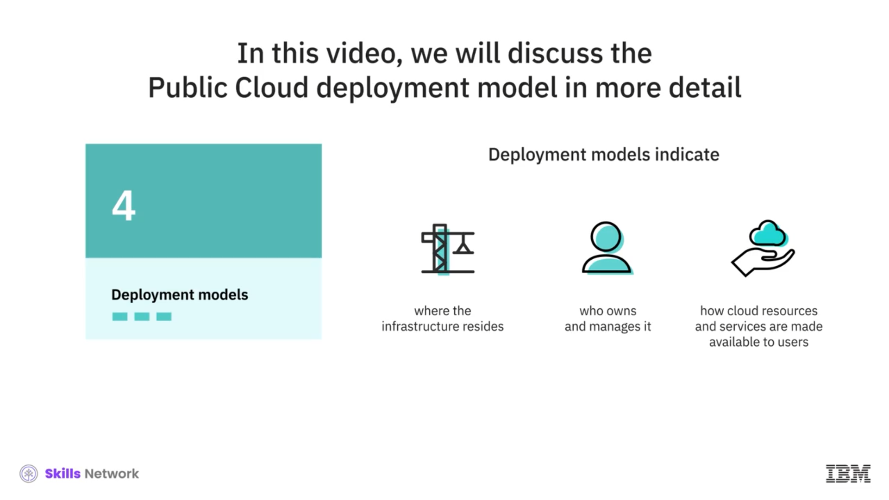
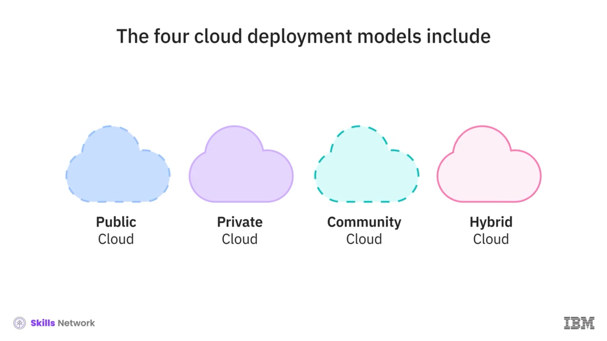
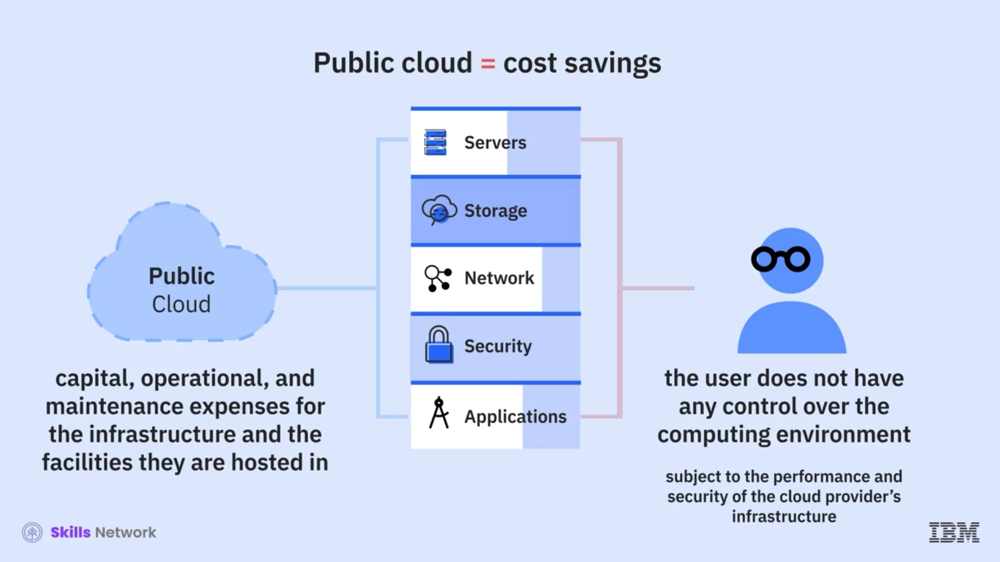
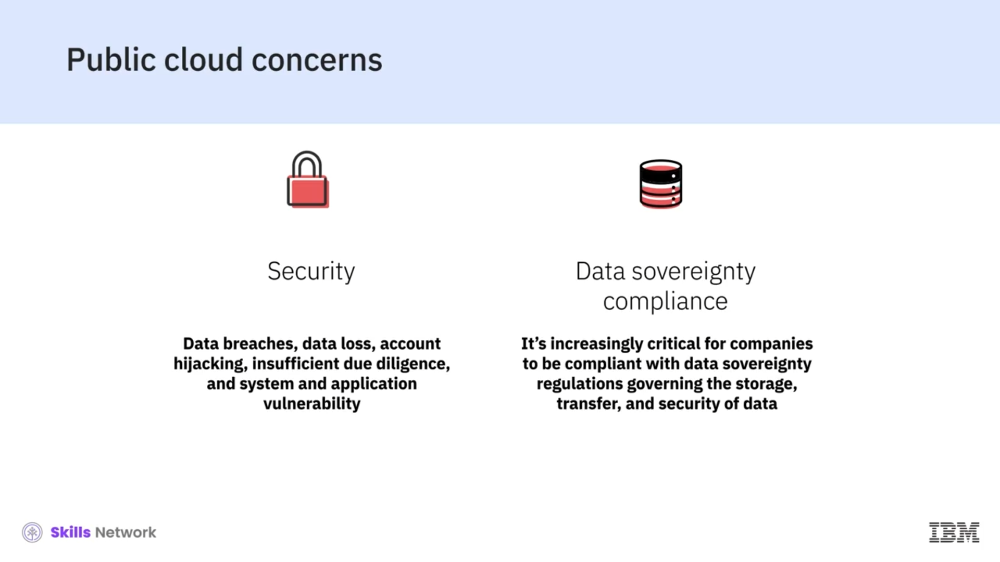

# ☁️ Public Cloud

Giriş niteliğindeki bulut videomuzda, bulut için dört dağıtım modelinden kısaca bahsetmiştik. Bu videoda, **Public Cloud (Genel Bulut)** dağıtım modelini daha ayrıntılı ele alacağız. Dağıtım modelleri; altyapının  **nerede bulunduğunu** , **kimin sahip olup yönettiğini** ve bulut kaynakları ile hizmetlerinin kullanıcılara **nasıl sunulduğunu** gösterir.

Dört bulut dağıtım modeli şunları içerir:  **Public Cloud** ,  **Private Cloud** , **Community Cloud** ve  **Hybrid Cloud** .

---

## 🌐 Genel Bulutun Tanımı ve Sunum Şekli

Genel bulut modelinde kullanıcılar; sunuculara, depolamaya, ağa, güvenliğe ve uygulamalara, bulut hizmet sağlayıcıları tarafından internet üzerinden sunulan hizmetler olarak erişir.

Web konsolları ve API’ler kullanılarak, kullanıcılar ihtiyaç duydukları kaynak ve hizmetleri sağlayabilir (provision edebilir). Bulut sağlayıcısı altyapının  **sahibidir** ,  **yönetir** , **sağlar** ve  **bakımını yapar** ; bunu müşterilere ya abonelik ücretiyle ya da kullanıma dayalı ücretle kiralar.

---

## 🧩 Mülkiyet ve Sorumluluklar

Kullanıcılar; uygulamalarının çalıştığı sunuculara veya verilerinin kullandığı depolamaya  **sahip değildir** ; sunucuların operasyonlarını **yönetmez** ve hatta platformların nasıl bakım gördüğünü  **belirlemez** .

Gündelik yaşamda su, elektrik veya gaz gibi hizmetleri tüketip ödediğimiz şekilde, bu bulut kaynaklarının hiçbirine sahip olmayız—hizmet sağlayıcıyla bir anlaşma yapar, kaynakları kullanır ve belirli bir dönem içinde kullandığımız kadar öderiz.

---

## 💸 Maliyet, Ölçeklenebilirlik ve Kontrol

Genel bulutlar, altyapı ve barındırıldığı tesislerle ilgili tüm sermaye, operasyon ve bakım giderlerini sağlayıcı üstlendiği için, **Toplam Sahip Olma Maliyeti (TCO)** açısından önemli maliyet tasarrufları sunar.

Ölçeklenebilirliği, daha fazla kapasite talep etmek kadar kolay hâle getirir. Ancak genel bulutta kullanıcı, bilişim ortamı üzerinde herhangi bir kontrole sahip değildir ve sağlayıcının altyapısının performansı ve güvenliğine tabidir.

---

## 🏢 Piyasadaki Örnek Sağlayıcılar

Günümüzde pazarda Amazon Web Services, Microsoft Azure, IBM Cloud, Google Cloud Platform ve Alibaba Cloud gibi çeşitli genel bulut sağlayıcıları vardır.

Tüm sağlayıcılar; sunucular, depolama, ağ, güvenlik ve veritabanları gibi ortak bir çekirdek hizmet seti sunsa da, çeşitli ödeme seçenekleriyle geniş bir niş hizmet yelpazesi de sunarlar.

---

## 🧱 Genel Bulutun Özellikleri

Genel bulutun bazı özelliklerinden bahsedelim:

* Genel bulut, kullanıcıların (tenant’ların) bilişim kaynaklarını paylaşmasını sağlayan **sanallaştırılmış çok kiracılı (multi-tenant)** bir mimaridir ve **güvenlik duvarlarının (firewall) dışında** yer alır.
* Bulut sağlayıcısının altyapı, platform ve yazılım dâhil kaynak havuzu, tek bir tenant veya kuruluşun kullanımına  **adanmış değildir** .
* Kaynaklar ihtiyaç oldukça dağıtılır ve çeşitli abonelik ile **pay-as-you-go** modelleri üzerinden sunulur.

---

## ✅ Genel Bulutun Faydaları

Genel bulutların önemli faydaları vardır; burada bazılarını ele alacağız:

Talep üzerine çok geniş kaynaklar mevcuttur; bu da uygulamaların talepteki dalgalanmalara sorunsuz biçimde yanıt vermesini sağlar.

Merkezî bulut kaynaklarını talep üzerine paylaşan çok sayıda kullanıcı göz önüne alındığında, genel bulut en büyük ölçek ekonomilerini sunar.

Genel bulutta mevcut sunucu ve ağ kaynaklarının çokluğu, genel bulutu **yüksek erişilebilir** kılar—bir fiziksel bileşen arızalansa bile hizmet, kalan kullanılabilir bileşenlerde etkilenmeden çalışmaya devam eder.

---

## ⚠️ Güvenlik ve Veri Egemenliği Kaygıları

Genel bulutlarla ilgili kullanıcıların bazı endişeleri olduğunu da belirtmek önemlidir—bunların başında **güvenlik** ve **veri egemenliği (data sovereignty) uyumluluğu** gelir.

Veri ihlalleri, veri kaybı, hesap ele geçirilmesi, yetersiz durum tespiti (due diligence) ve sistem ile uygulama zafiyetleri gibi güvenlik sorunları, kullanıcıların genel buluttaki güvenliğe ilişkin sürdürdüğü endişelerden bazıları gibi görünmektedir.

Verilerin farklı konumlarda saklanması ve ulusal sınırlar üzerinden erişilmesiyle birlikte, şirketlerin verilerin depolanması, aktarımı ve güvenliğiyle ilgili veri egemenliği düzenlemelerine uyumlu olması giderek daha kritik hâle gelmiştir.

Bir hizmet sağlayıcının yalnızca düzenlemelere ayak uydurabilmesi değil, aynı zamanda bu düzenlemelerin yorumlanmasına da uyum sağlayabilmesi, birçok işletmenin paylaştığı bir endişedir.

---

## 🧪 Genel Bulut için Yaygın Kullanım Senaryoları

Genel bulut için bazı yaygın kullanım senaryolarına bakalım:

Kuruluşlar, ekiplerinin uygulama geliştirme ve test etmeye odaklanabilmesi ve ürün ile hizmetleri için pazara çıkış süresini (time-to-market) azaltabilmesi amacıyla giderek daha fazla bulut tabanlı uygulama ve platformlara erişmeyi tercih etmektedir.

Kapasite ve kaynak ihtiyacı dalgalanan işletmeler genel bulutu tercih etmektedir.

Kuruluşlar, felaket kurtarma (disaster recovery), veri koruma (data protection) ve iş sürekliliği (business continuity) için ikincil altyapılar oluşturmak amacıyla genel bulut bilişim kaynaklarını kullanmaktadır.

Daha fazla kuruluş, daha yüksek erişilebilirlik, kolay dağıtım ve verilerini yedeklemek için bulut depolama ve veri yönetimi hizmetlerini kullanmaktadır.

BT departmanları, daha az kritik ve standartlaşmış iş platformları ve uygulamalarının yönetimini pubic cloud sağlayıcılarına dış kaynak olarak devretmektedir.

---

## 🎬 Sonraki Video

Bir sonraki videoda, **private cloud** modeline; özelliklerine, faydalarına ve bazı kullanım senaryolarına bakacağız.
