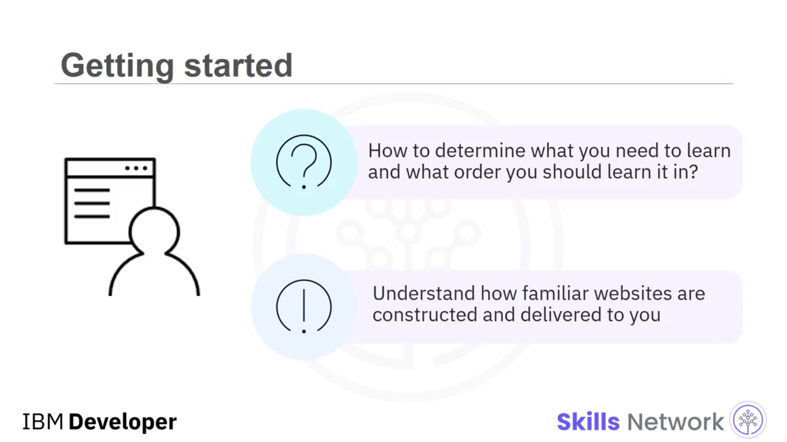
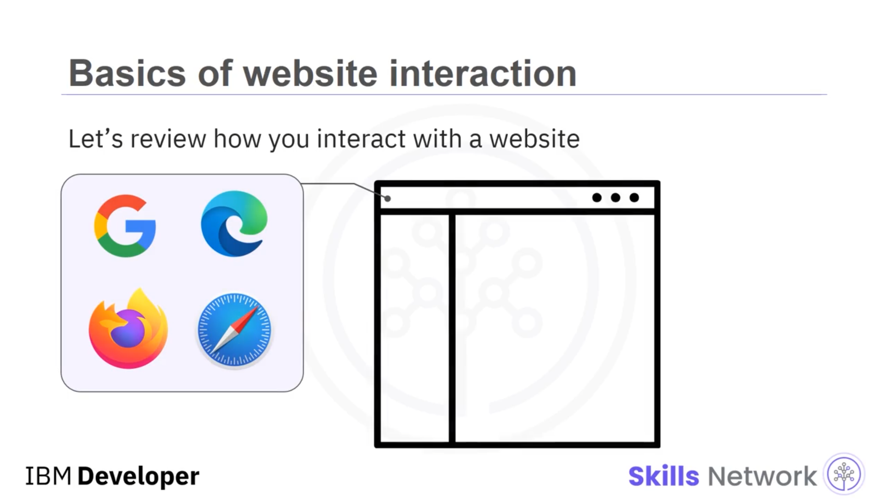
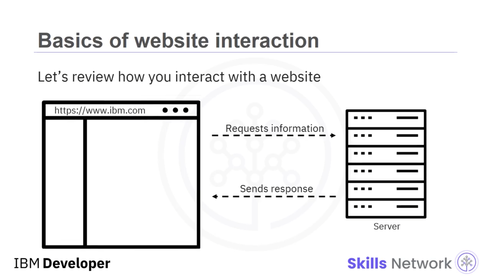
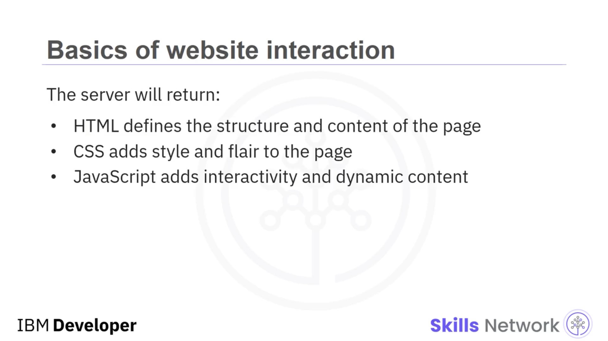
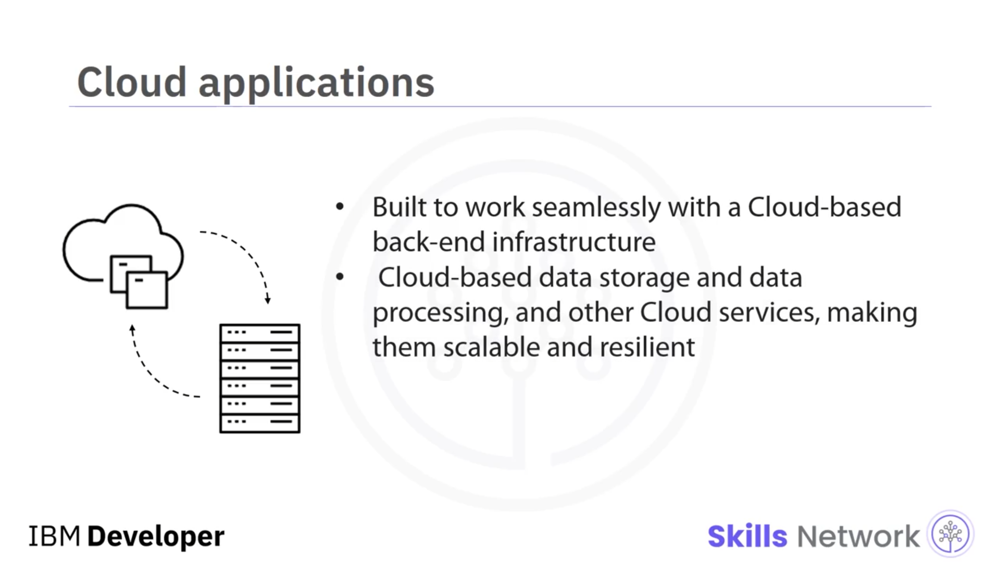
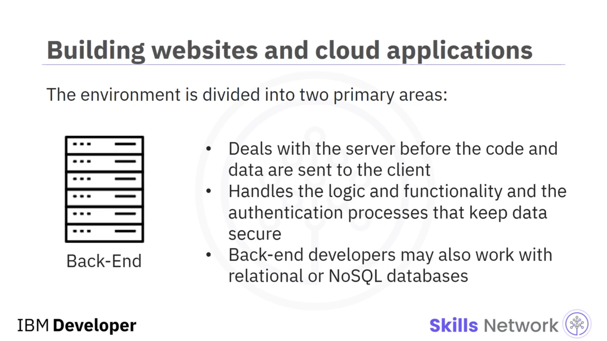
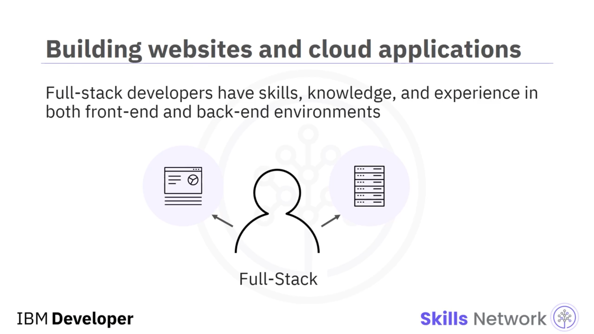
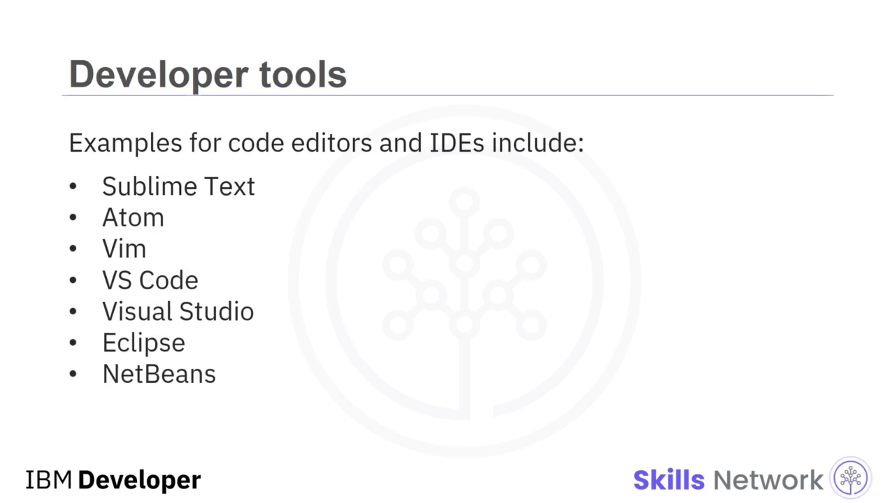

## ☁️ Web ve Bulut Geliştirmeye Genel Bakış

Merhaba, Web ve Bulut Geliştirmeye Genel Bakış dersine hoş geldiniz. Bir Web Geliştirici olarak yeni başladığınızda, ne öğrenmeniz gerektiğini ve bunu hangi sırayla öğrenmeniz gerektiğini belirlemek zor olabilir. Tanıdık web sitelerinin nasıl oluşturulduğunu ve size nasıl ulaştırıldığını anlamak iyi bir başlangıç noktasıdır.

Web sitesiyle nasıl etkileşim kurduğunuzun temellerini gözden geçirelim. Bir internet tarayıcısı açarsınız — birçok seçenek vardır:  **Google Chrome** ,  **Microsoft Edge** , **Mozilla Firefox** ve **Apple Safari** en popüler olanlardan bazılarıdır. Tarayıcının bir adres çubuğu vardır; buraya **[www.IBM.com](http://www.ibm.com/)** gibi bir **URL** girersiniz. Tarayıcı daha sonra bu ada sahip sunucuya bağlanır ve web sitesini oluşturan bilgileri talep eder.

## 🖥️ İstemci ve Sunucu Arasındaki İletişim

Sunucu daha sonra bir yanıt gönderir; bu yanıt, istemcinin web sitesini görüntülemek için ihtiyaç duyduğu verileri içerir. Çoğu web sitesi için sunucu şu içerikleri döndürür:

* **HTML** , sayfanın yapısını tanımlar, ancak çok çekici görünmez
* **CSS** , sayfaya stil ve görsel zenginlik katar
* **JavaScript** , etkileşim ve dinamik içerik ekler

Web sitelerinde görüntülenen içerik, ya sunucuda önceden depolanmış öğeler ( **“statik”** olarak adlandırılır) ya da istemci tarafından her istendiğinde üretilen öğelerden ( **“dinamik”** olarak adlandırılır) oluşabilir.

Dinamik öğeler; veritabanları gibi diğer sistem ve uygulamalardan gelen bilgileri içerebilir. Çoğu web sitesi, en iyi kullanıcı deneyimini sağlamak için hem statik hem de dinamik öğeler içerir.

## 🌩️ Bulut Uygulamaları ve Web Siteleri

Bulut Uygulamaları, sunucunun döndürdüğü içeriği talep etmeleri açısından web sitelerine benzer. Bulut uygulamaları; bulut tabanlı bir *back-end* altyapısı, bulut tabanlı veri depolama ve veri işleme ve diğer bulut servisleriyle sorunsuz çalışacak şekilde inşa edilir; bu da onları çok ölçeklenebilir ve çok dayanıklı hale getirir.

## 🧩 Front-End ve Back-End Ortamları

Web siteleri ve Bulut Uygulamaları geliştirme ortamı iki temel alana ayrılır: **front-end** ve  **back-end** .

 **Front-end** , istemci tarafında gerçekleşen her şeyle ilgilenir — kullanıcının görebildiği ve etkileşime girebildiği her şey. HTML, CSS, JavaScript ve ilgili framework’ler, kütüphaneler ve araçları kullanarak front-end kodlamada uzmanlaşmayı seçebilirsiniz.

**Back-end** ise kod ve veriler istemciye gönderilmeden önce sunucuda gerçekleşen her şeyle ilgilenir. Back-end kodlama genellikle web sitesinin veya uygulamanın çalışmasını sağlayan mantığı ve işlevselliği ve verileri güvenli tutan kimlik doğrulama süreçlerini yönetir. Back-end geliştiriciler ayrıca ilişkisel veya *noSQL* veritabanlarıyla çalışabilir; daha büyük projelerde veritabanı yöneticileriyle iş birliği de yapabilirler.

**Full-stack** geliştiriciler, hem front-end hem de back-end ortamlarında beceri, bilgi ve deneyime sahiptir.

## 🛠️ Geliştirici Araçları: Kod Editörleri ve IDE’ler

Hangi alanda uzmanlaşmayı seçerseniz seçin, çalışmanıza yardımcı olacak uygun araçlara ihtiyacınız olacaktır. Çoğu geliştiricinin kaynaklarına eklediği ilk araç bir kod editörüdür.

Geliştiriciler ayrıca kodu entegre etmek, derlemek, oluşturmak ve hata ayıklamak için araçlara ihtiyaç duyar. **Integrated Development Environments** veya  **IDE** ’ler, yalnızca kod düzenlemenin ötesinde bu ek yeteneklerin bazılarını içerir ve kodunuzu oluşturmayı ve yönetmeyi kolaylaştırır.

İyi IDE’ler birden fazla dili destekler ve **Git** ve **GitHub** gibi yönetim ve depolama araçlarıyla entegre olur. Diğer faydalı özellikler, çalışma tarzınızı ve ortamınızı destekleyen özel eklentiler ve temalardır.

Kod editörleri ve IDE’lere örnekler:  **Sublime Text** ,  **Atom** ,  **Vim** ,  **VS Code** ,  **Visual Studio** , **Eclipse** ve  **NetBeans** .

## ✅ Bu Kısa Genel Bakışta Öğrendikleriniz

Bu kısa genel bakışta şunları öğrendiniz:

* İstemci ve sunucular arasındaki temel iletişim
* Web sitelerinin nasıl inşa edildiği ve görüntülendiği
* Front-end geliştirmenin istemci tarafında olanlarla ilgili olduğu
* Back-end geliştirmenin sunucuda olanlarla ilgili olduğu
* Full-stack geliştirmenin hem front-end hem back-end geliştirmeyi içerdiği
* IDE’lerin kodunuzu oluşturmanıza ve yönetmenize yardımcı olacağı

