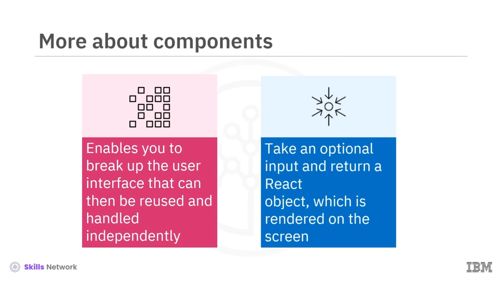
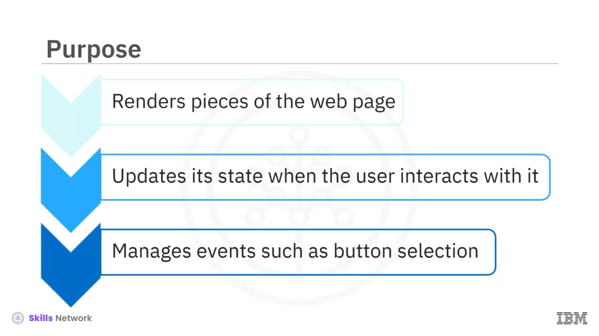
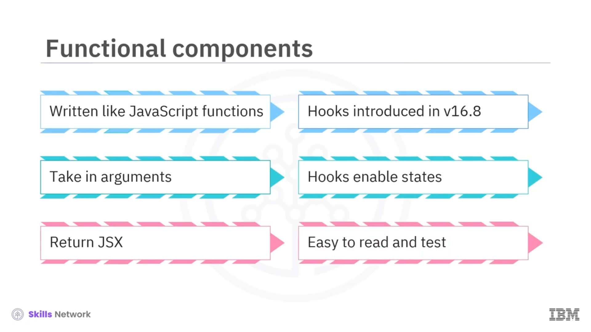
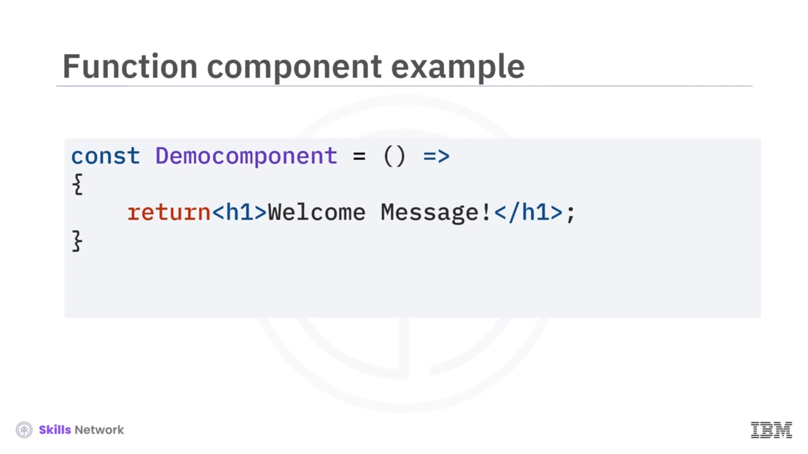
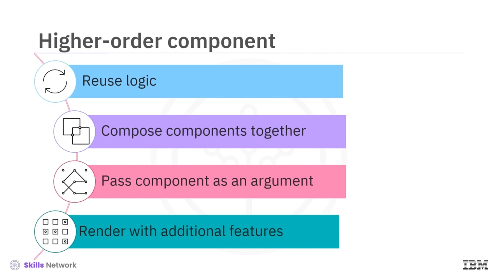
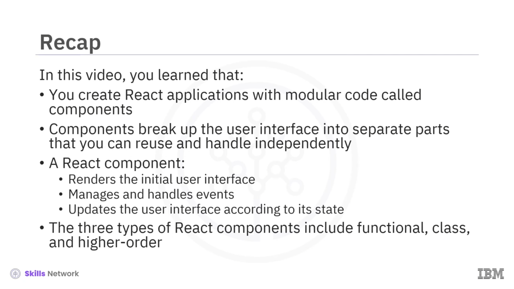

## 🧩 Introduction to Components

 **Introduction to Components** ’e hoş geldiniz. Bu videoyu izledikten sonra, *React bileşenlerinin* ne olduğunu açıklayabilecek, *React bileşenlerinin* özelliklerini tanımlayabilecek, *üç bileşen türünü* karşılaştırıp farklılıklarını ortaya koyabilecek ve bir **Hello World React bileşeni** oluşturabileceksiniz.

React uygulamalarını, **bileşen (components)** adı verilen modüler kod parçalarıyla oluşturursunuz. Bileşenler, React uygulamalarının **yapı taşlarıdır** ve kullanıcı arayüzünü (UI) tek tek parçalara bölerek karmaşık arayüzleri oluşturmayı kolaylaştırır. Ardından bu parçaları, kullanıcının gördüğü ve etkileşime geçtiği yapıyı oluşturan bir **üst (parent) bileşende** birleştirirsiniz.

React bileşenleri, kullanıcı arayüzünü ayrı ayrı öğelere bölmenizi sağlar. Bu öğeler daha sonra **yeniden kullanılabilir** ve **bağımsız** biçimde yönetilebilir.

---

## 🧱 React Bileşeni Nasıl Çalışır

Bir React bileşeni isteğe bağlı **girdi (input)** alır ve ekranda render edilen bir **React nesnesi** döndürür. React bileşeni web sayfasının parçalarını render eder.

Bileşen kodunu, kullanıcının etkileşimine göre nasıl davranacağını ve nasıl güncelleneceğini bilecek şekilde geliştirirsiniz. Bileşenin bu şekilde değiştirilmesine **state change (durum değişikliği)** denir.

Ayrıca, bir bileşen durumu (state) ile bir düğme seçme gibi **olayları (events)** da yönetirsiniz.

Bir bileşen üç unsurdan oluşur:

* **properties (props)**
* **events**
* **states**

Bir bileşenin **properties (props)** özelliğini, veriyi bir **üst bileşenden** bir **alt bileşene** depolamak ve aktarmak için kullanırsınız.

---

## 🧠 Events ve State

 **Events** , kullanıcının sistemle etkileşimi sonucunda  **document object model (DOM)** ’u yönetir.

Bir bileşenin  **state** ’ini kullanıcı arayüzünü güncellemek için kullanırsınız.

---

## 🧩 React’te Üç Bileşen Türü

React’te üç tür bileşen vardır:

* **class**
* **functional**
* **higher-order**

### 🔧 Functional Components

 **Functional components** , JavaScript fonksiyonları gibi yazılır. Argüman alabilir ve **JSX** döndürebilir.

React **16.8** sürümünden önce functional bileşenler *stateless* idi.  **16.8 sürümünde hooks’un tanıtılmasıyla** , artık function component’leri *state* ile birlikte kullanabilirsiniz.

Geliştiriciler genellikle artık function component’leri tercih eder; çünkü bunlar nispeten **okunması** ve **test edilmesi** kolaydır.

Bu kod örneği React’te basit bir functional component gösterir. Kodda, `Democomponent` fonksiyonu JSX olarak **Welcome Message** ifadesini döndürür.

---

### 🏛️ Class Components

React’te **class tabanlı bileşenler** oluşturmak için JavaScript  **ES6 class** ’larını kullanabilirsiniz. Veriyi bir class component’ten başka bir class component’e aktarabilirsiniz.

Bunlar  *state* , *props* ve *lifecycle methods* gibi ana React fonksiyonlarını kullanır.

React 16.8’de hooks’un tanıtılmasından sonra, geliştiriciler functional bileşenleri class bileşenlere kıyasla daha çok tercih etme eğilimindedir; çünkü class bileşenler daha  **karmaşıktır** .

---

### 🧠 Higher-Order Component (HOC)

Bir  **higher-order component (HOC)** , bileşen mantığını yeniden kullanmanıza olanak tanır. Bir bileşeni, başka bir bileşene argüman olarak vererek bileşenleri birlikte compose edebilirsiniz.

HOC, parametre olarak verilen bileşeni **ek özelliklerle birlikte** render eder.

---

## ✅ Özet

Bu videoda şunları öğrendiniz: React uygulamalarını **bileşen (components)** adı verilen modüler kodla oluşturursunuz. Bileşenler kullanıcı arayüzünü ayrı parçalara böler; bu parçaları **yeniden kullanabilir** ve **bağımsız** şekilde yönetebilirsiniz.

Bir React bileşeni:

* başlangıç kullanıcı arayüzünü render eder,
* olayları (events) yönetir ve işler,
* kendi state’ine göre kullanıcı arayüzünü günceller.

React bileşenlerinin üç türü:

* **functional**
* **class**
* **higher-order**

