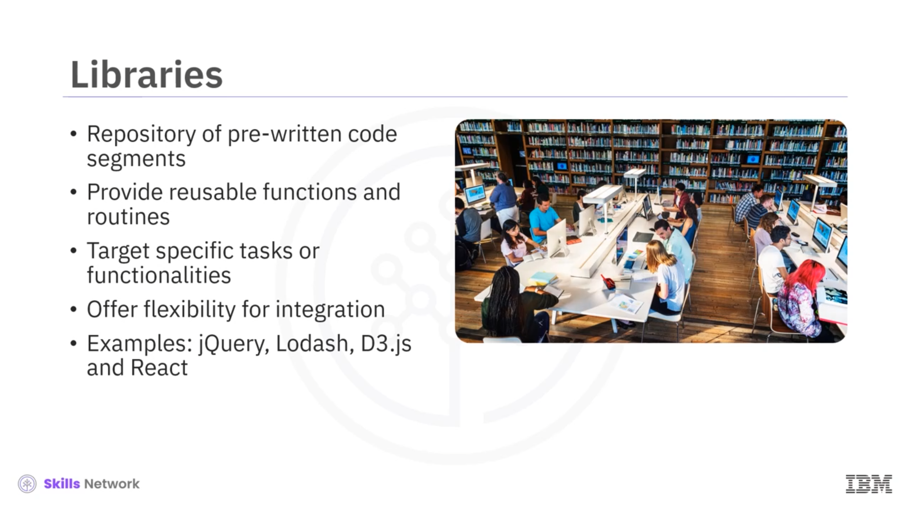
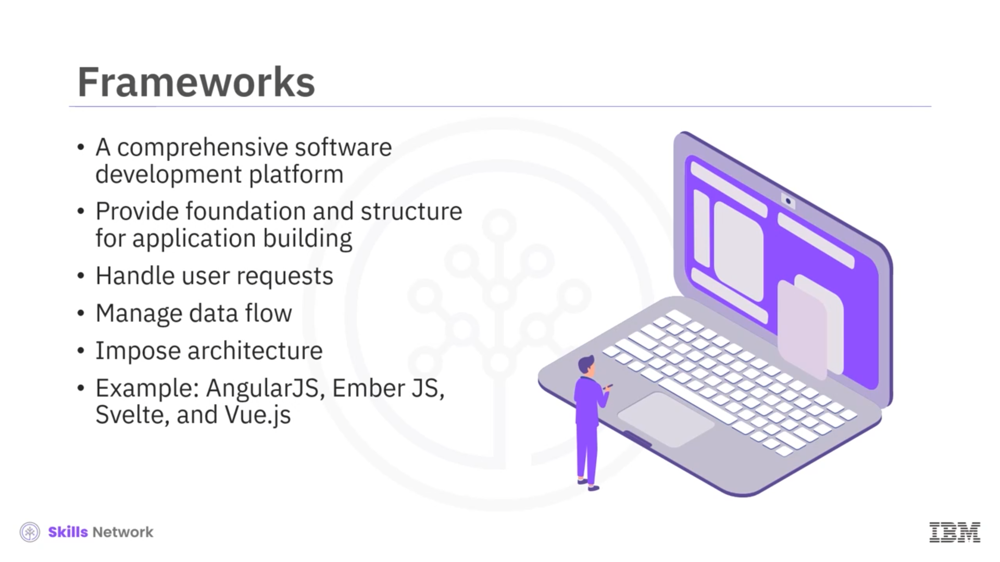
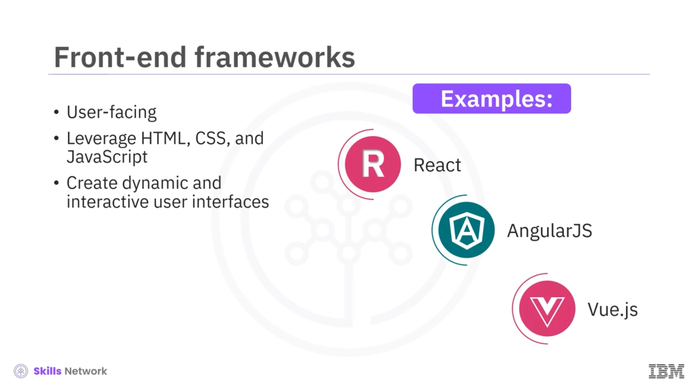
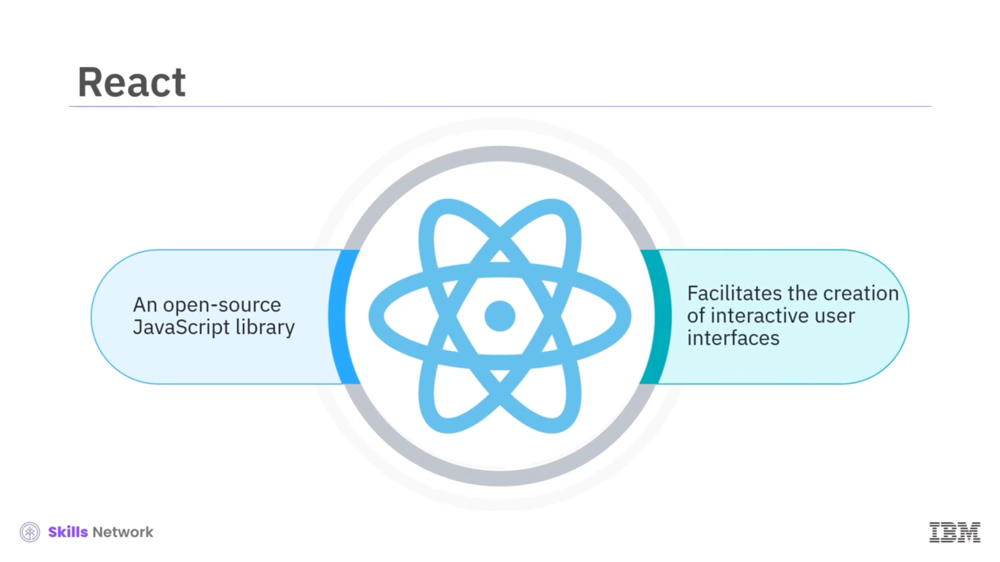
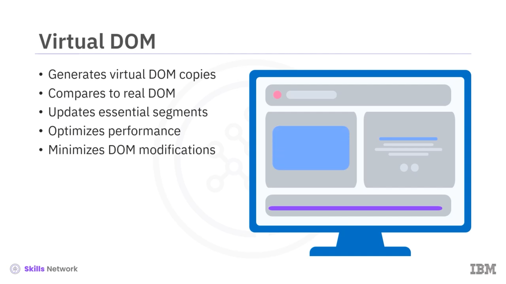
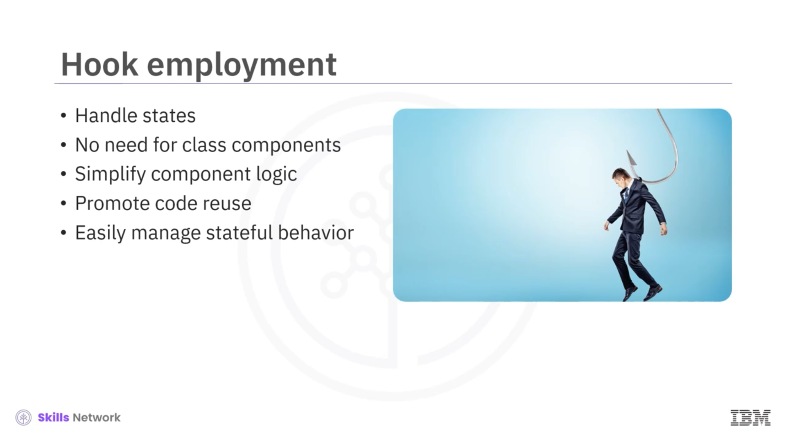
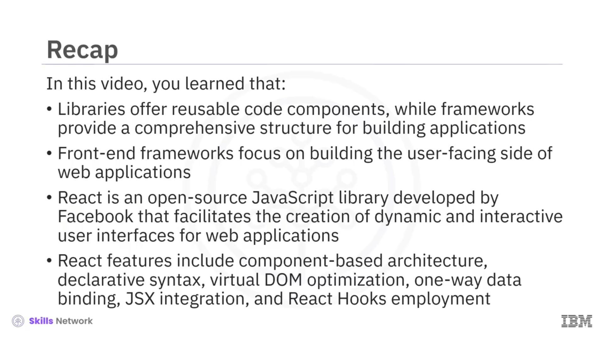

## 🎵 Introduction to Front-End Frameworks and React

Introduction to Front-end Frameworks and React’e hoş geldiniz. Bu videoyu izledikten sonra, **kütüphaneleri** ve **framework’leri** karşılaştırabilecek, **front-end framework’lerini** tanımlayabilecek ve React’in öne çıkan özelliklerini açıklayabileceksiniz.

Günümüzde geliştiriciler, modern web uygulamaları oluşturmak için React’i yaygın biçimde benimsiyor; ancak React kavramını incelemeden önce, **kütüphaneler** ve **framework’ler**in temellerini anlamalısınız.

Yazılım geliştirmede kütüphaneleri ve framework’leri sıkça kullanırsınız; her biri farklı roller ve amaçlar üstlenir. Şimdi her birini ele alalım.

---

## 📚 Kütüphane Nedir

Bir  **kütüphane (library)** , diğer programlar veya uygulamalar tarafından kullanılmak üzere **yeniden kullanılabilir fonksiyonlar** ve rutinler sağlayan, önceden yazılmış kod parçalarının bulunduğu bir depodur.

Bu kütüphaneler çoğu zaman belirli görevlere veya işlevlere odaklanır ve geliştiricilerin ihtiyaç duyduklarında bunları kod tabanlarına entegre etmelerine olanak tanır.

JavaScript kütüphanelerine örnekler: jQuery, Lodash, D3.js ve React.

---

## 🧩 Framework Nedir

Bir  **framework** , tüm uygulamaları inşa etmek için temel ve yapı sağlayan, kapsamlı bir yazılım geliştirme platformudur.

Belirli işlevler sunan kütüphanelerin aksine framework’ler, belirli bir mimariyi dayatır ve geliştirme sürecini kolaylaştırmak için araçlar, kütüphaneler ve yönergeler sağlar.

Framework’ler; kullanıcı isteklerini ele alma, veri akışını yönetme ve uygulamanın genel mimarisini yapılandırma gibi daha geniş konuları kapsar.

JavaScript framework’lerine popüler örnekler: AngularJS, Ember JS, Svelte ve Vue.js.

Web geliştirme söz konusu olduğunda ise özel bir framework türü ortaya çıkar:  **front-end framework** .

---

## 🖥️ Front-End Framework Nedir

 **Front-end framework’ler** , web uygulamalarının kullanıcıya dönük tarafını geliştirmeye odaklanır.

HTML, CSS ve JavaScript gibi teknolojilerden yararlanarak sunucu ile perde arkasında iletişim kuran, dinamik ve etkileşimli kullanıcı arayüzleri (UI) oluştururlar.

Popüler front-end framework’lerden bazıları: React, AngularJS ve Vue.js.

---

## ⚛️ React Nedir

React, Facebook ve Instagram’ı işleten bir şirket olan Meta tarafından geliştirilmiş, açık kaynaklı bir JavaScript kütüphanesidir.

Web uygulamaları için dinamik ve etkileşimli kullanıcı arayüzleri oluşturmayı kolaylaştırır.

React’in öne çıkan özellikleri şunlardır:  **bileşen tabanlı mimari** ,  **deklaratif sözdizimi** ,  **Virtual DOM** ,  **tek yönlü veri bağlama** , **JavaScript XML (JSX)** ve  **hook kullanımı** .

---

## 🧱 Bileşen Tabanlı Mimari

React’in esnek bileşen tabanlı mimarisi, yeniden kullanılabilir UI öğeleri oluşturmayı mümkün kılar.

React’te geliştiriciler, belirli bir web sayfası özelliğini temsil eden bağımsız bileşenleri bir araya getirerek kullanıcı arayüzleri oluşturur.

Örneğin geliştiriciler bir web sitesini üst bilgi (header), sol ve sağ kenar çubukları (sidebar) veya alt bilgi (footer) gibi parçalara bölebilir.

Bu modüler yaklaşım, UI işlevselliğini ayrı dosyalarda kapsüllemenizi sağlar ve kodu kopyalamadan, bileşenleri birden fazla sayfada yeniden kullanmayı kolaylaştırır.

---

## 🧠 Deklaratif Sözdizimi

React, veri veya state değiştiğinde UI’nın nasıl davranması gerektiğini güncelleyen **deklaratif bir sözdizimi** kullanır.

Bu deklaratif paradigma, geliştiricilerin yalnızca hedeflenen UI davranışını belirtmelerine olanak tanırken, alttaki DOM yönetimini React verimli biçimde gerçekleştirir.

Özünde geliştiriciler React’e **nasıl yapılacağını** değil, **ne yapılacağını** söyler.

---

## 🪞 Virtual DOM

React, doğrudan manipülasyon yerine **virtual DOM** kullanır.

Herhangi bir bileşende değişiklik olduğunda React, virtual DOM kopyaları üretir ve bunları gerçek DOM ile karşılaştırır; ardından yalnızca gerekli kısımları günceller.

Bu strateji, gereksiz DOM değişikliklerini en aza indirerek performansı optimize eder ve hızı artırır.

---

## 🔁 Tek Yönlü Veri Bağlama

React, verinin üst (parent) bileşenlerden alt (child) bileşenlere **tek yönlü** akmasını sağlayan **one-way data binding** uygular.

Bu yaklaşım veri yönetimini basitleştirir ve tutarsız state kaynaklı hataların riskini azaltır.

---

## 🧬 JSX Entegrasyonu

React, JavaScript içinde HTML benzeri kod yazmayı mümkün kılan bir JavaScript sözdizimi uzantısı olan **JSX (JavaScript XML)** kullanır.

JSX, UI bileşenlerini oluşturmayı ve görselleştirmeyi kolaylaştırır; HTML ile JavaScript’i sorunsuz biçimde entegre eder.

---

## 🪝 React Hooks

React, React 16.8’de tanıtılan bir özellik olan  **hooks** ’u kullanır.

Hooks, geliştiricilerin state ve diğer React özelliklerini sorunsuz biçimde ele almasına imkân tanır ve class tabanlı kodlama ihtiyacını ortadan kaldırır.

Hooks, bileşen mantığını basitleştirir, kod yeniden kullanımını teşvik eder ve state içeren davranışları yönetmeyi kolaylaştırır.

---

## ✅ Özet

Bu videoda, kütüphanelerin yeniden kullanılabilir kod bileşenleri sunduğunu; framework’lerin ise uygulama geliştirmek için kapsamlı bir yapı sağladığını öğrendiniz.

Front-end framework’ler, web uygulamalarının kullanıcıya dönük tarafını geliştirmeye odaklanır.

React, Facebook tarafından geliştirilmiş, web uygulamaları için dinamik ve etkileşimli kullanıcı arayüzleri oluşturmayı kolaylaştıran açık kaynaklı bir JavaScript kütüphanesidir.

React’in özellikleri;  **bileşen tabanlı mimari** ,  **deklaratif sözdizimi** ,  **virtual DOM optimizasyonu** ,  **tek yönlü veri bağlama** , **JSX entegrasyonu** ve **React hooks kullanımı**dır.

