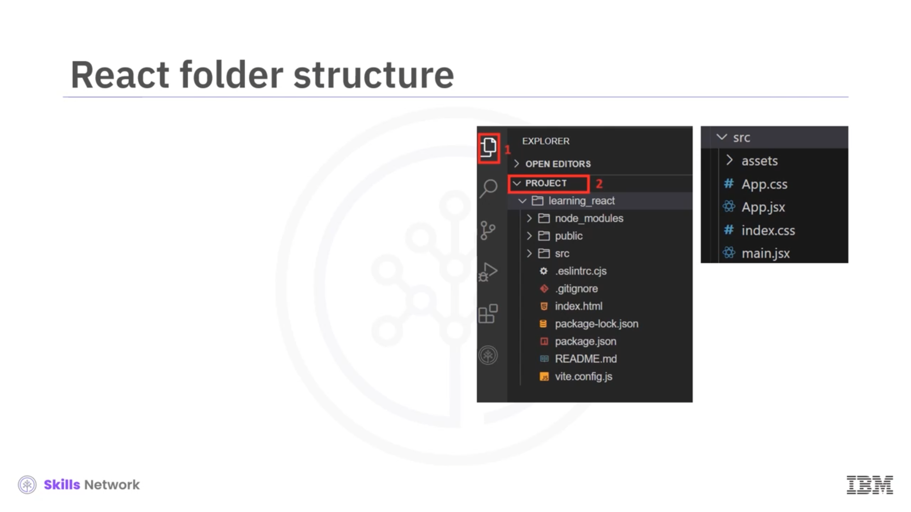
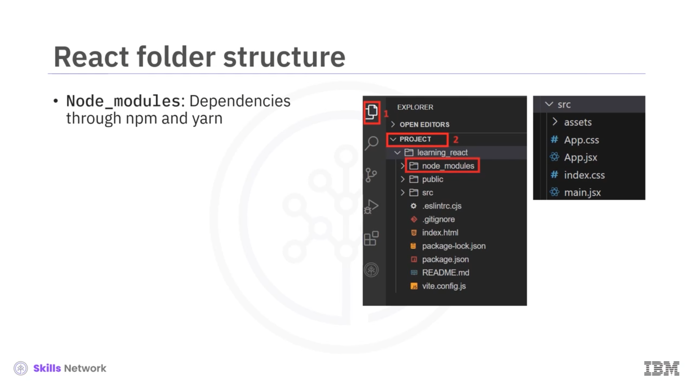
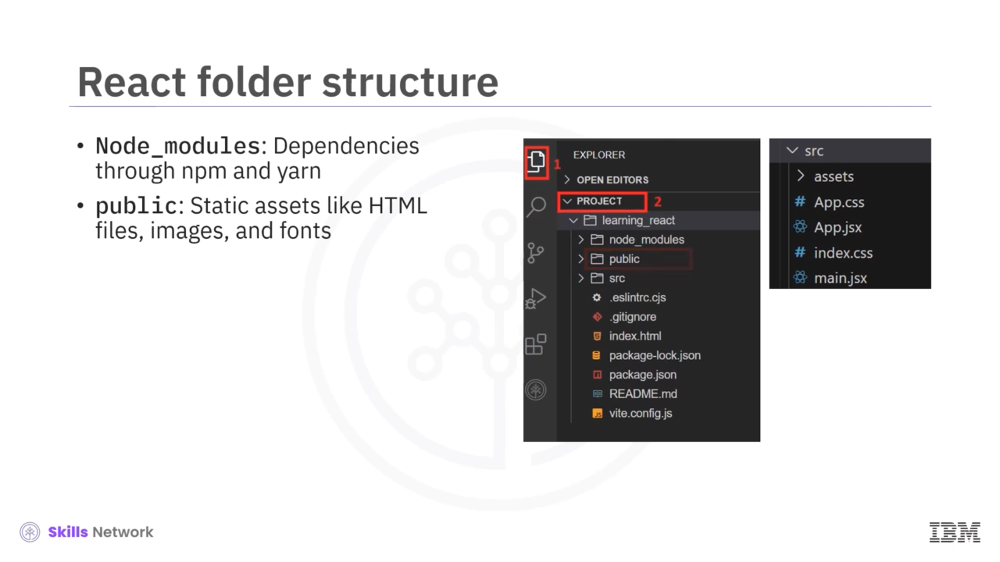

## 🧩 React Yapısını Anlamak

React yapısı hakkındaki bu videoya hoş geldiniz. Bu videoyu izledikten sonra, React projeleri oluşturmak için  **Vite build tool** ’u açıklayabilecek, bir React projesi oluşturma adımlarını listeleyebilecek ve bir React klasör yapısındaki dizinleri ve dosyaları sıralayabileceksiniz.


---

## 🛠️ CRA ve Vite

Kodda gösterildiği gibi CRA aracıyla bir React projesi oluşturabilirsiniz. Bu kod, proje için ihtiyaç duymayabileceğiniz bazı dosya ve klasörleri de kuracaktır. Sonuç olarak bu araç, büyük bir dosya boyutuna yol açabilir.

React yetkilileri artık yeni bir araç geliştirdi:  **Vite** .

Vite, mevcut web geliştirme senaryosunda front-end projeleri için geliştirilmiş bir geliştirme aracı olan bir build tool’dur. Bunu React, Angular veya sade JavaScript ile, ayrıca herhangi yeni bir JavaScript kütüphanesi ya da sistemiyle kullanabilirsiniz.


---

## ⚡ Vite Nasıl Çalışır

Vite, güncel tarayıcıların JavaScript modüllerini nasıl ele aldığını en iyi şekilde kullanarak web projelerinin geliştirilmesini ve build sürecini hızlandıran bir araçtır.

Bu işlem, kodun yalnızca gerektiğinde bundle edilmesiyle yapılır; bu da programlama ve build süresini hızlandırır.

---

## 🧱 Vite ile React Projesi Oluşturma Adımları

Vite aracıyla bir proje oluşturmak için aşağıdaki adımları izleyin:

1. Kod editörünüzün terminalinde `npm create` komutunu yazın.
2. Proje adını verin. Framework listesinin görüntülendiği yerde ok tuşlarıyla React’i seçin.
3. Sonrasında, üzerinde çalışmak istediğiniz script dili olarak JavaScript’i seçin.


Verilen proje adıyla bir klasör oluşturulacaktır.

4. Terminal, projenizde çalışmaya başlamak için şu talimatları verecektir:

```bash
cd learning_react
npm install
npm run dev
```

`cd learning_react`, sizi React projenizin doğru konumuna yönlendirir.
`npm install`, React projesini çalıştırmak için gereken tüm temel dosya ve paketleri kurar.
`npm run dev`, React uygulamasını başlatır ve bir web tarayıcısında render edilmesini sağlar.

5. Link ve port numarası görüntülenecek ve bu sayede React uygulamanız herhangi bir tarayıcıda açılabilecektir.
6. `npm run dev` komutu, çıktıyı gösterildiği gibi görüntüler.
7. 

---

## 📁 React Klasör Yapısını Anlamak

Şimdi React’in klasör yapısını anlayalım. Kod editörünüzün Explorer bölümünden React projesinin içine gidin; bu yapı görüntülenecektir.

Vite ile bir React projesi oluşturduktan sonra, klasör yapısı aşağıdaki dizinler ve dosyalardan oluşur.



---

## 📦 node_modules Dizini

`node_modules` dizini, NPM veya Yarn aracılığıyla yüklenen tüm bağımlılıkları içerir.



---

## 🗂️ public Dizini

`public` dizini, HTML dosyaları, görseller ve fontlar gibi statik varlıkları içerir.

HTML dosyası, React uygulaması için giriş noktası (entry point) görevi görür.



---

## 🧪 src Dizini

`src` dizini, React uygulamasının kaynak kodlarını içerir.

SRC klasörü içinde `App.jsx`, `App.css`, `main.jsx` ve `index.css` dosyaları bulunur.

`main.jsx`, React uygulaması için giriş noktasıdır. Public dizininde bulunan HTML dosyası içine root bileşeni render eder.

`App.jsx`, React uygulamasının root bileşenini temsil eder. UI’ı oluşturmak için başka bileşenler ve mantık içerebilir.

Bu dosya React için boilerplate şablonunu içerecektir.


---

## 🧾 Diğer Dosyalar

Yapıdaki diğer dosyalar aşağıdaki gibidir:

* `package.json`, proje ve bağımlılıklar hakkında metadata içerir. Ayrıca uygulamayı çalıştırmak, build etmek ve test etmek için script’ler içerir.
* `vite.config.js`, Vite build tool için yapılandırma ayarlarını içerir; build sürecini özelleştirme, plug-in belirtme ve geliştirme sunucusu seçeneklerini yapılandırma gibi.
* `.gitignore`, Git sürüm kontrolü tarafından yok sayılması gereken dosya ve dizinleri belirtir.
* `README.md`, proje hakkında bilgi sağlar; kurulum talimatları, kullanım yönergeleri ve proje dokümantasyonu dahil.
* `index.html`, web geliştirme projelerinin temel bir parçasıdır ve web uygulamalarının giriş noktası olarak hizmet eder.
* `eslintrc.cjs` dosyası, JavaScript için popüler bir linting aracı olan ESLint tarafından kullanılan bir yapılandırma dosyasıdır. `.cjs` uzantısı, bunun CommonJS modülü olduğunu gösterir; yani Node.js uygulamalarında CommonJS modül formatını takip eder.


---

## 🚀 Uygulamayı Geliştirmeye Başlamak

Artık daha fazla klasör ve dosya oluşturarak uygulamayı inşa etmeye başlayabilirsiniz.

---

## ✅ Özet

Bu videoda, Vite’ın mevcut web geliştirme senaryosunda front-end projeler için geliştirilmiş bir geliştirme aracı olan bir build tool olduğunu öğrendiniz.

Vite, JavaScript modüllerini yalnızca gerektiğinde bundle ederek ele alır; bu da programlama ve build süresini hızlandırır.

Vite ile bir React projesi oluşturduktan sonra klasör yapısının; `node_modules`, `public`, `src`, `main.jsx`, `App.jsx`, `package.json` ve benzeri birçok dizin ve dosyadan oluştuğunu öğrendiniz.


