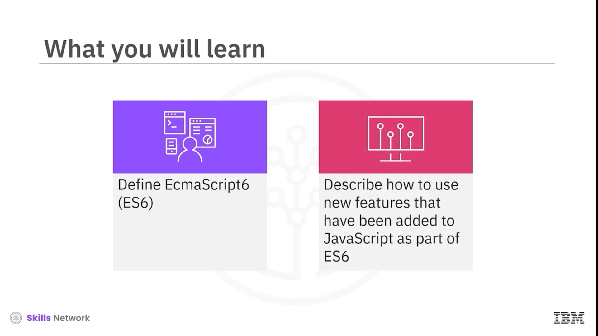
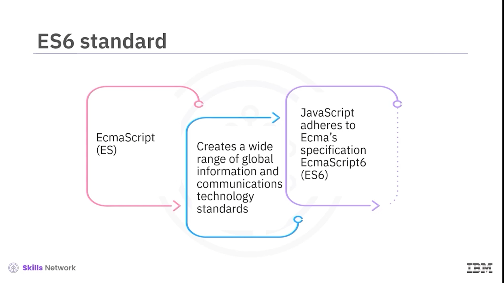
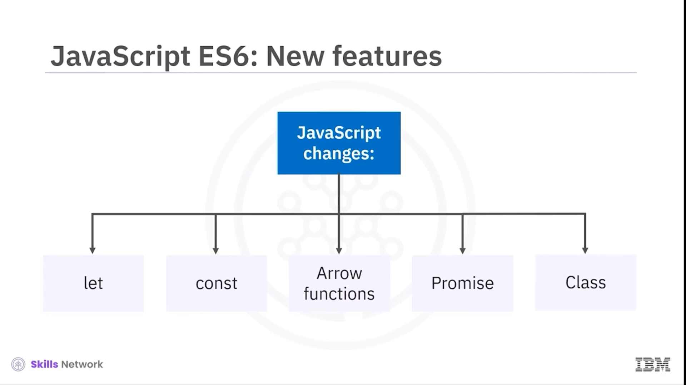
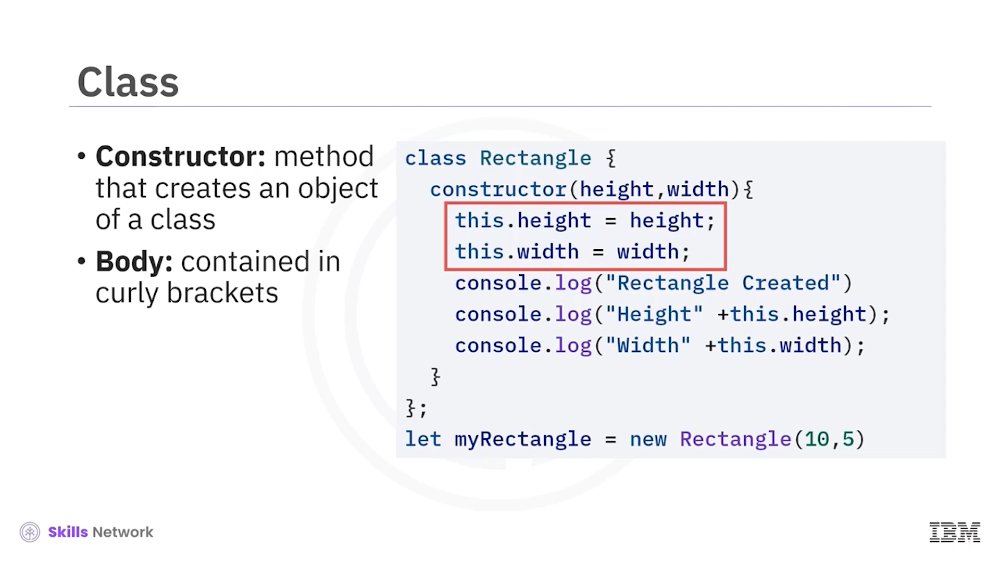
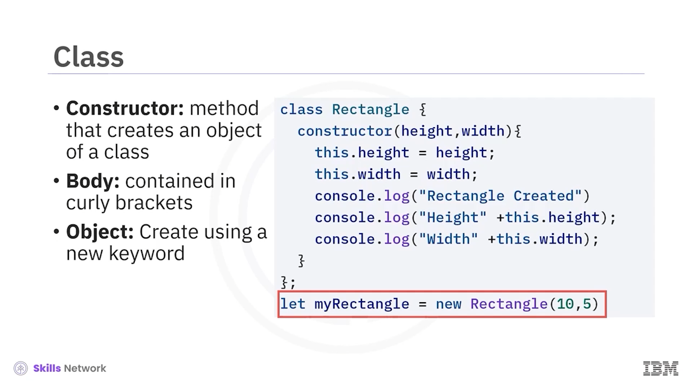
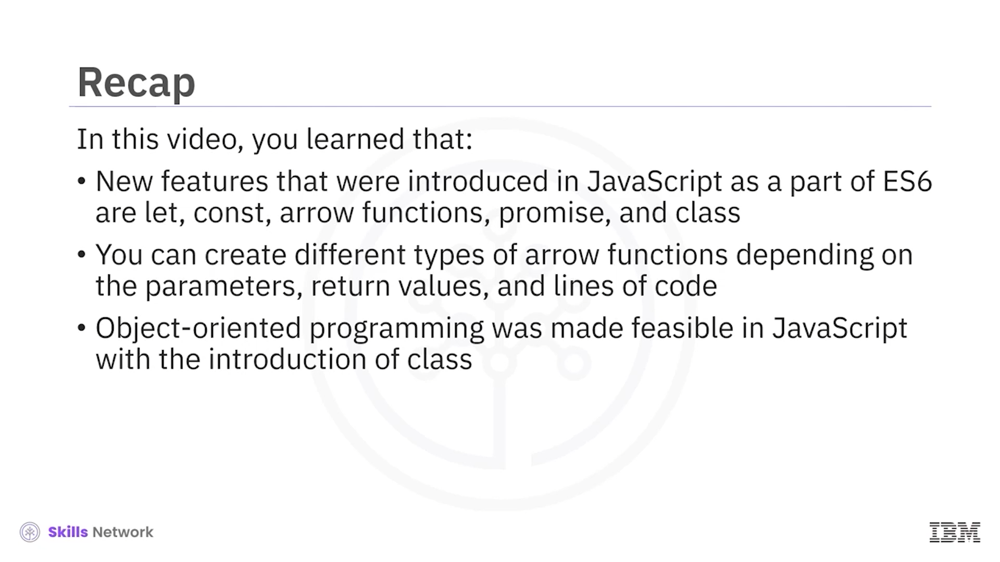

## 📘 ES6’ya Giriş

ES6’ya Giriş’e hoş geldiniz. Bu videoyu izledikten sonra, **ECMAScript 6** (ES6 olarak da bilinir) tanımını yapabilecek ve ES6 kapsamında JavaScript’e eklenen yeni özelliklerin nasıl kullanılacağını açıklayabileceksiniz.

ES,  **ECMAScript** ’in kısaltmasıdır.  **ECMA** , çok çeşitli küresel bilgi ve iletişim teknolojisi standartları oluşturan bir standartlar kuruluşudur.

JavaScript, 2015’te yayımlanan **ECMASpecification ES6** standardına uygundur. ES’in daha yeni sürümleri, yayımlandıkları yıla göre adlandırılır. En güncel olanı  **ECMAScript 2020** ’dir.

 **ES.next** , ECMAScript’in gelecek sürümünü ifade etmek için kullanılan dinamik bir addır.

ES6, büyük etkisi olan değişiklikleri içeren bir sürümdür. JavaScript’teki temel değişiklikler şunlardır:  **let** ,  **const** ,  **arrow functions** , **promises** ve  **class** .

---

## 🧱 var, let ve const

Değişkenleri ya da  **VAR** ’ları kullanmaya aşinasınız. Bir **VAR** global scope’a sahiptir. Bir kez tanımlandığında, kodun herhangi bir yerinden kullanılabilir veya referans alınabilir.

Bu durum, özellikle çok sayıda değişkenin yönetildiği büyük projelerde zorluk yaratır.

ES6’da, VAR’a ek olarak **let** ve **const** kullanırsınız.

 **let** , değişkenlerin scope’unu tanımlandıkları blok içinde kısıtlamanıza izin verir. Bu sınırlı scope’a **local scope** denir.

Bu örnekte, `num` yalnızca o blok içinde scope’a sahiptir. 7. satır hata verecektir çünkü `num` scope dışındadır.

 **const** , değeri değiştirilemeyen sabitleri tanımlamanıza izin verir. 3. satır hata verir çünkü `num`, değeri 5 olan bir sabit olarak tanımlanmıştır.

Hem **let** hem de  **const** ’u React programlamasında kullanabilirsiniz.

---

## 🏹 Arrow Functions

Arrow functions, fonksiyonları değişken tanımlar gibi tanımlamanıza izin verir. Bu sözdizimini kullanmak, fonksiyonlarla çalışmak için daha kısa ve daha temiz bir yoldur.

Burada gördüğünüz, ES5 JavaScript’te bir fonksiyonun nasıl yazıldığıdır. Aşağıda ise ES6’da nasıl yazıldığı görülebilir.

Bir fonksiyon, tıpkı bir değişken gibi `let` ve `const` ile de tanımlanabilir.

Bu fonksiyon parametre almaz ve yalnızca bir ifadeye sahiptir.

Dikkat edin, süslü parantezler yoktur.

Arrow functions normal fonksiyonlar gibi çağrılır. Callback’ler için parametre olarak da iletilebilirler.

Burada `sayHello` adlı arrow function, `setTimeout`’a callback parametresi olarak geçirilmiştir.

Arrow functions normal fonksiyonlar gibi parametre de alır. Bir veri tipi veya bir nesne döndürebilirler.

Burada bir parametre alan bir fonksiyon görebilirsiniz.

Fonksiyon parantezleri zorunlu değildir.

Tek satır kod vardır, ancak kod bir değer döndürdüğü için süslü parantez içinde olmalıdır.

Bu, iki parametre alan bir fonksiyondur.

Parametre listesi etrafına fonksiyon parantezleri konmalıdır.

Bu fonksiyon da yalnızca bir satır koda sahiptir ve hiçbir şey döndürmez; dolayısıyla süslü parantezlere ihtiyaç duymaz.

Bu, iki parametre alan ve bir değer döndüren bir fonksiyondur.

Ve bu, iki parametre alan ve iki satır koda sahip bir fonksiyondur.

---

## 🤝 Promise

**Promise** nesnesi, asenkron bir işlemin gelecekte tamamlanmasını ve onun dönüş değerini temsil eder.

Asenkron bir işlem çağırdığınızda, promise **pending** durumundadır.

İşlem başarıyla tamamlandığında, promise’in **fulfilled** olduğu söylenir.

İşlem başarısız olduğunda, promise’in **rejected** olduğu söylenir.

İlk örnekte, iki parametre alan (`resolve` ve `reject`) bir arrow function promise argümanı vardır.

Eğer milisaniye cinsinden mevcut zaman ikiye bölünebiliyorsa, bu arrow function parametre olarak `success` ile `resolve` çağırır.

Değilse, parametre olarak `failed` ile `reject` çağırır.

Bu fonksiyon, promise nesnesinin constructor’ına geçirilir.

İkinci örnekte ise, promise argümanlarını ayrı tanımlamak yerine, fonksiyon doğrudan promise constructor’ına argüman olarak verilir.

Her iki durumda da davranış aynıdır.

---

## 🏛️ Class ve Nesne Yönelimli Programlama

Nesne yönelimli programlama, JavaScript’e  **class** ’ın eklenmesiyle mümkün hale gelmiştir.

 **Class** , nesneler oluşturmak için bir şablon veya blueprint’tir.

JavaScript’te class’lar  **prototype** ’lar üzerine inşa edilmiştir.

 **Prototype** , fonksiyonlar dahil tüm JavaScript nesnelerinin bir özelliğidir.

Bir fonksiyon, bir nesne örneği (instance) oluşturmak için kullanılabilir.

Burada `this`, mevcut nesneye referans verir; ancak fonksiyon prototype’ları ile tüm nesne yönelimli programlama kavramları kullanılamaz.

Class kavramı, fonksiyon prototype temelinden inşa edilerek nesne yönelimli programlamayı JavaScript’e genişletmek üzere oluşturulmuştur.

Burada ilk console log, `person1` nesnesinin tüm prototype’ını yazdıracaktır.

İkinci console log, adı yazdıracaktır ve üçüncü console log, yaşı yazdıracaktır.

Bir class, constructor’a sahip olabilir; constructor, bir class’tan nesne oluşturmak istediğinizde çağrılan bir metottur.

Class gövdesi, süslü parantezler içinde bulunan kısımdır.

---

## 🧮 Rectangle Örneği ve new Kullanımı

Burada `rectangle` genel bir class’tır. Tüm rectangle’ların bazı `height` ve `width` değerleri vardır; bunlar property’lerdir.

Bir rectangle nesnesi oluşturduğunuzda, `height` ve `width` değerlerini constructor’a parametre olarak geçirirsiniz.

`my rectangle`, rectangle class’ı ile oluşturulmuş bir nesnedir.

Bu örnekte, class’ın bir nesnesi `new` anahtar sözcüğü kullanılarak oluşturulabilir.

Property’ler, `this` anahtar sözcüğü kullanılarak oluşturulmakta olan mevcut nesneye atanır.

`Rectangle` blueprint’tir.

Bu anahtar sözcük, `my rectangle` nesnesinin property’lerini ayarlamaya yardımcı olur.

---

## 🧬 Kalıtım

JavaScript ES6’da bir class, başka bir class’tan kalıtım alabilir.

 **Subclass** , superclass’tan kalıtım alan class’tır.

Subclass, superclass’ın tüm attribute’larını ve method’larını miras alır.

React bileşenleri, kullanıcı tanımlı bileşenler oluşturmak için kalıtımı kullanır.

Subclass, `super` method çağrısı ile superclass constructor’ını çağırma ayrıcalığına sahiptir.

---

## ✅ Özet

Bu videoda, ES6 kapsamında JavaScript’e eklenen yeni özelliklerin  **let** ,  **const** ,  **arrow functions** , **promise** ve **class** olduğunu öğrendiniz.

Parametreler, dönüş değerleri ve kod satırı sayısına bağlı olarak farklı türlerde arrow function’lar oluşturabilirsiniz.

Ve nesne yönelimli programlama, JavaScript’e class’ın eklenmesiyle mümkün hale gelmiştir.

