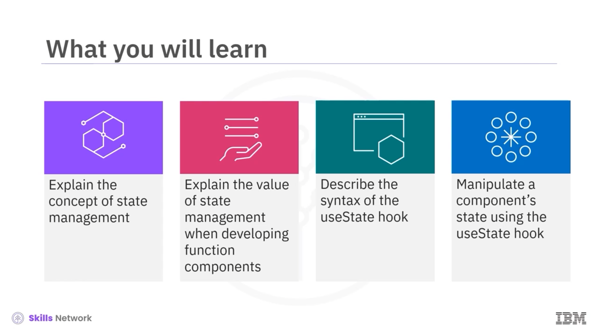
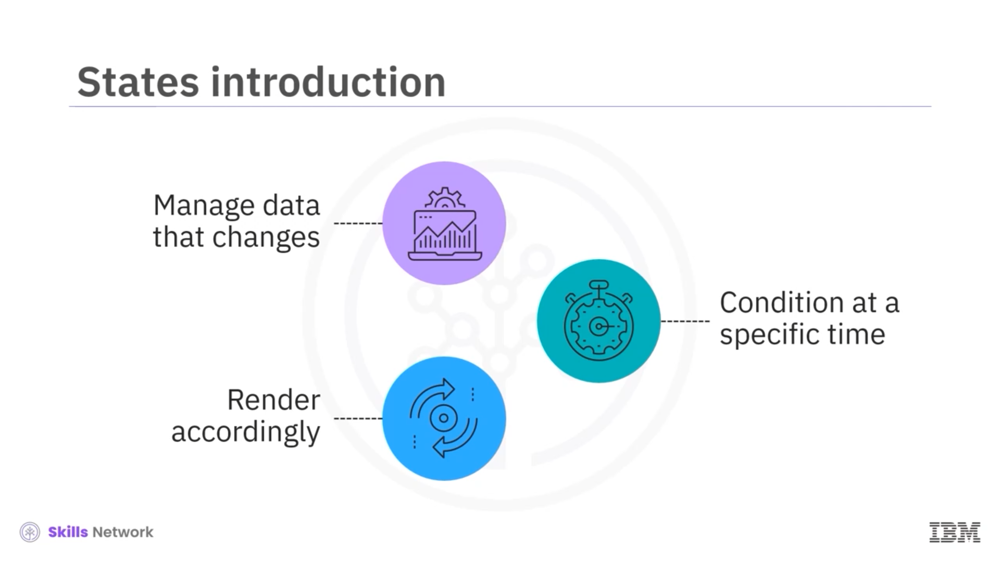
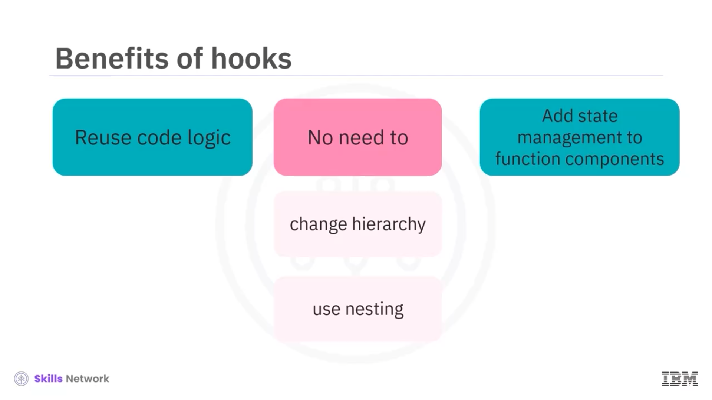
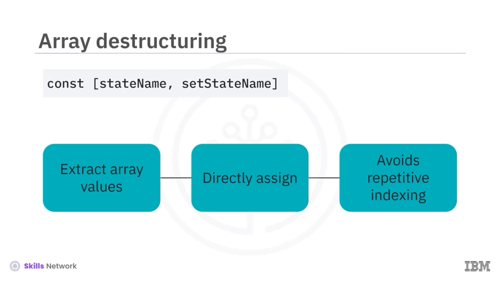
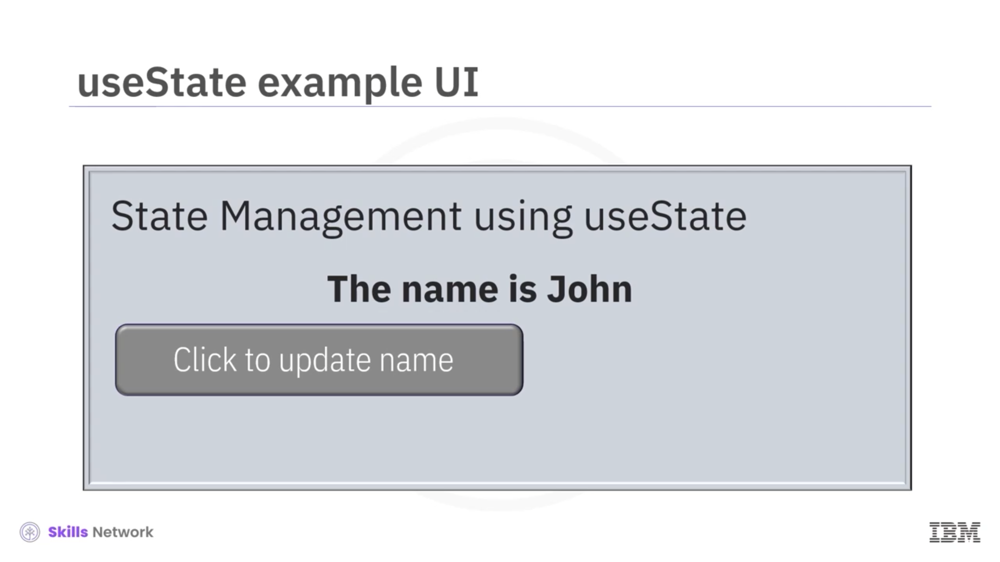
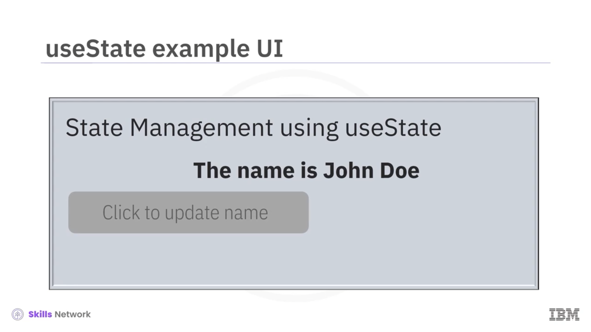
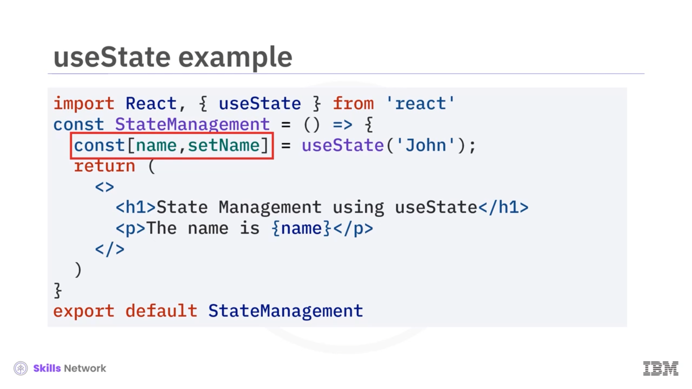
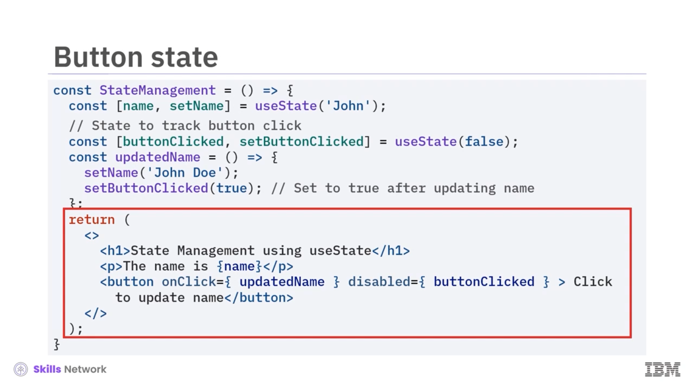

## 🧠 State Management in Function Components

State Management in Function Components bölümüne hoş geldiniz. Bu videoyu izledikten sonra şunları yapabileceksiniz:

* *State management* kavramını açıklamak
* Function component’leri geliştirirken *state management* değerini açıklamak
* *useState* hook’unun sözdizimini ( *syntax* ) açıklamak
* *useState* hook’unu kullanarak bir bileşenin state’ini manipüle etmek

React’te, bir bileşenin içinde zamanla değişebilen veriyi yönetmek için *state* kullanırsınız. Bir bileşenin state’i, o bileşenin belirli bir andaki durumunu ifade eder. Bir nesnenin state’i, davranışını etkileyen ve bu bilgiye göre render edilmesini sağlayan bilgileri tutar.

Hook’ların ortaya çıkmasından önce, React function component’lerin state’ini yönetemezdi. Artık function component’ler yerel ( *local* ) state management yeteneklerine sahiptir.

---

# 🪝 Hooks ve useState

Bu videoda *useState* hook fonksiyonunun bir gösterimini göreceksiniz. Hook’lar, bileşen hiyerarşisini değiştirmeden veya gereksiz iç içe geçmeyi ( *nesting* ) oluşturmadan, kod mantığını ( *logic* ) bileşenler arasında yeniden kullanmanıza olanak tanır. Ayrıca, farklı bileşenler arasında işlevselliği paylaşmayı ve compose etmeyi kolaylaştırır.

Sık kullanılan bir hook olan  **useState** ’e bakalım. *useState* hook’u, function component’lere state management işlevleri eklemenizi sağlar. Bir stateful değeri tek bir değişkenle ve o değişkenin değerini güncellemek için bir fonksiyonla döndürür. Burada sözdizimini görebilirsiniz.

---

## 🧾 useState Sözdizimi

*useState* fonksiyonunu çağırır ve başlangıç state’ini ( *initial state* ) parametre olarak verirsiniz. Dönüş değerini bir `const` dizi değişkenine atarsınız. Bu dizide iki değer vardır: **stateName** ve başına **set** anahtar sözcüğü getirilmiş olan  **setStateName** .

Şimdi bu token’ların her birine daha yakından bakalım.

Bu sözdizimi, `const` değişkeni için *array destructuring* kullanır.  *Array destructuring* , bir diziden değerleri çıkarıp bunları ayrı değişkenlere atamanıza olanak tanır. Dizinin elemanlarına tekrar tekrar indeksleme ile erişmek yerine, bu özellikle değişkenleri diziyle atamak kodunuzu basitleştirir.

Bu durumda,  *useState* ’in döndürdüğü diziden iki değer çıkarır ve bunları sırasıyla `stateName` ve `setStateName` olarak adlandırılan değişkenlere atar.

`stateName` değişkeni güncel state değerini saklar. Bu değişken bileşenin mevcut durumunu temsil eder. Buna erişebilir ve gerektiğinde güncelleyebilirsiniz.

`setStateName` fonksiyonunu, state değerini güncellemek için *useState* hook’u sağlar. `setStateName` çağırdığınızda React, güncellenmiş state değeriyle bileşeni yeniden render eder ve gerekli UI güncellemelerini tetikler.

Başlangıç state değerini, *useState* fonksiyonuna parametre olarak verirsiniz. Bu değer, bileşen ilk kez render edildiğinde `stateName` değişkenini başlatır.

---

## 🧪 Örnek: Name Güncelleme

Şimdi bu sözdiziminin bir örnekle gösterimini göreceksiniz. Burada gösterilene benzer bir UI geliştirmek için kullanılan koda bakalım.

Kullanıcı düğmeyi seçmeden önce arayüz `"The name is John."` gösterir. Düğme seçildikten sonra arayüz `"The name is John Doe."` gösterecektir.

Bu bileşen olan **StateManagement** ile, *useState* hook’unu kullanarak bileşenin state’ini yönetebilir ve görüntüleyebilirsiniz.

Bileşen, React paketinden gerekli bağımlılıkları içe aktarır; bunlar arasında React ve *useState* hook’u vardır.

Bileşen fonksiyonunun içinde, *useState* hook’unu kullanarak `name` adında bir state değişkeni ve bu state değişkenini güncellemek için bir `setName` fonksiyonu tanımlarsınız. Kod, `nameState` değişkeninin başlangıç değerini **John** olarak ayarlar.

*useState* hook’u iki öğeli bir dizi döndürür: `name` değişkeninin mevcut state değeri ve bu state değerini güncellemek için bir fonksiyon olan `setName`. Bu öğeleri değişkenlere atamak için dizi ayrıştırma sözdizimini kullanırsınız.

Bileşen, bir fragment içinde kapsüllenmiş JSX öğelerini döndürür. `"State Management using useState"` başlığını gösteren bir **H1** öğesi ve JSX interpolation kullanarak `name` state değişkeninin mevcut değerini gösteren bir paragraf öğesi içerir.

---

## 🖱️ setState Kullanımının Amacı

Şimdi  *set state* ’in amacına daha yakından bakalım.

Diyelim ki önceki örnekteki gibi `name` değerini **John** olarak başlatıyorsunuz ve şimdi kullanıcı bir düğme seçtiğinde kullanıcının adını  **John** ’dan  **John Doe** ’ya güncellemek istiyorsunuz.

Bu kodda, nesnenin adını `setName` olarak belirledik. Bunun için bu *set state* fonksiyonunu kullanmalısınız.

Bu kod, bileşenin döndürdüğü JSX’e bir `button` öğesi ekler. Bu düğmede bir `onClick` event handler bulunur. Kullanıcı düğmeye tıkladığında `updatedName` fonksiyonu çağrılır; bu fonksiyon da kendi içinde `updatedName` fonksiyonuna gömülü `setName` fonksiyonunu **John Doe** argümanıyla çağırır.

`setName` fonksiyonu `name` state değişkenini **John Doe** olarak günceller. Sonuç olarak, düğmeye basıldıktan sonra bileşen yeniden render edilir ve `"John Doe"` adını görüntüler.

Düğme tıklamasından sonra, `buttonClicked` *useState* değişkeninin yardımıyla düğme devre dışı ( *disabled* ) hale gelir.

---

## 🔁 Örnek: ToggleMessage ile Mesaj Göster/Gizle

Şimdi **ToggleMessage** adlı bir bileşen tanımladığınız başka bir örneği inceleyelim. Bu bileşeni bir mesajı göstermek veya gizlemek için kullanabilirsiniz.

Bileşenin içinde, *useState* hook’unu kullanarak `isVisible` adlı bir state değişkeni tanımlarsınız ve bunu **true** ile başlatırsınız. Bu değişken, mesajın görünürlük state’ini temsil eder.

Kullanıcı bir düğmeye tıkladığında `isVisible` değerini değiştiren `toggleVisibility` adlı bir fonksiyon tanımlarsınız. Bu fonksiyon, `isVisible`’ın mevcut değerini negatife çevirir; böylece **true** ve **false** arasında geçiş yapar.

JSX kodu, bir **div** öğesi içinde bir **H2** başlığı, bir düğme ve bir paragraf render eder. Düğmede, tıklanınca `toggleVisibility` fonksiyonunu çağıran bir `onClick` event handler vardır.

Düğme metni, `isVisible` değerine bağlı olarak dinamik biçimde değişir. `isVisible` **true** ise, düğme metni `"Hide message"` olur. Aksi halde `"Show message"` olur.

Paragraf, `isVisible` değerine bağlı olarak koşullu render edilir. `isVisible` **true** ise, UI `"This is a hidden message."` paragrafını gösterir. Değer **false** olduğunda gizli kalır.

---

## ✅ Video Özeti

Bu videoda şunları öğrendiniz:

* *State management* , bir bileşen içinde zamanla değişebilen veriyi yönetmenizi sağlar.
* *useState* hook’u, function component’lerin bileşenin state’ini yerel olarak yönetmesini sağlar.
* *useState* hook’unu kullanırken şu sözdizimini kullanabilirsiniz: *useState* fonksiyonunu çağırın ve başlangıç state’ini parametre olarak verin. Dönen değeri, ayrıştırılmış ( *destructured* ) bir dizi ile bir `const` dizi değişkenine atayın.
* Dizi iki değere sahiptir: `stateName` ve `stateName`’in başına `set` kelimesi getirilmiş hali.
* Bir bileşeni dinamik ve etkileşimli yapmak gerektiğinde *useState* hook’unu kullanmalısınız.

