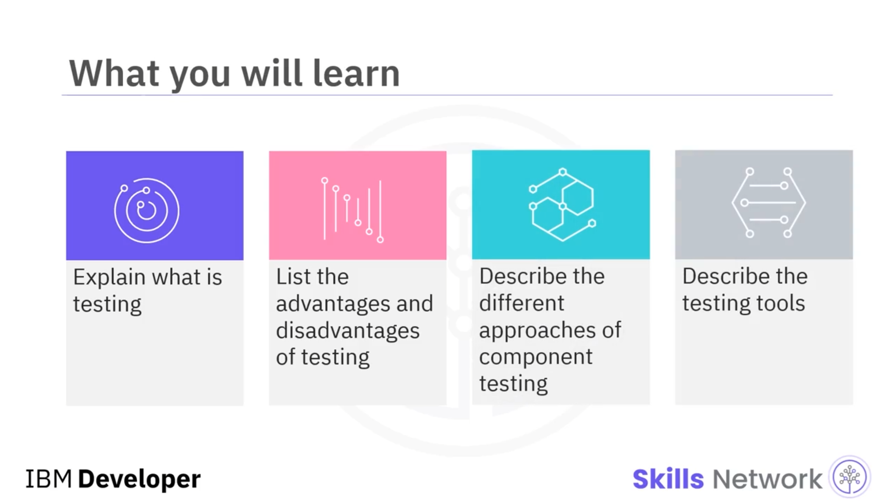
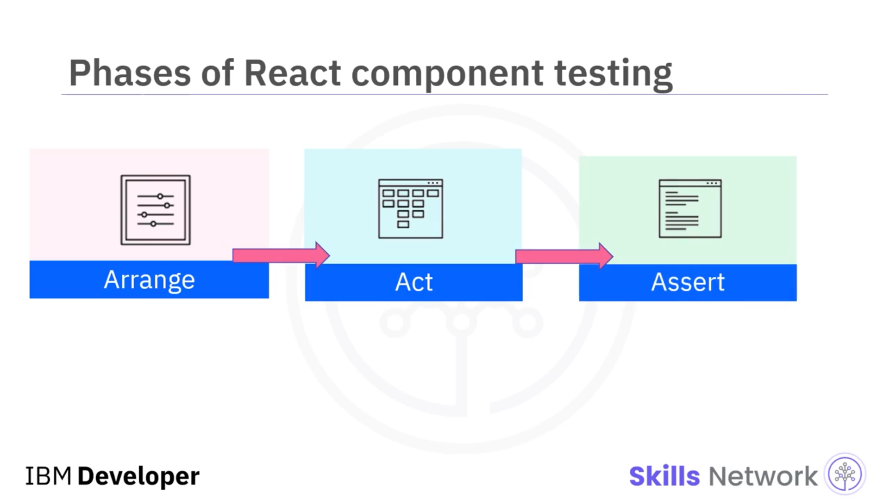
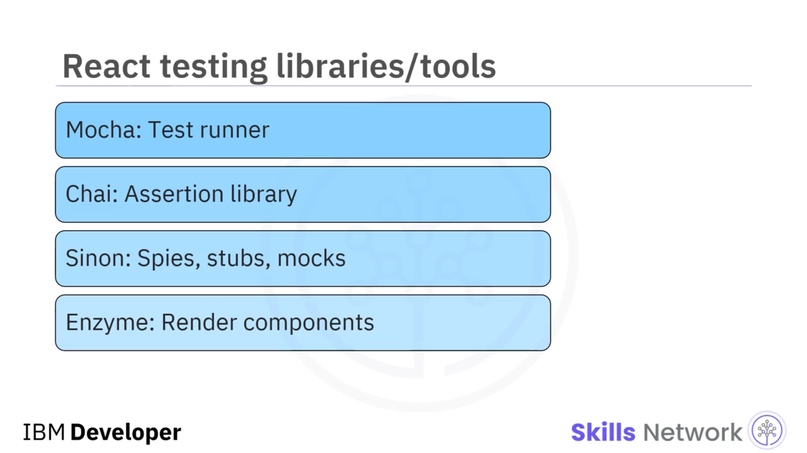
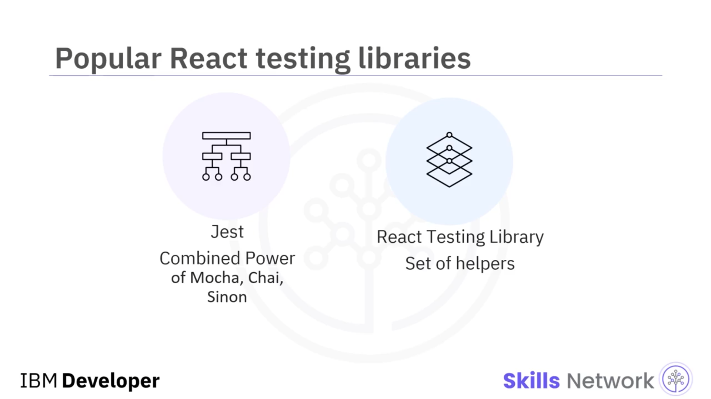
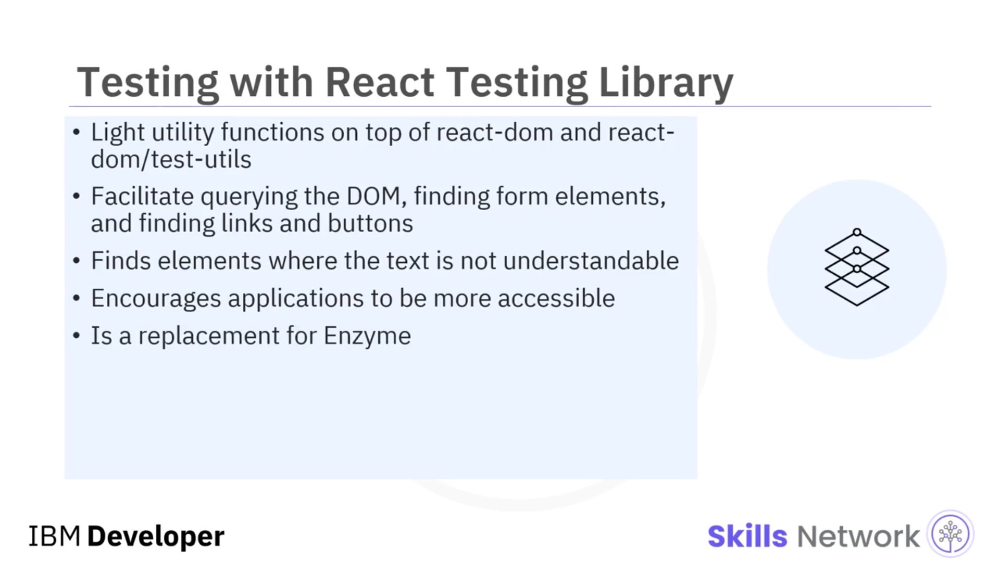
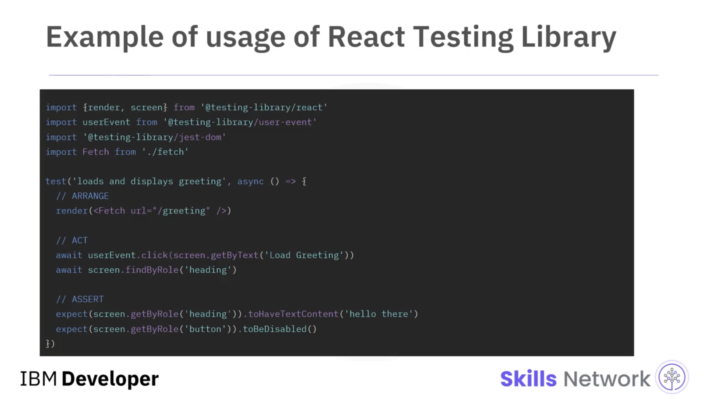
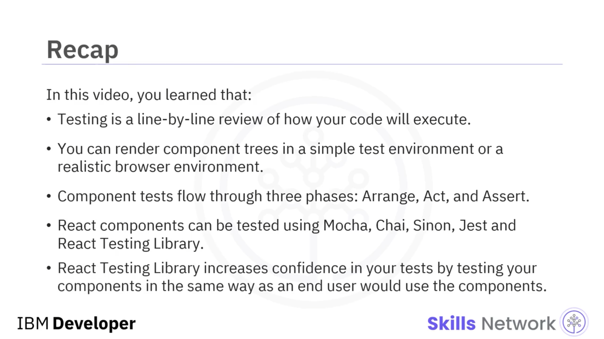

## 🧪 Testing React Components

Testing React Components bölümüne hoş geldiniz. Bu videoyu izledikten sonra şunları yapabileceksiniz:

* Test etmenin ne olduğunu açıklamak
* Test etmenin avantajlarını ve dezavantajlarını listelemek
* Bileşen testinin farklı yaklaşımlarını açıklamak
* Test araçlarını açıklamak

Test etmek, kodunuzun nasıl çalışacağını satır satır gözden geçirmektir. Test etme, ayrıca bir uygulamanın çeşitli kod parçalarından oluşan bir test paketi ( *suite of tests* ) kullanılarak, bir uygulamanın başarılı ve hatasız biçimde çalışıp çalışmadığını doğrulamak için de yapılabilir.

Test etmek önemlidir; ancak bazı avantajları ve dezavantajları vardır.

---

## ✅ Avantajlar ve ❌ Dezavantajlar

### ✅ Avantajlar

* Beklenmedik regresyonu ( *unexpected regression* ) önler.
* Geliştiricinin geçmişle ilgili endişelenmek yerine mevcut göreve odaklanmasını sağlar.
* Normalde inşa etmesi çok karmaşık olacak bir uygulamanın modüler şekilde oluşturulmasına olanak tanır.
* Manuel doğrulama ihtiyacını azaltır.

### ❌ Dezavantajlar

* Daha fazla kod yazmanız gerekir; ayrıca kodu debug etmeniz ve bakımını yapmanız gerekir.
* Kritik olmayan test hataları, sürekli entegrasyon ( *continuous integration* ) açısından uygulamanın reddedilmesine neden olabilir.

---

## 🎯 React Component Testinin Amacı

React bileşenlerinin test edilmesi, uygulamanızın son kullanıcılar için amaçlandığı şekilde çalıştığından emin olmak için yapılır. Test, geliştiriciler tarafından hazırlanan kodun hatasız çalışıp çalışmadığını kontrol etmek için doğrulama yapar.

Testler ayrıca, son kullanıcıların eylemlerini kopyalayarak ( *replicating the actions of the end users* ) uygulamanın işlevselliğini test eder.

Uygulama üzerinde yapılan güncellemelerin, uygulamanın genel çalışma biçimini etkilemediğini doğrulamak için de test yapmalısınız.

Uygulamanızı test etmek ayrıca regresyonu ( *regression* ) önler; bu, daha önce düzeltilmiş bir hatanın yeniden ortaya çıkmasıdır. Bu durum, belirli bir olay gerçekleştiğinde özelliğin amaçlandığı gibi çalışmayı durdurmasına neden olabilir.

---

## 🧭 React Component Testing Yaklaşımları

React bileşen testi için iki yaklaşım vardır:

### 🧩 1) Basit Test Ortamında Component Trees Render Edip Çıktıyı Doğrulama

Bileşen ağaçlarını basit bir test ortamında render edebilir ve çıktıyı doğrulayabilirsiniz. Bu tür  *unit testing* , uygulamanın izole bir bölümünü kapsar. *Shallow rendering* ile birlikte yapılır.

Örneğin, bir bileşen varsayılan özelliklerle ( *default properties* ) render edilebilir.

### 🌐 2) Gerçekçi Tarayıcı Ortamında Tam Uygulamayı Çalıştırma (End-to-End)

İkinci yaklaşım, gerçekçi bir tarayıcı ortamında tam bir uygulamanın çalıştırılmasını gerektirir; buna **“end-to-end” testing** denir.

Bu, birden fazla birimi birleştiren ve testleri tek bir büyük testte entegre eden çok adımlı ( *multi-step* ) bir testtir.

Testler simüle edilmiş bir tarayıcıda yapılır. Test çalışırken UI olabilir veya olmayabilir.

Örneğin, tüm bir kimlik doğrulama akışını ( *authentication flow* ) test etmek.

---

## 🧱 Component Testlerinin Üç Aşaması

Component testleri üç aşamada ilerler:

### 🧰 Arrange

Bu aşamada, bileşen özellikleri ( *component properties* ) hazırlanır.

### 🎬 Act

Bu aşamada, bileşenin DOM’u kullanıcı arayüzüne render etmesi gerekir. Daha sonra, programatik olarak tetiklenebilecek kullanıcı eylemlerini veya event’lerini kaydeder.

### ✅ Assert

Son olarak, beklentiler ayarlanır ve bileşen markup’ı üzerindeki belirli yan etkiler ( *side effects* ) doğrulanır.

Bu unit testing biçimi **Arrange-Act-Assert** olarak bilinir.

---

## ⚖️ Test Aracı Seçerken Dikkate Alınacak Noktalar

Test araçlarını seçerken şu noktaları dikkate almak faydalıdır:

### 🚀 Speed vs. Environment

Bazı araçlar, değişiklik yapma ile sonuç görme arasında çok hızlı bir geri bildirim döngüsü sağlar; ancak tarayıcı davranışını tam olarak modellemez.

Diğer araçlar gerçek tarayıcı ortamı kullanabilir; ancak iterasyon hızını düşürür ve sürekli entegrasyon sunucusunda güvenilmez olabilir.

### 🧩 Ne Mock’lanmalı?

Bileşenlerle birlikte, “unit” ve “integration” test arasındaki fark belirsiz olabilir.

Bir form test ediyorsanız, formun butonlarını da test etmeli mi? Yoksa bir button component’in kendi test paketi mi olmalı? Bir button’u refactor etmek, form testini kırmalı mı?

---

## 🧰 React Component Test Araçları

React bileşenleri için çeşitli test kütüphaneleri vardır.

Node.js arka planına sahip react ekosisteminde, JavaScript uygulamalarını test etmek için  **Mocha** , **Chai** ve **Sinon** bulunur.

* **Mocha** , test runner olarak kullanılır.
* **Chai** , assertion library olabilir.
* **Sinon** , opsiyonel olarak spies, stubs ve mocks gibi nesnelerle JavaScript mantığını test etmek için kullanılabilir.

Bu nesneler, farklı test türleri için kullanılabilecek kod parçalarıdır.

Bu üç test kütüphanesinin tamamı React uygulamalarını test etmek için kullanılabilir. Ancak React bileşenlerini render etmek için karışıma **Enzyme** adlı başka bir kütüphane de eklenir.

---

## 🧪 Jest ve React Testing Library

React bileşenlerini şu araçlarla da test edebilirsiniz:

* **Jest**
* **React Testing Library**

 **Jest** , Facebook tarafından React bileşenlerini test etmek için yayınlandı ve Mocha, Chai, Sinon ve daha fazlasının birleşik gücünü sunar.

 **React Testing Library** , React bileşenlerini uygulama detaylarına ( *implementation details* ) bağlı kalmadan test etmenizi sağlayan yardımcılar ( *helpers* ) setidir.

Jest:

* Bir JavaScript test runner’dır.
* Bir assertion library’dir.
* Spies, stubs ve mocks da sunar.

Jest, React bileşenlerinizi daha güçlü biçimde test etmek için **Enzyme** veya **React Testing Library** ile birleştirilebilir.

Test için `jsdom` üzerinden DOM’a erişmenizi sağlar.

Jest; modülleri ve timer’ları mock’lama gibi güçlü özelliklerle birlikte yüksek iterasyon hızı sunar; böylece kodun nasıl çalıştığı üzerinde daha fazla kontrol sağlayabilirsiniz.

Jest, test yürütme için bir command line tool içerir.

Ayrıca neredeyse sıfır konfigürasyonla mock fonksiyonlar oluşturmanıza olanak tanır ve assertion’ları okumayı kolaylaştırır.

Ek olarak, bileşen render sonucunu kontrol edip doğrulamanıza yardımcı olan **“snapshot testing”** sunar.

Jest, `npx-create-react-app` kullanıldığında, React Testing Library ile birlikte React’e dependency olarak yüklenir.

React Testing Library:

* `react-dom` ve `react-dom/test-utils` üzerine hafif yardımcı fonksiyonlar sağlar ve daha iyi test pratiklerini teşvik edecek şekilde tasarlanmıştır.
* DOM’u sorgulamayı ( *querying the DOM* ) kolaylaştırır.
* Form elemanlarını label’larıyla bulmayı sağlar.
* Kullanıcının yaptığı gibi, link ve butonları metinlerinden bulmayı sağlar.
* Metin içeriği ve label’ın anlaşılır olmadığı durumlarda eleman bulmak için önerilen bir yöntem sunar.

Bu kütüphane, uygulamalarınızın daha erişilebilir olmasını teşvik eder ve bileşenlerinizi son kullanıcının kullanacağı şekilde test etmenizi sağlar.

Bu kütüphane, Enzyme’ın yerine geçen bir çözümdür.

---

## 🧾 React Testing Library ile Test Etme Örneği

Bu örnek, React Testing Library kullanarak bileşenlerin nasıl test edileceğini gösterir.

Yukarıdaki test kodu, bileşeni sanal olarak render etmek için React Testing Library’nin `render` metodunu kullanır. Render edilen HTML’e `screen` nesnesi üzerinden erişebilirsiniz.

React Testing Library’nin birincil amacı, bileşenlerinizi bir son kullanıcının bileşenleri kullanacağı şekilde test ederek testlerinize olan güveni artırmaktır.

Kullanıcılar, bir uygulamanın backend’inden haberdar değildir ve yalnızca çıktının farkındadır. Bu kütüphane, testlerinizi bileşen çıktısına dayalı olarak yazmanızı sağlar.

Testlerinizi React Testing Library ile yeniden yazmak değerlidir; çünkü sizi yavaşlatan testleri, daha fazla güven veren ve uzun vadede üretkenliğinizi artıran testlerle değiştiriyor olursunuz.

---

## ✅ Video Özeti

Bu videoda şunları öğrendiniz:

* Test etme, kodunuzun nasıl çalışacağını satır satır gözden geçirmektir.
* Bileşen ağaçlarını basit bir test ortamında veya gerçekçi bir tarayıcı ortamında render edebilirsiniz.
* Component testleri üç aşamada ilerler:  **Arrange** , **Act** ve  **Assert** .
* React bileşenleri  **Mocha** ,  **Chai** ,  **Sinon** , **Jest** ve **React Testing Library** ile test edilebilir.
* React Testing Library, bileşenlerinizi bir son kullanıcının kullanacağı şekilde test ederek testlerinize olan güveni artırır.

