## 🧺 Working with Arrays in React Components

Working with the Arrays in React Components bölümüne hoş geldiniz. Bu videoyu izledikten sonra şunları yapabileceksiniz:

* Dizileri ( *arrays* ) ve React bileşenlerindeki önemini tanımlamak
* React’te dizilerin nasıl bildirileceğini ( *declare* ) açıklamak
* React bileşenlerinde dizilerin nasıl dolaşılacağını ( *traverse* ) açıklamak
* React’te dizilerle nasıl çalışılacağını açıklamak

Bir dizi ( *array* ), JavaScript’te birden fazla değeri tek bir değişkende saklamak için kullanılan bir veri yapısıdır. Elemanların virgülle ayrıldığı bir listeyi köşeli parantezler içine alarak tanımlanır.

Diziler, sayılar, string’ler, nesneler ve hatta diğer diziler dahil olmak üzere herhangi bir veri tipinde elemanlar içerebilir.

React’te diziler genellikle veri listelerini yönetmek için kullanılır ve dinamik ve etkileşimli kullanıcı arayüzleri oluşturmak için gereklidir. React bileşenleri sıklıkla eleman veya veri dizilerini render eder ve React’te dizileri bildirmek ve bileşenler içinde elemanlarını dolaşmak için çeşitli yollar vardır.

---

## 🧾 React’te Array Tanımlama Yolları

Bir diziyi, gösterildiği gibi *array literal* notasyonu ile tanımlayabilirsiniz.

Diziler, gösterildiği gibi **useState** hook’u kullanılarak bileşen state’i içinde saklanabilir.

Diziler, gösterildiği gibi uygulama mantığına veya alınan verilere göre dinamik biçimde oluşturulabilir.

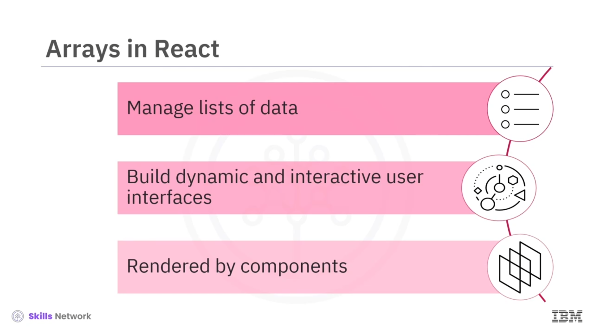

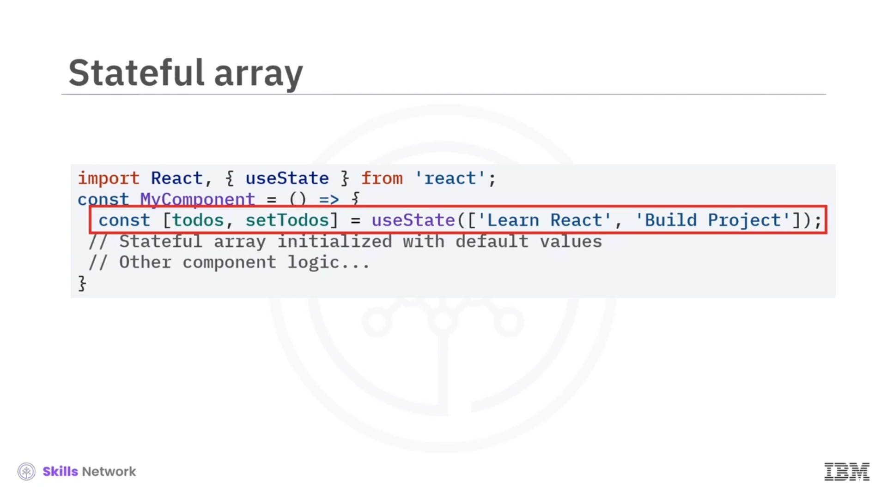

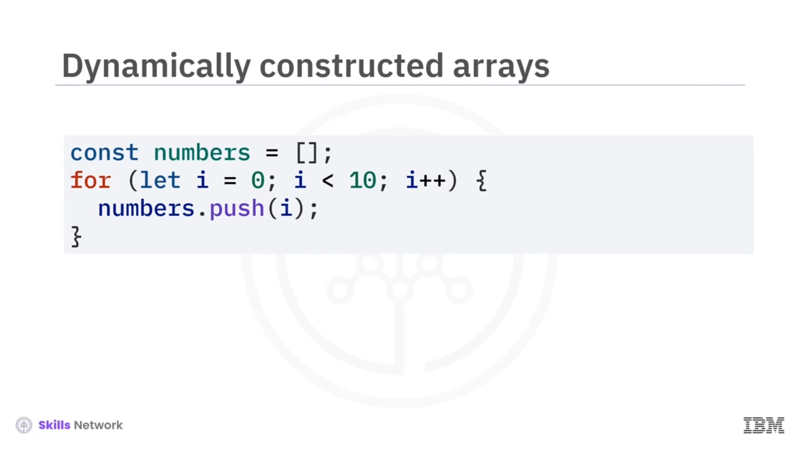

---

## 🔁 React Bileşenlerinde Dizileri Dolaşma

React bileşenlerinde dizileri dolaşmak ( *traversing* ), özellikle dinamik içerik render ederken veya veri listelerini yönetirken yaygın bir görevdir.

`map`, `forEach`, `for...of` döngüleri veya indeks tabanlı dolaşım gibi yöntemleri kullanarak, React bileşenlerinde dizilerle verimli şekilde çalışabilir ve dinamik ve etkileşimli kullanıcı arayüzleri oluşturabilirsiniz.

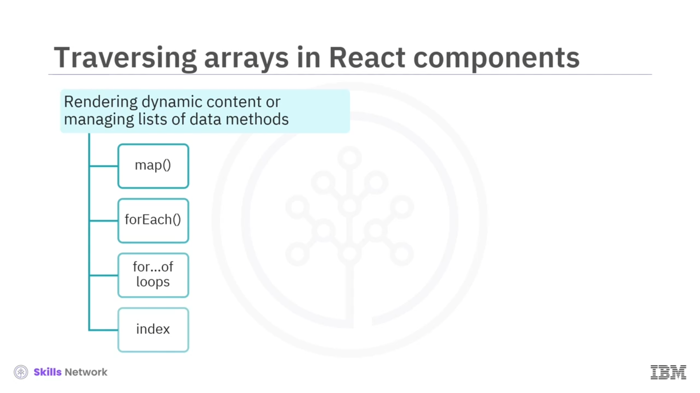

* `map` metodu, bir dizinin her elemanı üzerinde gezinmek ve gösterildiği gibi React elemanlarından oluşan yeni bir dizi döndürmek için yaygın biçimde kullanılır.

* `forEach` metodu, bir dizinin her elemanı üzerinde gezinir ve gösterildiği gibi bir callback fonksiyon çalıştırır.

* `for...of` döngüsünü, gösterildiği gibi bir dizinin elemanları üzerinde gezinmek için kullanabilirsiniz.

* Bir dizinin elemanlarına, gösterildiği gibi indekslerini kullanarak erişebilirsiniz.

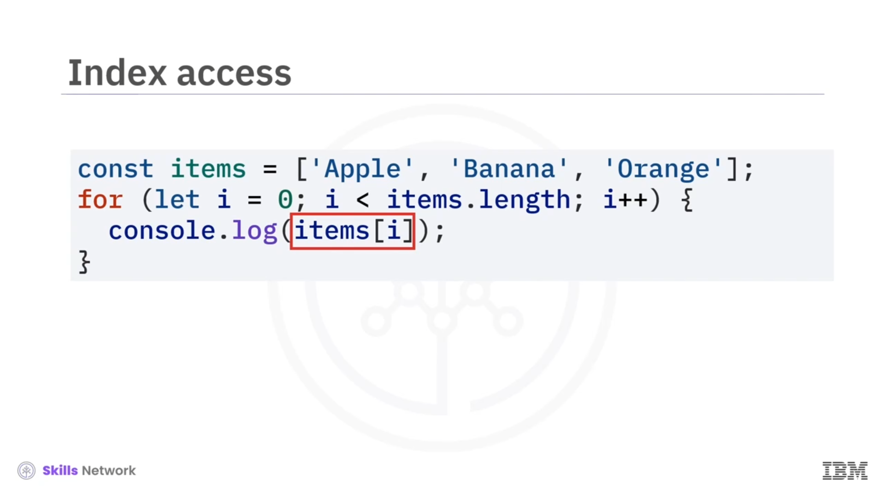

Bir dizi üzerinde `map` ile dolaşıp her öğe için bir JSX elemanı döndürerek bir öğe listesi render edebilirsiniz.

---

## 🌦️ Örnek: Array Render Etme

### Array declaration

Bileşen fonksiyonunun içinde, `items` adlı bir dizi tanımlanır ve dört string elemanla başlatılır:  **autumn** ,  **spring** , **summer** ve  **winter** . Bunlar mevsimleri temsil eder.

### JSX rendering

Bileşen, çıktının yapısını temsil eden JSX markup döndürür. İçinde bir `div` öğesi, bir `h1` başlığı, mevsim adları ve sırasız bir liste (`ul`) öğesi bulunur.

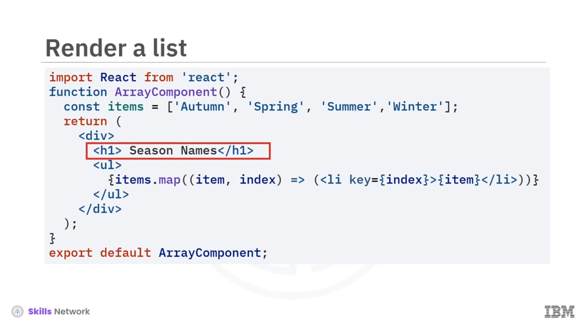

### Mapping array elements

`ul` öğesinin içinde, `map` metodu `items` dizisi üzerinde dolaşmak için kullanılır.

Dizinin her elemanı için dinamik olarak bir `"li"` liste öğesi üretilir. React’in her liste öğesini verimli biçimde tanımlamasına yardımcı olmak için `key` özelliği, `map` fonksiyonunun `index` parametresine atanır.

Çıktıda, **Season Names** başlığı altında dizideki öğeler  **autumn** ,  **spring** , **summer** ve **winter** olarak gösterilir.

---

## ➕➖ State ile Array’e Eleman Ekleme ve Silme

State ve React’in set state metodu kullanılarak bir diziden eleman ekleyebilir veya çıkarabilirsiniz; bu, aşağıdaki kodda gösterildiği gibidir.

### State management

Bileşen, state’i yönetmek için React’ten **useState** hook’unu kullanır. İki state değişkeni tanımlanır:

* **Items** : Mevsimleri temsil eden string dizisini tutar; başlangıç değeri  **autumn** ,  **spring** ,  **summer** ,  **winter** .
* **Input value** : Diziye yeni öğe eklemek için kullanılan input alanının değerini temsil eder; başlangıçta boş string.

### Adding items

**Add** düğmesine tıklandığında `addItem` fonksiyonu çağrılır. `setItems` fonksiyonunu kullanarak `input value`’nun mevcut değerini `items` dizisine ekler ve ardından `inputValue`’yu boş string’e sıfırlar.

### Removing items

Her liste öğesinin yanındaki **Remove** düğmesine tıklandığında `removeItem` fonksiyonu tetiklenir. `items` dizisi kopyalanarak `newItems` adlı yeni bir dizi oluşturulur ve `splice` metodu kullanılarak belirtilen indeksteki öğe kaldırılır. Ardından `setItems` ile güncellenmiş dizi yeni state olarak ayarlanır.

### Rendering JSX

Bileşen, çıktının yapısını temsil eden JSX markup döndürür. Bir `h1` başlığı ( **Seasons** ), bir sırasız liste (`ul`) ve `map` kullanılarak oluşturulan dinamik `li` liste öğelerini içerir.

Her `li` öğesi, `items` dizisinden bir mevsimi gösterir ve bir **Remove** düğmesi içerir. Düğmeye tıklandığında ilgili indeks için `removeItem` fonksiyonu çalışır.

Listenin altında bir input alanı, kullanıcıların diziye yeni öğe eklemesine izin verir. `inputValue` state değişkeni input alanının değerini kontrol eder. **Add** düğmesine tıklamak, input alanının mevcut değerini `items` dizisine ekler ve bir sonraki giriş için input alanını temizler.

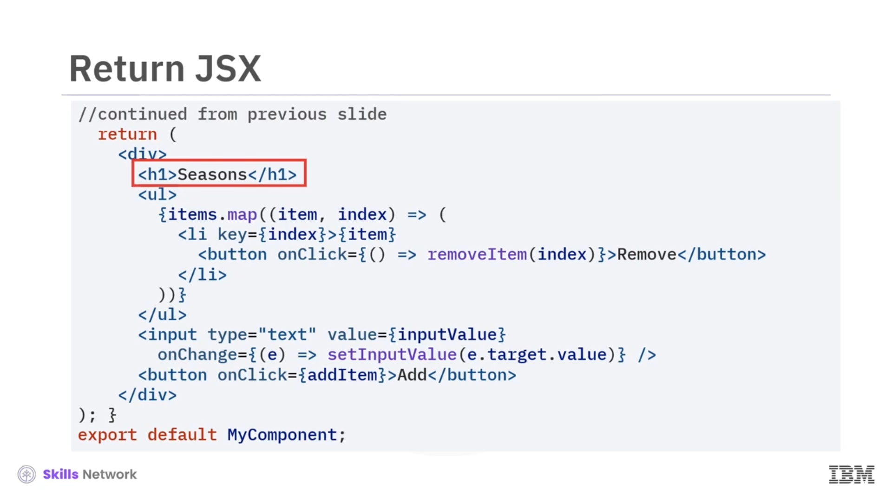

Çıktı, her dizi öğesinin karşısında bir **Remove** düğmesi ve en altta bir **Add** düğmesi ile gösterildiği gibi görüntülenir.

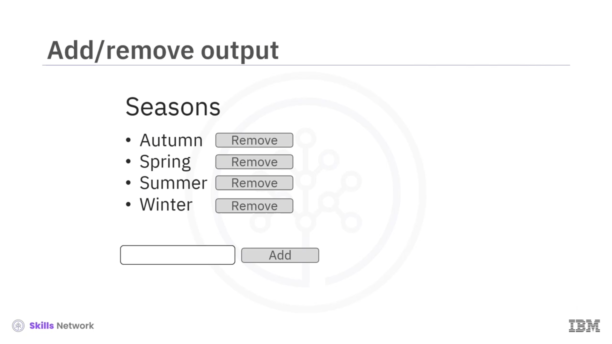

Input alanına veri girildikten sonra çıktı gösterildiği gibi olur. Çıktı, **monsoon** öğesinin dizi listesine eklendiğini gösterir.

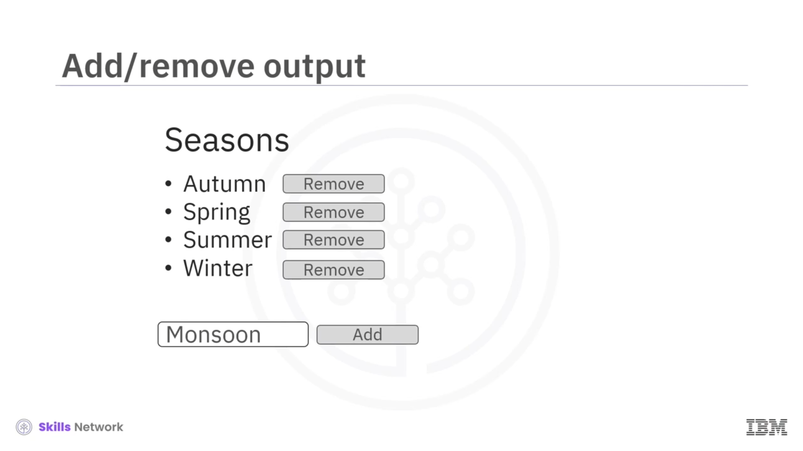

Silmek isterseniz, bir öğenin karşısındaki **Remove** düğmesine tıklayın; öğe silinecektir.

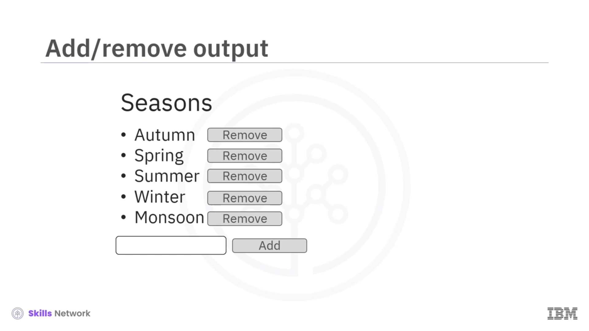

Örneğin görselde gösterildiği gibi **Autumn** için **Remove** düğmesine tıklarsanız, dizi listesi gösterildiği gibi görünecektir.

---

## 🧩 Array İçeriğine Göre Koşullu Render

Bir dizinin içeriğine göre bileşenleri koşullu olarak render edebilirsiniz.

Örneğin, koddaki açıklama şöyledir:

### State management

Bileşen, state’i yönetmek için React’ten **useState** hook’unu kullanır.

Tek bir state değişkeni tanımlanır:

* **Items** : Front-end dillerini temsil eden string dizisini tutar.

### Rendering JSX

Bileşen, çıktının yapısını temsil eden JSX markup döndürür. Bir `h1` başlığı ( **Front-end languages** ) içerir.

`items` boş değilse, `map` metodu kullanılarak front-end dillerini temsil eden `li` liste öğelerini içeren bir `ul` sırasız listesini koşullu olarak render eder.

`items` boşsa, **"No Front-end language is available"** diyen bir paragraf (`p`) render edilir.

Çıktı, gösterildiği gibi görüntülenir.

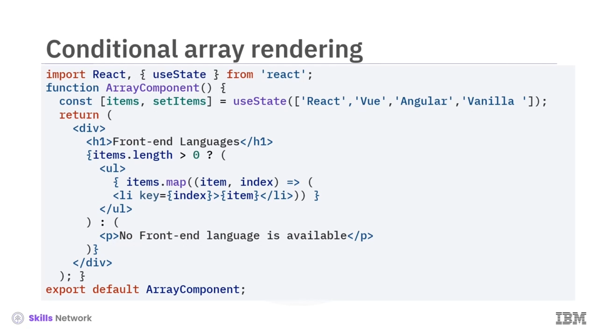

---

## ✅ Ders Özeti

Bu derste şunları öğrendiniz:

* Diziler, öğe gruplarını tek bir değişkende saklamak için sıklıkla kullanılan temel veri yapılarıdır.
* Bazı önemli dizi metotları şunlardır:
  * `map`: Her elemana bir fonksiyon uygulayarak yeni diziler oluşturmayı kolaylaştırır.
  * `forEach`: Yeni bir dizi oluşturmadan her dizi elemanı üzerinde bir fonksiyon çalıştırır.
* `push` ve `splice` metotları, eleman eklemek ve kaldırmak için kullanılabilir.
* Diziler, veriyi hızlı biçimde değiştirmek ve dolaşmak için güçlü bir veri yapısıdır.

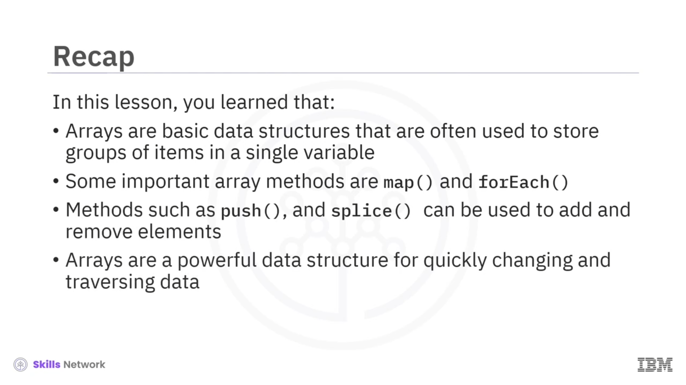
