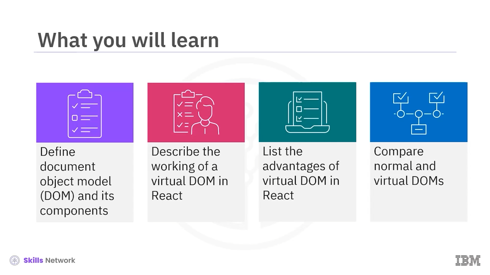
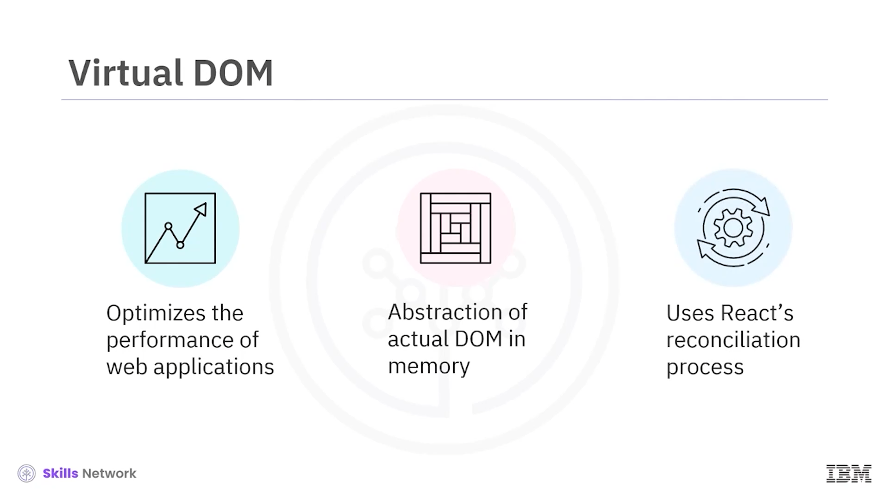
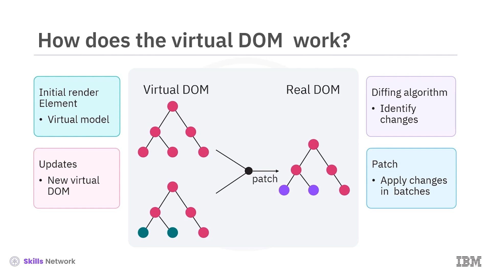
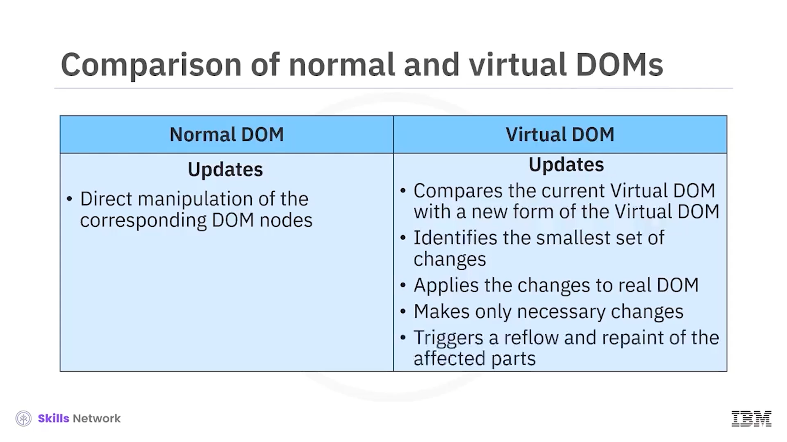

## 🧠 Virtual DOM Manipulation in React

React’te Virtual DOM’un nasıl çalıştığına dair bir videoya hoş geldiniz. Bu videoyu izledikten sonra şunları yapabileceksiniz:

* *Document Object Model* (DOM) ve bileşenlerini tanımlamak
* React’te Virtual DOM’un çalışma şeklini açıklamak
* React’te Virtual DOM’un avantajlarını listelemek
* Normal DOM ile Virtual DOM’u karşılaştırmak

*Document Object Model* (DOM), web sayfaları ve belgeler için bir arayüzdür ve bir HTML yapısını ağaç benzeri bir yapı olarak temsil etmek için kullanılır. Her düğüm ( *node* ), belgenin elementler, nitelikler ( *attributes* ) ve metin ( *text* ) gibi bir parçasını temsil eder.

DOM, programların web belgesinin içeriğine, yapısına ve stiline dinamik olarak erişmesine ve bunları manipüle etmesine olanak tanır.

DOM’un bileşenleri;  **nodes** ,  **elements** , **attributes** ve  **events** ’tir. DOM, belgeyi düğümlerden oluşan bir ağaç yapısı olarak temsil eder. Element, text, attribute gibi farklı node türleri vardır.

Elementler, HTML belgelerinin yapı taşlarıdır. Belgenin içeriğini temsil ederler.

Attributes, elementler hakkında ek bilgi sağlar. Özellikleri, stilleri veya davranışı belirtebilir.

DOM events, JavaScript kodunun belgede kullanıcı etkileşimlerine veya diğer aksiyonlara yanıt vermesine olanak tanır.

---

## 🪞 Virtual DOM Nedir?

Virtual DOM, React gibi framework’lerde web uygulamalarının performansını optimize etmek için kullanılan bir kavramdır. Gerçek DOM’un bellekte ( *in memory* ) uygulanmış bir soyutlamasıdır ve React’in *reconciliation* süreci tarafından gerçek DOM ile senkron tutulur.

---

## ⚙️ Virtual DOM Nasıl Çalışır?

Bir React bileşeni ilk kez render edildiğinde, DOM’un sanal ( *virtual* ) bir modeli oluşturulur.

Bir bileşenin state’i veya props’larında değişiklik yapıldığında, React yeni bir Virtual DOM temsili oluşturur.

React, yeni Virtual DOM’u önceki Virtual DOM ile karşılaştırmak ve gerçek DOM’u güncellemek için gereken en küçük değişiklikleri belirlemek üzere bir *diffing algorithm* kullanır.

React, değişiklikleri verimli biçimde gerçek DOM’a bir *patch* olarak uygulamak için gruplama ( *batching* ) kullanır; bu, gereksiz yeniden render’ları ve DOM operasyonlarını minimize etmeye yardımcı olur.

---

## 🚀 Virtual DOM’un Önemi

Virtual DOM, React’te önemlidir. Şunları sunar: hız artışı, basit geliştirme, çapraz platform uyumluluğu, state management ve debugging ve testing.

Virtual DOM, DOM değişikliklerinin sıklığını azaltarak web uygulaması hızını artırır.

Geliştiriciler, DOM manipülasyonunun ayrıntılarıyla ilgilenmeden deklaratif kod geliştirmeye odaklanabilir.

Çapraz platform uyumluluğu sayesinde, React’in Virtual DOM soyutlaması; web tarayıcıları ve mobil cihazlar gibi çeşitli platformlarda verimli bileşen render edilmesini sağlar.

React state management, Virtual DOM ile birlikte, uygulama state’indeki değişikliklere yanıt olarak etkili güncellemeleri ve yeniden render etmeyi kolaylaştırır.

Virtual DOM, geliştirme sırasında DOM’un sanal sürümünü inceleme imkânı vererek React uygulamalarında debugging ve testing’i basitleştirir.

---

## ✅ React’te Virtual DOM’un Avantajları

React’te Virtual DOM’un avantajları şunlardır:  **efficient updates** ,  **component reusability** , **declarative syntax ile kolay güncelleme** ve  **improved server side rendering** .

React’in Virtual DOM’u, gerçek DOM’da yalnızca gerekli değişikliklerin yapılmasını sağlar; bu da daha iyi performans ve daha hızlı render anlamına gelir.

Virtual DOM, geliştiricilerin compose edilebilen ve verimli biçimde güncellenebilen yeniden kullanılabilir bileşenler oluşturmasına olanak tanır.

React’in deklaratif sözdizimi, geliştiricilerin hedeflenen UI durumunu tanımlamasını sağlar ve React Virtual DOM’u güncelleyerek bileşenleri buna göre render eder.

Virtual DOM, React’te server side rendering’i mümkün kılar; bu da ilk sayfa yükleme performansını ve web uygulaması SEO’sunu iyileştirir.

---

## 🆚 Normal DOM ve Virtual DOM Karşılaştırması

Normal DOM ile Virtual DOM, yükleme sürecinde farklılık gösterir.

Normal DOM’da, bir web sayfası tarayıcıda yüklendiğinde tarayıcı HTML içeriğini analiz eder ve HTML kodundan DOM ağacını oluşturur. Süreç; HTML markup’ını analiz etmeyi, DOM node’larını üretmeyi ve içeriği ekranda göstermeyi içerir.

Büyük DOM ağaçlarına sahip karmaşık web sayfalarını render etmek maliyetli olabilir.

Buna karşılık Virtual DOM, bellekte yaşayan ve tarayıcının render engine’i ile bağlantılı olmayan bir soyutlamadır; yani değişiklikleri doğrudan gerçek DOM’a güncellemez.

Bir uygulama yüklendiğinde React, bellekte Virtual DOM adı verilen bir Virtual DOM tree temsili oluşturur. Bu Virtual DOM, React bileşenlerinin başlangıç state’i ve props’larına göre inşa edilir.

Normal DOM’da, DOM’da güncellemeler yapıldığında (örneğin bir elementin içeriğini değiştirmek veya niteliklerini değiştirmek), tarayıcı ilgili DOM node’larını doğrudan manipüle eder.

Buna karşılık Virtual DOM’da, React uygulamasında değişiklikler yapıldığında React, mevcut Virtual DOM ile güncellenmiş state’i gösteren yeni bir formu karşılaştırır. Ardından, DOM’un yeni durumu temsil etmesi için yapılması gereken en küçük değişiklikleri belirler.

Bu değişiklikler tek seferde yapılır ve sonra gerçek DOM’a uygulanır. Böylece mümkün olan en az geçiş ( *transition* ) ve güncelleme yapılır.

React’te *reconciliation* süreci, DOM’a yalnızca gerekli değişikliklerin uygulanmasını sağlar. Bu da daha hızlı ve daha verimli olmasını sağlar.

Her güncelleme, belgenin etkilenen kısımlarında bir *reflow* ve *repaint* tetikler; bu, özellikle büyük uygulamalarda performansı etkileyebilir.

---

## 🧩 Örnek Senaryo: Sadece Gerekli Bileşenlerin Güncellenmesi

İki bileşenli basit bir React örneği oluşturalım: bir parent component  **app.jsx** , birinci child component ve ikinci child component.

Birinci child component bir öğe listesini render eder ve parent component, tüm listeyi yeniden render etmeden yalnızca bir öğeyi günceller. Ayrıca ikinci child component’in tekrar render edilmemesini de sağlar.

Bu örnekte, app component bir öğe listesi state’ini yönetir.

Birinci child component, array item’lardan oluşan bir listeye ve bu listenin ilk elemanını güncellemek için bir butona sahiptir.

İkinci child component yalnızca o bileşene ilişkin bilgiyi gösterir.

Yukarıdaki kodun çıktısı gösterildiği gibidir.

Console log’larını incelerseniz şu davranışı fark edersiniz:

İlk yüklemede tüm bileşenler render edilir.

Öğeyi güncellemeyi seçtiğinizde, yalnızca birinci child component yeniden render edilir. Ne app component ne de ikinci child component değişir.

React’in Virtual DOM’u, güncellenmiş app’i önceki Virtual DOM ile karşılaştırır ve yalnızca birinci child component’in state’inin değiştiğini belirler. Bu nedenle, tüm listeyi yeniden render etmeden yalnızca DOM’un ilgili kısmını, yani child component’i günceller.

Bu örnek, React’in Virtual DOM’unun yalnızca DOM’un gerekli kısımlarını güncelleyerek uygulama performansını iyileştirdiğini gösterir; özellikle yalnızca belirli bileşenlerin veya elementlerin güncellenmesi gereken senaryolarda.

---

## ✅ Video Özeti

Bu videoda şunları öğrendiniz:

* DOM, programların web belgesinin içeriğine, yapısına ve stiline dinamik olarak erişmesine ve bunları manipüle etmesine olanak tanır.
* Virtual DOM, bellekte uygulanmış gerçek DOM’un bir soyutlamasıdır ve React’in *reconciliation* süreci ile gerçek DOM ile senkron tutulur.
* React’in Virtual DOM’u, yalnızca DOM’un gerekli kısımlarını güncelleyerek uygulama performansını iyileştirir; özellikle yalnızca belirli bileşenlerin veya elementlerin güncellenmesi gereken senaryolarda.

