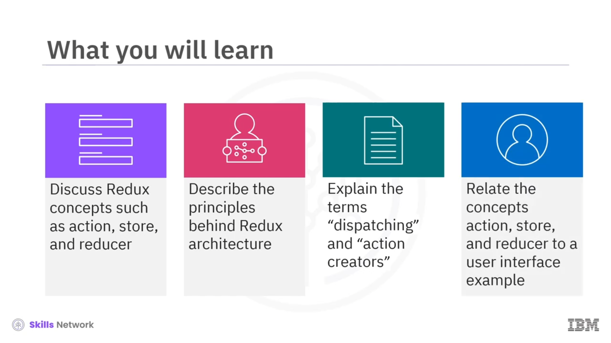
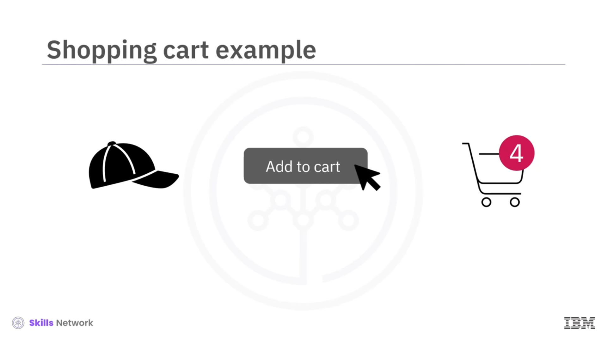
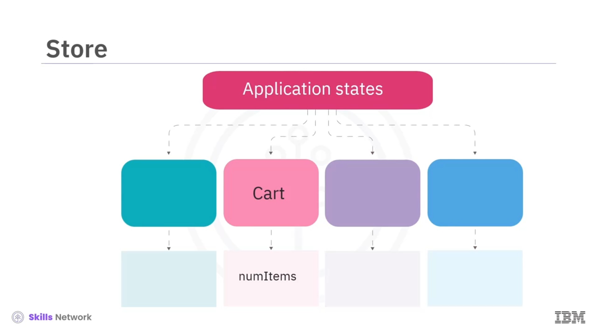
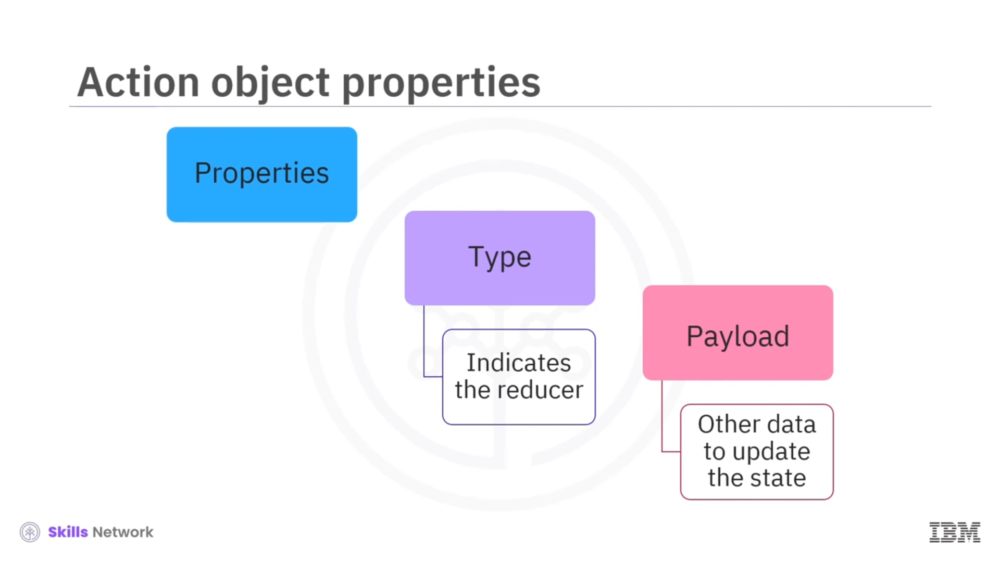
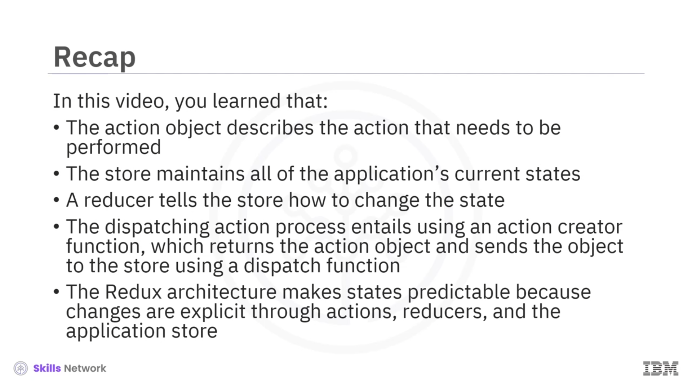

## 🧠 Essential Concepts of Redux

*Redux’un temel kavramlarına hoş geldiniz.* Bu videoyu izledikten sonra;  *action* , *store* ve *reducer* gibi Redux kavramlarını tartışabileceksiniz. *Redux mimarisinin* arkasındaki prensipleri açıklayabileceksiniz. *dispatching* ve *action creators* terimlerini açıklayabileceksiniz.  *action* , *store* ve *reducer* kavramlarını bir kullanıcı arayüzü örneğiyle ilişkilendirebileceksiniz.

## 🏢 Redux ve Merkezi Durum Yönetimi

 *Redux* , uygulamanız için merkezi bir durum yönetim sistemi sunar. *Redux* kullandığınızda, *bileşen durumlarını* yönetmeniz gerekmez.  *Redux* , durumları tek tek bileşenler yerine *uygulama düzeyinde* yönetir.

Bu yaklaşımı kullanırken, bileşen özelliklerini ( *properties/props* ) *immutable* olarak ele almalısınız. Var olan durumları değiştirmek yerine yeni durum nesneleri oluşturursunuz.  *Redux* , bileşen özelliklerini güncellerken  *actions* , *stores* ve *reducers* kullanır. Şimdi her birini kısaca konuşalım; ardından daha sonra daha detaylı ele alacağız.

## 🗄️ Store

 *Store* , uygulamanın mevcut tüm durumlarını içerir.

## 🧾 Action

Bir durum güncellemesine ihtiyaç olduğunu belirtmek için bir *action object* çağırırsınız, ancak *action* bu durumun *nasıl* değiştirileceğini belirtmez.

## 🧩 Reducer

*Action* içinde “nasıl” bilgisini belirtmek yerine, store’daki durumun nasıl güncelleneceğini tanımlayan bir *reducer function* yazarsınız.

## 🛒 Kullanıcı Arayüzü Örneği: E-Ticaret Sepeti

Daha fazla detaya girmeden önce bir e-ticaret uygulamasındaki sepeti düşünün. Kullanıcının bakış açısından beklenti şudur: kullanıcı “ *add to cart* ” seçeneğini seçtikten sonra sepete eklediği ürün sayısı kadar, sepetteki toplam ürün sayısı artmalıdır.

Bunun doğru şekilde çalışması için, arka planda  *actions* , *store* ve *reducers* açısından neler olduğuna bakalım.

## 🧰 Action Creator ve Dispatching

Kullanıcı “ *add to cart* ” seçeneğini seçtiğinde, bir *action creator function* başlatılır. Diyelim ki bu fonksiyonun adını **addItem** koydunuz. **addItem** fonksiyonu bir  *action creator* ’dır.

Bir *action object* oluşturur ve döndürür. Bileşeniniz bu  *action object* ’i bir *dispatch function* kullanarak  *store* ’a gönderir. Bu sürecin tamamına *dispatching an action* denir.

## 🌳 State Tree ve Uygulama Durumu

 *Store* , sepetin durumu da dahil olmak üzere tüm uygulama durumlarını içerir. Sepet verilerinin bir kısmı, sepetteki mevcut ürün sayısını içerir.

 *Store* ’un kendisi, uygulama durumlarını depolamak ve yönetmek için *state tree* adlı bir veri yapısı kullanır. Bu ağaç, özelliklerini yönetmek için yöntemler içeren bir  *JavaScript object* ’tir.

## 🧾 Action Object: type ve payload

 *Action object* , yapılması gereken eylemi tanımlar. İçinde *type* ve *payload* gibi özellikler bulunur.

 *Store* , hangi reducer’ın action’ı işlemesi gerektiğini belirlemek için action’ın *type* özelliğini kullanır. *payload* özelliği ise durumu güncellemek için gerekli diğer verileri saklar.

Sepete ürün ekleme örneğimizde, *payload* sepetin artmış değerini içerecektir.

## 🧮 Reducer’ın Çalışma Mantığı

Daha sonra *store* reducer’ı çağırır; reducer store’a durumu nasıl değiştireceğini söyler. Store action’ı aldığında uygun reducer’ı çağırır ve yeni durumu hesaplamak için hem  *action object* ’i hem de  *state object* ’i reducer fonksiyonuna aktarır.

Reducer’ın *pure function* olduğunu unutmayın; yani aynı girdiler verildiğinde her zaman aynı çıktıyı üretir, yan etkisi yoktur ve *mutating functions* içermez.

## 🧱 Redux Mimarisinin Nedenleri

Reducer kullanımı Redux mimarisinde ekstra bir adım gibi görünebilir. Ancak bu mimari, açık durum değişikliklerini garanti ederek öngörülebilir bir durum kapsayıcısı ( *predictable state container* ) sağlar.

Durum değişikliklerini takip etmeniz gerektiğinde, eylemin tanımını ve durumun nasıl değiştiğine dair detayları ayırdığı için kodu okumayı kolaylaştırır. Bu da hata ayıklamayı kolaylaştırır ve kod bakımını basitleştirmeye yardımcı olur.

## 🧾 Video Özeti

Bu videoda şunları öğrendiniz:

* *Action object* , yapılması gereken eylemi tanımlar.
* *Store* , uygulamanın mevcut tüm durumlarını korur.
* Bir  *reducer* , store’a durumu nasıl değiştireceğini söyler.
* *Dispatching an action* süreci, bir *action creator function* kullanır; bu fonksiyon  *action object* ’i döndürür ve nesneyi bir *dispatch function* kullanarak  *store* ’a gönderir.
* Redux mimarisi,  *actions* , *reducers* ve uygulama  *store* ’u üzerinden değişiklikler açıkça tanımlandığı için durumları öngörülebilir hale getirir.

