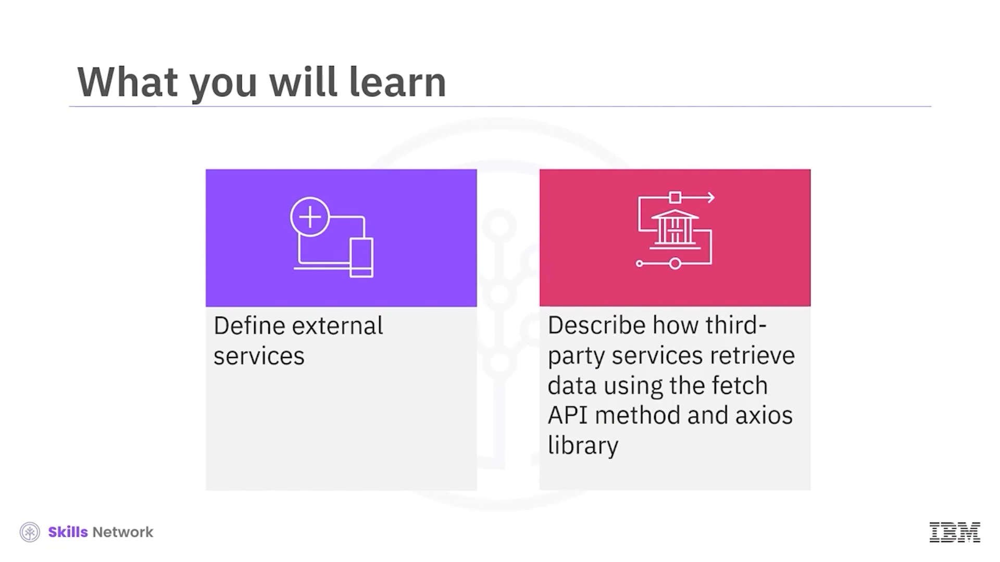
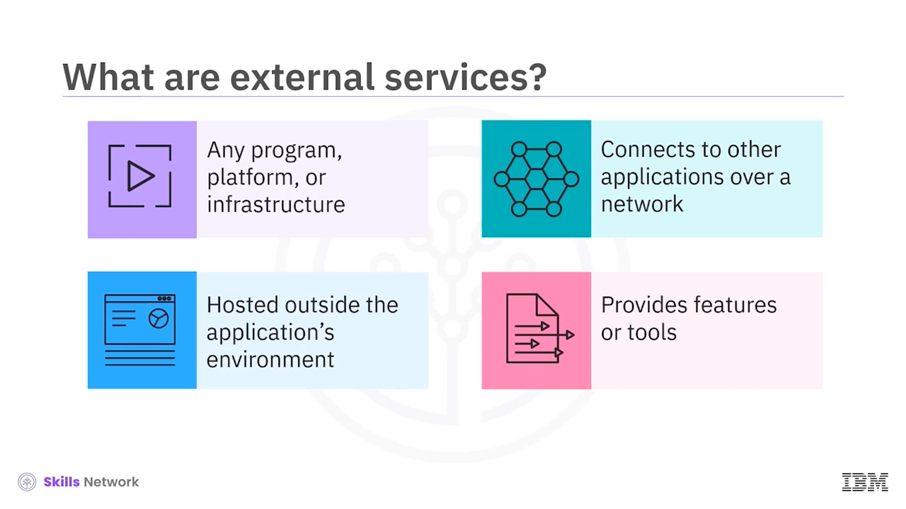
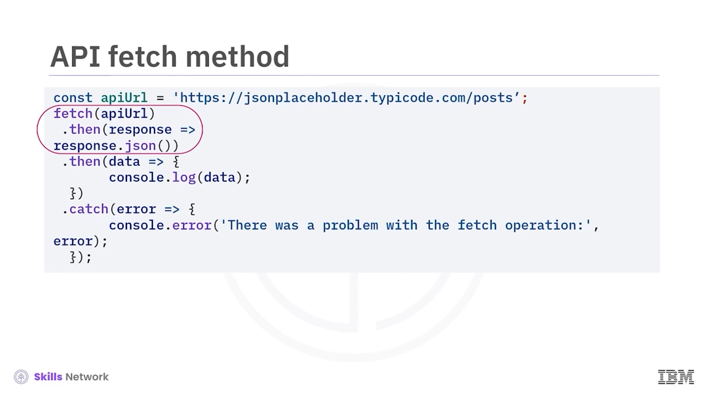
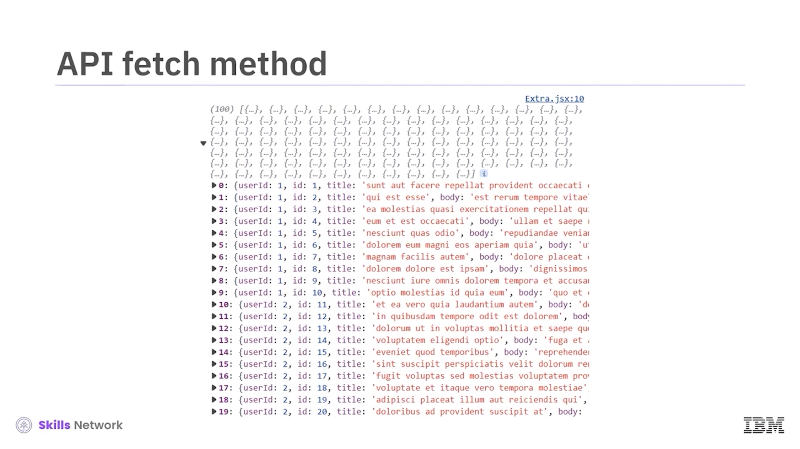

# 🌐 Connecting React to External Services

React’i harici servislere bağlama konulu videoya hoş geldiniz. Bu videoyu izledikten sonra harici servisleri tanımlayabilecek, üçüncü taraf servislerin *fetch API* yöntemi ve *axios* kütüphanesi kullanarak veriyi nasıl aldığını açıklayabileceksiniz.



Harici servisler, uygulamanızın bir ağ üzerinden bağlandığı üçüncü taraf platformlar, uygulamalar veya sistemlerdir. Bu servisler genellikle uygulamanızın ortamı dışında barındırılır ve uygulamanızın ihtiyaç duyabileceği ek özellikler, araçlar veya veriler sağlar. Uygulamanızın API’ler (application programming interfaces) aracılığıyla dış kaynaklarla veya servislerle etkileşime girmesine olanak tanırlar; böylece veri alışverişi, özellik entegrasyonu veya servis yürütme mümkün olur.

Application programming interfaces veya  **API’ler** , uygulamanızın dış servislerle konuşmasına ve veri alışverişi yapmasına imkân verir. Üçüncü taraf servisler bunları sunar.

API’ler, veri edinmenizi, operasyonlar yürütmenizi veya uygulamanıza ekstra özellikler eklemenizi sağlar. Üçüncü taraf servisler, *fetch API method* ve *axios library* gibi birden fazla API yöntemiyle alabileceğiniz veriler sağlar.



---

## 📥 Fetch API ile Veri Çekme

Bir örnek üzerinden API kullanarak veri çekmeyi anlayalım. Kodda, **apiUrl** adlı sabit bir değişken, JSON placeholder API’den gelen dış API’nin URL’ini saklamak için kullanılır. Bu API, test ve geliştirme için sahte JSON verisi oluşturmak üzere kullanılır.

Ardından, *fetch* metodu verilen URL’e ( **apiUrl** ) bir **GET** isteği gönderir. Bu, dış API’den bilgi alma sürecini başlatır.

*fetch* çağrısına *THEN* metodunu bağlarsınız. Bu metot, fetch eylemi başarılı olduğunda çalışan bir callback fonksiyonunu argüman olarak alır. Ayrıca response nesnesi için bir argüman da alır. Callback fonksiyonunu, response nesnesinin *JSON* metodunu çağırmak için kullanırsınız. Bu metot, response body’yi JSON olarak alır ve JSON verisiyle çalışmanız için size bir promise verir.


Son adımda okunan JSON verisiyle ilgilenmek için bir *THEN* metodu daha eklersiniz. Bu metot, callback fonksiyonunu argüman olarak alır. JSON parse işlemi tamamlandığında callback fonksiyon çalışır ve parse edilmiş JSON verisi argüman olarak verilir. Callback fonksiyonda bu bilgiyi console’a yazarsınız.

Fetch süreci sırasında hataları ele almak için zincire bir *CATCH* metodu eklersiniz. Bu metot argüman olarak, bir hata olduğunda çalışan bir callback fonksiyonu alır. Callback kodu içinde hatayı console’a loglarsınız; böylece hata mesajlarını debug etmeye yardımcı olacak şekilde kullanabilirsiniz.

Genel olarak, bu kod *fetch* fonksiyonunu kullanarak dış bir API’ye basit bir GET isteği yapmayı, dönen veriyi işlemeyi ve fetch işlemi sırasında oluşabilecek hataları düzgün şekilde ele almayı gösterir. API fetch method kodunun çıktısı gösterildiği gibidir.





---

## ⚡ Axios ile Veri Çekme

Axios, web tarayıcılarından HTTP istekleri için popüler bir JavaScript kütüphanesidir. Axios’un nasıl çalıştığını ve fetch API method’undan nasıl farklı olduğunu gösteren bir örneğe bakalım.


Axios’u kullanmak için önce aşağıdaki şekilde kurmanız gerekir:

```bash
npm install axios
```

Ardından aşağıdaki gibi import etmeniz gerekir:

```js
import axios from axios
```

Sonrasında, belirtilen URL’e ( **apiUrl** ) GET isteği yapmak için *axios.get* metodunu kullanırsınız. Axios, HTTP isteğinin oluşturulmasını ve yürütülmesini otomatik olarak yönetir.

Bu kodda axios, **otomatik JSON parse etme** gibi ek özellikler sunar. Bu nedenle, fetch API method’unda yaptığınız gibi ayrıca *response.json* çağırmaya gerek yoktur.

API’den gelen response’u ele almak için bir *.then* metodu zincirlersiniz. İstek başarılı olduğunda response nesnesi callback fonksiyona aktarılır. Veriye *response.data* ile erişir ve console’a loglarsınız.

Fetch süreci sırasında oluşabilecek hataları ele almak için zincire bir *catch* metodu eklersiniz.

Bu kod aynı çıktıyı üretir, ancak daha az işlem yürütülür.


---

## 🧾 Özet

Bu videoda, harici servislerin uygulamanızın bir ağ üzerinden bağlandığı üçüncü taraf platformlar, uygulamalar veya sistemler olduğunu öğrendiniz.

API’ler, veri edinmenizi, operasyonlar yürütmenizi veya uygulamanıza ekstra özellikler eklemenizi sağlar. Üçüncü taraf servisler, *fetch API method* ve *axios library* gibi birden fazla API yöntemiyle çekebileceğiniz veriler sağlar.


