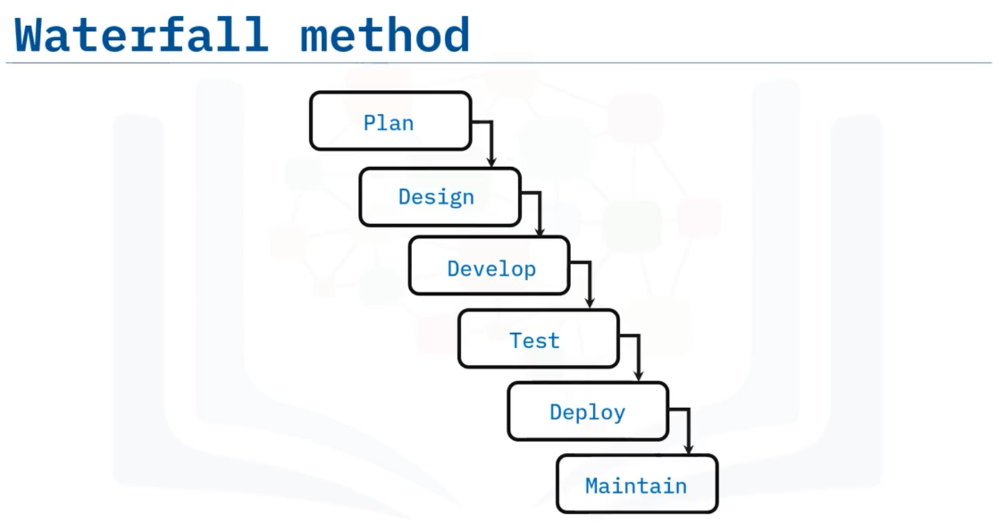
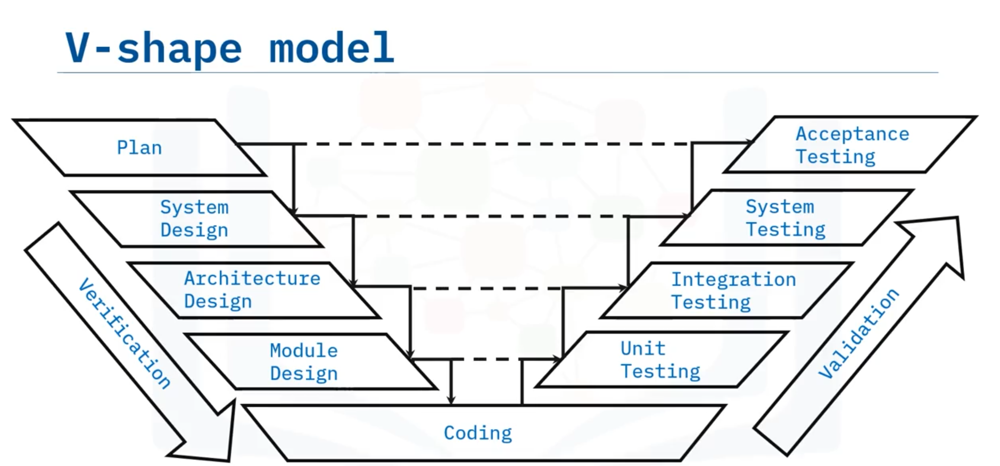
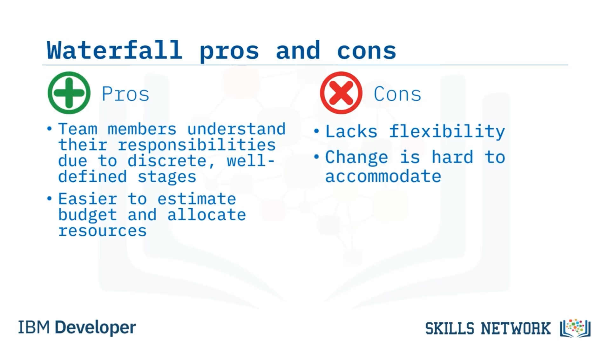
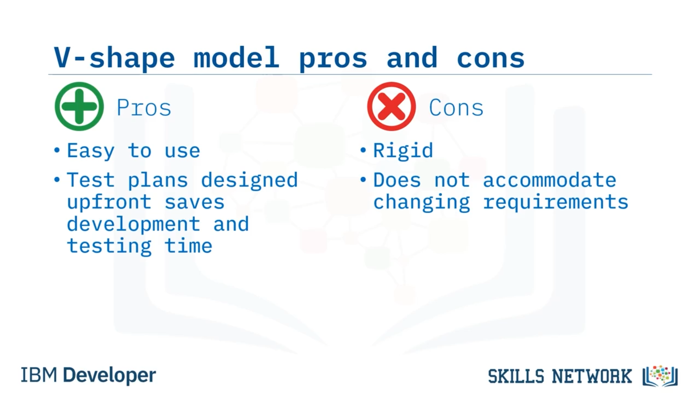
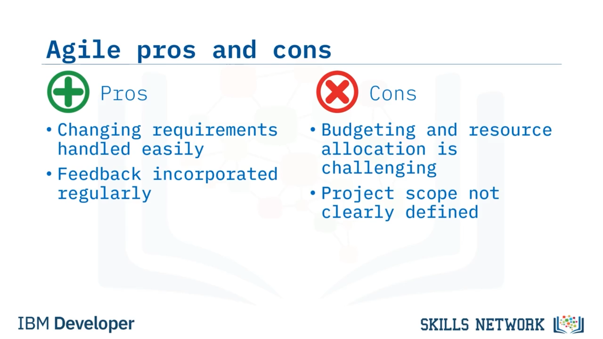

# 💻 Yazılım Geliştirme Metodolojileri

## 📌 Giriş

Yazılım Geliştirme Metodolojilerine hoş geldiniz. Bu videoyu izledikten sonra, yazılım geliştirme yaşam döngüsüne ilişkin yaygın olarak kullanılan çeşitli yaklaşımları sıralayabilecek, Waterfall, V-shape modeli ve Agile yöntemlerini açıklayabilecek ve bu üç yöntemin her birinin artı ve eksilerini karşılaştırabileceksiniz.

Yazılım geliştirmeye yaklaşmanın birçok yolu vardır. Genellikle, ekip üyeleri arasındaki iletişimi netleştirmeye ve bilginin nasıl ve ne zaman paylaşılacağını belirlemeye yardımcı olmak için yazılım geliştirmeye yönelik belirli bir metodoloji kullanılır. Bu videoda bu yaklaşımlardan üçünü ele alacağız: Waterfall, V-shape modeli ve Agile.

Başlangıçta, SDLC tasarlandığında, bugün Waterfall yöntemi olarak bilinen yaklaşım uygulanıyordu.

## 💦 Waterfall Yöntemi

Waterfall, bir aşamanın çıktısının döngünün bir sonraki aşamasının girdisi olduğu sıralı bir yazılım geliştirme yöntemidir. Bir önceki aşama tamamlandıktan sonra ancak geliştirme ve bir sonraki aşama üzerindeki çalışmalar başlar. Gereksinimlerin tanımlanması ve mimari tasarım gibi tüm planlama baştan yapılır.

Müşteri, ürünü genellikle test aşamasına gelene kadar görmez. Ürünün büyük bir sürümünün yayımlanması için aynı süreç tekrarlanır; bu da sürümler arasında yıllar gibi uzun aralıklar oluşmasına neden olur.

## ✅ V-shape Modeli

V-shape modeli, aşamalar bir V şekli oluşturduğu için bu şekilde adlandırılmıştır. V’nin sol tarafında aşağı doğru inen aşamalara “doğrulama” denir. Ardından, V’nin sağ tarafında yukarı doğru çıkan aşamalar “geçerleme” olarak adlandırılır.

V-shape modeli, aynı şekilde sıralı olması bakımından Waterfall’a benzer. Doğrulama tarafındaki her aşama, ona karşılık gelen bir geçerleme aşamasına sahiptir. V’nin her iki tarafında da gerçekleşen dört aşama vardır.

V’nin aşağıya inen tarafında planlama, sistem tasarımı, mimari tasarım ve ardından modül tasarımı yer alır. V’nin alt kısmı kodlama aşamasıdır. Ve V’nin yukarı çıkan tarafında, aşağıya inen taraftaki aşamalara karşılık gelen dört aşama bulunur: birim testi, entegrasyon testi, sistem testi ve kabul testi.

Testler soldaki doğrulama aşamaları sırasında yazılır ve sağdaki geçerleme aşamalarında yürütülür.

## 🌀 Agile Modeli

Şimdi, Agile modeli farklıdır. Sıkı bir şekilde yukarıdan aşağıya ilerleyen doğrusal bir süreç yerine, birden fazla kısa döngü boyunca işbirliğine dayalı bir yazılım geliştirme sürecine odaklanır. Agile, geliştirmeye yönelik yinelemeli bir yaklaşımdır. SDLC ile yine uyumludur, ancak her bir aşama kısadır.

Ekipler, genellikle bir ile dört hafta süren döngüler, yani sprintler halinde çalışır. Başarısızlık riskini en aza indirmek için her sprintte birim testleri yapılır. SDLC’deki “bakım” aşaması yerine, sprintin son aşaması geri bildirim aşamasıdır.

Her sprintin sonunda, paydaşların yeni işlevselliği görebileceği ve geri bildirim verebileceği “sprint demo” adı verilen bir toplantıda, çalışan koddan bir parça yayımlanır. Sprint demosundan sonra, her sprint döngüsü için tüm süreç tekrar edilir.

Birkaç sprint döngüsünden sonra, paydaşların temel özellik seti hakkında geri bildirim verebilmesi için asgari uygulanabilir ürün (MVP) geliştirilir. MVP, yazılım hakkındaki varsayımları doğrulamak için bir özellik seti içerir.

Agile geliştirmesinin, “Agile manifestosu” olarak bilinen belgede belirtilen dört temel değeri şunlardır: süreçler ve araçlardan ziyade bireyler ve etkileşimler; kapsamlı dokümantasyondan ziyade çalışan yazılım; sözleşme müzakeresinden ziyade müşteri ile iş birliği ve bir planı takip etmekten ziyade değişime yanıt vermek.

## ⚖️ Yöntemlerin Karşılaştırılması ve Artıları/Eksileri

Waterfall ve V-shape modeli gibi geleneksel SDLC yöntemleri ile Agile yazılım geliştirme yöntemi arasındaki temel fark, ilk gruptakilerin sıralı, Agile’ın ise döngüsel olmasıdır. Waterfall ve V-shape gibi geleneksel SDLC yöntemleri, müşteri geri bildirimi istenmeden önce tüm ürünün geliştirilmesine odaklanırken, Agile hızlı ve kısa gelişim ataklarına odaklanır.

Her yöntemin artıları ve eksileri vardır; yine de Agile, modern yazılım geliştirmede muhtemelen en yaygın kullanılan yöntemdir. Waterfall yönteminin artıları açısından, anlaşılması ve takip edilmesi kolaydır. Her aşama ayrık ve iyi tanımlanmıştır; bu da tüm ekip üyelerinin rollerini anlamasını kolaylaştırır. Ayrıca, planlama baştan yapıldığı için, bütçe tahmini yapmak ve kaynakları tahsis etmek yinelemeli yöntemlere göre daha kolaydır.

Öte yandan, Waterfall esneklikten yoksundur. Tüm planlama en başta yapıldığı için, bir gereksinim değiştiğinde veya gözden kaçırıldığında, bu değişikliği daha sonraki bir tarihte sürece dahil etmek zor olabilir. Kaçınılmaz olarak, öngörülemeyen karmaşıklıklar ortaya çıkar ya da üzerinde anlaşmaya varılan işlevsellik, başlangıçta tasavvur edilenden sapar.

Waterfall gibi, V-shape modeli de basit ve kullanımı kolaydır. Waterfall’dan bile daha katıdır, ancak doğrulama aşaması sırasında test planlarının tasarlanması, kodlama ve geçerleme aşamalarında önemli ölçüde zaman kazandırır. Dezavantajları da Waterfall’a benzerdir; çünkü değişen gereksinimleri kolayca karşılamaz. Bir uygulama test aşamasına geçtiğinde, geri dönüp işlevselliği değiştirmek son derece zordur.

Agile geliştirme ise farklıdır; ürün geliştirme boyunca sürekli araştırma, planlama ve testlere dayanır. Bir projeye yeni özellikler eklerken geliştirme, geleneksel SDLC’de olduğu gibi yine aynı aşamalardan geçer; ancak Agile’da yeni ve değişen gereksinimler, planlama her sprint döngüsünün başında başlatıldığı için hızlı ve kolay bir şekilde ele alınır. Kaynakların çoğu geliştirme aşamasına harcanır.

Her döngünün sonunda, QA ekibi, paydaşlar ve müşteri, gereksinimlere göre test edebilecekleri çalışan bir miktar koda sahip olur ve geri bildirim vermeye teşvik edilir. Son yıllarda kodlama dilleri ve teknolojileri geliştiği için, şimdi geliştiricilerin daha büyük ürüne kolayca entegre edilebilen daha küçük kod parçalarına odaklanabildiği modüler tasarıma olanak tanırlar. Bu küçük parçalar, MVP’yi sağlamak için yayımlanabilir.

Agile’ın eksileri ise bütçeleme ve zamanlama gibi baştan yapılan planlamanın zor olabilmesidir; çünkü ürünün genel kapsamı net bir şekilde tanımlanmamıştır.

## 🧾 Özet

Bu videoda şunları öğrendiniz:

* Yazılım geliştirmeye yönelik yaygın yaklaşımlardan üçü Waterfall, V-shape modeli ve Agile’dır.
* Waterfall ve V-shape sıralı yöntemlerdir; buna karşılık Agile yinelemelidir.
* Hem Waterfall hem de V-shape modelleri uygulaması kolay yöntemlerdir, ancak hiçbiri değişen gereksinimleri iyi şekilde karşılamaz.
* Agile, değişen gereksinimlere olanak tanır, ancak kaynak tahsisi zorlayıcı olabilir.
