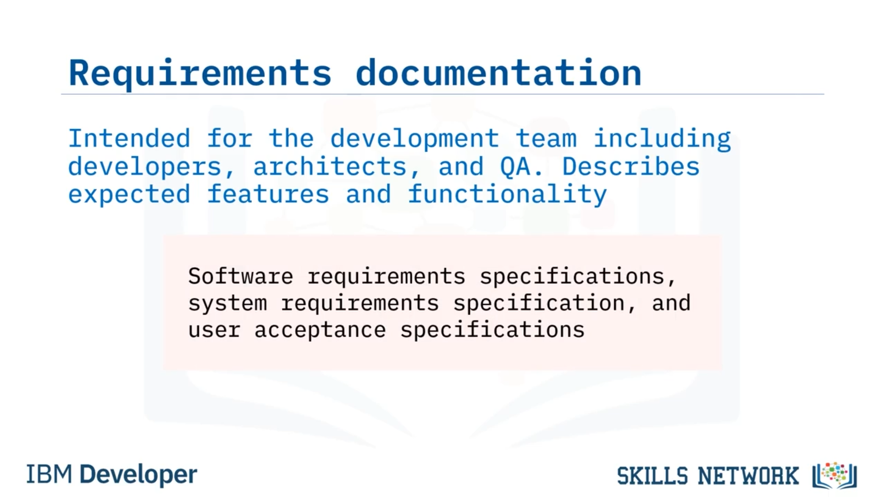

# 📚 Yazılım Dokümantasyonu

## 👋 Giriş ve Öğrenme Hedefleri

Merhaba ve Yazılım Dokümantasyonuna hoş geldiniz. Bu videoyu izledikten sonra şunları yapabileceksiniz:

* Dokümantasyon formatlarını listelemek.
* Ürün dokümantasyonu ile süreç dokümantasyonunu karşılaştırmak ve aralarındaki farkları açıklamak.
* Dokümantasyon kategorilerini ve türlerini tanımlamak.
* Standart işletim prosedürlerinin (SOP) amacını açıklamak.

Yazılım dokümantasyonu, yazılım hakkında; ürünün ne olduğunu ve nasıl kullanılacağını açıklayan bilgilerdir. Bunlar, bir yazılım ürününün geliştirilmesi ve kullanımıyla ilişkili yazılı, video veya grafik varlıklar olabilir.

Dokümantasyon bu üç formatın herhangi birinde olabilir. Dokümantasyon, SDLC’nin tüm aşamalarında geçerli olan yazılım mühendisliğinin temel bir yönüdür. Yazılım dokümantasyonu, son kullanıcılar, yazılım geliştiriciler, QA mühendisleri, sistem yöneticileri ve diğer paydaşlar gibi farklı türde hedef kitleler için yazılabilir.

Dokümantasyon iki kategoriye ayrılabilir: ürün ve süreç. Ürün dokümantasyonu, ürünün işlevselliğiyle ilgiliyken; süreç dokümantasyonu, bir görevin nasıl tamamlanacağını açıklar. Süreç dokümantasyonu, bir iş sürecinin kaliteli şekilde uygulanması için gereken gereksinimleri sağlamalıdır.

Şimdi, bazı spesifik ürün dokümantasyonu türlerini tartışalım.

## 📁 Dokümantasyon Kategorileri ve Türleri

Birçok dokümantasyon türü vardır ve biz beş kategoriyi ele alacağız: gereksinim, tasarım, teknik, kalite güvencesi ve kullanıcı dokümantasyonu.

### 📌 Gereksinim Dokümantasyonu

Gereksinim dokümantasyonu, SDLC’nin planlama aşamasında yazılır ve geliştiriciler, mimarlar ve QA personeli dahil olmak üzere geliştirme ekibini hedefler.

Gereksinim dokümantasyonu, yazılım sisteminin beklenen özelliklerini ve işlevselliğini açıklar. Yazılım gereksinim şartnamelerini, sistem gereksinim şartnamelerini ve kullanıcı kabul şartnamelerini içerir.

### 🧱 Tasarım Dokümantasyonu

Tasarım dokümantasyonu, yazılımın gereksinimleri karşılayacak şekilde nasıl inşa edileceğini açıklamak için yazılım mimarları ve geliştirme ekibi tarafından yazılır. Hem kavramsal hem de teknik tasarım dokümanlarından oluşur.

### 🧑‍💻 Teknik Dokümantasyon

Teknik dokümantasyon, diğer geliştiricilerin kodun davranışını anlamak için kodu okumalarına yardımcı olan, kod içinde yazılmış yorumları içerir. Ayrıca, kodun nasıl çalıştığını açıklayan çalışma dokümanlarını ve proje uygulaması sırasında mühendislerin fikirlerini ve düşüncelerini kaydeden belgeleri de içerebilir.

### ✅ Kalite Güvencesi (QA) Dokümantasyonu

Kalite güvencesi dokümantasyonu, bir test ekibinin stratejisi, ilerlemesi ve metrikleriyle ilgili tüm dokümanları içerir. Test dokümantasyonu türleri arasında test planları, test verileri, test senaryoları, test vaka(lar)ı, test stratejileri ve izlenebilirlik matrisleri bulunur.

İzlenebilirlik matrisleri, test vakalarını kendi gereksinimleriyle eşleştirir.

### 🧑‍🏫 Kullanıcı Dokümantasyonu

Kullanıcı dokümantasyonu, son kullanıcıları hedefler ve yazılımın nasıl işletileceğini açıklar ya da onların sistemi kurmalarına veya sorun gidermelerine yardımcı olur.

Son kullanıcı dokümantasyonu; sıkça sorulan sorular, kurulum ve yardım kılavuzları, eğitimler (tutorials) ve kullanıcı el kitaplarını içerir.

## 📋 Standart İşletim Prosedürleri (SOP)

Standart işletim prosedürleri, SOP olarak adlandırılır ve genellikle süreç dokümantasyonuna eşlik eder. Süreç dokümantasyonu bir sürecin genel bir özetini sunar, ancak SOP’ler çok daha ayrıntılıdır.

SOP, kurumlara özgü, yaygın fakat karmaşık bir görevin adım adım nasıl gerçekleştirileceğini açıklayan yazılı dokümantasyondur. Örneğin, bir yazılım mühendisi için bir kod deposu kullanarak koda check-in yapmak genel bir bilgidir.

Ancak, bir organizasyonun, kodun ana dala (main branch) birleştirilmesi için o organizasyona özgü izlenmesi gereken belirli adımları olabilir. SOP dokümantasyonu bu adımları ayrıntılı olarak açıklar.

SOP’ler, akış şeması, hiyerarşik taslak veya adım adım talimatlar biçiminde olabilir.

## 🔄 Dokümantasyonun Güncel Tutulması

Dokümantasyon, hangi biçimde olursa olsun, güncel tutulmalıdır. Örneğin çevrimiçi kullanıcı el kitaplarını ele alalım. Bulut tabanlı bir uygulamanın kullanıcı arayüzü değişirse, buna eşlik eden çevrimiçi dokümantasyonun da buna uygun şekilde güncellenmesi gerekir.

İşletmelerin bu adım için kaynak ayırdıklarından emin olmaları gerekir.

Yazılım geliştirme ve SDLC bağlamında, dokümantasyonun güncellenmesi bakım aşaması sırasında gerçekleşir. İdeal olarak, dokümantasyon doğruluğunu sağlamak için periyodik olarak da gözden geçirilmelidir.

## 🧾 Bu Videoda Öğrendikleriniz

Bu videoda şunları öğrendiniz:

* Dokümantasyon üç formatta gelir: yazılı, video veya grafik.
* Süreç dokümantasyonu, bir görevin nasıl tamamlanacağını açıklar.
* Ürün dokümantasyonu, bir ürünün nasıl çalıştığıyla ilgilidir.
* Ürün dokümantasyonu türleri; gereksinim, tasarım, teknik, QA ve kullanıcı dokümantasyonunu içerir.
* Ve SOP’ler, bir kuruluşun belirli prosedürünü detaylandıran yazılı talimatlardır.
