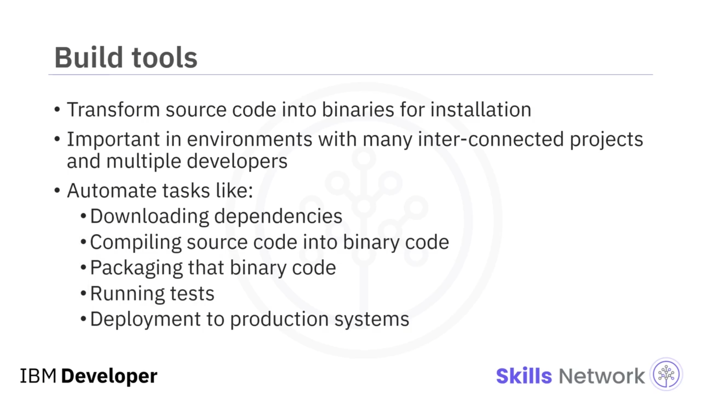
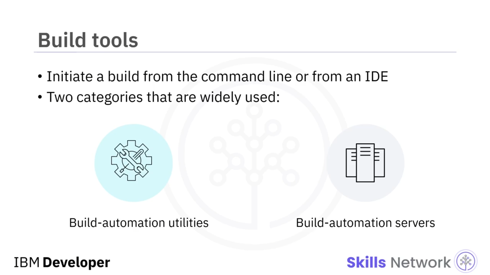

# 🧰 Daha Fazla Uygulama Geliştirme Aracı

Daha Fazla Uygulama Geliştirme Araçlarına hoş geldiniz. Uygulamanızın inşa edilip dağıtılmasına yardımcı olabilecek bazı araçlara bakalım: CI/CD, derleme araçları, paketler ve paket yöneticileri. CI/CD, sürekli entegrasyon ile sürekli teslimat ya da sürekli dağıtım uygulamalarını ifade eder. CI/CD, geliştiricilerin sık yapılan değişiklikleri güvenilir şekilde sunmasını sağlayan, devops ekipleri için en iyi uygulamalardan biridir. Bir derleme otomasyon sunucusu aracılığıyla uygulandığında, Sürekli Entegrasyon (CI) tüm kod bileşenlerinin sorunsuz bir şekilde birlikte çalışmasını sağlar. Bir CI derleme ortamı, projenin ne kadar hızlı değiştiğine bağlı olarak, en az her gün, hatta mümkünse her saat, yeni geliştirilen kodu sık sık entegre etmenizi sağlar. Sürekli teslimat (CD), CI’nin bittiği yerde başlar. CI süreci kodunuzu otomatik olarak derler ve test eder, ardından CD, bir derlemedeki tüm kod değişikliklerini bir test veya hazırlık ortamına dağıtır.

Bir derleme aracı, kaynak kodunuzu kurulum için gereken ikili dosyalara dönüştürür. Derleme araçları, kaynak kodunuzu düzenler, derleme bayraklarını ayarlar ve bağımlılıkları yönetir. Bu araçlar, birçok birbiriyle bağlantılı projenin bulunduğu ve her projeye birden fazla geliştiricinin katkıda bulunduğu ortamlarda özellikle önemlidir. Bu tür ortamlarda, hangi değişikliklerin yapıldığını, hangi sırayla yapıldığını, hangi bağımlılıkların mevcut olduğunu ve bir sonraki derlemeye nelerin dâhil edilmesi gerektiğini takip etmek çok zor olabilir; bu nedenle otomasyon, her şeyin sorunsuz bir şekilde işlemesi için kilit öneme sahiptir. Derleme otomasyonu, geliştiricilerin günlük çalışmalarında yaptıkları çok çeşitli görevleri otomatikleştirebilir; örneğin bağımlılıkların indirilmesi, kaynak kodun ikili koda derlenmesi, bu ikili kodun paketlenmesi, testlerin çalıştırılması ve üretim sistemlerine dağıtım. Bir derlemeyi komut satırından veya bir IDE içinden başlatabilirsiniz. Yaygın olarak kullanılan iki tür derleme aracı vardır: kaynak kodu derleyip bağlayarak yürütülebilir dosyalar gibi derleme çıktıları üreten derleme otomasyonu yardımcı programları ve bu derleme otomasyonu yardımcı programlarını zamanlanmış ya da tetiklemeye dayalı olarak çalıştıran derleme otomasyon sunucuları. Derleme araçlarına bazı örnekler şunlardır: Webpack – JavaScript için bir modül paketleyicisidir, Babel – bir JavaScript derleyicisidir ve Web Assembly – tarayıcınızda çalışan ikili komut biçimidir.

Artık uygulamanız geliştirilip test edildiğine göre, dağıtıma hazırsınız. Peki bu nasıl gerçekleşir? Uygulamanın, kullanıcı tarafından kolay ve sorunsuz bir şekilde kurulabilir olması gerekir; bu nedenle yaygın olarak kullanılan bir teknik, gerekli tüm dosyaları toplamak ve bunları tek bir paket içinde bir araya getirmektir. Paketler; uygulama dosyalarını, kurulum talimatlarını ve seçtiğiniz herhangi bir metaveriyi içeren arşiv dosyalarıdır. Ayrıca kendi metaverilerine de sahiptirler; örneğin paket açıklaması, paket sürümü ve önceden kurulması gereken diğer paketler gibi bağımlılıklar. Uygulamanızı bir paket hâlinde topladıktan sonra, onu dağıtmak için bir paket yöneticisi kullanabilirsiniz.

Paket yöneticileri, kullanıcının isteği üzerine yazılım paketlerini bulma, kurma, bakımını yapma veya kaldırma görevlerini üstlenir. Paket yönetim sistemleri; paket arşivlerini açmak için dosya arşivleyicileriyle koordinasyon sağlar, paketin bütünlüğünü ve doğruluğunu sağlamak için sağlama toplamlarını ve dijital sertifikaları doğrular, bir yazılım deposundan mevcut yazılımları bulur, indirir, kurar veya günceller ve bir paket, ihtiyaç duyduğu tüm paketlerle birlikte yüklensin diye bağımlılıkları yönetir. Başlıca platformlar için yaygın olarak kullanılan bazı paket yöneticileri şunlardır: Linux üzerinde Debian Paket Yönetim Sistemi (DPKG) ve Red Hat Paket Yöneticisi (RPM); Windows’ta Chocolatey; Android’de Package Manager; macOS’te Homebrew ve MacPorts. Uygulamanın bir parçası olarak geliştirilen herhangi bir kütüphane veya yardımcı kod, bulut uygulaması paket yöneticileriyle yönetilir. Popüler diller için bazı paket yöneticisi örnekleri ise şunlardır: Node.js/JavaScript için npm; Java için Gradle ve Maven; Ruby için RubyGems; Python için ise Pip ve Conda.

Bu videoda, geliştirici olarak kariyeriniz boyunca kullanacağınız bazı araçları öğrendiniz; bunlar arasında CI/CD, derleme araçları, paketler ve paket yöneticileri bulunur.

