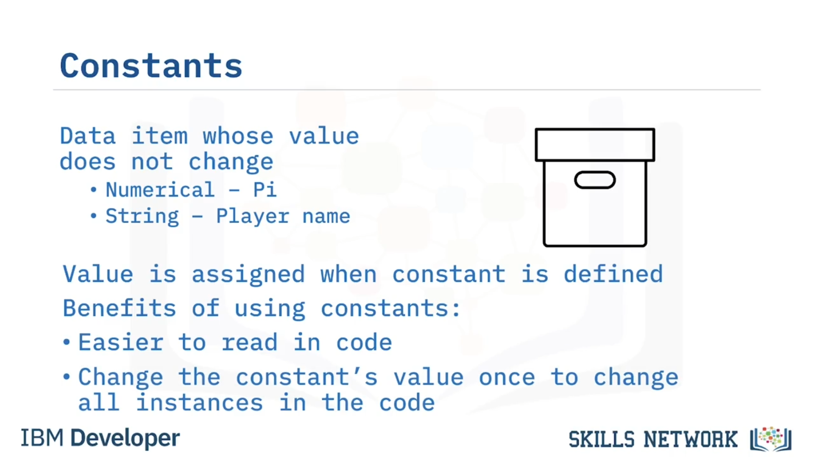
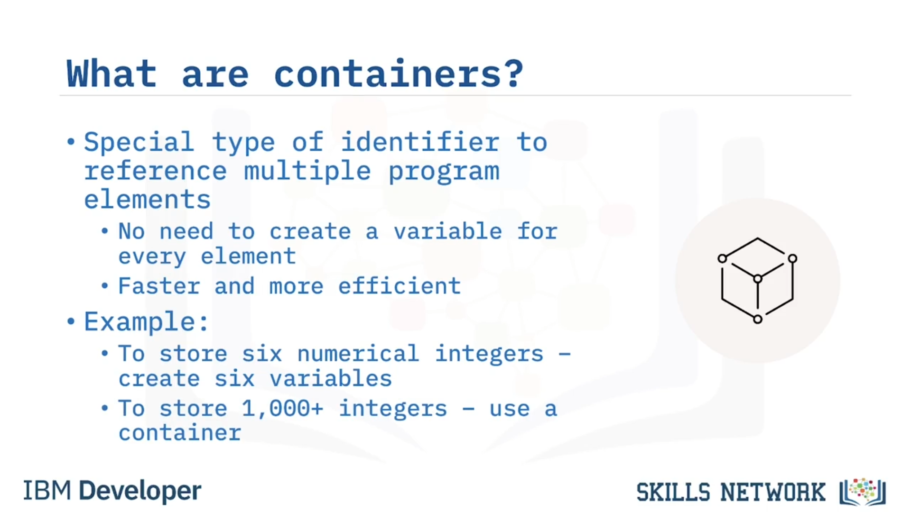

# 🤖 Programlama Kavramlarına Giriş Bölüm 1

Programlama Kavramlarına Giriş – Bölüm 1’e hoş geldiniz. Bu videoyu izledikten sonra şunları yapabileceksiniz: Programlamada tanımlayıcıların (identifier) amacını ve kullanımını açıklamak. Ve programlamada kapsayıcıların (container) amacını ve kullanımını açıklamak. Yazılım programlamayı tam olarak anlayabilmek için önce bilmeniz gereken bazı temel programlama kavramları vardır. İlk bakacağınız kavramlar tanımlayıcılardır. Yazılım geliştiricileri, saklanan bir değeri, bir metodu, bir arayüzü veya bir sınıfı, ona özel olarak adlandırılmış bir etiket atayarak referans almak için tanımlayıcı (identifier) kullanırlar. Eğer tanımlayıcı veri saklıyorsa, programdaki veri değerleri iki türden biri olabilir: ya sabit (constant) ya da değişken (variable).

Sabit (constant), değeri program içinde değişmeyen bir veri öğesidir. Bu, Pi’nin matematiksel değeri gibi sayısal bir sabit olabileceği gibi, bir oyunda oyuncunun adı gibi sabit kalan bir metin dizisi de olabilir. Sabitlere “adlandırılmış sabitler” de denir. Bir sabiti tanımlarken ona bir değer atarsınız. Örneğin, programınız içinde Pi gibi sayısal bir değere, veya bir maliyet fiyatına ya da bir vergi oranına atıfta bulunmak isteyebilirsiniz ve bu sayısal değeri tekrar tekrar yazmak yerine, bunun için bir sabit tanımlayıp ona ‘pi_value’, ‘cost_price’ veya ‘tax_rate’ gibi anlamlı bir ad verebilirsiniz. Programlarınızda sabit kullanmanın birkaç büyük faydası vardır; bunlardan biri kodunuzun daha kolay okunabilir olmasıdır, diğeri ise belirlenmiş değer gelecekte değişirse, bu değeri kod içinde geçen her yerde bulup değiştirmek yerine yalnızca sabitin üzerinde bir kez değiştirmeniz yeterli olmasıdır. Programlamada kullanılan diğer tanımlayıcı türü ise değişkendir (variable).

İsminden de anlaşılacağı gibi, bu tür bir tanımlayıcı sabit değildir; değeri, programın yürütülmesi sırasında değişebilir; örneğin bir kullanıcının bir uygulamaya yaşını girmesi veya bir oyunda yüksek skorun saklanması gibi. Değişkenler metin dizileri, sayısal değerler veya başka herhangi bir veri türü olabilir. Bir değişkeni tanımlayıcı olarak kullanmak, kullanıcı adı, bir hizmet veya bir dosya adı gibi sizin için baştan bilinmeyen program öğelerine atıfta bulunmanın kullanışlı bir yoludur. Eğer bir değişken kullanmazsanız, programınızdaki tüm adları ve değerleri kodun içine sabit (hard code) olarak yazmanız gerekir ki bu iyi bir uygulama olarak kabul edilmez. Değişkenler, tanımlanırken bir veri türü ve başlangıç değeri verilerek bildirilebilir ve atanabilir, ya da bir değişkeni tanımlarken başlangıç değeri atamamayı seçebilir ve bu değerin daha sonra programdaki talimatlar tarafından atanmasını sağlayabilirsiniz. Daha önce bahsedilen tanımlayıcı veri yapılarının yanı sıra, programda birden fazla öğeye referans verebilen özel tanımlayıcı türleri de vardır ve bunlara kapsayıcılar (containers) denir. Birden fazla öğe belirleyebilmek, her bir öğe için tek tek değişken oluşturmak zorunda kalmamanız anlamına gelir.

Bu da işlemi daha hızlı ve verimli hale getirir. Örneğin, yalnızca altı tamsayı (integer) saklamak istiyorsanız, her biri için altı ayrı değişken oluşturabileceğinizi iddia edebilirsiniz. Ancak 1.000 tamsayı veya daha fazlasını saklamanız gerektiğini düşünün. Böyle bir durumda 1.000 değişken tanımlamak bariz biçimde kullanışsız ve verimsiz bir programlama tekniği olacaktır; bu nedenle bu durumda bir kapsayıcı kullanırsınız. Birden fazla öğe belirtmek için iki tür kapsayıcı vardır: diziler (arrays) ve vektörler (vectors). Bu kapsayıcı türlerinin en basiti dizidir (array). Bir dizide, aynı türden sabit sayıda öğe, sıfır indeksinden başlayarak ardışık (sequential) sırada saklanır.

Bir dizi tanımladığınızda, içereceği değerlerin veri türünü (örneğin integer, boolean veya string) ve ardından içerebileceği maksimum öğe sayısını belirtirsiniz. Bir dizi tanımlamanın sözdizimi; önce veri türünü, sonra dizinin adını, sonra da köşeli parantezler içinde dizinin maksimum boyutunu belirtmektir. Sabit boyutlu dizilerin aksine, vektörlerin boyutu dinamiktir ve siz onlara öğe ekledikçe veya öğe çıkardıkça kendi kendilerine yeniden boyutlandırılırlar. Bu nedenle, vektörlerin “dinamik diziler” olarak adlandırıldığını da görebilirsiniz. Dinamik yapıda oldukları için vektörler dizilerden daha fazla bellek alanı kullanırlar ve öğeleri, ardışık bellek konumlarında saklanmadıkları için dizilerdeki öğelere göre erişilmesi biraz daha uzun sürer. Bir vektör tanımlamanın sözdizimi; önce vektörün kapsayıcı türünü belirtmek, ardından veri türünü açı ayraçlar (<> ) içinde yazmak ve sonra da dizinin adını yazmaktır. Vektör olduğu için, içerebileceği maksimum değer sayısını belirtmeniz gerekmez; çünkü boyutu sabit değil, dinamiktir.

Bu videoda şunları öğrendiniz: Yazılım geliştiriciler, bir program bileşenine referans vermek için tanımlayıcı (identifier) kullanır. Eğer bir tanımlayıcı veri saklıyorsa, bu veri ya sabit (constant) ya da değişken (variable) olabilir. Sabit, değeri program içinde değişmeyen bir veri öğesidir. Değişken sabit değildir; değeri programın yürütülmesi sırasında değişebilir. Bir dizide, aynı türden sabit sayıda öğe sıfırdan başlayarak ardışık sırada saklanır. Ve vektörlerin dinamik bir boyutu vardır; öğeler eklendikçe veya çıkarıldıkça kendilerini otomatik olarak yeniden boyutlandırırlar.

