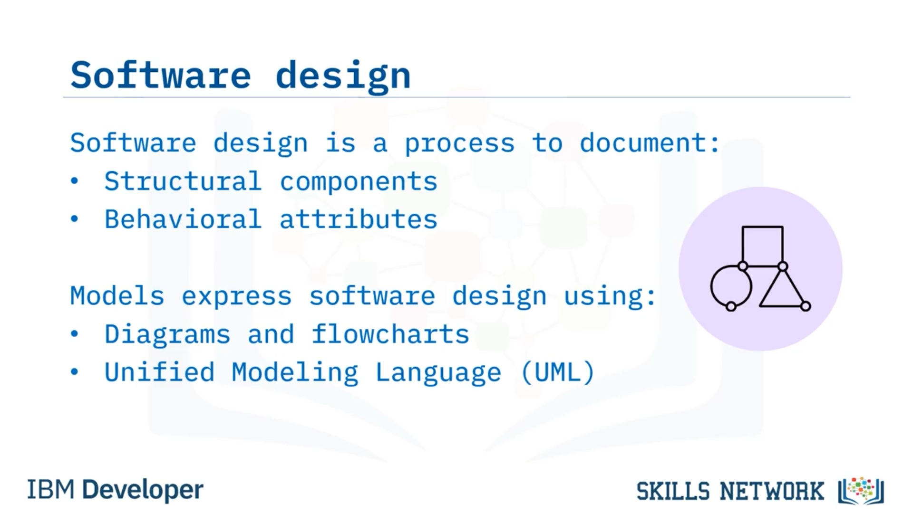
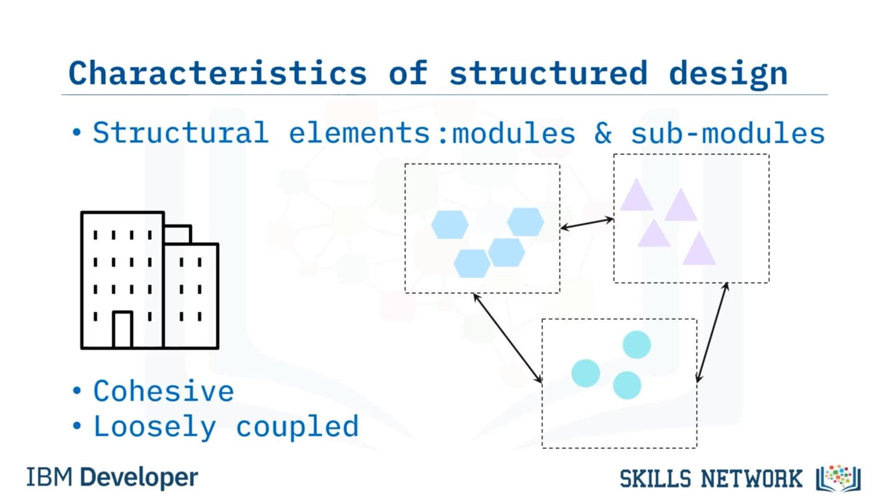
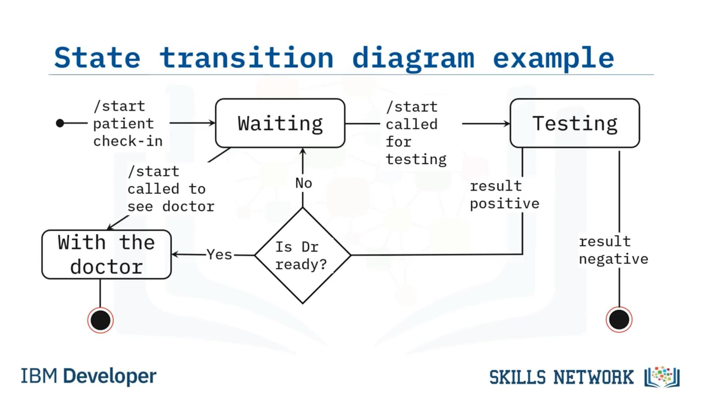

# 🧩 Yazılım Tasarımı ve Modellemesi

Yazılım tasarımı ve modellemesine hoş geldiniz. Bu videoyu izledikten sonra şunları yapabileceksiniz: “structured design” ve “behavioral models” terimlerini karşılaştırmak ve aralarındaki farkları ortaya koymak; Unified Modeling Language’i (veya UML’yi) ve yazılım tasarlarken sağladığı avantajları açıklamak; ve etkileşim (interaction) ve durum geçişi (state transition) diyagramlarının amacını tartışmak. Yazılım tasarımı, yazılım geliştirilebilmeden önce yazılımın yapısal bileşenlerinin ve davranışsal özelliklerinin belgelendiği bir süreçtir. Tasarım sürecinin temel faaliyetlerinden biri, tasarımı ifade etmek için yazılımın modellenmesidir. Bu, daha büyük yazılım çözümünün ve onun alt bileşenlerinin yanı sıra bunlar arasındaki etkileşimlerin görsel ya da diyagram şeklinde gösterimlerinin oluşturulmasını içerir.

Bu, basit akış şemaları kullanılarak ya da UML gibi daha standartlaştırılmış yöntemlerle yapılabilir. Bir yazılım sistemi, yapısal öğeler açısından yorumlanabilir. Structured design, bir yazılım problemini modüller ve alt modüller adı verilen, iyi organize edilmiş daha küçük çözüm öğelerine dönüştürerek kavramsallaştırır. Structured design, bir çözüme ulaşmak için düzen ve organizasyonu vurgular. İyi yapılandırılmış bir tasarım, yüksek bütünlüğe sahip ve gevşek bağlı modüller içermelidir. Cohesion, işlevsel olarak ilişkili tüm öğelerin bir arada gruplanmış olması anlamına gelir. Coupling ise farklı modüller arasındaki iletişimdir. Bir sistemin gevşek bağlı olması için modüllerin zayıf şekilde ilişkilendirilmiş olması gerekir; böylece bir bileşendeki değişikliklerin diğerini en az düzeyde etkilemesi sağlanır. Gevşek bağlılık, bu modülde daha sonra ele alınacak olan servis odaklı mimarilerde ve mikro hizmet tabanlı mimari desenlerde sıkça kullanılan bir mimari ilkedir.

Diyagram, basitleştirilmiş örnek bir faturalama sistemini göstermektedir. Modüller bir hiyerarşi içinde düzenlenmiş ve birbirleriyle iletişim kurmaktadır. Dikdörtgenler modül ve alt modülleri temsil eder. “Billing” ana modüldür ve diğer dikdörtgenlerin ana faturalama modülüne ait alt modüller olduğunu görebilirsiniz. Bu örnekte alt modüller “insurance verification”, “submit claim” ve “output total”dır. Oklar, sistemdeki veri akışını temsil eder. Davranışsal modeller, bir sistemin ne yaptığını açıklar, bunu nasıl yaptığını ise açıklamaz.

Bir sistemin genel davranışı, davranış modelleri aracılığıyla iletilebilir. Bir sistemin davranışını iletmek için kullanılabilecek çeşitli UML diyagramları vardır. Bunlardan ikisini, bir durum geçiş diyagramını (state transition diagram) ve bir etkileşim diyagramını (interaction diagram) ele alacağız. Birbiriyle bağlantılı modüllerden oluşan karmaşık bir yazılım sistemi geliştirirken, farklı öğeler arasındaki ilişkileri, davranışları ve hiyerarşileri hatırlamak zor olabilir. Unified Modeling Language’in kısaltması olan UML, karmaşık yazılım sistemlerinin mimarisini, tasarımını ve uygulamasını görsel olarak temsil etmenin bir yoludur. UML, geliştirme süreçlerinin tamamında kullanılabilen standartlaştırılmış bir modelleme dilidir. UML diyagramları iki sınıfa ayrılabilir: yapısal (structural) veya davranışsal (behavioral).

UML, programlama dili açısından tarafsızdır; bu nedenle yazılım geliştiriciler, hangi dilde geliştirme yaparlarsa yapsınlar, onu kolayca yorumlayabilir ve çalışmalarına uygulayabilirler. Geliştirme ekipleriyle mimariyi, davranışı ve yapıyı paylaşmak için UML kullanmanın çeşitli avantajları vardır. UML diyagramlarının en büyük avantajı, herhangi bir kod yazılmadan önce özellikleri planlamaya olanak tanımasıdır; bu da zaman ve para tasarrufu sağlar. İkinci olarak, bu diyagramlar, yeni ekip üyelerinin veya ekip değiştiren geliştiricilerin projeye hızlıca uyum sağlamaları için kullanılabilir. Ayrıca, diyagramlar teknik ve teknik olmayan kitleler arasındaki iletişimi daha kolay hâle getirmek için de kullanılabilir. Ve son olarak, sistemin görsel bir temsilinin olması, geliştiricilerin modüller arasındaki ilişkileri görebildikleri için kaynak kodda yol almalarını kolaylaştırır. Dolayısıyla birçok türde UML diyagramı vardır, ancak genel olarak UML diyagramları davranışsal veya yapısal olarak sınıflandırılabilir.

Bir sonraki adımda davranışsal modelleri ve ardından nesne yönelimli tasarımı (object-oriented design) ele alacağız. Bir sistemin davranışı, durum geçiş diyagramı (state transition diagram) adı verilen bir UML diyagramı yardımıyla açıklanıp gösterilebilir. Durum geçiş diyagramı, bir sistemin sahip olduğu farklı durumları ve sistemde durum değişikliğine neden olan olayları tanımlayan durumlardan ve olaylardan oluşan bir koleksiyondur. Gösterilen diyagram, bir hastanın bir klinikte doktora gitmesini modelleyen bir durum geçiş diyagramına örnektir. Farklı durumlar arasında “waiting”, “testing” ve “with the doctor” yer alır. Oklar, bir durumdan diğerine olası geçişleri temsil eder ve geçişi tetikleyen olayı adlandırır. Bir etkileşim diyagramı, bir yazılım sisteminin dinamik doğasını modellemek için kullanılır. Nesneleri ve bunların ilişkilerini görselleştirmeye yardımcı olurlar. Burada gösterilen etkileşim diyagramı türü olan bir sıralama diyagramı (sequence diagram), nesneler arasındaki iletişimi zamana göre gösterir. Bu örnek, bir hastanın çevrimiçi bir portaldan randevu almasını göstermektedir. Bu, davranışsal bir UML diyagramına bir başka örnektir.

Bu videoda şunları öğrendiniz: Structured design, bir yazılım problemini iyi organize edilmiş daha küçük çözüm öğelerine ayırır. Davranışsal modeller, sistemin bu davranışı nasıl uyguladığını açıklamadan sistemin davranışını açıklar. UML diyagramları geliştirmek, geliştiricilerin bir projeye hızlıca uyum sağlamalarına, özellikleri kodlamadan önce planlamalarına ve kaynak kodda kolayca yol bulmalarına yardımcı olarak zaman ve para tasarrufu sağlar. Bir durum geçiş diyagramı, bir sistemin farklı durumlarını ve durum değişikliğine neden olan olayları tanımlayan, durumlar ve olaylardan oluşan bir koleksiyon içeren davranışsal bir modeldir. Ve son olarak, bir etkileşim diyagramı, etkileşim hâlindeki nesnelerin nasıl iletişim kurduğunu açıklar.

