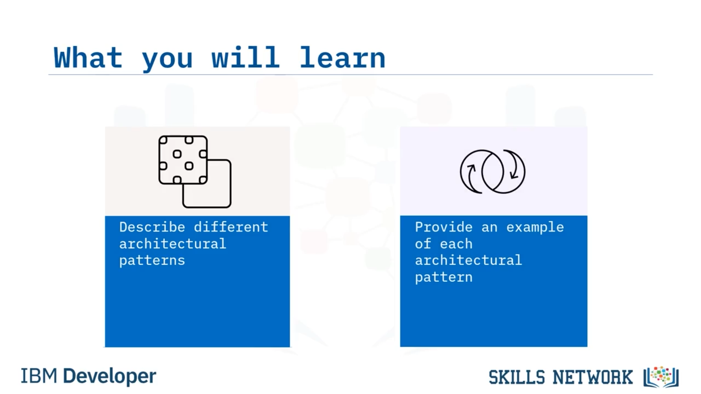
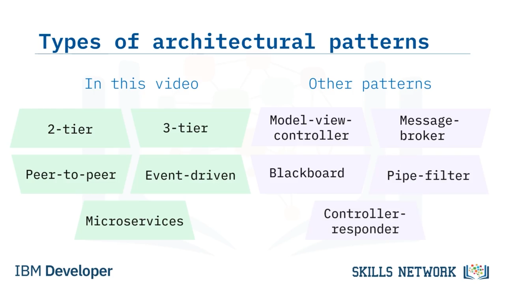
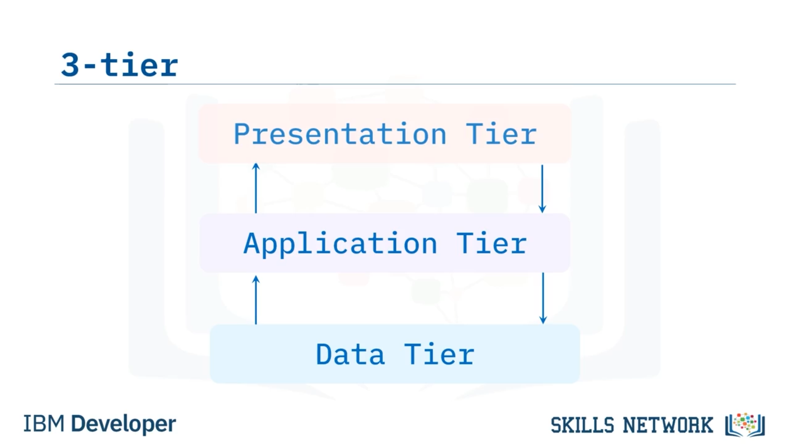
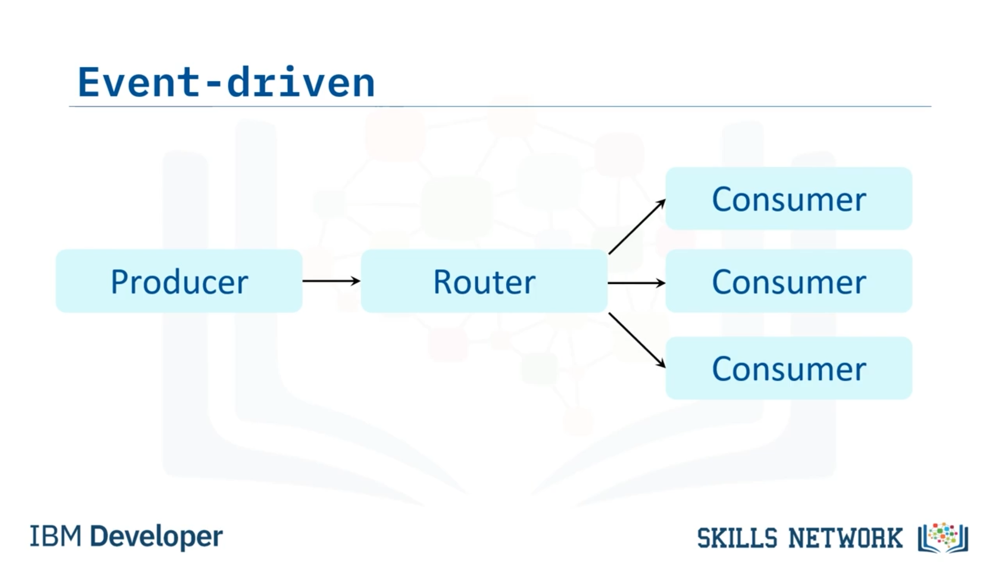
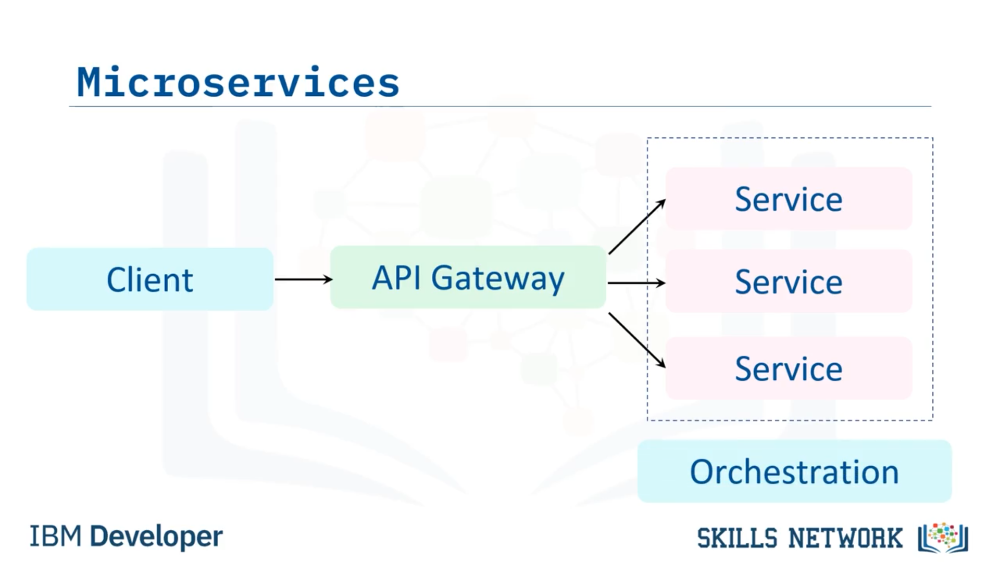

## 🏛️ Yazılımda Mimari Kalıplar

## 🎯 Video Hedefleri ve Mimari Kalıp Tanımı

Yazılımda mimari kalıplara hoş geldiniz! Bu videoyu izledikten sonra şunları yapabileceksiniz: 2-tier, 3-tier, peer-to-peer, event-driven ve microservices gibi farklı yazılım mimarilerini tanımlamak ve her mimari kalıp için birer örnek verebilmek. Bir mimari kalıp, yazılım mimarisindeki bir probleme tekrarlanabilir bir çözümdür. Kalıplar, bir yazılım sisteminin ortak iç öğelerini ve yapılarını vurgular. Farklı mimari kalıplar, birbiriyle ilişkili özellikleri paylaşabilir. Bu videoda 2-tier, 3-tier, peer-to-peer, event-driven ve microservices ele alınacaktır.

## 🧱 Diğer Mimari Kalıplar ve 2-Tier / 3-Tier’e Giriş

Ancak bu videoda ele alınmayacak başka birçok kalıp vardır. Bu kalıplara model-view-controller, message-broker, blackboard, pipe-filter ve controller-responder dahildir. 2-tier mimarisi, client-server olarak da adlandırılan ve sunucunun, istemciye sunulan kaynakların ve hizmetlerin çoğunu barındırdığı, sağladığı ve yönettiği bir hesaplama modelidir. Arayüz, istemci makinede bulunur ve veri ya da hizmet için sunucuya istek gönderir. Bu tür bir mimaride genellikle bir ağ bağlantısı üzerinden bir sunucu bileşenine bağlı birden fazla istemci bilgisayar bulunur. 3-tier mimarisi veya üçten fazla katmanın bulunduğu n-tier mimarisi, en yaygın yazılım mimarisidir. 3-tier mimari, birlikte tek bir yazılım birimi olarak işlev gören birkaç yatay katmandan oluşur.

## 📚 Katmanlar, 3-Tier Yapısı ve Peer-to-Peer Tanımı

Bir katman yalnızca doğrudan üstünde ve altında bulunan diğer katmanlarla iletişim kurar. İlgili bileşenler aynı katman içinde yerleştirilir. Bir katmandaki değişiklikler diğer katmanı etkilemez. 3-tier mimari, uygulamaları üç mantıksal ve fiziksel hesaplama katmanına göre düzenler: sunum katmanı, yani kullanıcı arayüzü; orta katman, genellikle iş mantığının işlendiği uygulama katmanıdır; veri katmanı ise verinin saklandığı ve yönetildiği katmandır. Peer-to-peer mimari, kısaca P2P, hem istemci hem de sunucu olan düğümlerden oluşan merkeziyetsiz bir ağdan oluşur. İş yükü bu düğümler arasında paylaştırılır. Peer’ler, kaynaklarının bir bölümünü, sunucular tarafından merkezi bir koordinasyona gerek kalmadan diğer ağ katılımcılarına doğrudan kullanılabilir hale getirir. Kaynaklar; işlem gücü, disk depolama alanı veya ağ bant genişliği gibi şeylerdir.

## 🔄 Peer-to-Peer ve Olay Kavramına Giriş

Peer’ler, geleneksel client-server mimarisinin aksine hem kaynak sağlar hem de tüketir; geleneksel mimaride tüketim yalnızca istemci tarafından yapılırken, kaynakları sunan taraf sunuculardır. Peer-to-peer mimari, dosya paylaşımı, anlık mesajlaşma, iş birliği ve yüksek performanslı hesaplama için kullanışlıdır. Bir olay, durum değişikliğine yol açan herhangi bir şeydir. Bir olayı, son kullanıcı tarafından tetiklenen bir eylem (örneğin bir fare tıklaması) ya da programın başka bir parçası tarafından tetiklenen bir eylem olarak düşünebiliriz. Event-driven mimari, olayların üreticilerine ve tüketicilerine odaklanır. Üreticiler tetikleyicileri dinler ve bunlara tepki verirken, tüketiciler bir olayı işler. Üretici, olayı bir event router’a yayınlar.

## 📡 Olay Yönlendirme, Gevşek Bağlılık ve Mikroservisler

Router, olayın hangi tüketiciye iletileceğini belirler. Tetikleyici olay, olayı dinleyen tüketiciye gönderilen ve event notification olarak adlandırılan bir ileti üretir. Event-driven mimarilerdeki bileşenler gevşek bağlıdır; bu da kalıbı modern, dağıtık sistemlerle kullanım için uygun hale getirir. Microservices, bir uygulamanın işlevselliğini services adı verilen modüler bileşenlere bölen bir uygulama geliştirme yaklaşımıdır. Application Programming Interface, kısaca API, bir uygulamanın diğer uygulamalarla iletişim kuran kısmıdır. Bir API, iki uygulamanın birbirlerinin verilerini nasıl paylaştığını ve değiştirdiğini tanımlar. API’ler, microservices tabanlı bir mimari oluşturmak için kullanılabilir.

## 🚏 API Gateway, Orkestrasyon ve 2-Tier Örnekleri

API Gateway, API’yi istemciden bir service’e yönlendirir. Orchestration, servisler arasındaki iletişimi yönetir. Şimdi bu kalıpların her biri için bir örnek tartışalım. Bir metin mesajlaşma uygulaması, 2-tier kalıbına bir örnektir. İstemci, bir metin mesajını bir sunucu üzerinden göndermek için bir istek başlatır ve sunucu da bu mesaja farklı bir başka istemciye ileterek yanıt verir. 2-tier kalıbına bir diğer örnek, veritabanı istemcilerinin veritabanı sunucularına bağlanmasıdır. Birçok web uygulaması 3-tier kalıbını kullanır.

## 🧩 3-Tier Web Uygulamaları, Ride-Sharing ve Kripto Örnekleri

Bu uygulamalar, kullanıcı arayüzünü sağlamak için bir web sunucusu, kullanıcı girdilerini işlemek için bir uygulama sunucusu ve veri yönetimini gerçekleştiren bir veritabanı sunucusu kullanırlar. Bu üç sunucu türünün işlevleri, başka bir videoda daha ayrıntılı olarak tartışılacaktır. Lyft ve Uber gibi ride-sharing uygulamaları, event-driven kalıplara örnektir. Müşteri, belirli bir konumdan başka bir konuma gitmek için bir yolculuğa ihtiyaç duyduğunu bildiren bir bildirim gönderir ve bu olay bir tüketiciye yönlendirilir. Bitcoin ve Ethereum gibi cryptocurrencies, peer-to-peer bir kalıp kullanır. Blockchain’deki her bilgisayar hem sunucu hem de istemci olarak hareket eder. Son olarak, sosyal medya siteleri microservices’ten oluşur.

## 👥 Kullanıcı Hesapları, Hizmetler ve Kalıpların Birleşimi

Bir kullanıcının bir hesabı vardır. Bu hesap, arkadaş ekleme, hedeflenmiş reklam önerileri ve içerik görüntüleme gibi farklı hizmetler talep edebilir. Mimari kalıplar, mutlaka birbirini dışlayan yapılar değildir. Başka bir deyişle, bu kalıplardan ikisi veya daha fazlası birleştirilebilir. Örneğin, three-tiered bir mimari aynı zamanda microservice tabanlı olabilir veya peer-to-peer bir mimari event-driven da olabilir. Ancak tüm mimari kalıplar birlikte kullanılamaz. Peer-to-peer bir mimari aynı zamanda two-tier olamaz; çünkü peer-to-peer bir mimaride tek bir makine hem istemci hem de sunucuyu temsil ederken, two-tier bir mimaride istemci sunucudan ayrıdır.

## 🧭 Sistem Mimarının Rolü ve Temel Çıkarımlar

Yazılım sisteminin hangi mimari kalıplara uyacağına karar vermek, sistem mimarının sorumluluğundadır. Bu videoda şunları öğrendiniz: Bir mimari kalıp, mimari bir probleme tekrarlanabilir bir çözümdür. 2-tier bir kalıp, bir istemci ve bir sunucuya sahiptir. Metin mesajlaşma uygulamaları 2-tier bir kalıp kullanır. 3-tier bir kalıp, birbirleriyle etkileşime giren üç katmana sahiptir. Web uygulamaları 3-tier bir kalıp kullanır. Event-driven bir kalıpta, bir consumer tarafından üretilen ve yine consumer tarafından yanıtlanan eylemler vardır. Ride-sharing uygulamaları, event-driven bir kalıp kullanır.

## 🌐 Peer-to-Peer, Microservices ve Kalıpların Bir Arada Kullanımı

Peer-to-peer kalıbı, hem istemci hem de sunucu olarak hareket eden düğümlerden oluşan merkeziyetsiz bir ağdan oluşur. Cryptocurrency, peer-to-peer kalıbına bir örnektir. Microservices, tek bir sistem gibi davranan ve istemciyle etkileşen, gevşek bağlı bireysel servislerdir. İletişim, servisler arasında orkestre edilir. Sosyal medya siteleri bir örnektir ve son olarak, iki veya daha fazla kalıp tek bir sistemde birleştirilebilir, ancak bazıları birbirini dışlamaz.

