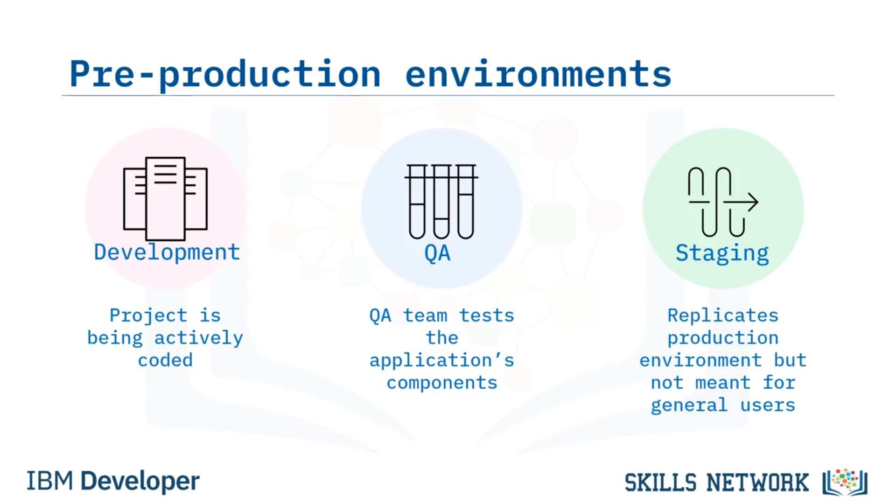

# Uygulama Dağıtım Ortamları

## 🚀 Uygulama Dağıtım Ortamlarına Giriş

Application Deployment Environments modülüne hoş geldiniz. Bu videoyu izledikten sonra ayrıca şunları yapabileceksiniz: Farklı pre-production ortamı türlerini listelemek ve amaçlarını belirtmek. Bir production ortamını diğer uygulama ortamlarından ayırt etmek. Ve deployment seçeneklerini karşılaştırmak ve kıyaslamak. Bir uygulama ortamı, bir uygulamayı çalıştırmak için gereken donanım ve yazılım kaynaklarının birleşimidir. Buna şunlar dahildir: uygulamanın çeşitli bileşenleri veya modülleri için application code ve/veya binary executable'lar; uygulamayı çalıştırmak için ihtiyaç duyduğu software stack, yani bağımlı olduğu modüller ve kütüphaneler, üçüncü taraf uygulamalar ve middleware ile işletim sistemi; herhangi bir networking bileşeni ve altyapısı; ayrıca işlem kaynakları, bellek ve depolama dahil olmak üzere fiziksel ya da sanal donanım. Uygulamanın yaşam döngüsünün hangi aşamasında olduğuna bağlı olarak çeşitli ortam türleri vardır.

## 🧪 Pre-production Ortamları ve Production'a Giriş

Pre-production ortamları, uygulamanın production'a hazırlanırken çeşitli biçimlerde üzerinde bulunduğu platformlardır. Yaygın pre-production ortamları “development”, “QA” (quality assurance, yani kalite güvencesi) ve “staging”dir. Development environment, uygulamanın aktif olarak kodlandığı platformdur ve çoğu durumda sadece geliştiricinin çalışma istasyonu olabilir. QA environment, bazen “testing” olarak da adlandırılır, QA ekibinin uygulamanın bileşenlerini test etmesini sağlayan ortamdır. Staging environment, production ortamını olabildiğince yakından kopyalayan ancak genel kullanıcılar için tasarlanmamış ortamdır. Şimdi production ortamını ele alalım. Çoğunlukla sadece “production” olarak adlandırılan production ortamı, uygulamanın çalıştığı donanım ve yazılımın yanı sıra ek altyapı bileşenlerinden oluşan tüm solution stack'i içerir.

## 🏗️ Production Ortamı ve On-premises Deployment

Production ortamı tüm kullanıcılar için tasarlanmıştır. Pre-production ortamlarından farklı olarak, bu sağlam ortam, genel kullanım için tasarlandığından ve kurumsal seviyedeki uygulamalar için aynı anda binlerce ya da milyonlarca kişi tarafından kullanılabileceğinden, uygulamanın “load”unu dikkate almak zorundadır. Production ortamları ayrıca güvenlik, güvenilirlik ve ölçeklenebilirlik gibi fonksiyonel olmayan gereksinimleri de dikkate almalıdır. Bu da production ortamını pre-production ortamlardan daha karmaşık hâle getirir. Şimdi production ortamının altyapısına bir göz atalım. Uygulama ortamlarını deploy etmek için birkaç seçenek vardır. On-premises deployment'ta sistem ve altyapısı, genellikle bir firewall'un arkasında, kuruluşun fiziksel konumu içinde, kurum içi olarak bulunur. Firewall'lar özel bir ağa gelen veya giden yetkisiz erişimi engeller.

## ☁️ On-premises ve Public Cloud Deployment Modelleri

Bir kuruluş, bir uygulamanın ve o uygulama tarafından kullanılan verilerin üzerinde daha fazla güvenlik veya kontrol isterse, uygulamayı on-premises olarak deploy edebilir. On-premises software deployment'larda, uygulamayı çalıştırmak için gereken sistem, donanım, ilgili altyapı ve bakımın sorumluluğu kuruluşa aittir. On-premises deployment, cloud deployment ile karşılaştırıldığında genellikle daha pahalıdır. Şimdi de cloud deployment'ları tartışalım. Üç tür cloud deployment modeli vardır: public, private ve hybrid. Public cloud, yazılımı destekleyen altyapıdan, cloud provider'a ait donanım üzerinde ve açık internet üzerinden yararlandığınız durumdur. Bu donanım ve ilişkili servisler diğer şirketlerle paylaşılır. Public cloud provider'lara Amazon Web Services (AWS), Microsoft Azure, Google Cloud Platform ve IBM Cloud örnek verilebilir. Public cloud, ölçeklenebilirliği ve maliyeti nedeniyle en yaygın olanıdır.

## 🔒 Private ve Hybrid Cloud Modelleri ile Ortam Türleri

Private cloud'da cloud altyapısı, yalnızca tek bir kuruluşun münhasır kullanımı için sağlanır. Software system on-premises olarak çalıştırılabilir ya da altyapı, bir service provider tarafından sahip olunabilir, yönetilebilir ve işletilebilir. Örneğin AWS, aynı zamanda bir private cloud service provider'dır. Private cloud'un temel avantajı artan güvenliktir, ancak tamamen özelleştirilebildiği için daha fazla esneklik de sağlar. Şimdi, public ve private cloud'ların her ikisinin de sorunsuz biçimde birlikte çalıştığı bir karışımın hybrid cloud modeli olarak adlandırıldığını görelim. Hybrid cloud, maliyet, güvenlik, ölçeklenebilirlik ve esneklik açısından public ve private cloud modellerinin avantajlarını potansiyel olarak optimize eder. Bu videoda şunları öğrendiniz: Uygulama ortamları şunları içerir: development, testing veya QA, staging ve production.

## 📈 Production Ortamı Gereksinimleri ve Dağıtım Seçenekleri

Production ortamları ayrıca yük, güvenlik, güvenilirlik ve ölçeklenebilirlik gibi fonksiyonel olmayan gereksinimleri de dikkate almalıdır. Ve uygulama ortamları, geleneksel donanım üzerinde on-premises olarak ya da public, private veya hybrid cloud platformlarında deploy edilebilir.

