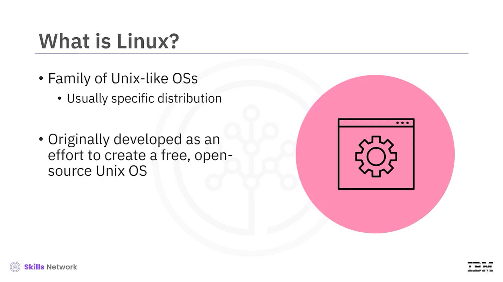
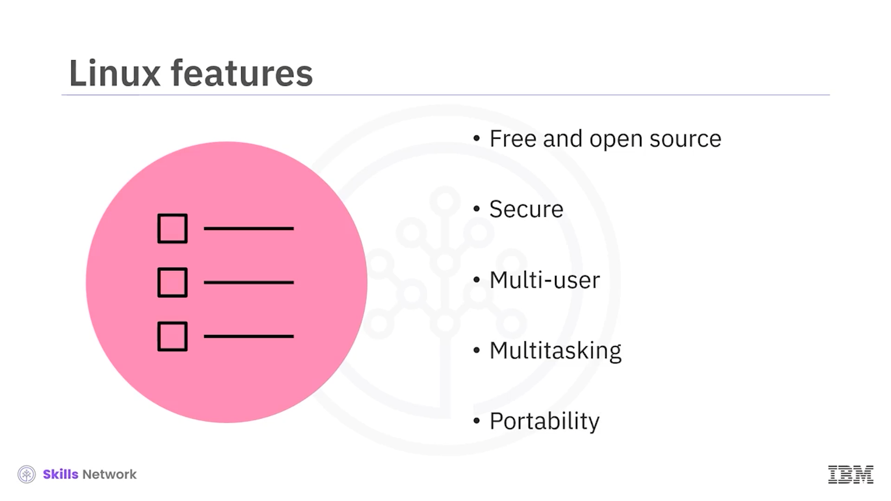
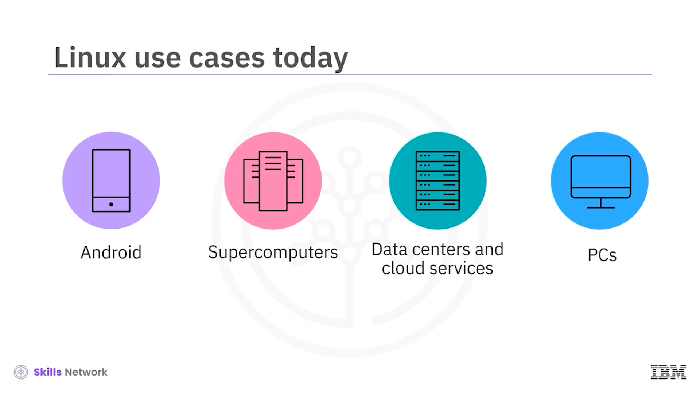

# 🐧 Linux ve Unix’e Giriş

Linux ve Unix’e Giriş’e hoş geldiniz.

Bu videoyu izledikten sonra şunları yapabileceksiniz:

* Bir işletim sistemi ya da  *OS* ’un ne olduğunu açıklamak
* *Linux* ve  *Unix* ’in kökenlerini tanımlamak
* *Linux* ve  *Unix* ’in bazı özelliklerini listelemek

---

## 💻 İşletim Sistemi (OS) Nedir?

İşletim sistemi nedir?

Bir işletim sistemi, bilgisayar donanımını ve kaynaklarını yöneten

ve donanımla etkileşim kurarak faydalı görevler gerçekleştirilmesini sağlayan bir yazılımdır.

---

## 🏛 Unix Nedir?

Peki, *Unix* nedir?

Aslında  *Unix* , bir işletim sistemleri ailesidir.

Bazı popüler *Unix* tabanlı işletim sistemleri şunlardır:

* *Oracle Solaris* ve *OpenSolaris*
* *FreeBSD*
* *HPUX*
* *IBM AIX*
* Ve günümüzde en popüler masaüstü işletim sistemlerinden biri olan *Apple MacOS*

---

## 📜 Unix’in Tarihçesi

1960’larda, orijinal *Unix* işletim sistemi,  *AT&T Bell Labs* ’te oluşturuldu.

Ancak, o dönemdeki birçok işletim sistemi gibi

belirli bir donanım sistemi için yapılmıştı;

bu durumda, *PDP-7* bilgisayarı için.

1970’lerde, *Unix* işletim sistemi *C* dilinde yeniden yazıldı.

Bu, onu diğer sistemlerden ayırdı

ve birçok donanım mimarisine taşınabilir ( *portable* ) hale getirdi.

Daha sonra, 1970’lerin sonlarında,  *UC Berkeley* ,

*Berkeley Software Distribution* ya da  *BSD* ’yi geliştirdi.

Bu,  *Unix* ’e ek yazılımlar ve yetenekler sağlayan bir eklentiydi.

Ünlü *Mac OS* daha sonra  *BSD* ’den türetilmiştir.

---

## 🐧 Linux Nedir?

Peki, *Linux* nedir?

 *Linux* , *Unix* benzeri ( *Unix-like* ) işletim sistemleri ailesidir.

Ancak  *Linux* ’tan bahsedildiğinde, insanlar genellikle

belirli bir dağıtımdan veya “türde” ( *flavor* ) söz ederler.

 *Linux* , *Unix* işletim sisteminin ücretsiz, açık kaynaklı bir sürümünü

oluşturma çabası olarak geliştirilmiştir.

---

## ⭐ Linux’un Temel Özellikleri

Temel *Linux* özellikleri şunları içerir:

* *Linux* ücretsiz ve açık kaynaktır

  Bu, herkesin kaynak kodu görebileceği anlamına gelir.
* Kaynak koduna bu kadar çok gözün bakmasıyla

  *Linux* , yıllar içinde en güvenli işletim sistemi haline gelmiştir.
* Çok kullanıcılıdır ( *multi-user* )

  *Linux* , sisteme aynı anda erişen birden fazla kullanıcıyı destekleyecek şekilde tasarlanmıştır.
* Çoklu görev ( *multitasking* ) destekler

  Aynı anda birden fazla işi ve uygulamayı çalıştırabilir.
* Taşınabilirdir ( *portable* )

  *Linux* , masaüstlerinden sunuculara, cihazlara ( *appliances* ) kadar

  birçok farklı türde cihaz ve donanım platformunda çalışacak şekilde taşınmıştır.

---

## 🧬 Linux Nasıl Ortaya Çıktı?

*Linux* nasıl başladı?

1980’lerde,  *MIT* ’de *GNU* geliştirildi.

 *GNU* , “ *GNU's Not Unix* ” ifadesinin kısaltmasıdır

ve mevcut *Unix* sistem araçlarının ücretsiz, açık kaynaklı bir takımı olarak yapılmıştır.

1991’de,  *Linus Torvalds* , *Linux* adlı

ücretsiz, açık kaynaklı bir *Unix* çekirdeği ( *kernel* ) geliştirdi.

 *Kernel* , bir işletim sisteminin çekirdek bileşenidir

ve bileşenlerin makinenin donanımıyla iletişim kurmasını sağlar.

Burada,  *Linus Torvalds* ’ın kendi açık kaynaklı *Unix* benzeri çekirdeğini geliştirirken

ilerlemesini paylaştığı ünlü gönderisi yer almaktadır.

Bu gönderide, o zamanın diğer bir *Unix* benzeri çekirdeği olan  *Minix* ’e atıfta bulunur.

Kısa süre sonra, 1992’de, *GNU* ile *Linux* çekirdeğini

birleştirme potansiyeli fark edildi

ve popüler *Linux* işletim sistemleri ortaya çıkmaya başladı.

1996’da, *Larry Ewing* adlı bir bilgisayar bilimci,

daha sonra *Linus Torvalds* tarafından resmi *Linux* maskotu olarak benimsenen

penguen  *Tux* ’ü yarattı.

---

## 🌍 Günümüzde Unix ve Linux Kullanımı

Bugün, *BSD* tabanlı  *Mac OS* ,

dünya genelinde milyonlarca cihazda çalışmaktadır.

Milyarlarca *Linux* örneği, modern web’i bize sunan sunucularda çalışmaktadır.

Ve özellikle geliştiriciler arasında, *Ubuntu* gibi modern *Linux* işletim sistemleri,

PC alanında popülerlik kazanmaya başlamıştır.

---

## 🧪 Linux’un Güncel Kullanım Senaryoları

Peki, günümüzde *Linux* için en yaygın kullanım alanları nelerdir?

* Öncelikle, dünyanın dört bir yanındaki milyarlarca akıllı telefonda kullanılan

  *Android* işletim sistemi aracılığıyla

  (ki  *Android* , *Linux* tabanlı bir çekirdek kullanır).
* *Linux* , süper bilgisayarlarda da yaygın olarak kullanılır;

  birçok *Linux* destekli sunucu, yüksek performanslı hesaplama uygulamaları için

  bir araya getirilir.

* Kurumsal ve bulut veri merkezleri de milyonlarca sunucu üzerinde *Linux* kullanır;

  her türden uygulamayı, web sunucularını, veritabanlarını ve benzerlerini çalıştırır.
* Son olarak, *Linux* sürümleri, bilgisayarınızın işletim sistemi olarak

  kolayca kullanılabilir.

Birçok kişi, bugün *Linux*u bir öğrenme deneyimi olarak ya da günlük ana sistemi ( *daily driver* ) olarak kurmaktadır.

---

## 🔁 Bu Videoda Öğrendikleriniz

Bu videoda şunları öğrendiniz:

* *Unix* ’in, 1960’lardan beri var olan bir işletim sistemleri ailesi olduğu
* *Linux* ’un, 1991’de  *Unix* ’e ücretsiz, açık kaynaklı bir alternatif olarak geliştirildiği
* *Linux* ’un çok kullanıcılı ( *multi-user* ), taşınabilir ( *portable* ) olduğu   ve çoklu görev ( *multitasking* ) desteklediği
* Ve  *Linux* ’un günümüzde mobil cihazlarda, süper bilgisayarlarda,  veri merkezlerinde ve bulut sunucularında yaygın olarak kullanıldığı

  
