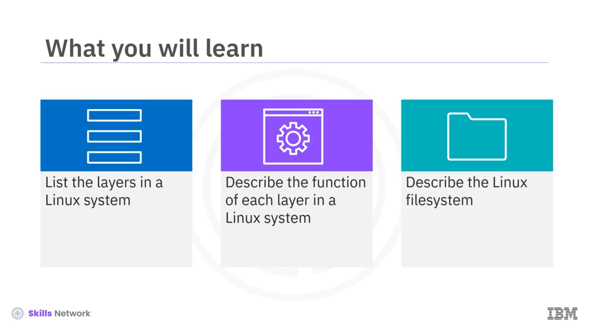
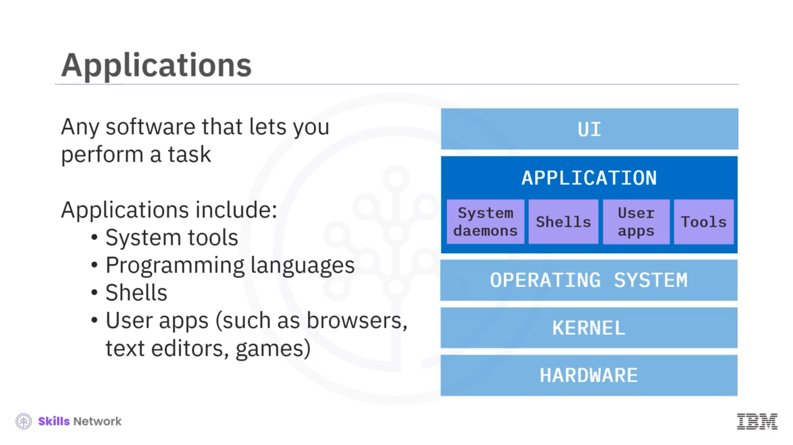
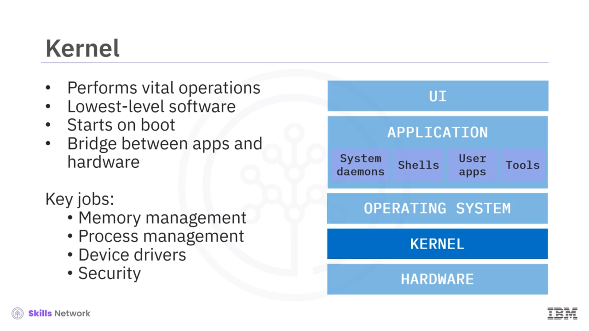
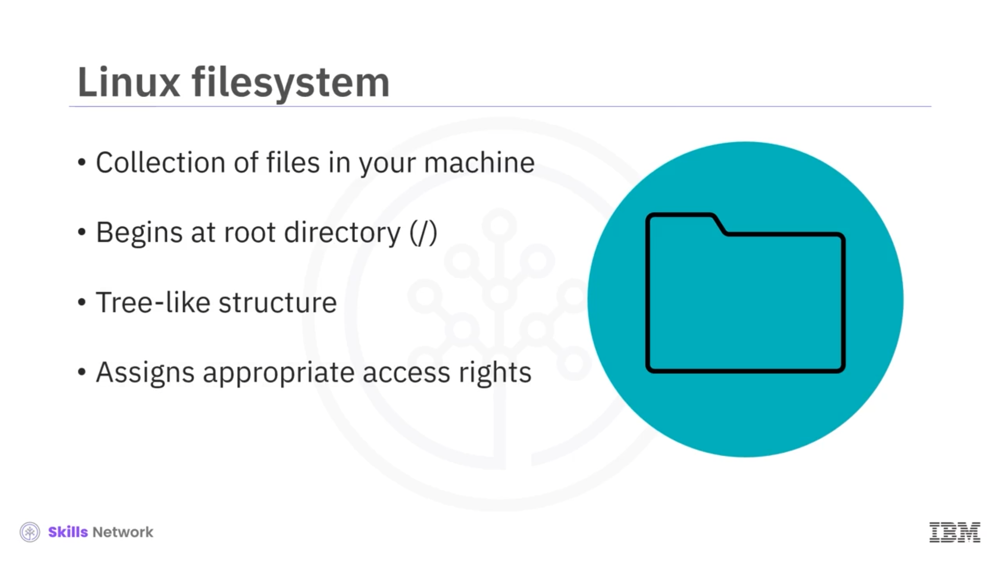

# 🧱 Linux Mimarisine Genel Bakış

“Linux Mimarisine Genel Bakış”a hoş geldiniz. Bu videoyu izledikten sonra şunları yapabileceksiniz:

* Bir Linux sistemindeki katmanları listelemek
* Her katmanın Linux sistemindeki rolünü açıklamak
* Linux dosya sistemini tanımlamak

Linux sistemi beş ayrı katmandan oluşur. Linux mimarisinin en dış katmanı, kullanıcıların klavye veya fare kullanarak sistemle etkileşim kurmasını sağlayan **UI (User Interface / Kullanıcı Arayüzü)** katmanıdır.

 **Uygulama katmanı** , Linux sisteminde görevleri yerine getirmek için kullanılan sistem daemon’ları, kabuklar ( *shell* ), kullanıcı uygulamaları ve araçları içerir.

Uygulamalar, görevleri yerine getirmek için işletim sistemiyle iletişim kurar.  **İşletim sistemi (OS)** , iş zamanlama ( *job scheduling* ) ve zamanı takip etme gibi sistem kararlılığı için hayati olan işlerden sorumludur.

Tüm Linux işletim sistemleri, en kritik düşük seviye görevleri yerine getiren **Linux çekirdeği (kernel)** üzerine inşa edilmiştir. Çekirdek, işletim sisteminin çekirdek bileşenidir ve bellek yönetimi, işlem yönetimi ve güvenlikten sorumludur. Çekirdek, bilgisayardaki işlemciler, bellek modülleri, giriş aygıtları ve depolama gibi tüm fiziksel veya elektronik cihazları içeren donanım katmanıyla etkileşim kurar.

---

## 🧩 Linux Sistem Katmanları

Linux sistemindeki birinci katman **kullanıcı arayüzü (UI)**dir. UI, kullanıcıların klavyeyi kullanarak uygulamaları kontrol edip görevleri yerine getirmesine olanak tanır.

Masaüstü Linux sürümleri, Microsoft Windows’a benzeyen **Grafik Kullanıcı Arayüzü (Graphical User Interface –  *GUI* )** katmanını içerir. Bu katman, kullanıcı arayüzünün işlevlerini fare gibi diğer kontrol cihazlarına da genişletir.

Bir Linux makinesini şu amaçlarla kullanabilirsiniz:

* Bir web tarayıcısı kullanarak bir arkadaşınıza e-posta göndermek
* Bir müzik çalar kullanarak en sevdiğiniz şarkıyı dinlemek

---

## 🖥️ Uygulama Katmanı

 **Uygulamalar** , bir Linux sisteminde kullanıcıya belirli bir görevi yerine getirme olanağı sağlayan yazılımlardır. Uygulamalar şunları içerebilir:

* Derleyiciler ( *compiler* ) gibi sistem araçları
* Programlama dilleri
* Çoğu zaman işletim sisteminin bir parçası olan özel uygulamalar olan  *shell* ’ler
* Tarayıcılardan metin düzenleyicilere, oyunlara kadar her türden **kullanıcı uygulamaları**

---

## 🛠️ İşletim Sistemi (OS) Katmanı

İşletim sistemi, sistem sağlığı ve kararlılığı için hayati olan işleri ve programları kontrol eder. İşlevleri arasında şunlar da yer alır:

* Yazılımları kullanıcılara atamak
* Hataları tespit etmek ve tam bir sistem çökmesini önleyecek önlemleri uygulamak
* Dosya yönetimi gerçekleştirmek

Bir Linux sisteminde işletim sistemi, en hayati işlemleri gerçekleştiren **Linux çekirdeği** üzerine kuruludur.

---

## 🐧 Linux Çekirdeği (Kernel)

Çekirdek, Linux sistemindeki en düşük seviyeli yazılımdır ve sistem üzerinde tam kontrole sahiptir.

* Bilgisayarınız açılır açılmaz çalışmaya başlar
* Sistem çalıştığı sürece bilgisayarınızın belleğinde kalır
* Uygulamalarınız ile makine donanımınız arasında bir köprü görevi görür

Bu sayede, uygulamalar ile donanımın **“system call”** adı verilen mekanizmalar üzerinden etkin bir şekilde iletişim kurmasını sağlar.

Çekirdeğin dört temel görevi vardır:

* Bellek yönetimi
* Süreç ( *process* ) yönetimi
* Doğru donanım desteği için aygıt sürücülerini yönetmek
* Sistemin güvenli kalmasını sağlamak

---

## 🔌 Donanım (Hardware) Katmanı

Linux sistemindeki son katman, bilgisayarınızı oluşturan fiziksel veya elektronik cihazlardan oluşan **donanım** katmanıdır. Bu katman şunları içerebilir:

* Çoğu hesaplamayı yürütmekten sorumlu **merkezi işlem birimi (CPU – Central Processing Unit)**
* Uygulamalarınızın çalışması için gereken geçici bilgileri tutan, hızlı bir depolama birimi olan **rastgele erişimli bellek (RAM – Random Access Memory)**
* Bilgisayarınız kapalıyken de kalması gereken veriler için kullanılan depolama alanı
* Bilgisayarınızın ekranı
* Klavye, fare veya USB bellek gibi tüm USB cihazları

---

## 📁 Linux Dosya Sistemi

 **Linux dosya sistemi** , makinenizdeki dosyaların tümünden oluşur. Buna:

* Makinenin ve uygulamaların çalışması için gereken dosyalar
* Kendi çalışmalarınızı içeren kişisel dosyalarınız

dahildir.

Dosya sisteminin en üst düzeyi, eğik çizgi ile sembolize edilen **kök dizin** `(/)`’dir. Bunun altında, sistemdeki dizinlerin ve dosyaların oluşturduğu ağaç benzeri bir yapı bulunur. Dosya sistemi ayrıca dizinlere ve dosyalara uygun erişim haklarını atar.

Linux dosya sisteminin en tepesinde, birçok başka dizini ve dosyayı içeren **kök dizin** bulunur.

---

## 🌳 Kök Dizin Altındaki Önemli Dizinler

Önemli dizinlerden biri, kullanıcı ikili (binary) dosyalarını içeren `*/bin*` dizinidir.

İkili dosyalar, makinenizin programları çalıştırmak ve komutları yürütmek için okuduğu kodu içerir. Bu dizine, doğrudan kök dizinin altında yer aldığını belirtmek için “`/bin` (slash bin)” adı verilmiştir.

Diğer önemli dizinler şunlardır:

* `*/usr*`: Kullanıcı programlarını içerir
* `*/home*`: Tüm kişisel dosyalarınızı saklamanız gereken, size ait kişisel çalışma dizininizdir
* `*/boot*`: Sistem açılışı için hayati öneme sahip olan, sistem önyükleme dosyalarını içerir
* `*/media*`: Sisteme bağlanan CD veya USB sürücüler gibi geçici ortamlarla ilgili dosyaları içerir

Kök dizin içinde başka birçok dizin daha vardır, ancak bu ders kapsamında bunlara erişmeniz gerekmeyecektir.

Linux sistemindeki tüm dosya ve dizinler, dosyanın veya dizinin amacına bağlı olarak bu belirlenmiş klasörlerden birinin içine organize edilmiştir.

---

## ✅ Öğrendiklerimizin Özeti

Bu videoda şunları öğrendiniz:

* Bir Linux sistemi beş temel katmandan oluşur.
* Kullanıcı arayüzü, kullanıcının kontrol cihazlarını kullanarak uygulamalarla etkileşime girmesini sağlayan katmandır.
* Uygulamalar, kullanıcıların sistem içinde belirli görevleri yerine getirmesini sağlar.
* İşletim sistemi, Linux çekirdeğinin üzerinde çalışır ve sistem sağlığı ile kararlılığı için hayati öneme sahiptir.
* Çekirdek, en düşük seviyeli yazılımdır ve uygulamaların donanımınızla etkileşime girmesini sağlar.
* Donanım, PC’nizin tüm fiziksel veya elektronik bileşenlerini içerir.
* Linux dosya sistemi, sistemdeki tüm dizin ve dosyalardan oluşan, ağaç benzeri bir yapıya sahip bir yapıdır.

