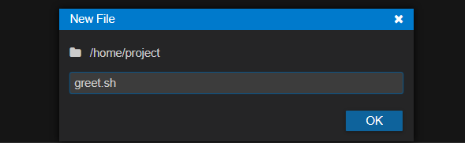
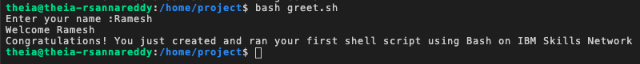

# 🧪 Uygulamalı Lab: Kabuk Betiklerine Başlangıç

## 🎯 Öğrenme Hedefleri

Bu labı tamamladıktan sonra şunları yapabileceksiniz:

* Basit bir Bash kabuk betiği oluşturmak ve çalıştırmak
* Bir Bash kabuk betiğinde *shebang* yönergesini uygulamak

---

## 💻 Skills Network Cloud IDE Hakkında

*Skills Network Cloud IDE* (Theia ve Docker tabanlı), kurs ve proje ile ilgili uygulamalı labler için bir ortam sunar.

 *Theia* , masaüstünde veya bulutta çalışabilen, açık kaynaklı bir IDE'dir (*Integrated Development Environment* – Tümleşik Geliştirme Ortamı).

Bu labı tamamlamak için, Docker konteyneri içinde çalışan Theia tabanlı  *Cloud IDE* ’yi kullanacağız.

---

## ⚠️ Bu Lab Ortamı Hakkında Önemli Uyarı

Bu lab ortamındaki oturumların kalıcı olmadığını unutmayın.

Her bağlandığınızda sizin için yeni bir ortam oluşturulur. Daha önceki oturumda kaydetmiş olabileceğiniz tüm veriler silinir.

Verilerinizi kaybetmemek için, bu lableri tek bir oturumda tamamlamayı planlayın.

---

## 📝 Alıştırma 1 – Temel Bir Kabuk Betiği Oluşturma ve Çalıştırma

Bu alıştırmada, aşağıdakileri yapan basit bir betik oluşturacaksınız:

* Bir kullanıcı adı almak
* Kullanıcıya bir hoş geldin mesajı yazdırmak

Ayrıca, `#` ile başlayan yorum satırlarını da betiğe ekleyeceksiniz. Yorumlar kabuk tarafından çalıştırılmaz.

Uygun şekilde kullanıldıklarında, yorumlar bir kabuk betiğini daha okunabilir hale getirir ve betiğin hata ayıklanmasına yardımcı olur.

---

### ✏️ 1.1. Yeni Bir Betik Dosyası Oluşturma

**Adım 1:** Lab ekranındaki menüden **File → New File** seçeneğini kullanarak yeni bir dosya oluşturun.


**Adım 2:** Dosyayı `greet.sh` olarak adlandırın ve **OK** düğmesine tıklayın.



**Adım 3:** Aşağıdaki satırları yeni oluşturduğunuz dosyaya kopyalayıp yapıştırın:

```bash
# This script accepts the user's name and prints 
# a message greeting the user

# Print the prompt message on screen
echo -n "Enter your name :"	  

# Wait for user to enter a name, and save the entered name into the variable 'name'
read name			

# Print the welcome message followed by the name
echo "Welcome $name"

# The following message should print on a single line. Hence the usage of '-n'
echo -n "Congratulations! You just created and ran your first shell script "
echo "using Bash on IBM Skills Network"
```

**Adım 4:** Dosyayı **File → Save** menü seçeneğini kullanarak kaydedin.

---

### ▶️ 1.2. Betiği Çalıştırma

Menü çubuğuna tıklayıp **Terminal → New Terminal** seçeneğini belirleyerek yeni bir terminal açın.


Bu işlem, ekranın alt kısmında yeni bir terminal penceresi açar.


Yeni açılan terminalde aşağıdaki komutları çalıştırın.

Önce bu yeni dosyanın izinlerini kontrol etmek için aşağıdaki komutu girin:

```bash
ls -l greet.sh
```


Eğer dosya mevcutsa ve okuma izinlerine sahipse, onu çalıştırmak için aşağıdaki komutu girin:

```bash
bash greet.sh
```

Ekranda şu mesaj görünür:

> Enter your name :

Adınızı yazın ve **Enter** tuşuna basın.

Şimdi, girdiğiniz isimle birlikte ekranda hoş geldin mesajlarının görüntülendiğini görmelisiniz.



Tebrikler! İlk Bash kabuk betiğinizi başarıyla çalıştırdınız.

---

## 🧩 Alıştırma 2 – Shebang Satırı Kullanma

Bu alıştırmada, önceki alıştırmada oluşturduğunuz `greet.sh` betiğini düzenleyip bir *shebang* ekleyerek betiği çalıştırılabilir bir dosya haline getireceksiniz.

Bu işlem, betiğin adının bir komut gibi kullanılabilmesini sağlamak için yapılır. Bu özel *shebang* satırını eklemek, betiğin hangi yorumlayıcı ile çalıştırılacağını belirtmenizi sağlar – bu durumda Bash kabuğu.

Aşağıdaki adımları izleyerek betiğinize bir *shebang* eklemeyi öğreneceksiniz.

---

### 🧭 2.1. Yorumlayıcının Yolunu Bulma

`which` komutu, `bash` komutunun yolunu bulmanıza yardımcı olur:

```bash
which bash
```

Bu komut, bu durumda `/bin/bash` yolunu döndürür.

---

### 📝 2.2. greet.sh Betiğini Düzenleyip Shebang Satırını Ekleme

Dosyayı açın ve betiğin en başına aşağıdaki satırı ekleyin:

```bash
#! /bin/bash
```

Betik şimdi aşağıdaki gibi görünmelidir:


```bash
#! /bin/bash
# This script accepts the user's name and prints 
# a message greeting the user

# Print the prompt message on screen
echo -n "Enter your name :"	  

# Wait for user to enter a name, and save the entered name into the variable 'name'
read name			

# Print the welcome message followed by the name
echo "Welcome $name"

# The following message should print on a single line. Hence the usage of '-n'
echo -n "Congratulations! You just created and ran your first shell script "
echo "using Bash on IBM Skills Network"
```

---

### 🔐 2.3. Betiğin İzinlerini Kontrol Etme

`greet.sh` dosyasını adla çalıştırılabilir hale getirmek için bir adım daha gereklidir.

`greet.sh` üzerinde kullanıcıya ait çalıştırma izni eklemek için aşağıdaki komutu girin:

```bash
chmod +x greet.sh
```

Çalıştırma izninin verilip verilmediğini doğrulayın.

💡 **İpucu:** Genellikle bir betiğe tüm kullanıcılar, gruplar ve diğerleri için izin vermek iyi bir fikir değildir. Çalıştırma iznini yalnızca dosyanın sahibi olan kullanıcı (yani siz) ile sınırlamak daha uygundur.

`greet.sh` dosyasının izinlerini değiştirerek dosyayı sadece kullanıcı için çalıştırılabilir yapmak isterseniz, aşağıdaki komutu çalıştırın:

```bash
chmod u+x greet.sh
```

İzinleri doğrulamak için aşağıdaki komutu kullanın:

```bash
ls -l greet.sh
```

Eğer çalıştırma iznini herkese vermek isterseniz, `chmod +x greet.sh` komutunu çalıştırmanız gerekir.

---

### ▶️ 2.4. Betiği Çalıştırma

Kabuk betiğini çalıştırmak için aşağıdaki komutu girin:

```bash
./greet.sh
```

Buradaki `.` mevcut dizini ifade eder. Linux’a `greet.sh` betiğini çalıştırmasını ve bu betiğin geçerli dizinde bulunduğunu söylemiş olursunuz.

---

## 🧪 Pratik Alıştırma

1. Kullanıcının ad ve soyadını alan, bunları sırasıyla `firstname` ve `lastname` değişkenlerinde saklayan ve `"Hello <firstname> <lastname>"` şeklinde bir hoş geldin mesajı yazdıran `greetnew.sh` adlı bir betik oluşturun.

**İpucu için tıklayın**

`read` komutunu ve `echo` komutlarını kullanın. Yorum satırları yazın. *Shebang* satırını eklediğinizden emin olun.

**Çözüm için tıklayın**

**Adım 1:** `greetnew.sh` adlı yeni bir dosya oluşturun.

**Adım 2:** Dosyaya aşağıdaki satırları ekleyin:

```bash
#! /bin/bash
# This script accepts the user's name and prints 
# a message greeting the user
# Print the prompt message on screen
echo -n "Enter your firstname :"	  
# Wait for user to enter a name, and save the entered name into the variable 'name'
read firstname			
# Print the prompt message on screen
echo -n "Enter your lastname :"	  
# Wait for user to enter a name, and save the entered name into the variable 'name'
read lastname
# Print the welcome message followed by the name
echo "Hello $firstname $lastname."
```

**Adım 3:** Dosyayı kaydedin.

**Adım 4:** `greetnew.sh` için sahibine çalıştırma izni ekleyin:

```bash
chmod u+x greetnew.sh
```

**Adım 5:** Dosyayı komut satırından aşağıdaki komutla çalıştırın:

```bash
./greetnew.sh
```

---

## 📚 Özet

Bu labde aşağıdakileri öğrendiniz:

* Basit bir Bash kabuk betiği oluşturmak ve çalıştırmak
* Bir Bash kabuk betiğinde `#! /bin/bash` *shebang* yönergesini uygulamak
