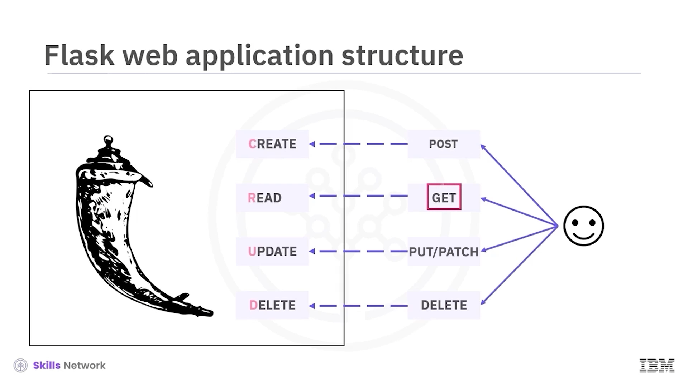
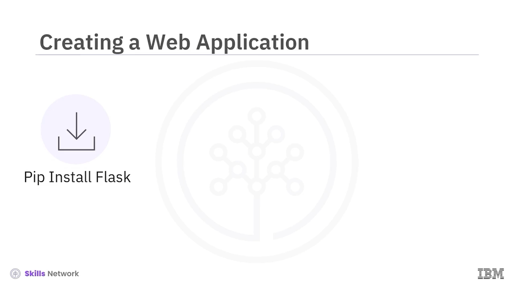
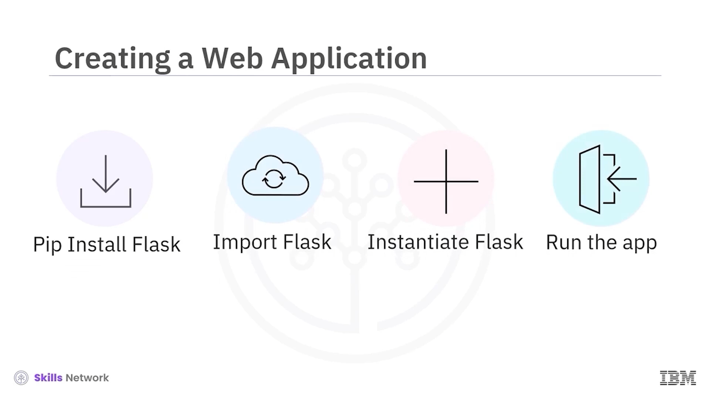
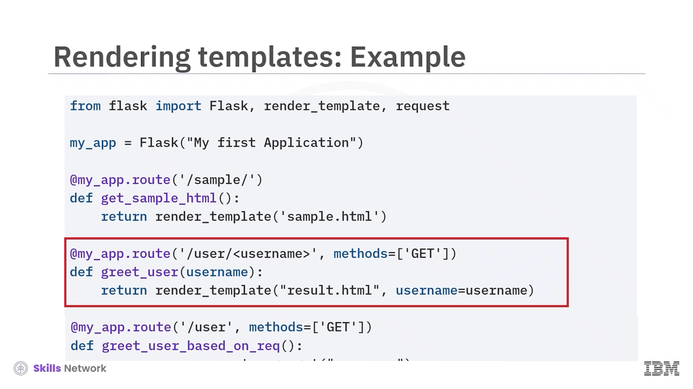
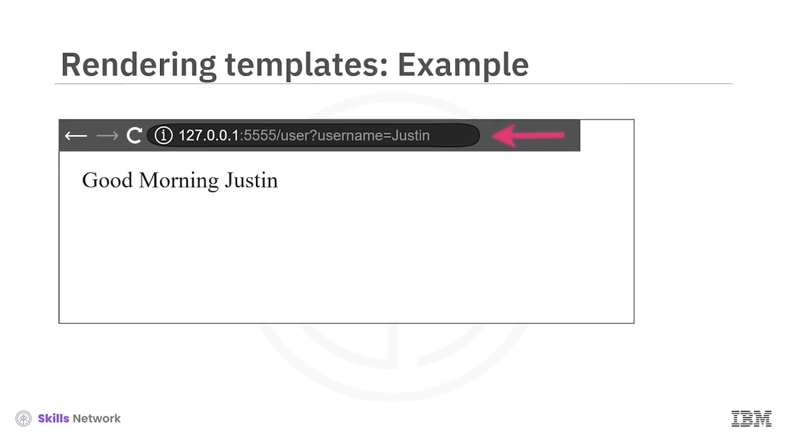
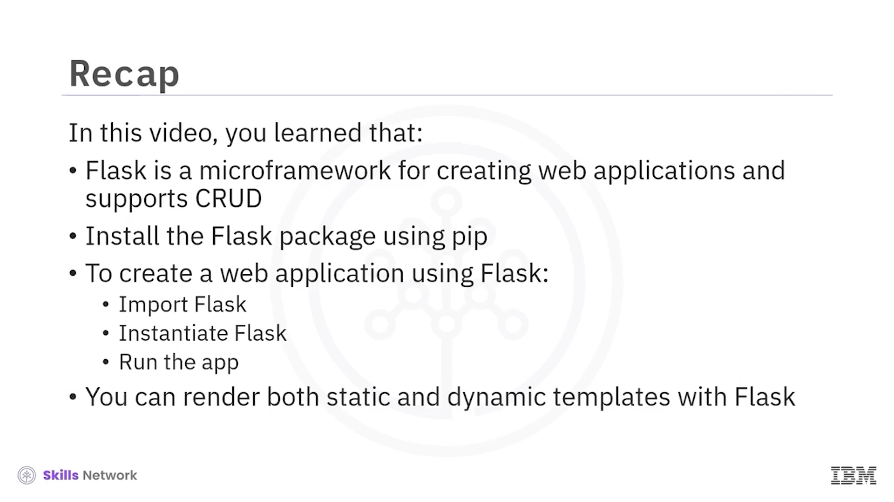

# 🚀 Flask Kullanarak Web Uygulamaları Dağıtma

Flask ile Web Uygulamaları Dağıtmaya hoş geldiniz.

Bu videoyu izledikten sonra şunları yapabileceksiniz:

* Flask özelliklerini açıklamak
* Flask’i kurmak
* Flask kullanarak bir Python web uygulaması oluşturmak ve dağıtmak


---

## 🧩 Flask ve CRUD İşlemleri

Flask, Python ile web uygulamalarını hızlı ve kolay bir şekilde oluşturmak için kullanılan bir mikro framework’tür.

Flask, CRUD işlemlerini destekler; CRUD,  *create (oluştur)* ,  *read (oku)* , *update (güncelle)* ve *delete (sil)* isteklerinden başka bir şey değildir ve bunlar  **POST** ,  **PUT** ,  **GET** , **PATCH** ve **DELETE** istekleri yaparak gerçekleştirilir.


İşte bir Flask uygulamasının temel yapısı. Flask paketinin logosuna dikkat edin.

Şimdi, Flask’i CRUD işlemleri için nasıl kullanabileceğinize bakalım.

**POST** istekleri, nesne veya veri oluşturmak için kullanılır.

Örneğin, bir kullanıcı oluşturmak için **POST** isteklerini kullanabilirsiniz.

Çoğu web uygulamasında,  **POST** ’un nesne veya veri oluşturmak için kullanıldığını görürsünüz.

Sunucudan veri okumak için **GET** isteğini kullanabilirsiniz.

Mevcut veri veya nesneleri güncellemek için **PUT** ve **PATCH** isteklerini kullanabilirsiniz.

Mevcut veri veya nesneleri silmek için **DELETE** isteklerini kullanabilirsiniz.

Dikkat edin, çoğu web uygulaması, nesne ve verileri oluşturmak, güncellemek ve silmek için  **POST** ’u, okumak için ise  **GET** ’i kullanma eğilimindedir.

Başka bir video,  **POST** , **PUT** ve **GET** isteklerini ayrıntılı olarak açıklar.



---

## 📦 Flask Kurulumu

Şimdi, Flask ile bir web uygulamasının nasıl oluşturulacağına bakalım.

İlk adım, Python için standart paket yöneticisi olan `pip` kullanarak Flask paketini kurmaktır.

Diğer tüm paketlerde olduğu gibi, aşağıdaki komutu kullanabilirsiniz:

```bash
pip install flask
```

Bu komut, Flask’in en güncel sürümünü indirir.

Flask paketi kuruldu ve artık web uygulamasını oluşturmaya hazırsınız.





---

## 🏗️ Basit Bir Flask Web Uygulaması Oluşturma

Sonraki adımda, Flask paketini içe aktarın, `Flask` sınıfını örnekleyin, bir web uygulaması oluşturun ve ardından uygulamayı çalıştırın.

Gösterim amacıyla, bir **GET** isteğine yanıt olarak `"hello world"` metnini döndüren bir web uygulamasına bakalım.


---

## ✅ Adım Adım “Hello World” Uygulaması

### 1️⃣ Adım: Flask’i Kurun

Flask’i `pip` ile kurun.

```bash
pip install flask
```

### 2️⃣ Adım: Flask Modülünü İçe Aktarın

Flask paketinden `Flask` modülünü içe aktarın. Bunu yapmak için, küçük `flask` modülünden büyük **F** ile yazılan `Flask` sınıfını içe aktarın:

```python
from flask import Flask
```

### 3️⃣ Adım: Web Uygulaması Nesnesini Oluşturun

`Flask` sınıfından bir nesne oluşturarak bunu web uygulaması olarak kullanın ve `MyFirstWebApplication` adını verin, `app` olarak saklayın.

Örneğin:

```python
app = Flask("MyFirstWebApplication")
```

Çoğu uygulama, anlaşılır olması için `app` referans adını kullanır. Ancak `app` sadece bir referans adıdır ve başka bir isim de kullanabilirsiniz.

---

## 🛣️ Root Tanımlama ve GET Metodu

### 4️⃣ Adım: Root’u ve Çağrılacak Metodu Tanımlayın

Root ve bu root’a erişildiğinde çağrılacak metodu tanımlayın.

Örneğin:

```python
@myapp.route('/')
```

Bu örnekte ne **GET** ne de **POST** belirtilmiştir. Bir istek türü belirtmediğinizde, varsayılan olarak **GET** kullanılır.

Bu nedenle, örnekteki endpoint artık root için **GET** isteklerine hizmet verebilecektir.


---

## 🗣️ `hello` Metodu ve Yanıt Döndürme

### 5️⃣ Adım: `hello` Metodunu Yazın

`hello` metodu şu şekilde yazılır:

```python
def hello():
    ...
```

`hello` metodu, bir önceki adımda tanımlanan API endpoint’e sistem eriştiğinde çağrılacaktır.

Bunu yapmak için kullanılan kod, `app.run` ifadesidir; parantez içinde `debug` ifadesiyle kullanılır.

Bu metod herhangi bir parametre almaz ve `"hello world"` dizesini döndürür.

Kodda bu, şu şekilde yazılır:

```python
return 'hello world!'
```


---

## ▶️ Uygulamayı Çalıştırma Koşulu

### 6️⃣ Adım: `__name__ == "__main__"` Koşulunu Ekleyin

Web uygulamasının yalnızca `name` özniteliği `main` olarak ayarlanmışsa çalışması gerektiği koşulunu ekleyin.

Varsayılan olarak `name`, açıkça değiştirilmedikçe `main` olarak ayarlanır.

Bu kodu, diğer Python uygulamaları gibi kaydedip çalıştırabilirsiniz.


Metin olarak tarif edilen ifade:

`app myapp.run open round bracket debug equals true with capital T close round bracket.`

Yani `debug` değeri büyük `T` harfiyle `True` olarak ayarlanır:

```python
myapp.run(debug=True)
```

Geliştirme ortamında sunucuyu başlatmak için, kodu bir Python dosyasına kaydetmeniz ve diğer Python uygulamaları gibi çalıştırmanız gerekir.

Web uygulaması sunucusu başladığında, uygulamaya erişilebilecek IP adresini ve port numarasını size gösterir.

Endpoint’leri kontrol etmek için, tarayıcıyı açabilir ve sunucu çıktısında gördüğünüz endpoint’e bağlanabilirsiniz:

`127.0.0.1` IP adresinde, `5000` portu üzerinden bağlanarak web sunucusu uygulamasından dönen `"hello world"` dizesini görebilirsiniz.


---

## 🧬 Flask’te Templates (Şablonlar)

 *Templates* , web uygulamasından sunulan, önceden oluşturulmuş HTML sayfalarından başka bir şey değildir. Bunlar hem statik hem de dinamik olabilir.

Varsayılan olarak Flask uygulaması, kök dizin altında **`templates`** adlı bir dizinde şablonları arar.

Eğer şablonlar, kök dizinde **`static`** adlı bir klasörde tutulan resimleri, stil dosyalarını ( *styling sheets* ) veya JavaScript dosyalarını kullanacaksa, statik sayfalar olduğu gibi ( *as is* ) görüntülenir.

Dinamik sayfalar genellikle her istek için dinamik olarak doldurulan bilgiler içerir. Bu sayfalar çoğunlukla argüman olarak geçirilen değerlere dayanır.

Argümanlar URL üzerinden veya istek parametreleri olarak gönderilebilir.


---

## 🧪 Örnek Bir Flask Uygulaması (Statik ve Dinamik Sayfalar)

Şimdi örnek bir Flask uygulamasına bakalım.

Başlangıçta, web uygulaması oluşturmak için `Flask`’i, gelen isteği ( *incoming request* ) işlemek için `request`’i ve statik/dinamik HTML sayfaları görüntülemek ( *render etmek* ) için `render_template` fonksiyonunu içe aktarırız.


Şu ifadeyi yazın:

```python
from flask import Flask, render_template, request
```

Sonra `Flask`’i örnekleyin ve statik klasörü ayarlayın.

Örneğin:

```python
myapp = Flask("MyFirstApplication", static_folder="static")
```

Varsayılan klasör adı `static`’tir; ancak statik içerikleri farklı isimde bir dizinde de tutabilirsiniz, yeter ki bunu açıkça ayarlayın.


---

## 🌐 Örnek Uygulamadaki Üç Endpoint

Bu web uygulamasında üç endpoint olduğunu fark edin.

### 1️⃣ `/sample` – Statik Sayfa

İlk endpoint `/sample`’dır. Bu endpoint, statik bir HTML sayfası görüntüler.

Bu HTML içindeki görsel, `static` dizininden alınır.

Bunu yapan kod:

```python
@myapp.route('/sample')
def get_sample_html():
    return render_template('sample.html')
```

İkinci satırda:

`def get_sampleHTML` yazılır (metinde belirtildiği gibi arada boşluk yoktur).

Üçüncü satırda:

`return render_template('sample.html')` yazılır.


### 2️⃣ `/user/<username>` – URL Parametresi ile

Sonraki endpoint `/user/<username>`’dir; burada açı parantez içindeki `username` parametredir.

Kod şu şekilde yazılır:

```python
@myapp.route('/user/<username>', methods=['GET'])
```

Metinde belirtildiği gibi, `methods = GET` olarak açıkça ayarlanmıştır; bu, isteğin türünü nasıl belirtebileceğinizi göstermek içindir.

Herhangi bir şey belirtilmezse, isteğin **GET** olduğu kabul edilir.

Sayfa, URL’de gönderdiğimiz parametre ile görüntülenir.



### 3️⃣ `/user/username` – Request Parametresi ile

Son endpoint yine `/user/username`’dir; burada `username` bir istek parametresi ( *request parameter* ) olarak gönderilir.

Sayfa, istekle gönderilen bu parametreyle görüntülenir.




---

## 🧾 Videoda Öğrendikleriniz

Bu videoda şunları öğrendiniz:

* Flask, web uygulamaları oluşturmak için kullanılan bir mikro framework’tür ve CRUD’u destekler.
* Flask paketini `pip` kullanarak kurabilirsiniz.
* Flask kullanarak web uygulaması oluşturmak için `Flask`’i içe aktarır, `Flask`’ten bir nesne örnekler ve uygulamayı çalıştırırsınız.
* Flask ile hem statik hem de dinamik şablonları ( *templates* ) görüntüleyebilirsiniz.


