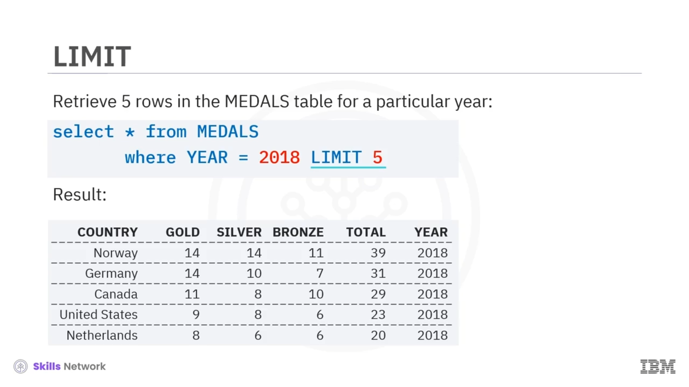

# 📊 COUNT, DISTINCT ve LIMIT

## 👋 Giriş

Merhaba ve hoş geldiniz.

Bu videoda, *SELECT* ifadeleriyle birlikte kullanılan birkaç yararlı ifadeyi kısaca tanıtacağız.

---

## 🔢 COUNT ifadesi

İlki *COUNT* ifadesidir.  *COUNT* , sorgu ölçütleriyle eşleşen satırların sayısını getiren yerleşik ( *built-in* ) bir veritabanı fonksiyonudur.

Örneğin, belirli bir tablodaki toplam satır sayısını almak için aşağıdaki ifadeyi kullanabilirsiniz:

```sql
SELECT COUNT(*) FROM tablename;
```

Diyelim ki *MEDALS* adlı bir tablo oluşturdunuz ve bu tablonun *COUNTRY* adlı bir sütunu var ve madalya alan kişinin Kanada'dan olduğu satırların sayısını getirmek istiyorsunuz.

Bu durumda aşağıdaki gibi bir sorgu çalıştırabilirsiniz:

```sql
SELECT COUNT(COUNTRY) FROM MEDALS WHERE COUNTRY = 'CANADA';
```


---

## 🧹 DISTINCT ifadesi

İkinci ifade *DISTINCT*tir.

 *DISTINCT* , bir sonuç kümesindeki yinelenen değerleri kaldırmak için kullanılır.

Örneğin, bir sütundaki benzersiz değerleri almak için aşağıdaki ifadeyi yazabilirsiniz:

```sql
SELECT DISTINCT columnname FROM tablename;
```

Daha önce bahsedilen *MEDALS* tablosunda, bir ülke birden çok kez altın madalya almış olabilir.

Örneğin, altın madalya almış benzersiz ülkelerin listesini getirebilirsiniz. Yani, aynı ülkenin tüm yinelenen değerlerini kaldırırsınız:

```sql
SELECT DISTINCT COUNTRY FROM MEDALS WHERE MEDALTYPE = 'GOLD';
```


---

## 📉 LIMIT ifadesi

Üçüncü ifade *LIMIT*tir.  *LIMIT* , veritabanından getirilen satır sayısını sınırlandırmak için kullanılır.

Örneğin, bir tablodaki yalnızca ilk 10 satırı getirebilirsiniz:

```sql
SELECT * FROM tablename LIMIT 10;
```

Bu, çok büyük olabilen tüm sonuç kümesini getirmek yerine, sadece birkaç satıra bakarak sonuç kümesini incelemek için çok yararlı olabilir.

Örneğin, belirli bir yıl için *MEDALS* tablosundan yalnızca birkaç satır getirebilirsiniz:

```sql
SELECT * FROM MEDALS WHERE YEAR = 2018 LIMIT 5;
```


---

## ✅ Kapanış

Bu videoda, *SELECT* ifadeleriyle birlikte kullanılan bazı yararlı ifadeleri, yani yerleşik ( *built-in* )  *COUNT* , *DISTINCT* ve *LIMIT* fonksiyonlarını ele aldık.

Bu videoyu izlediğiniz için teşekkürler.



