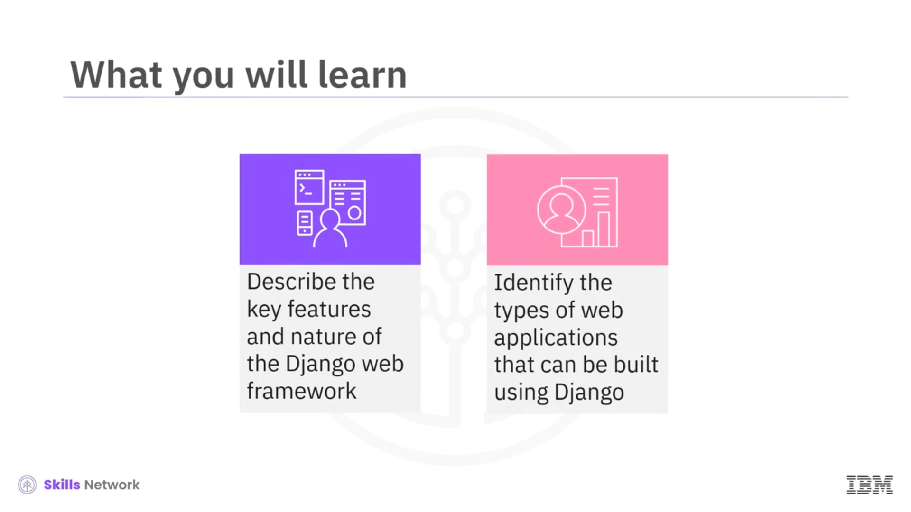
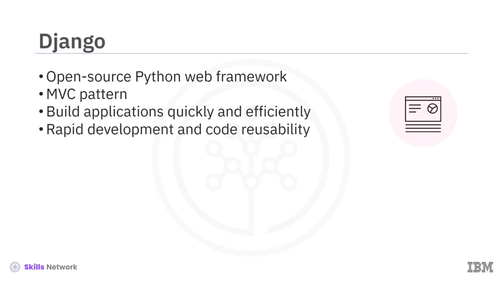
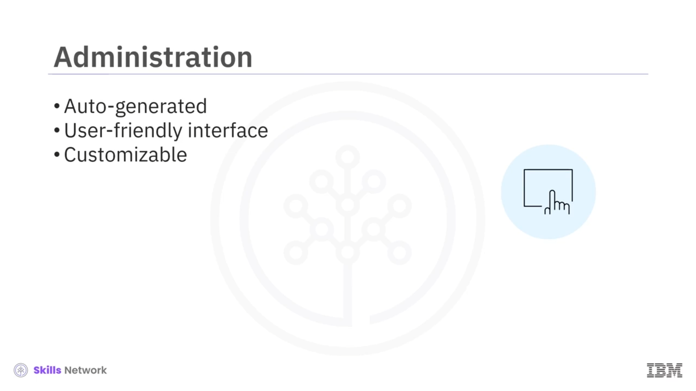
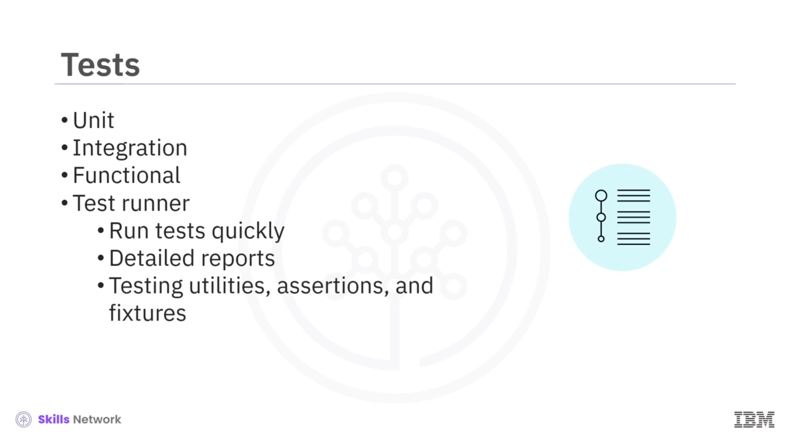
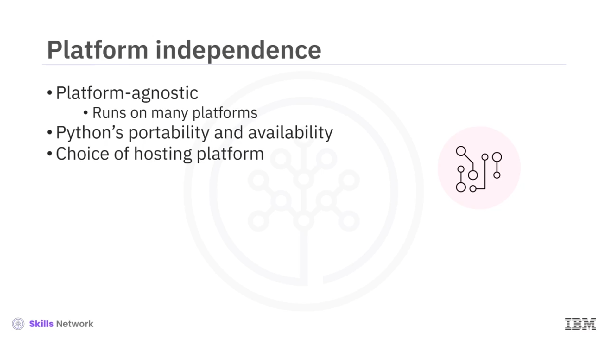
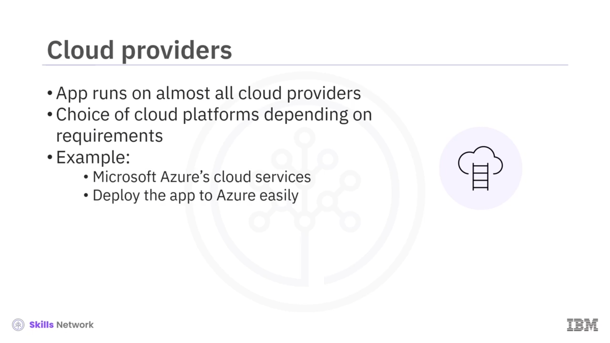
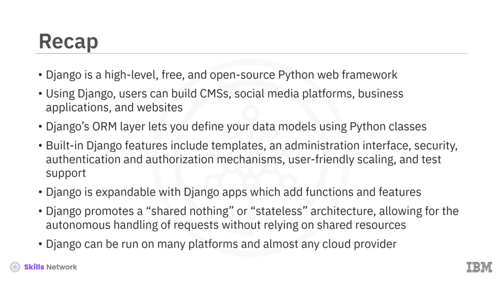

# 🐍 Django'ya Giriş

Django’ya girişe hoş geldiniz.

Bu videoyu izledikten sonra, Django web çatısının (framework’ünün) temel özelliklerini ve doğasını açıklayabilecek ve Django kullanılarak hangi tür web uygulamalarının geliştirilebileceğini belirleyebileceksiniz.

---

## 🎯 Django’nun Temel Özellikleri

Django, yüksek seviyeli, erişilebilir ve açık kaynaklı bir Python web çatısıdır.

*Model-View-Controller (MVC)* desenini takip eder; bu desen, geliştiricilerin web uygulamalarını hızlı ve verimli bir şekilde oluşturmalarına yardımcı olur.

Django, hızlı geliştirme ve kod tekrar kullanılabilirliğini (code reusability) mümkün kılmak için oluşturulmuştur.

---

## 🌐 Django ile Geliştirilebilen Uygulama Türleri

Kullanıcılar, Django ile neredeyse her tür web uygulamasını geliştirebilir; bunlara içerik yönetim sistemi (*Content Management System* veya  *CMS* ), sosyal medya platformları, iş uygulamaları ve yeni web siteleri dahildir.

Django’yu tanımlamak için yaygın kullanılan bir ifade, Django web çatısının kapsamlı yapısı nedeniyle “ **piller dahil** ” ( *batteries included* ) ifadesidir.

Django, kullanıma hazır geniş bir özellik ve işlev yelpazesi sağlar.

---

## 🧬 ORM Katmanı: Nesne-İlişkisel Eşleme

Django, veriyi tanımlamanızı sağlayan bir *object relational mapping* yani *ORM* katmanı sunar; bu katman, veri modellerinizi Python sınıflarını kullanarak tanımlamanıza imkân verir.

Bu, veritabanlarıyla çalışmayı ve aşağıdaki işlemleri gerçekleştirmeyi kolaylaştırır:

* Sorgulama (querying)
* Ekleme (inserting)
* Güncelleme (updating)
* Kayıt silme (deleting records)

---

## 🧩 Şablon Motoru ve Yönetim Arayüzü

Django’nun yerleşik bir şablon (template) motoru vardır; bu motor, uygulamanızın iş mantığını (business logic) sunum mantığından (presentation logic) ayırmanıza imkân tanır.

Django ayrıca, uygulamanızdaki modellere dayalı olarak otomatik olarak oluşturulan bir yönetim (administration) arayüzü sağlar.

Bu arayüz, site içeriğini yönetmek için kullanıcı dostu bir arayüz sunar ve belirli gereksinimlere uyacak şekilde özelleştirilebilir.

---

## 🔐 Güvenlik, Kimlik Doğrulama ve Yetkilendirme

Django, yaygın web güvenlik açıklarına karşı koruma sağlayan güçlü güvenlik özellikleri sunar; bunlara şunlar dahildir:

* *Cross-Site Scripting (XSS)*
* *Cross-Site Request Forgery (CSRF)*
* *SQL injection*

Django ayrıca, parola karma (password hashing) ve kullanıcı oturum yönetimi (user session management) için mekanizmalar sağlar.

Django’nun yerleşik kimlik doğrulama (authentication) ve yetkilendirme (authorization) mekanizmaları vardır; bunlar, kullanıcı hesaplarını yönetmenize (kayıt, oturum açma ve parola yönetimi dahil) imkân tanır.

Ayrıca, kullanıcı izinlerini ve erişim kısıtlamalarını tanımlamak için ince ayarlı yetkilendirme kontrolleri (fine-grained authorization controls) sunar.

---

## 📦 Modüller, Uygulamalar ve Üçüncü Taraf Paketler

Django, modüller aracılığıyla genişletilebilir; bunlara Django uygulamaları ( *Django apps* ) veya paketler ( *packages* ) de denir.

Bu modüller, Django projelerinize belirli işlevler veya özellikler eklemek için entegre edebileceğiniz yeniden kullanılabilir bileşenlerdir.

Örneğin:

* Django, `gettext` modülünü kullanarak dil yerelleştirmesini (language localization) destekler.
* Django, formlarda otomatik bot gönderimlerini engellemeye yardımcı olan captcha entegrasyonu için `Django Simple Captcha` gibi üçüncü taraf paketler sunar.
* Django’nun yerleşik forms modülü, form verisinin belirli ölçütleri karşılamasını sağlayan güçlü form doğrulama (validation) mantığını içerir.

---

## 🏗️ Paylaşımsız (Stateless) Mimari ve Ölçeklenebilirlik

Django, her web sunucusu örneğinin birbirinden bağımsız çalıştığı bir mimariyi teşvik eder; buna *share nothing* veya *stateless* mimari denir.

Her web sunucusu örneği, istekleri ve yanıtları, paylaşılan kaynaklara güvenmeden veya istekler arasında sunucu tarafı bir durum (server-side state) tutmadan, özerk şekilde (autonomously) işler.

Django web çatısı, ölçeklemeyi kolaylaştırır; çünkü Django uygulaması *stateless* olduğu için kullanıcı oturumlarını yönetir.

Bu, geliştiricilerin bir uygulamanın daha fazla örneğini eklemesini ve kullanıcı deneyimini modeller arasında veri kaybetmeden aktarmasını sağlar.

---

## ✅ Test Desteği ve Test Çerçevesi

Django, birim (unit), entegrasyon (integration) ve işlevsel (functional) testler dahil olmak üzere her tür testi destekler.

Django’nun test çerçevesi, geliştiricilerin testleri hızlı bir şekilde çalıştırmasını sağlayan bir test çalıştırıcı (test runner) içerir ve ayrıntılı test raporları sunar.

Test yazmayı ve yürütmeyi kolaylaştırmak için çeşitli test yardımcıları (testing utilities), iddialar (assertions) ve  *fixture* ’lar sağlar.

---

## ☁️ Platform Bağımsızlığı ve Bulut Dağıtımı

Django, Python üzerine inşa edildiği için platform bağımsızdır ( *platform agnostic* ); bu da onun birçok platformda çalışabileceği anlamına gelir.

Bu platform bağımsızlığı, Python’un taşınabilirliğinden (portability) ve farklı işletim sistemlerinde geniş ölçüde bulunabilir olmasından kaynaklanır.

Bu durum, geliştiricilerin ihtiyaçlarına ve altyapılarına en uygun barındırma (hosting) platformunu seçmelerine olanak tanır.

Bir Django uygulaması, neredeyse tüm bulut sağlayıcılarında çalıştırılabilir.

Django’nun platformdan bağımsız yapısı, uygulamanızı belirli gereksinimlerinize ve tercihlerinize bağlı olarak çeşitli bulut platformlarına dağıtmanıza (deploy) imkân verir.

Örneğin, bir blog platformuna sahipseniz ve Microsoft Azure’un bulut hizmetlerinin sadeliğini ve kullanıcı dostuluğunu tercih ediyorsanız, blog uygulamanızı hiçbir zorluk yaşamadan Azure’a dağıtabilirsiniz.

---

## 👥 Django Topluluğu ve Açık Kaynak Gelişim

Django web çatısı, başarısının büyük bir kısmını kendini adamış kullanıcı topluluğuna borçludur.

Bu topluluk, dünya çapında geliştiricileri, tasarımcıları ve tutkulu meraklıları içerir; hepsi, olağanüstü web uygulamaları oluşturma konusunda ortak bir tutkuyu paylaşır.

Django topluluğunun temel güçlerinden biri, çatıyı sürekli geliştirme ve ilerletme konusundaki kararlılığıdır.

Django’nun açık kaynak (open-source) yapısı, geliştiricilerin uzmanlıklarını ve iyileştirmelerini çatı kod tabanına (framework’s codebase) katkıda bulunmalarını mümkün kılar.

Bu kolektif çaba, yeni özellikler sunan, performansı optimize eden ve güvenlikle ilgili endişeleri ele alan düzenli güncellemeler ve sürümlerle sonuçlanır.

---

## 🌟 Django ile Geliştirilmiş Ünlü Web Uygulamaları

Birçok ünlü web uygulaması, Django kullanılarak geliştirilmiştir.

* Fotoğraf ve video paylaşımı için popüler bir sosyal medya platformu olan Instagram, başlangıçta Django kullanılarak oluşturulmuştur.
* Önde gelen bir müzik akış platformu olan Spotify da altyapısında Django’yu kullanmıştır.
* Popüler video paylaşım platformu YouTube, mimarisine Django’yu dahil etmiştir.
* Ve tanınmış bir haber yayını olan The Washington Post, içerik yönetim sistemi (content management system) veya *CNS* için Django’yu benimsemiştir.

---

## 🧾 Videonun Özeti

Bu videoda şunları öğrendiniz:

* Django, yüksek seviyeli, erişilebilir ve açık kaynaklı bir Python web çatısıdır.
* Django kullanarak, içerik yönetim sistemleri ( *CMS’ler* ), sosyal medya platformları, iş uygulamaları ve web siteleri oluşturabilirsiniz.
* Django’nun *object relational mapping (ORM)* katmanı, veri modüllerinizi Python sınıflarını kullanarak tanımlamanıza imkân verir.
* Django’daki yerleşik özellikler; şablonlar (templates), bir yönetim arayüzü, güvenlik, kimlik doğrulama ve yetkilendirme mekanizmaları, kullanıcı dostu ölçekleme ve test desteğini içerir.
* Django, işlevler ve özellikler ekleyen modüller veya Django uygulamaları ( *Django apps* ) ya da paketlerle genişletilebilir.
* Django, istek ve yanıtların paylaşılan kaynaklara güvenmeden özerk biçimde ele alınmasını sağlayan *share nothing* veya *stateless* bir mimariyi teşvik eder.
* Ve Django, her platformda ve neredeyse her bulut sunucusunda çalışabilen platformdan bağımsız ( *platform agnostic* ) bir yapıya sahiptir.

