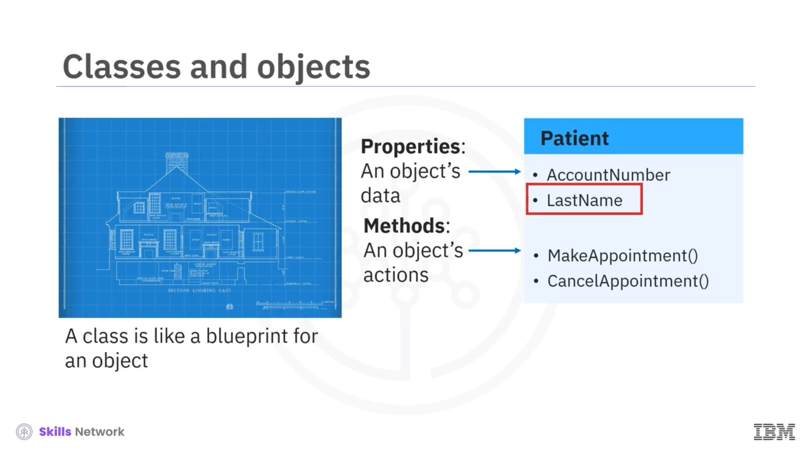
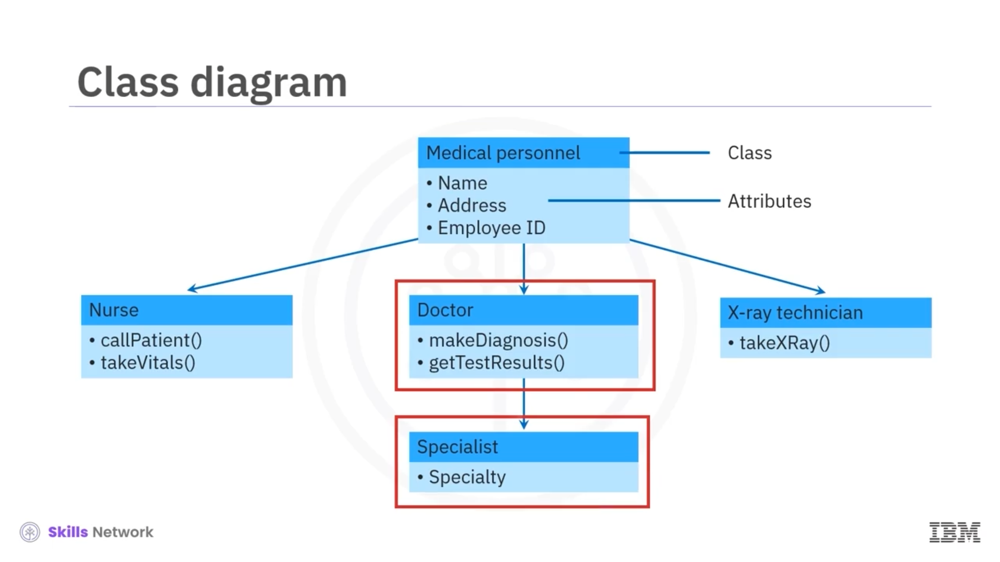

# 🧩 Nesne Yönelimli Analiz ve Tasarım

Nesne yönelimli analiz ve tasarıma hoş geldiniz.

Bu videoyu izledikten sonra şunları yapabileceksiniz:

* Nesnelerin ve sınıfların ne olduğunu açıklamak.
* Bir sınıf diyagramının amacını tanımlamak.
* Nesne yönelimli tasarımı yazılım mimarisiyle ilişkilendirerek açıklamak.

## 🧱 OOAD Nedir?

Kısaca *OOAD* olarak adlandırılan *object oriented analysis and design* (nesne yönelimli analiz ve tasarım), sistemin geliştirilmesinde nesne yönelimli programlama dillerinin kullanılacağı durumlarda bir yazılım sistemini analiz etmek ve tasarlamak için kullanılan bir yaklaşımdır.

OOAD’i tartışmadan önce, Java, C++ veya Python gibi dillerdeki nesne yönelimli programlama hakkında biraz daha bilgi edinelim.

OOAD’in merkezinde nesneler bulunur. Nesneler veri içerir ve ayrıca nesnenin gerçekleştirebileceği eylemleri belirleyen davranışlara sahiptir.

## 🏥 Hasta Nesnesi Örneği: Nia Patel

Örneğin, bir hastayı temsil eden bir nesne oluşturabilirim. Diyelim ki bu hastanın adı Nia Patel ve Nia, aldığı bir randevuyu iptal etmek zorunda.

Ancak Nia nesnesini oluşturmadan önce, önce hasta nesnesinin genel bir sürümünü oluşturmamız gerekir. Bir nesnenin genel sürümüne *sınıf* ( *class* ) denir. Nia hakkında daha fazla konuşmadan önce, şimdi sınıfları ele alalım.

Özgül nesneler, yani *instances* (örnekler), bir nesne için birer plan veya şablon olan sınıflardan oluşturulur. Önceki örneğimizde, Nia Patel’i ele alırsak, Nia hasta sınıfının bir örneği olur.

## 🧬 Sınıflar, Özellikler ve *Instantiation*

Sınıf, nesnenin genel niteliklerini, yani özelliklerini ve metotlarını içerir; ancak bu genel nitelikler, nesne oluşturulduğunda — ki kod içinde buna *instantiation* denir — belirli değerlere ayarlanır.

Hasta sınıfında, bir özellik olan ancak bu soyadının ne olduğunu belirtmeyen `LastName` adlı bir değişken olabilir. `LastName`, nesne oluşturulup bir isim atanana kadar bir yer tutucudur.

Nesne örneği oluşturulduktan sonra, nesnenin bazı eylemler gerçekleştirmesini sağlamak için metotları çağrılabilir; örneğin bir randevu alma veya bir randevuyu iptal etme gibi.

OOAD, birbirleriyle etkileşime giren nesnelere bölünebilen sistemler için kullanılır. Bu sayede birden fazla geliştirici, uygulamanın farklı yönleri üzerinde aynı anda çalışabilir.

Daha önce de belirtildiği gibi, bir sistemin hem statik yapısını hem de dinamik davranışını gösteren görsel *UML* diyagramları oluşturulabilir.

## 📊 Sınıf Diyagramları ve Yapısal UML

Davranışsal UML diyagramlarına dair birkaç örnek zaten gördük. Şimdi, sınıf diyagramı ( *class diagram* ) adı verilen yapısal bir UML diyagramına bakalım.

Artık sınıfların ne olduğunu bildiğimize göre, bu bir sınıf diyagramı örneğidir.

Sınıf diyagramları, OOAD’de bir yazılım sisteminin yapısını aktarmak için yaygın olarak kullanılır. Sınıf diyagramı, nesne yönelimli bir tasarımda sınıfların birbirleriyle nasıl ilişkilendiğini gösterir. Her kutu bir sınıfı temsil eder ve onun niteliklerini gösterir.

## 🧬 Alt Sınıflar ve Kalıtım İlişkisi

Bir nesnenin niteliklerinin, hem özellikleri veya verileri hem de metotlar adı verilen kullanılabilir eylemleri olduğunu unutmayın.

Bir sınıf diyagramı, sınıflar arasındaki ilişkileri de gösterir. Bir alt sınıfın, üst sınıfının niteliklerini miras aldığı söylenir; bu, üst sınıfla aynı özellik ve metotlara sahip olduğu, ancak ek özellikler ve metotlar da ekleyebileceği anlamına gelir.

Bu diyagramda hemşire, doktor ve teknisyen sınıfları tıbbi personel sınıfının alt sınıflarıdır ve uzman sınıfı da doktor sınıfının bir alt sınıfıdır. Bu da doktorların tıbbi personelin yapabildiği her şeyi yapabildiği, uzmanların ise bir doktorun yapabildiği her şeyi yapabildiği anlamına gelir.

## ✅ Videonun Özeti

Bu videoda, nesne yönelimli analiz ve tasarımın, etkileşen nesnelerin davranışlarına dayalı olarak bir yazılım sistemini planlama süreci olduğunu öğrendiniz.

Nesneler veri içerir ve ayrıca nesnenin gerçekleştirebileceği eylemleri belirleyen davranışlara sahiptir.

Sınıflar, nesneler için birer plandır.

Bir sınıf diyagramı, nesneler arasındaki ilişkiyi gösteren yapısal bir UML diyagramıdır.

