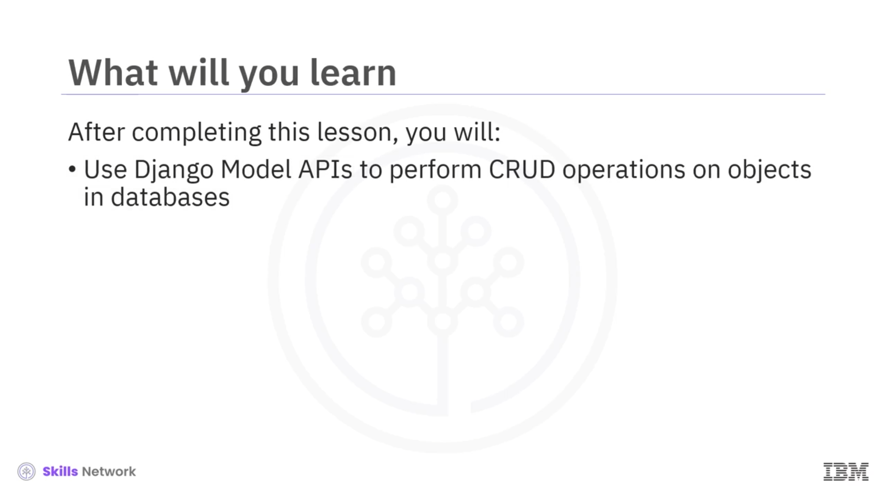
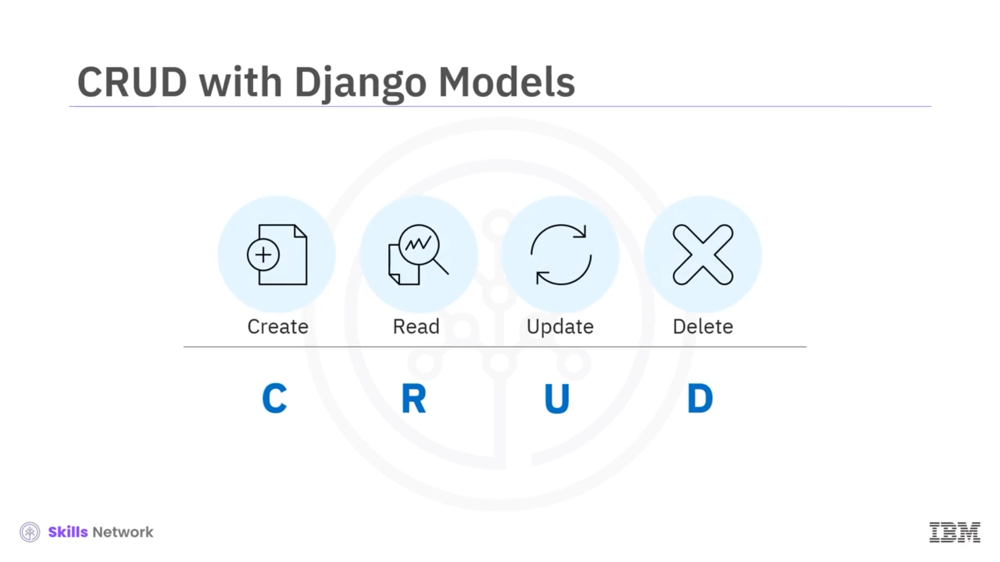
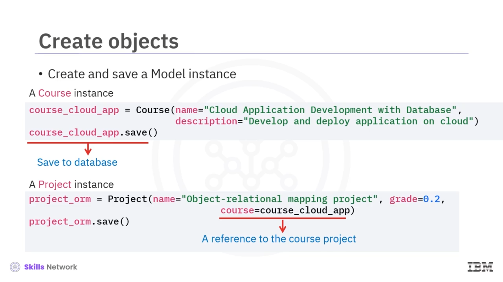
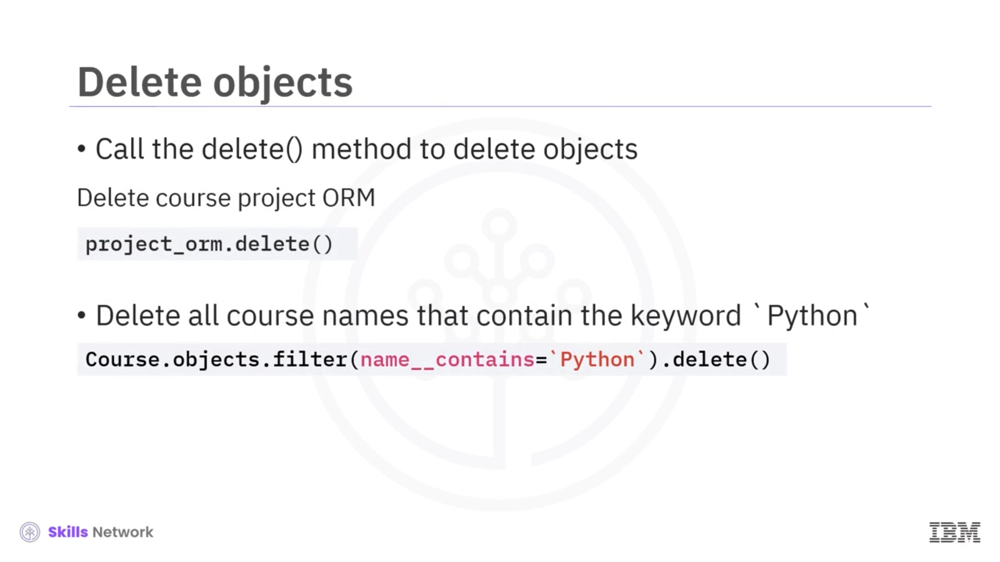

# 🧩 Django Modelleri CRUD

## 👋 Django Modelleri CRUD’a Hoş Geldiniz

Django Modelleri CRUD’a hoş geldiniz.

Bu videoyu izledikten sonra şunları yapabileceksiniz:

Nesneler üzerinde CRUD işlemleri gerçekleştirmek için Django Model API’lerini kullanmak.

---

## 🧱 CRUD İşlemleri ve Django Model API’leri

Veriler üzerinde en yaygın işlemler şunlardır:

Create (Oluştur), Read (Oku), Update (Güncelle) ve Delete (Sil).

Django Model, SQL sorguları yazmadan nesneleri işlemek için kapsamlı CRUD API’leri sağlar.

---

## 📚 Örneklerde Kullanılacak Çevrimiçi Kurs Modelleri

Kullandığımız örnekler için çevrimiçi kurs modellerini gözden geçirelim.

Temel *User* modeli, *Instructor* ve *Learner* modellerimiz hakkında ortak bilgileri içerir.

*Instructor* modeli, *User* modelinden miras alınır ve “is full time” (tam zamanlı mı) ya da toplam öğrenci sayısı gibi alanlara sahiptir.

*Learner* modeli de miras alınmıştır.

Meslek ( *occupation* ) ve sosyal bağlantı ( *social link* ) gibi alanlara sahiptir.

*Course* modeli, hem *Instructor* hem de *Learner* modelleriyle *Many-To-Many* (Çoktan-Çoğa) ilişkilere sahiptir.

*Course* modeli ayrıca *Project* modeliyle *Many-To-One* (Çoktan-Bire) ilişkiye sahiptir.

---

## 🧬 Nesne Oluşturma ve İlişkiler Kurma

Bir Django modelinde, bir nesne oluşturur ve onu veritabanına bir kayıt olarak eklemek için modelin `save` yöntemini çağırırsınız.

Burada `course_cloud_app` nesnesini oluşturup kaydettik.

Oluşturduğunuz nesne, başka bir modele referans içeriyorsa — örneğin bir *Foreign Key* ya da *Many-to-Many* alanı gibi — bir ilişki oluşturmak için ilgili model referansını kullanırsınız.

Bir *Project* nesnesi oluşturduk ve onun *Course* dış anahtarını ( *Foreign Key* ) az önce oluşturduğumuz bulut uygulaması kursuna ( *cloud app course* ) referans verecek şekilde ayarladık.

---

## 🔍 Kayıtları Okuma (Read) İçin Sorgulama

Nesneleri ve ilişkilerini veritabanına ekledikten sonra, bunları sorgulayabiliriz.

Önce, bir model için tüm nesnelerin nasıl okunacağına bakalım.

Bu, SQL’de bir tablodaki tüm satırları almak için `SELECT *` kullanmaya denktir.

Genel olarak, Django Model API’sini kullanarak nesneleri okumak için, model sınıfınız üzerinde bir *Manager* kullanarak bir *QuerySet* oluşturmanız gerekir.

Bir  *QuerySet* , veritabanındaki kayıtların bir koleksiyonunu temsil eder.

---

## 🧩 Model Manager ve QuerySet Kullanımı

Modelinizi bir Django Model’den (*Django Model* sınıfından) kalıtım alarak tanımladıktan sonra — örneğin bu örnekteki *Course* modeli gibi — veritabanı kayıtlarına erişmek için modelin  *Manager* ’ını bir arayüz olarak kullanabilirsiniz.

Varsayılan olarak, model yöneticisinin ( *model manager* ) adı `objects`’tır.

Tablo düzeyindeki işlemler ile kayıt düzeyindeki işlemleri birbirinden ayırmak için, `objects` yöneticisine yalnızca model sınıfını kullanarak erişebilirsiniz; model örneği üzerinden erişemezsiniz.

Tüm kurs kayıtlarını almak için,  *Manager* ’ın `all` metodunu kullanırsınız; bu size bir *QuerySet* nesnesi döndürür.

Çıktıda, tüm kursların döndürüldüğünü ve *QuerySet* nesnesine dahil edildiğini görebilirsiniz.

---

## 🎯 Alt Kümeler ve `filter` Metodu

Genellikle, tüm tablo yerine yalnızca bir alt kümeye ihtiyaç duyarsınız.

Yarı zamanlı eğitmenlerden oluşan bir alt küme oluşturmak için, başlangıç  *QuerySet* ’ini `filter` metodunu çağırarak daraltırsınız.

`filter` metodu, “büyüktür”, “küçüktür”, “içerir” veya “boş mu” ( *is null* ) gibi birçok arama parametresi alabilir.

Bu, SQL `WHERE` ifadesindeki koşul kullanımı gibidir.

Arama parametreleri, alan adını ve sorgu ifadesini içerir; eşitlik kontrolü için bu ifade boş olabilir veya diğer kontroller için alt çizgi (`_`) ile ayrılabilir.

Bu örnekte, yalnızca yarı zamanlı eğitmenlerden oluşan bir alt küme oluşturmak için, Boole alanı `is_full_time`’ın `False` olup olmadığını kontrol ediyoruz.

*Course* model yöneticisi, bir *QuerySet* nesnesine dahil edilen tüm yarı zamanlı *Instructor* nesnelerini döndürecektir.

---

## 🚫 `exclude` Metodu ve Filtre Zinciri

`exclude` metodu, verilen arama parametreleriyle eşleşmeyen kayıtları içeren yeni bir *QuerySet* döndürür.

Hem `exclude` hem de `filter` metotları birer *QuerySet* döndürdükleri için, bir filtre zinciri oluşturmak üzere `exclude` ve `filter` metotlarını art arda ekleyebiliriz.

Bu, SQL `WHERE` ifadesinde `AND` kullanarak birden fazla koşul eklemeye benzer.

Hem `exclude` hem `filter` kullanarak bir *Instructor* alt kümesi bulabiliriz.

Önce, tüm yarı zamanlı eğitmenleri kaldırmak için `exclude` metodunu kullanırız.

Sonra, 30.000’den fazla öğrencisi olan ve adı `J` harfiyle başlayan eğitmenleri bulmak için iki `filter` uygularız.

---

## 🧮 Birden Fazla Koşulla Filtreleme

Birden fazla filtre uygulamanın bir başka yolu da, tek bir `filter` metodunda birden fazla arama parametresi eklemektir.

Ve hedef  *QuerySet* ’in döndürüldüğünü görebiliriz.

Eğer sorgunuzla yalnızca tek bir nesne eşleşiyorsa, bu nesneyi döndürmek için `Get` metodunu kullanabilirsiniz.

Örneğin, yalnızca bir tane `John` adında eğitmen olduğunu biliyorsak, `first_name` arama parametresiyle `Get` metodunu kullanarak bu eğitmeni alabiliriz.

---

## 🔗 İlişkili Modeller ve Otomatik JOIN İşlemleri

Önceki model tasarımımızda, birçok model ilişkisel alan referansları kullanılarak birbirine bağlanmıştı.

Örneğin, *Course* modeli, *Instructor* modeline *Many-To-Many* alan referansına sahipti.

Nesne bakış açısından, bu bileşik alanlar, ilgili modellere referanslardır.

SQL bakış açısından ise, bu alanlar ilgili tablolara işaret eden  *foreign key* ’lerdir ve ilişkili bilgileri elde etmek için birleştirilebilirler ( *JOIN* ).

Veritabanında ilişkili kayıtları sorgularken, Django SQL `JOIN` işlemlerini otomatik olarak halleder.

Böylece, referansları kullanarak ilişkili nesneleri okuyabilirsiniz.

Ayrıca, diğer nesnelerdeki ilişkili alanlar üzerinde arama parametreleri de oluşturabilirsiniz.

Örneğin, bir eğitmenin adının `John` olduğu tüm kursları bulmak için, ilişkili alan olan `instructors` ile başlayan, ardından çift alt çizgi (`__`), ardından da  *Instructor* ’ın alanı olan `first_name` gelen bir arama parametresi oluşturabiliriz.

---

## ✏️ Kayıtları Güncelleme (Update)

Veritabanına kayıtların nasıl ekleneceğini ve Django modelleri kullanılarak verilerin nasıl okunacağını gördük.

Şimdi, nesneleri güncelleyerek veritabanı kayıtlarının nasıl güncelleneceğini görelim.

Bunu yapmanın bir yolu, bir nesnenin ilkel ( *primitive* ) alanlarını güncellemektir.

Örneğin, *Learner* nesnemiz için, “date of birth” (doğum tarihi) alanını 16 Mart 1985 olarak değiştirebilir ve bu değişikliği veritabanına yansıtmak için `save` metodunu kullanabiliriz.

Django modeli, karşılık gelen SQL `UPDATE` ifadelerini oluşturacak ve çalıştıracaktır.

---

## 🔄 İlişkili Alanları Güncelleme

Yine, *Foreign Key* alanı veya *Many-To-Many* alanı gibi ilişkili alanları da güncelleyebiliriz.

Örneğin, bir kursun dış anahtar alanını ( *course foreign key field* ), farklı bir kursu işaret edecek şekilde güncelleyebiliriz.

Ayrıca, bir kursa başka bir öğrenciyi eklemek için `Add` metodunu da kullanabiliriz.

---

## 🗑️ Kayıtları Silme (Delete)

Veritabanındaki kayıtları silmek için, bir model nesnesi veya bir *QuerySet* üzerinde `Delete` metodunu çağırırsınız.

Django ORM, farklı “on delete” seçeneklerini destekler.

Bunlar hakkında daha sonra daha fazla bilgi edineceksiniz.

---

## 🧾 Ders Özeti

Bu videoda şunları öğrendiniz:

Django API’leri ile, SQL sorguları yazmadan veritabanlarındaki veriler üzerinde işlemler gerçekleştirebilirsiniz ve Django Model API’lerini kullanarak nesneleri oluşturabilir ( *create* ), okuyabilir ( *read* ), güncelleyebilir ( *update* ) ve silebilirsiniz ( *delete* ).

