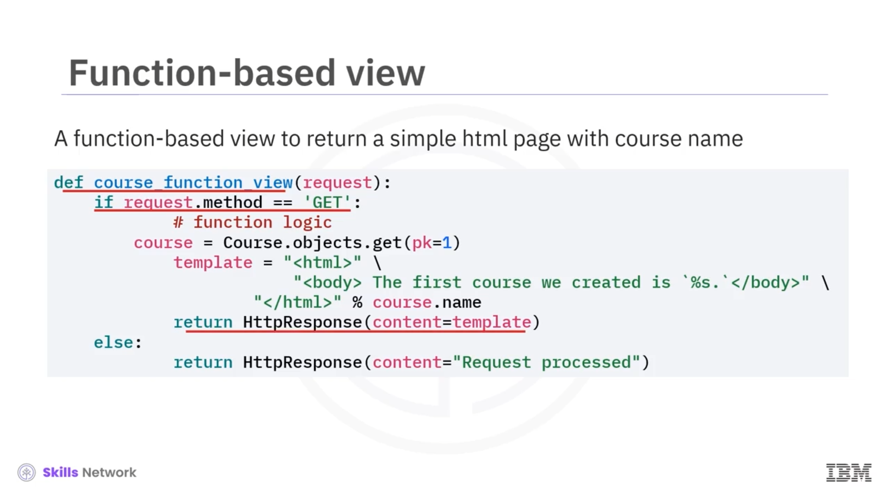
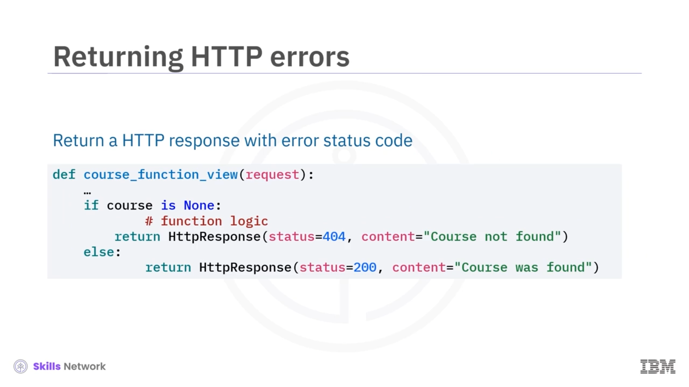

# 👀 Django Views

## 🎯 Öğrenme Hedefleri

Django Views'a hoş geldiniz! Bu videoyu izledikten sonra şunları yapabileceksiniz: Django  *view* 'lerini anlamak ve oluşturmak.

Bir  *view* , `HTTP GET`, `POST`, `DELETE` veya `UPDATE` gibi bir web isteğini alır ve bir web yanıtı döndürür. Web yanıtı bir string, bir `JSON/XML` dosyası, bir `HTML` sayfası veya istemci ya da sunucu tarafındaki hataları belirten bir hata durumu (status) olabilir.

## 🧩 Django View Nedir?

Şimdi fonksiyon tabanlı bir  *view* 'in nasıl oluşturulacağını görelim.

Diğer Django fonksiyonları gibi, *view* de girdiler olarak argümanlar alır ve bir şey döndürür. Normalde ilk argüman olarak bir `HTTP request` nesnesine ihtiyaç duyar. Bu nesne, method, header, parametreler veya payload gibi salt okunur ( *read-only* ) metaverileri içerir.

İstek methodu bir `HTTP GET` veya `HTTP POST` methodudur ve *view* genellikle bunu iş mantığı ( *logic* ) kullanarak işlemelidir. Örneğin burada, veritabanından ilk kurs kaydını sorgular ve adını bir `HTML` şablonuna ekleriz.

İş mantığı ile `HTTP` isteği işlendiikten sonra bir `HttpResponse` nesnesi doldurulur ve arayüze (UI) döndürülür. Genellikle bir `HTTPResponse` oluşturmak ve döndürmek için `HTTPResponse` kurucusuna ( *constructor* ) bir `HTML` sayfası, bir string veya bir bytestring gibi içerikler gönderebilirsiniz.

## 🌐 URL Desenini View ile Eşlemek

View'i oluşturduktan sonra, bir URL desenini (pattern) ona eşlersiniz; böylece bir `HTTPRequest` içindeki URL, *view* fonksiyonunuza eşlenir.

Bunu yapmak için, uygulamanızın (app) kök klasöründeki, genellikle `urls.py` olarak adlandırılan `URLConf` dosyasını açın. Ardından, bir URL deseni belirleyen ilk argümanı `route` olan bir `path` nesnesi ekleyin.

Django, istenen (requested) URL'yi `urlpatterns` listesindeki her desenle karşılaştıracaktır. İkinci argüman, önceki slaytta tanımladığımız *view* fonksiyonudur.

`name` argümanı, Django içindeki diğer yerlerden bu  *view* 'e atıfta bulunmanıza olanak tanır; böylece URL'yi gerektiği kadar sık değiştirebilir ve URL desenine atıfta bulunmak için referans adını kullanabilirsiniz. Bazen `app_name`'i bir önek ( *prefix* ) veya ad alanı ( *namespace* ) olarak belirtmeniz de gerekir.

Burada uygulamamızı `onlinecourse`,  *view* 'ün adını ise `course` olarak adlandırdık. Dolayısıyla, Django projemizin herhangi bir yerinden bu URL desenine `onlinecourse:course` ifadesini kullanarak atıfta bulunabiliriz.

## 📡 HTTP Yanıtları ve Durum Kodları

Her `HTTP` yanıtı bir durum kodu (`status code`) ile ilişkilidir. Önceki sonucumuzda `HTTP` yanıtına dahil edilen varsayılan `200` kodu, isteğin başarıyla işlendiğini gösterir.

Ancak bir  *view* 'ün yanıtı aynı zamanda bir hata da olabilir. Örneğin, *view* veritabanında kursu bulamadığında kullanıcıya bir "not found" hatası döndürmelidir.

`HTTP` hata yanıtı, içerik (örneğin bir hata mesajı veya bir hata `HTML` sayfası) ile birlikte `HttpResponse` kurucusunun ( *constructor* ) `status` argümanına `404 Not Found` gibi bir hata durumu eklenerek döndürülebilir.

Kurs bulunabiliyorsa, bir başarı mesajı veya bir `HTML` sayfası ile birlikte `200 OK` durum kodu kullanılabilir.

## 🧾 Videonun Özeti

Bu videoda şunları öğrendiniz: Django  *view* 'lerinin ne olduğunu ve bir `HTTP` isteği almak ve bir `HTTP` yanıtı göndermek için Django  *view* 'ünün nasıl oluşturulacağını.

