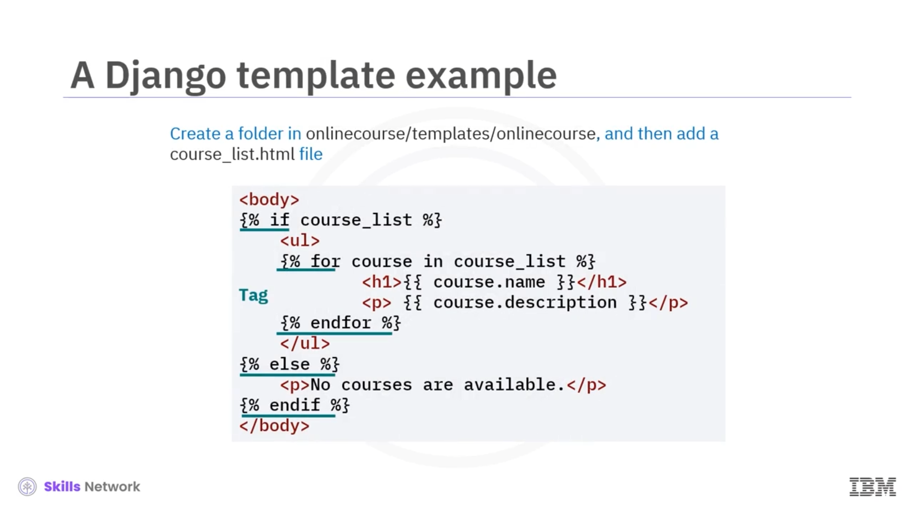
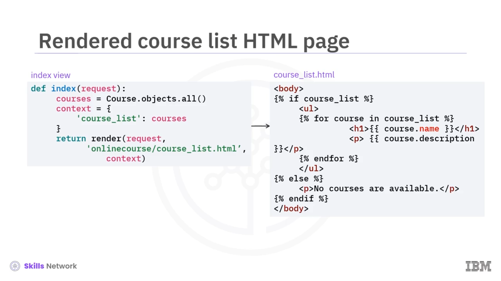
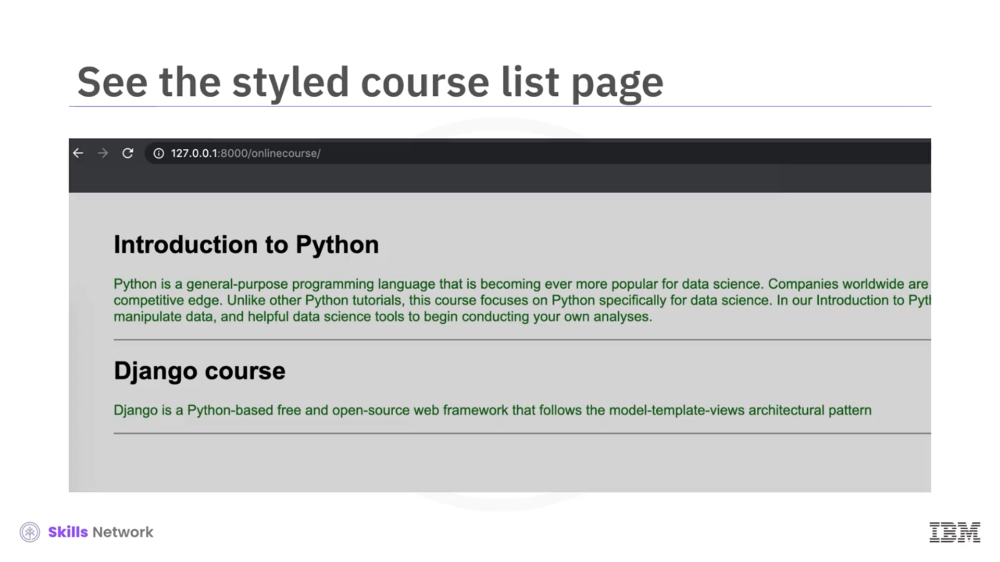
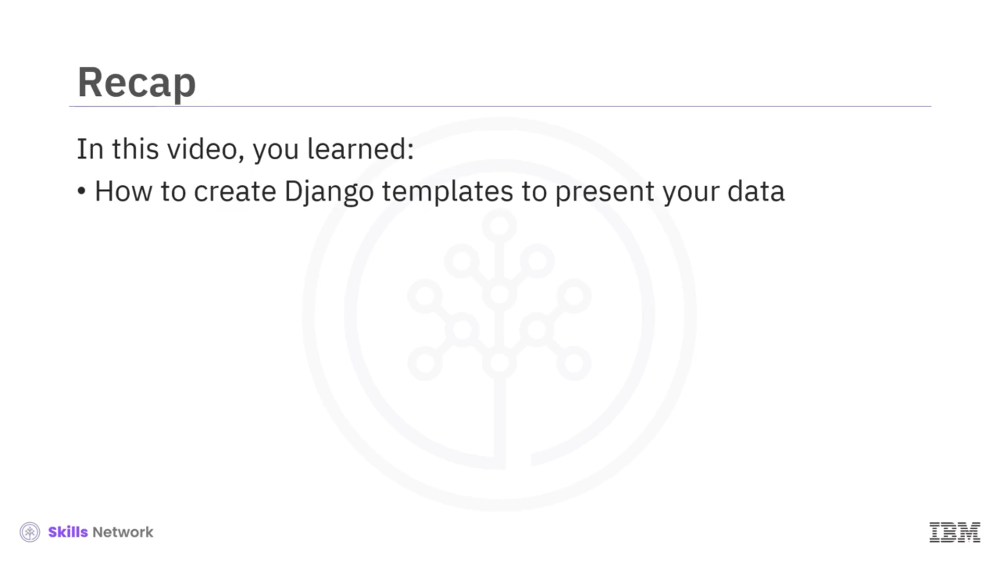

# 🧩 Django Template

## 🎯 Django Template’e Giriş

Django Template’e hoş geldiniz. Bu videoyu izledikten sonra, verilerinizi dinamik HTML sayfaları olarak sunmak için Django view’larını ve template’lerini birleştirebileceksiniz.

## 🧱 Django Template Nedir?

Django’da verilerinizin nasıl sunulacağını belirtmek için template’ler oluşturursunuz.

Bir Django template’i, dinamik kısımların nasıl ekleneceğini tanımlamak için statik HTML öğelerini Django template tag’leri ve değişkenleriyle birleştirir. Bunlar birlikte çalışarak, bir kullanıcının web tarayıcısında render edilen bir HTML sayfası üretir.

Bir Django template’i, Django template tag’leri ve değişkenleri içeren ve Django template motoru tarafından yorumlanan bir HTML dosyasıdır.

## 📁 Template Dosyasını Uygulamaya Eklemek

Onlinecourse uygulamamıza bir template dosyası eklemek için, `onlinecourse` kök klasörünün altında `templates` adında bir klasör oluştururuz.

`templates` klasörünün içinde ikinci bir `onlinecourse` klasörü oluştururuz. Böylece, template dosyasına şu şekilde başvurabiliriz: `onlinecourse/course_list.html`.

## 🏷️ Template İsim Alanı (Namespace)

Template yolunda iki adet `onlinecourse` klasörü olduğuna dikkat edin. Bunun başlıca nedeni, ikinci `onlinecourse` klasörünün, diğer uygulamalardaki aynı isimli template dosyalarını ayırt etmek için bir isim alanı görevi görmesidir.

Django’yu doğru template’e yönlendirdiğimizden emin olmanın en iyi yolu, template’leri, `onlinecourse`’un kendisi için adlandırılmış başka bir dizinin içine koyarak isim alanına ayırmaktır.

## 🧩 Context ile Template’in Render Edilmesi

Bir template dosyası oluşturulduktan sonra, view’lar tarafından döndürülen, sözlük benzeri bir nesne olan *context* ile render edilir.

Render işlemi, değişkenleri context içinde aranan değerleriyle değiştirir ve tag’leri çalıştırır. Geri kalan her şey olduğu gibi çıktıya yazılır.

Burada, sunucudan dönen `course_list` listesinin var olup olmadığını kontrol etmek için bir *if-else* tag’i kullanıyoruz. Eğer varsa, listeyi dolaşmak için bir *for loop* tag’i kullanılır. Eğer yoksa, hiç kurs olmadığını belirten bir HTML paragraf tag’i üretilir.

## 🔗 Context Değişkenleri ve Index View

`course` ve `course_list`, context’ten gelen değişkenlerdir. Bir değişken bir nesneyi temsil ediyorsa, özniteliklerine erişmek için nokta gösterimini (dot notation) kullanabilirsiniz.

Bir HTML template dosyası oluşturduktan sonra, template’i veriyle doldurmamız gerekir. Bu mantık, view’lar tarafından yönetilir.

Bu, önce veritabanındaki tüm kursları bulan bir *index view* örneğidir. Sonra, `context` adında sözlük benzeri bir nesne oluşturur ve buna, yinelemeli (iterable) bir kurslar `QuerySet`’i içeren `course_list` anahtarını ekleriz.

Ardından, doğrudan bir `HttpResponse` nesnesi döndürmek yerine, burada verilen bir template’i verilen bir context sözlüğüyle birleştirmek için `render` metodunu kullanırız. Bunun sonucunda, `render` metodu, render edilen metni saran bir `HTTPResponse` döndürür.

## 🌐 Index View Akışı ve Çıktı Sayfa

Index view örneğimizde, ilk argüman orijinal HTTP isteği, ikinci argüman template HTML dosyasına göreli bir yoldur ve üçüncü argüman, template dosyasıyla birleştirilecek olan context’tir.

Artık template’leri ve view’ları oluşturduk ve view için URL’yi yapılandırdık. View, bir kurs listesi bulur ve template dosyasını yüklemek ve kurs listesini yerleştirmek için `render` metodunu çağırır.

Template dosyasında, her kursun adı bir HTML başlık (header) olarak ve kurs açıklaması bir HTML paragrafı olarak görüntülenir. Daha sonra index view URL’sine gidebiliriz.

Üretilen web sayfası, `Introduction to Python` ve `Django course` adında iki kursun listelendiği bir sayfa gösterecektir. Django view’ları tarafından sağlanan verileri HTML dosyaları olarak sunmak için Django template’ini nasıl kullanacağınızı gördünüz.

## 🎨 CSS ve Statik Kaynaklarla Sayfayı Güzelleştirme

Bir HTML dosyasını daha etkileşimli, duyarlı (responsive) ve stilize hale getirmek için, CSS, medya ve JavaScript gibi statik kaynak dosyalar kullanmamız gerekir.

Şimdi, basit bir CSS dosyası ekleyerek kurs index sayfamızı nasıl güzelleştireceğimizi görelim.

Django uygulamamızda oluşturulan bir CSS stil sayfasını kullanmak için, önce bir statik tag kümesini yüklemek üzere `load static` kullanmamız ve ardından, göreli bir yola göre mutlak URL üretmek için `static` tag’ini kullanmamız gerekir.

Sonraki adımda, sırasıyla `body`, paragraf ve yatay çizgi (horizontal line) tag’lerine CSS sınıflarını ekleriz.

İşte CSS eklenmiş güncellenmiş index sayfası. Mutlak yol (absolute path) URL’sinin üretildiğine dikkat edin. Arka plan artık açık gri, kurs açıklamaları ise yeşildir ve bir yatay çizgi ile birbirinden ayrılmıştır.

## ✅ Bu Videoda Öğrendikleriniz

Bu videoda, verilerinizi sunmak için Django template’leri oluşturmayı öğrendiniz.

