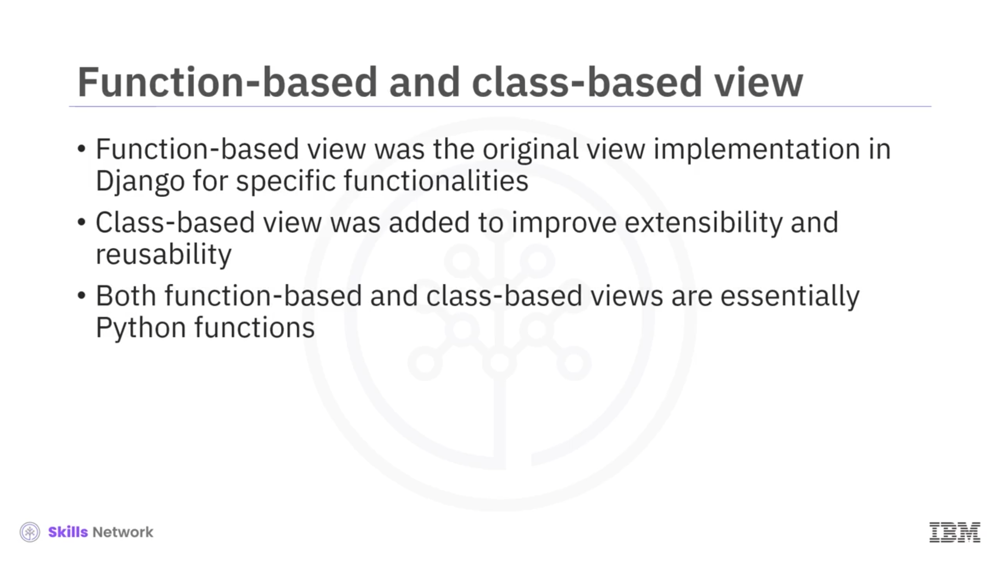
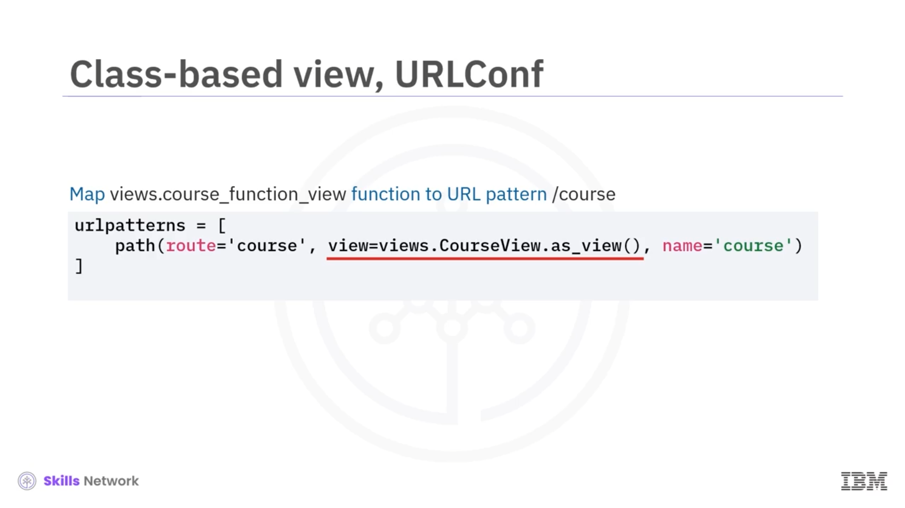
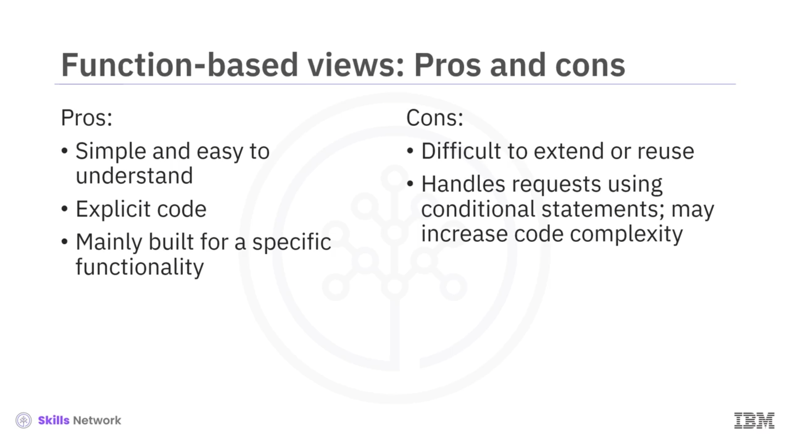
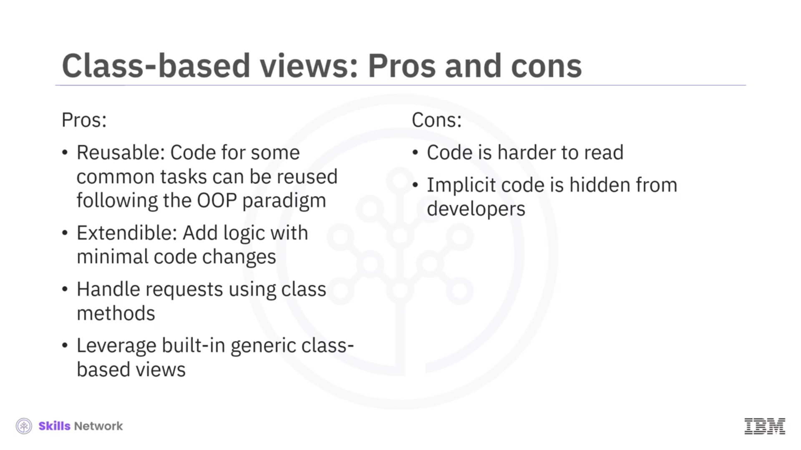

# 🧱 Sınıf Tabanlı ve Generic Sınıf Tabanlı View'ler

## 👋 Giriş ve Öğrenme Hedefleri

Django sınıf tabanlı view'lerine hoş geldiniz.

Bu videoyu izledikten sonra şunları yapabileceksiniz:

* Sınıf tabanlı ve generic sınıf tabanlı view'ler oluşturmak
* Fonksiyon tabanlı view'ler ile sınıf tabanlı view'lerin artı ve eksilerini karşılaştırmak

## 🆚 Fonksiyon Tabanlı ve Sınıf Tabanlı View'ler

Fonksiyon tabanlı view, Django'daki ilk view uygulamasıdır. Bir istek parametresi ve yanıtın nasıl üretileceğine dair açık bir mantıkla belirli bir sorunu çözmek için oluşturulmuştur.

Sınıf tabanlı view ise view'lerin genişletilebilirliğini ve yeniden kullanılabilirliğini artırmak için Django'ya eklenmiştir.

Bir view, fonksiyon tabanlı view kullanılarak da sınıf tabanlı view kullanılarak da oluşturulsa, özünde bir Python fonksiyonu ya da çağrılabilir bir nesnedir.

Fonksiyon tabanlı view ile ilgili temel sorun, genellikle genişletmenin veya özelleştirmenin çok zor olmasıdır. Bu sorunları gidermek için sınıf tabanlı view oluşturulmuştur.

Bir HTTP yanıtı döndüren sınıf tabanlı bir view'in nasıl oluşturulacağını görelim.

## 🏗️ Bir Sınıf Tabanlı View Oluşturma

Bir fonksiyon oluşturmak yerine, Django `View` taban sınıfından kalıtım alan bir sınıf tanımlarsınız.

Daha sonra, `View` taban sınıfı tarafından soyutlanan ve bir HTTP `GET` veya `POST` isteğini işlemek için kullanılan `get` veya `post` gibi bazı ortak metotlara erişebilirsiniz.

Sonra, HTTP isteklerini işlemek için kendi mantığınızı uygularsınız.

Örneğin, bir URL'den gelen HTTP `GET` yöntemini işlemek için, önce veritabanından ders kaydını sorgulayan, ders adını bir HTML şablonuna yerleştiren ve bir `HttpResponse` nesnesini dolduran basit bir `get` metodu uygularız.

## 🔗 URL Eşleme, `View` Taban Sınıfı ve `as_view`

Ayrıca bir URL desenini sınıf tabanlı view sınıfına eşlememiz gerekir. Bu, fonksiyon tabanlı view için URL yapılandırmaya benzer.

Tek fark, `view` argümanı için tanımladığımız `as_view` fonksiyonunu ya da `CourseView` sınıfını belirtmeniz gerekmesidir.

`as_view` fonksiyonu, `View` taban sınıfından kalıtım yoluyla gelir. Django `View` sınıfı, tüm sınıf tabanlı view'ler için taban sınıftır.

Django `View` sınıfı, ayrıca bir `inner_view` metodu tanımlayan ve çağrılabilir bir değer olarak döndürülecek olan bir `as_view` metodunu tanımlar.

## ⚙️ `URLconf`, `dispatch` ve Çağrılabilir View Mantığı

Dolayısıyla `view.as_view` sınıf metodunu kullanarak onları `URLconf`'a eklediğimizde, bu bir fonksiyon döndürür.

Bu fonksiyon çağrıldıktan sonra, view çağrılabilir nesnesi isteği `dispatch` metoduna iletir; `dispatch` ise `GET` veya `POST` gibi ilgili HTTP metodunu uygular.

Böylece, sınıf tabanlı bir view bile aslında belirli bir HTTP metodunu işleyen bir fonksiyondur. Sonuç olarak, hem fonksiyon tabanlı hem de sınıf tabanlı view'ler birer fonksiyondur.

## 📦 Generic Sınıf Tabanlı View'ler

Web uygulaması geliştirmede, bir listeyi görüntülemek veya bir nesnenin ayrıntılarını derinlemesine (drill-down) göstermek gibi yaygın görevleri yerine getirmemiz gerekir.

Geliştirmeyi hızlandırmak ve bu yaygın görevleri çözmek için Django, geliştiricilerin en az kod değişikliğiyle yeniden kullanıp genişletebileceği, *generic-based views* olarak adlandırılan bazı yerleşik view sınıfları sağlar.

## 🧩 `DetailView` Örneği ve Diğer Generic View Türleri

Daha önce yaptığımız gibi, bir ders detayını görüntülemek için kullanılan generic sınıf tabanlı bir view örneğine bakalım.

Önce, generic `DetailView` sınıfını genişleten bir `CourseView` tanımlamamız gerekir. Sonra, model olarak `Course`'u belirtir ve bir HTML şablon dosyası yolu sağlarız.

`DetailView` tarafından sağlanan metodlar, nesneyi nasıl elde edeceğini ve HTML sayfasını nasıl dolduracağını bilir.

Böylece geliştiricilerin, HTTP isteğini işlemek için herhangi bir kod yazmadan, bir HTML şablonuna dayanarak bir `Course` nesnesini tarayıcıda göstermek için yalnızca iki satır kod yazması yeterlidir.

Şimdi generic sınıf tabanlı view örneklerinden birkaçına bakalım:

* `ListView`, nesnelerin bir listesini temsil eder.
* `DetailView`, bir nesnenin detaylarını temsil eder.
* `FormView` bir formu temsil eder ve bir grup `Date` view'i, tarih tabanlı verileri işler.

## ⚖️ Function-based View'lerin Artıları ve Eksileri

Şu ana kadar fonksiyon tabanlı, sınıf tabanlı ve generic sınıf tabanlı view'leri öğrendiniz. Uygulamanızda hangisini kullanacağınıza karar vermenize yardımcı olması için artı ve eksileri özetleyelim.

### ✅ Fonksiyon Tabanlı View'lerin Artıları

Fonksiyon tabanlı view için başlıca artılar, kod yazmanın basit ve anlaşılmasının kolay olmasıdır.

`View` taban sınıfında tanımlanan metotlar gibi ekstra bir yapı veya tasarımı takip etmeden, mantığınızı açıkça yazabilirsiniz.

Yeniden kullanılma olasılığı düşük, çok spesifik bir işleviniz varsa, fonksiyon tabanlı view sizin için bir seçenek olabilir.

### ❌ Fonksiyon Tabanlı View'lerin Eksileri

Temel eksilerden biri, fonksiyon tabanlı view'lerin genişletilmesinin veya yeniden kullanılmasının zor olmasıdır.

Ayrıca HTTP istek metotlarını koşullu ifadeler kullanarak işlerler; bu da kod karmaşıklığını artırabilir.

## ⚖️ Class-based View'lerin Artıları ve Eksileri

### ✅ Sınıf Tabanlı View'lerin Artıları

Sınıf tabanlı view'ler için artılar arasında, yeniden kullanılabilirlik ve genişletilebilirlik bulunur.

Ayrıca, istekleri sınıf metotları kullanarak işleyebilirsiniz.

Ve yaygın görevleri çözmek için generic sınıf tabanlı view'lerden yararlanabilirsiniz.

### ❌ Sınıf Tabanlı View'lerin Eksileri

Sınıf tabanlı view'lerin başlıca eksisi, ek `View` taban sınıf kalıtımı eklemenin kodu okumayı zorlaştırmasıdır.

Örtük (implicit) kod gizlidir ve geliştiricilerin, view'lerin tam olarak nasıl uygulandığını anlamak için kaynak kodu kontrol etmeleri gerekir.

## ✅ Bu Videoda Öğrendikleriniz

Bu videoda şunları öğrendiniz:

* Sınıf tabanlı view'lerin nasıl uygulanacağını.
* Django'nun yerleşik generic sınıf view'lerini yaygın görevleri çözmek için nasıl kullanacağınızı ve fonksiyon tabanlı ile sınıf tabanlı view'lerin artı ve eksilerini.

