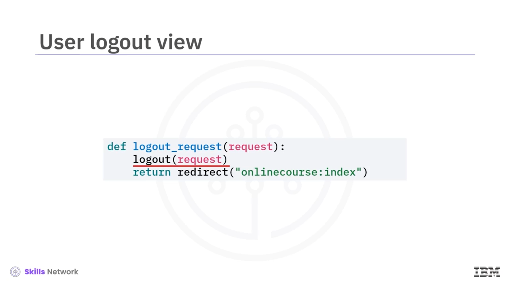
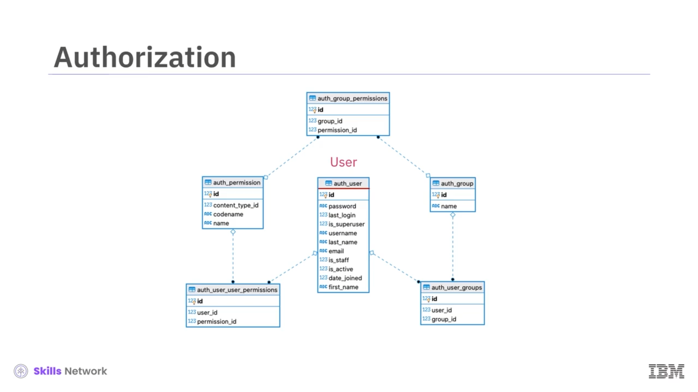

# 🔐 Django Kimlik Doğrulama Sistemi

## 🧾 Giriş ve öğrenme hedefleri

Django Kimlik Doğrulama Sistemine hoş geldiniz.

Bu videoyu izledikten sonra, kimlik doğrulama ( *authentication* ) ve yetkilendirmeyi ( *authorization* ) tanımlayabilecek ve Django `User` nesnelerini kullanarak kimlik doğrulama ve yetkilendirme işlemlerini gerçekleştirebileceksiniz.

## 🔑 Kimlik doğrulama ve yetkilendirme nedir?

Kimlik doğrulama, kullanıcıların kimliklerini kullanıcı adı ve parola gibi kimlik bilgilerini kullanarak doğrulama sürecidir.

SMS/e-posta ile tek seferlik parola, tek oturum açma (SSO) veya yüz tanıma ve parmak izi gibi biyometrik yöntemler gibi modern kimlik doğrulama sistemleri, kullanıcıların doğrudan parola girmesini bile gerektirmez.

Kullanıcıların kimlikleri doğrulandıktan sonra, yetkilendirme, veritabanları gibi kaynaklara kullanıcıların erişim izinlerini kontrol eder.

Sistem yöneticilerinin genellikle, bir dersin içeriğini görüntüleme izni gibi belirli erişim izinlerine sahip farklı roller veya gruplar tanımlamaları gerekir. Yöneticiler erişim vermek için rolleri atar veya kullanıcıları belirli gruplara ekler.

`User` modeli, kullanıcı adı, parola ve e-posta gibi temel kullanıcı bilgilerini sağlar. Django’da bir `User` modeli, kimlik doğrulamayı gerçekleştirmek ve yetkilendirmeyi yönetmek için gruplar ve izinler gibi diğer modellerle birlikte çalışmak üzere oluşturulur.

## 👤 User modelini genişletme ve giriş formu

Geliştiriciler, `User` modelini genişleterek, bu modelden miras alan eğitmen ( *instructor* ) veya öğrenen ( *learner* ) gibi uygulamaya özgü kullanıcılar tanımlayabilir.

Bir kullanıcıyı kullanıcı adı ve parola ile kimlik doğrulamak veya oturum açtırmak için önce kimlik bilgilerini alacak bir web sayfası şablonu oluştururuz.

Tipik bir web giriş sayfasında bir kullanıcıyı nasıl kimlik doğruladığımıza bakalım. Bunun tam bir HTML şablonu olmadığını, yalnızca “import form” öğesini gösterdiğimizi unutmayın.

Bu basit giriş formu için, kullanıcı adını almak üzere bir metin girişi ve parolayı parola maskesiyle almak üzere bir parola girişi oluşturduk.

Formu gönderdiğimizde, kullanıcıyı kimlik doğrulamak için `onlinecourse` giriş görünümüne (`login view`) bir `POST` isteği göndeririz.

İşte az önce oluşturduğumuz giriş sayfasının bir önizlemesi. Kullanıcı adı ve parola girilebilir ve arka uçtaki bir giriş görünümüne gönderilebilir.

## 🔐 Giriş (login) görünümü ve oturum (session) yönetimi

Giriş görünümü için, önce istek nesnesinin `POST` özniteliğinden kullanıcı adını ve parolayı alırız.

Kullanıcı adı ve parolanın veritabanındaki kayıtlarla eşleşmesi durumunda geçerli bir kullanıcı döndüren, Django kimlik doğrulama çatısının sağladığı `authenticate` metodunu kullanırız.

Sağlanan kimlik bilgileri eşleşmiyorsa `None` döndürür.

Son olarak, kullanıcıyı oturum açmış hale getirmek ve bir `index` görünümüne yönlendirmek için `login` metodunu kullanabiliriz.

Bir kullanıcı oturum açtığında Django, oturum kimliği ( *session ID* ) olan benzersiz bir oturum ( *session* ) oluşturur.

Daha sonra kullanıcı bilgilerini sorgular ve bunları oturuma ekler; böylece sunucu, benzersiz oturum kimliğiyle hangi kullanıcının tanımlandığını bilir.

Web oturumu, bir web sitesini ziyaret eden kullanıcılar için durumsal ( *stateful* ) verileri saklar; böylece site ve kullanıcı, her işlem için tekrar oturum açmak zorunda kalmadan sunucuyla bir dizi işlem gerçekleştirebilir.

## 🍪 Session ID, çerezler (cookies) ve oturum kapatma

Tarayıcı tarafı da site içindeki kimlik tespiti için oturum kimliğini `COOKIE` içinde saklar.

Oturum kimliğini almak için `COOKIES` özniteliğini ve sözlük benzeri oturum verilerini almak için `session` özniteliğini kullanabiliriz.

Kullanıcı kimlik doğrulamasından geçmişse, geçerli bir oturum kimliği görebilmemiz ve oturum sözlüğü verilerinin, kullanıcı kimliği (`user id`) gibi kullanıcıya ait bilgiler içermesi gerekir.

Kullanıcı kimlik doğrulamasından geçmemişse, oturum kimliğini `None` ve oturum sözlüğünü boş olarak alırız.

Bir kullanıcının oturumunu kapatmak ( *logout* ) basittir. Sadece HTTP istek nesnesiyle `logout` metodunu çağırırız.

## 📝 Kayıt (registration) formu ve görünümü

Kayıt formu oluşturmak, giriş formu oluşturmaya benzer.

Formun `action` URL’sini `POST` metodu kullanan bir kayıt görünümüne yönlendirebilir ve kullanıcılardan kullanıcı adı ve parola almak için iki giriş öğesi ekleyebiliriz.

Kayıt sayfası, giriş sayfasına benzer. Kullanıcı adı ve parolayı alır ve bunları bir kayıt görünümüne gönderir.

Kayıt görünümü, kullanıcı adı ve parolayı `POST` özniteliğinden alır ve yeni bir kullanıcı oluşturmak için `User` model yöneticisinin `create_user` metodunu çağırır.

Kullanıcı daha sonra oturum açmış hale getirilebilir ve `onlinecourse` `index` sayfasına yönlendirilebilir.

## 🧑‍⚖️ Django’da yetkilendirme: User, Permission ve Group

Django’da kullanıcı yetkilendirmesi ağırlıklı olarak üç model tarafından yönetilir: `User`, `Permission` ve `Group`.

Kimlik doğrulama kısmında `User` modelini açıkladık.

`Permission` modeli, nesne türlerini ve kullanıcıların bunlara nasıl erişebileceğini saklamak için `User` ile çoktan çoğa ( *many-to-many* ) ilişkilere sahiptir.

`Group` modeli, aynı izinlere sahip kullanıcıları yönetmek için kullanışlı bir yol sunar.

İzinleri ve grupları yönetmenin en kolay yolu Django yönetim ( *admin* ) sitesini kullanmaktır; ancak bunları programatik olarak API’leri kullanarak yönetmeyi de tercih edebilirsiniz.

## 🧷 İzinler (permissions) ve kullanıcı grupları (groups)

Django’da tanımladığınız her model için izinler oluşturabilir ve atayabilirsiniz.

Dört varsayılan izin şunlardır: `View`, `Add`, `Change` ve `Delete`.

Örneğin, ders modelimiz (`course model`) için `Can add`, `Can change`, `Can delete` ve `Can view` izinlerimiz vardır.

Bazen aynı izinlere sahip kullanıcıları bir arada gruplamak isteyebiliriz. Django `Group` modeliyle, kullanıcı grupları oluşturabilir ve izinleri gruplara atayabilirsiniz.

Örneğin, ders ekleme, değiştirme, silme ve görüntüleme izinlerine sahip bir `Instructors` grubu oluşturabiliriz.

Yalnızca ders içeriğini görüntüleyebilen başka bir grup, `Learners`, oluşturabiliriz ve yeni bir eğitmen kullanıcısını tüm eğitmen izinlerini otomatik olarak vermek için kolayca `Instructors` grubuna ekleyebiliriz.

## 📚 Özet ve lab çalışması

Bu videoda, kimlik doğrulama ve yetkilendirmenin tanımını ve Django’yu kullanarak kullanıcıları kaydetmeyi ve kimliklerini doğrulamayı, yönetim sitesini kullanarak kullanıcılara izinler eklemeyi ve kullanıcıları gruplar halinde yönetmeyi öğrendiniz.

Kimlik doğrulama ve yetkilendirme laboratuvarında, bir Django uygulamasına kimlik doğrulama ve yetkilendirme ekleyerek daha fazla kodlama pratiği yapacaksınız.

