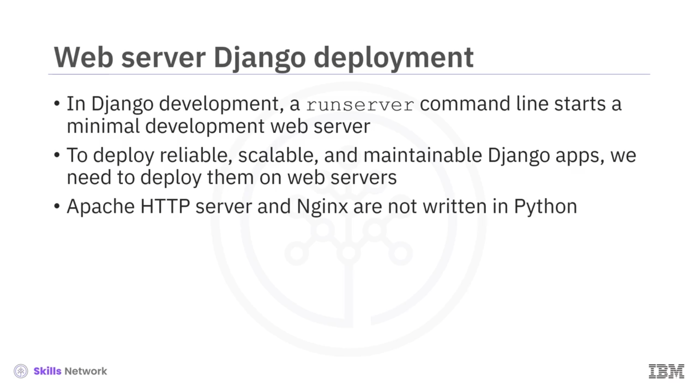
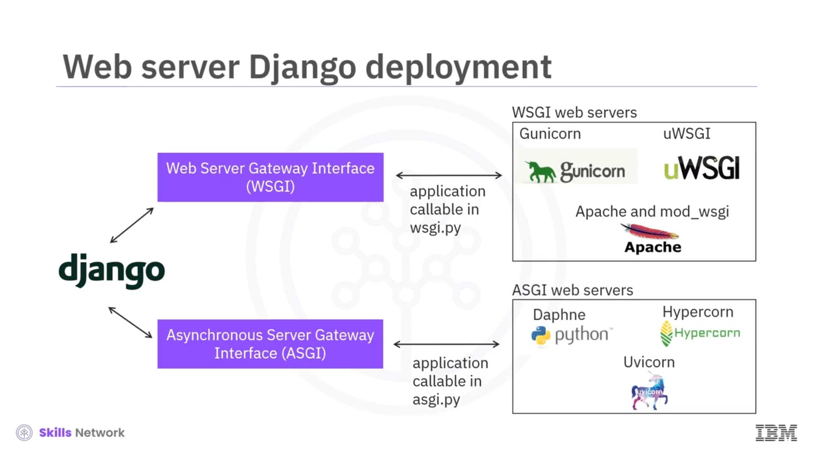
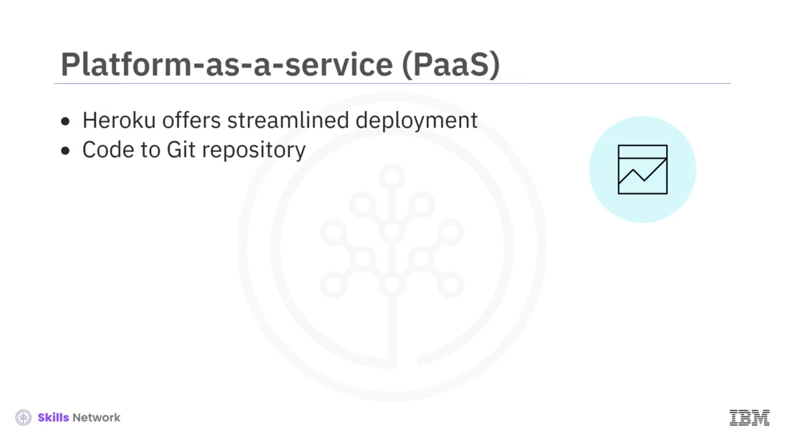

# 🚀 Django Uygulamalarınızı Dağıtın

## 🎯 Öğrenme Hedefleri

Django uygulamalarınızı dağıtma bölümüne hoş geldiniz!

Bu videoyu izledikten sonra:

* Django uygulamalarını web sunucularına nasıl dağıtacağınızı açıklayabilecek,
* Django uygulamalarını buluta nasıl dağıtacağınızı açıklayabilecek ve
* Bir Django uygulamasını bulutta üretim ortamına hazır hâle getirmek için en iyi uygulamaları sıralayabileceksiniz.

## 🌍 Geliştirme Sunucusu ve Web Sunucularına Dağıtım

Django geliştirme sırasında komut satırında `runserver` çalıştırmak, Django uygulamalarını hızlıca geliştirip test edebilmeniz için minimal bir geliştirme web sunucusu başlatır.

Güvenilir, ölçeklenebilir ve sürdürülebilir ( *dependable, scalable and maintainable* ) Django uygulamalarını dağıtmak için, bunları web sunucularına dağıtmanız gerekir.

Apache, *HTTP* ve Nginx gibi çoğu web sunucusu Python ile yazılmadığından, Django uygulamalarının bu sunucularla iletişim kurabilmesi için bu arayüzleri destekleyen web sunucularıyla konuşmalarını sağlayan ek arayüzlere ihtiyacı vardır.

## 🔁 WSGI: Web Sunucusu Ağ Geçidi Arayüzü

*Web Server Gateway Interface* yani  *WSGI* , web sunucuları ile uygulamalar arasındaki iletişim için başlıca Python standardıdır.

Yalnızca senkron kodu destekler.

`start project` komut satırı, varsayılan olarak Django'nun WSGI ile çalışabilmesi için bir `application` callable'ı tanımlayan bir `wsgi.py` dosyası oluşturur.

WSGI sunucuları bu `application` callable'ını bulmaya çalışır ve Django uygulamanızla iletişim kurmak için bunu bir giriş noktası olarak kullanır.

Django uygulamaları için kullanılabilen bazı popüler WSGI web sunucuları vardır. Örneğin:

* Gunicorn
* uWSGI
* Apache
* `mod_wsgi`

## ⚙️ ASGI ve Asenkron Desteği

Django uygulaması, başka bir web sunucusu arayüzü olan *Asynchronous Server Gateway Interface* ( *ASGI* ) arayüzünü de destekler.

WSGI’den temel farkı, asenkron kodu desteklemesidir.

`start project` komut satırı, ASGI web sunucusuyla çalışmak üzere bir `application` callable'ı tanımlayan bir `asgi.py` dosyası oluşturur.

Popüler ASGI web sunucularına şunlar örnek verilebilir:

* Daphne
* Hypercorn
* Uvicorn

## 🏗️ Üretim Ortamına Dağıtımın Zorlukları

Django uygulamalarını veya diğer web uygulamalarını bir üretim ortamına dağıtmak kolay değildir; çalışma zamanları ( *run times* ), işletim sistemleri, ağlar, veritabanları ve sunucular gibi platform ve altyapıları dağıtım gereksinimlerinizi karşılayacak şekilde dikkatle oluşturup yapılandırmanız gerekir.

## ☁️ Bulutta Django Uygulamalarını Çalıştırma

Neyse ki günümüzde *infrastructure-as-a-service* ve *platform-as-a-service* yardımıyla, uygulamaları sağlama (provisioning) platformlarına çok az çabayla dağıtabilirsiniz.

Diyelim ki web sitenizi yeni tamamladınız ya da herkese açık test için hazır bir aşamaya getirdiniz; kişisel geliştirme bilgisayarınıza göre daha yüksek erişilebilirlik ve kullanılabilirlik sunan bir barındırma çözümüne ihtiyaç duyarsınız.

Bir seçenek, bu web sitesini buluta dağıtmaktır.

Bulutta bir Django uygulamasını çalıştırmak için, web uygulamasını ve veritabanını barındıracak bir mekanizmaya ihtiyaç duyarsınız.

Önce barındırma ( *hosting* ) konusunu değerlendirmeniz gerekir. Seçebileceğiniz birkaç farklı seçenek vardır.

### 💻 Seçenek 1: Sanal Makine (VM) Kullanımı

İlk seçenek, seçtiğiniz bulut sağlayıcısından bir sanal makine, yani VM kullanmak ve Ubuntu, Python ve Apache gibi gereken minimal işletim sistemi ( *OS* ) ve yazılımları kurmaktır.

Ardından ortamı elle yapılandırır, bağımlılıkları yüklersiniz ve Django uygulamanızı dağıtırsınız.

### 🚀 Seçenek 2: Platform-as-a-Service (PaaS)

Bir başka seçenek, *platform-as-a-service* ya da *PaaS* dağıtımı kullanmaktır.

Heroku gibi platformlar daha sadeleştirilmiş bir dağıtım süreci sağlar.

Bu yöntemde, kodunuzu onların `Git` deposuna ( *Git repository* ) gönderirsiniz ve dağıtım sürecini otomatik olarak onlar yürütür.

### 📦 Seçenek 3: Konteynerleştirme Dağıtımı

Üçüncü seçenek konteynerleştirme ( *containerization* ) dağıtımıdır.

Bu yöntemle, Django uygulamanızı ve bağımlılıklarını paketlemek için Docker konteynerlerini kullanabilir ve bunları Kubernetes veya *K8s* gibi konteyner orkestrasyon araçlarıyla dağıtabilirsiniz.

 *IBM Cloud Code Engine* , iş yüklerini ( *workloads* ) oluşturma, dağıtma ve yönetme konusundaki operasyonel yükü soyutlar; böylece geliştiriciler ortak geliştirmeye ( *co-development* ) odaklanabilirler.

## 🗄️ Django ve Veritabanları

Django veritabanını kullanmayı tercih edebilirsiniz.

Django resmi olarak şu veritabanlarını destekler:

* PostgreSQL
* MariaDB
* MySQL
* Oracle
* SQLite

Bu veritabanları, bulut sağlayıcınız tarafından kendi kendinize yönettiğiniz ( *self-managed* ) veritabanları olarak veya veritabanı-hizmet-olarak ( *database-as-a-service* ) şeklinde dağıtılabilir.

## ✅ Bulutta Üretim İçin En İyi Uygulamalar

Bulutta Django uygulamanızı üretim ortamına hazır hâle getirmek için, aşağıdaki en iyi uygulamaları izleyin ve ölçeklenebilirlik ( *scalability* ), güvenlik ( *security* ) ve güvenilirliği ( *reliability* ) sağlamak üzere çeşitli yapılandırmalar uygulayın.

### 🧩 Üretim Veritabanı Kullanın

Üretimde, sağlam ve ölçeklenebilir bir veritabanı kullanmanız önerilir.

Örneğin:

* PostgreSQL
* MySQL
* Ya da başka uygun bir ilişkisel veritabanı

SQLite'ı üretim ortamında kullanmaktan kaçının; çünkü yüksek eşzamanlılık veya yoğun trafik için tasarlanmamıştır.

### 🔐 Veritabanı Kimlik Bilgilerini Güvenceye Alın

Veritabanı kimlik bilgilerinizi ve diğer hassas bilgileri ortam değişkenlerinde ( *environment variables* ) saklayın ve bunları asla doğrudan koda gömmeyin ( *hard code etmeyin* ).

### 🔒 HTTPS Kullanımı

Sunucu, barındırdığınız Django uygulaması ve tarayıcı üzerinden uygulamaya erişen kullanıcılarınız yani istemciler ( *clients* ) arasındaki iletişim için HTTPS kullanın.

### 🖼️ Statik ve Medya Dosyaları

Statik ve medya dosyaları için:

CSS veya JavaScript gibi statik dosyaları ve kullanıcı tarafından yüklenen medya dosyalarını verimli şekilde sunmak ve sunucu yükünü azaltmak amacıyla bir bulut depolama hizmeti veya bir *Content Delivery Network (CDN)* kullanın.

### ⚖️ Yük Dengeleme

Django durumsuz ( *stateless* ) olduğundan, bundan en iyi şekilde faydalanın ve gelen trafiği Django uygulamanızın birden çok örneğine dağıtmak için bir yük dengeleyici ( *load balancer* ) kullanmayı düşünün; böylece genel performans ve yüksek erişilebilirlik sağlanır.

### 📈 Yatay Ölçekleme

Uygulamanızı, trafik arttıkça daha fazla örnek veya konteyner ekleyerek yatay olarak ölçeklenebilecek şekilde tasarlayın.

### 📊 İzleme ve Günlükleme

Hataları takip etmek ve sorunları teşhis etmek için hata izleme ( *error monitoring* ) ve günlükleme ( *logging* ) hizmetleri kurun.

## 📌 Özet

Bu videoda:

* Django uygulamalarını WSGI ve ASGI web sunucularına nasıl dağıtacağınızı,
* VM, PaaS, konteynerleştirme dağıtımı, IBM Cloud Code Engine ve Django veritabanının uygulama dağıtımınızı nasıl kolaylaştırabileceğini ve
* Django uygulamanızı bulutta üretim ortamına hazır hâle getirmek için en iyi uygulamaları

öğrendiniz.
