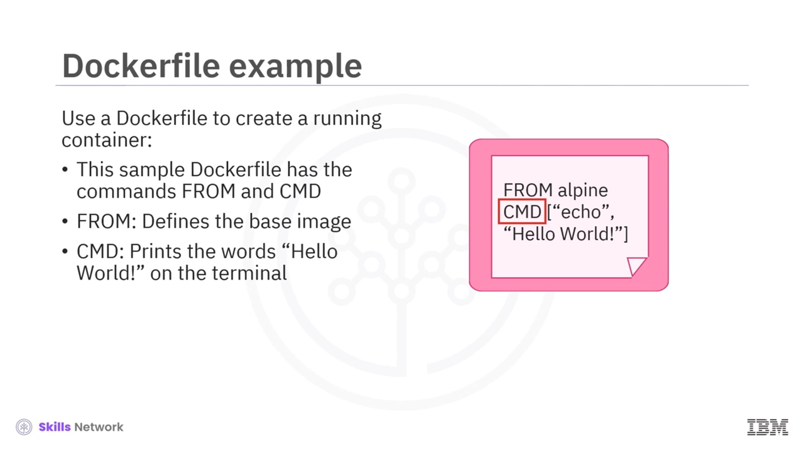
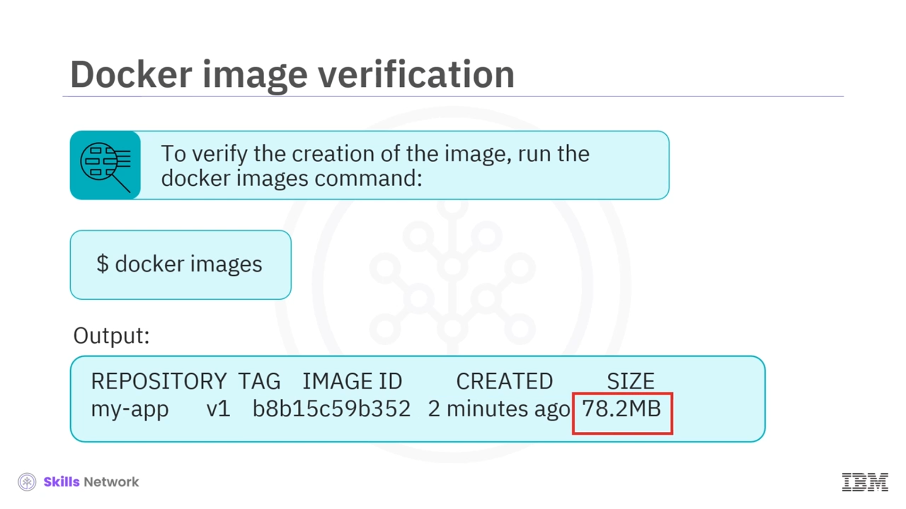

# 🐳 Konteyner Görüntülerini Oluşturma ve Çalıştırma

## 🚀 Dersin Hedefleri ve Geliştirme Süreci

Konteynerler inşa etmeye ve çalıştırmaya hoş geldiniz. Bu videoyu izledikten sonra, bir **Dockerfile** kullanarak bir **kapsayıcı görüntüsü (image)** oluşturabilecek, oluşturduğunuz bir görüntüden çalışan bir **kapsayıcı (container)** başlatabilecek ve temel **Docker komutlarını** açıklayabileceksiniz.

Bu geliştirme süreci, çalışan bir kapsayıcıya ulaşmak için izlenen adımları gösterir:

* Bir **Dockerfile** oluşturmak
* Bu Dockerfile’dan bir **kapsayıcı görüntüsü** oluşturmak
* Bu görüntüyü kullanarak **çalışan bir kapsayıcı** başlatmak

Çalışan bir kapsayıcı oluşturmak için temel olarak bir **Dockerfile** kullanırsınız.

## 📄 Örnek Dockerfile: FROM ve CMD Talimatları

Örnek  **Dockerfile** , `CMD` komutundan gelen talimatlara sahiptir.

`FROM` ifadesi, kullanılacak **temel görüntüyü (base image)** tanımlar ve `CMD`, terminalde *hello world* kelimelerini yazdırır.

Bu Dockerfile’dan görüntü oluşturmak için kullanılan **`docker build`** komutu;  **etiketi (tag)** ,  **depo adını (repository)** , **sürümü (version)** ve **geçerli dizini** parametre olarak kullanır.

## 🧱 docker build ile Görüntü Oluşturma ve Doğrulama

`docker build` komutunu çalıştırdıktan sonra çıktı iletileri, derleme bağlamının ( **build context** ) başarıyla  **Docker Daemon** ’a gönderildiğini gösterir. Bu çıktı, görüntünün başarıyla oluşturulduğunu ve `my-app` etiketiyle ( **tag** ) etiketlendiğini onaylar.

Oluşturulan görüntüyü doğrulamak için **`docker images`** komutunu çalıştırırsınız. Çıktı:

* **Depo adını (repository)** – örneğin: `my-app`
* **Etiketi (tag)** – örneğin: `v1`
* **Görüntü kimliğini (image ID)**
* **Oluşturulma tarihini (created)**
* **Görüntü boyutunu (size)**

gösterir.

## 🏃‍♂️ docker run ile Konteyner Başlatma

Oluşturduğunuz görüntüden bir kapsayıcı başlatmak için **`docker run`** komutunu kullanırsınız. Uygulama, kapsayıcı görüntü adı ve etiketi ile başlatılır ve terminale *hello world* kelimelerini yazdırır.

Daha sonra, oluşturulan kapsayıcının ayrıntılarını görmek için **`docker ps -a`** komutunu çalıştırabilirsiniz. Uygun parametreler verildiğinde, bu komut:

* Kapsayıcı kimliğini
* Kullanılan görüntüyü
* Çalıştırılan komutu
* Durumu ve oluşturulma zamanını

gibi bilgileri listeler.

## 📌 Özet: Temel Docker Komutları

Bu derste, bir **Dockerfile** kullanarak bir **konteyner görüntüsü** oluşturmak için **`docker build`** komutunun nasıl kullanıldığını gördünüz. Ardından, oluşturulan görüntüden bir **çalışan kapsayıcı** başlatmak için **`docker run`** komutunun kullanıldığını öğrendiniz.

Temel **Docker** komutları:

* **`docker build`** – Bir  **Dockerfile** ’dan, etiketler (tags) vererek kapsayıcı görüntüleri oluşturur.
* **`docker images`** – Tüm görüntüleri, depolarını, etiketlerini ve boyutlarını listeler.
* **`docker run`** – Bir görüntüden yeni bir kapsayıcı oluşturur ve çalıştırır.
* **`docker push`** – Görüntüleri yapılandırılmış bir **kayıt defterine (registry)** gönderir (depolar).
* **`docker pull`** – Yapılandırılmış bir kayıt defterinden görüntüleri indirir.

Bu komutlarla birlikte,  **Dockerfile** ,  **image** ,  **container** , **build** ve **run** adımlarının bir araya gelerek çalışan bir konteyner oluşturduğunu gördünüz.

